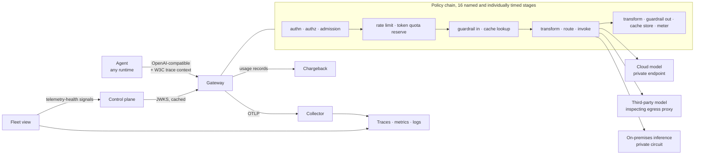

# AgentGate

**The control plane every agent passes through, regardless of where that agent runs.**

An enterprise agentic-AI platform for a regulated financial-services client: the AI gateway that
fronts all model traffic, the identity and registration path that governs which agents may call it,
and the observability plane that makes the whole fleet visible and attributable.

These are one plane with three faces, not three services that happen to be deployed together.
Identity is enforced *at* the gateway, and the gateway is where most telemetry originates. An
implementation that splits them creates exactly the seam this platform exists to remove.

| Plane | Binary | Responsibility |
|---|---|---|
| **Traffic** | `gateway` | Provider-agnostic model API. Routing and backend pools, token-based quotas, retries, failover, circuit breaking, caching, request and response transformation, guardrails, streaming. |
| **Trust** | `controlplane` | Agent workload identity, registration on deploy, the promotion gate into production, credential lifecycle, vault-backed secrets. |
| **Truth** | `fleetview` | Telemetry schema and pipelines, trace-completeness verification, fleet inventory, SLIs, SLOs and error budgets, cost attribution and chargeback, alerting. |

Supporting binaries: `guardrails` (content-safety callout service), `mockprovider` (simulated model
backends with controllable latency and failure), `agentctl` (developer and operator CLI), `loadgen`
(capacity proof).

---

## Run it

Everything below works from a fresh clone. Dependencies are vendored, so no network is needed to
build.

### One command

```bash
make run     # a mock model backend on :8090 and the gateway on :8080
make demo    # in another terminal: a completion, a cache hit, and a blocked secret
```

No Docker, no Postgres, no Redis, no identity provider, no key material. `config/gateway.yaml`
turns every dependency off on purpose — in-memory rate limiter, in-memory cache, builtin
guardrails, and `identity.allow_unverified` so callers need no token. `make demo` prints the
`x-agentgate-*` headers the gateway attaches to each decision:

```
X-Agentgate-Cache: miss          X-Agentgate-Guardrail: pass
X-Agentgate-Pool: general-chat   X-Agentgate-Cost-Usd: 0.000011
X-Agentgate-Model: mock-model-8b X-Agentgate-Tokens-Input: 17
```

Configuration validation refuses `allow_unverified` anywhere above `dev`.

### The whole stack

```bash
make run-stack     # gateway, control plane, fleet view, guardrails, three mock backends,
                   # Postgres, Redis, two-tier OTel collector, Prometheus, Grafana, Jaeger
make smoke         # registers an agent, mints a token, drives a request end to end,
                   # and asserts every header the frozen contract promises
make load          # capacity proof against the local stack
```

| Surface | URL |
|---|---|
| Gateway | http://localhost:8080 |
| Control plane | http://localhost:8081 |
| Fleet view (dashboard) | http://localhost:8082 |
| Prometheus | http://localhost:9099 |
| Grafana | http://localhost:3000 |
| Traces | http://localhost:16686 |

### The same thing by hand

`make run` is these two processes; run them yourself if you want separate terminals.

```bash
go run ./cmd/mockprovider &                              # a fake model backend on :8090
go run ./cmd/gateway -config config/gateway.yaml         # the gateway on :8080

curl -sS localhost:8080/v1/chat/completions \
  -H 'content-type: application/json' \
  -d '{"model":"general-chat","messages":[{"role":"user","content":"what happened to this payment"}],"max_tokens":32}'
```

---

## The request path



Two properties are worth reading twice.

**The gateway does not call the control plane on the request path.** Everything it enforces on is
in the signed token, and the key set is cached with a bounded staleness window. A control-plane
outage stops new identities being issued; it does not stop agents that are already running.

**The observability plane gates promotion.** The fleet view computes, per agent, what fraction of
the traces the gateway saw actually arrived, how many spans are orphaned, and how many lack an
owner or a cost centre. An agent whose telemetry is not trustworthy cannot reach production. That
is what makes the observability plane load-bearing rather than decorative.

---

## What is actually implemented

Not a scaffold. The behaviour below is exercised by the test suite and by `make smoke`.

**Gateway** — OpenAI-compatible unary and streaming chat completions, embeddings, model listing
scoped to the caller's entitlement, and a pre-flight token-count endpoint. Provider adapters for
the OpenAI wire format (OpenAI, Azure OpenAI, self-hosted vLLM) and the Anthropic Messages dialect
(native and Bedrock, including SigV4 signing and the AWS event-stream decoder). Weighted,
least-loaded, priority and round-robin pool strategies with priority tiers and failover between
them. Retry with full jitter, bounded by both the caller's deadline and a fleet-wide retry budget.
Three-state circuit breakers per backend. Priority-aware load shedding with a reserve for
interactive traffic. Exact-match caching with tenant-scoped keys. Reserve-and-settle token quotas,
distributed via a single atomic Redis script, degrading to per-replica limits when Redis is
unreachable. Input and streaming-windowed output guardrails with per-pool failure modes.
Idempotency keys. Data-classification-aware routing that keeps restricted traffic off backends not
cleared for it. Live drain, undrain and cache purge without a restart.

**Control plane** — OIDC discovery and JWKS publication, RFC 8693 token exchange from a
platform-issued workload identity, client-credentials fallback marked with a weaker attestation,
agent registration that is idempotent under pipeline re-runs, eight automated promotion gates,
two-party human approval with self-approval refused, time-boxed waivers, credential rotation with
an overlap window, emergency quarantine, and a ServiceNow-shaped change payload with a documented
manual fallback.

**Observability plane** — a `gen_ai.*`-aligned telemetry schema extended for ownership and
chargeback, an OTLP/HTTP trace exporter, Prometheus exposition, an OTLP receiver that computes
trace completeness, orphan and unattributed ratios and clock skew per agent, SLI and error-budget
evaluation with multi-window burn rates, EWMA cost-anomaly detection with hard per-cost-centre
daily ceilings, an immutable usage record per request, and a self-contained fleet dashboard.

**Deliberately deferred**, and documented as such rather than half-built: semantic caching is
implemented but off by default (ADR 0009); on-behalf-of delegation between agents has no model in
v1 and `docs/05-identity.md` §10.3 says so plainly; the ServiceNow integration ships as a payload
and an interface rather than a live connector.

---

## Repository map

```
SPEC.md                 The platform specification. The frozen v1 contract lives in §2.
api/openapi/            OpenAPI 3.1 for the gateway, control plane and fleet service.
cmd/                    gateway, controlplane, fleetview, guardrails, mockprovider, agentctl, loadgen
internal/
  gateway/              policy chain, routing, resilience orchestration, handlers
  identity/             agent identity URIs, claims, JWKS, verification, issuance, vault
  registry/             agent inventory, promotion gate, two-party approval, stores
  telemetry/            schema, tracing SDK, OTLP exporter, metric registry, logging
  provider/             provider adapters, dialect translation, SigV4, event stream
  resilience/           circuit breaker, retry budget, concurrency limiter
  ratelimit/            token buckets, reserve-and-settle quota, Redis scripts, fallback
  cache/ guardrails/    response cache; content safety and streaming scanner
  cost/ fleet/          pricing, usage records, anomaly detection; trust metrics, SLOs, dashboard
  config/ httpx/ yamlite  configuration and validation; HTTP contract primitives; config parser
docs/                   architecture, flows, sequences, contract, identity, telemetry, SLOs,
                        chargeback, migration, security, delivery plan, 15 ADRs, 32 runbooks
deploy/                 Dockerfile, compose stack, OTel collectors, Prometheus rules, Grafana,
                        Kubernetes with per-environment overlays, Terraform for Azure and AWS
test/load/              k6 scenarios, test matrix, analytical capacity model
examples/               agent manifest, Go and Python consuming-agent examples
```

---

## Documentation

Start where your question is.

| You are | Read |
|---|---|
| Building an agent that calls the gateway | [`docs/04-gateway-contract.md`](docs/04-gateway-contract.md), then [`examples/`](examples/) |
| Reviewing the architecture | [`docs/01-architecture.md`](docs/01-architecture.md), [`docs/02-flows.md`](docs/02-flows.md), [`docs/03-sequences.md`](docs/03-sequences.md) |
| A security reviewer | [`docs/10-network-security.md`](docs/10-network-security.md), [`docs/05-identity.md`](docs/05-identity.md) |
| On call for this platform | [`docs/runbooks/`](docs/runbooks/), starting with [`oncall-guide.md`](docs/runbooks/oncall-guide.md) |
| Asked to justify the spend | [`docs/08-chargeback.md`](docs/08-chargeback.md) |
| Planning the engagement | [`docs/11-delivery-plan.md`](docs/11-delivery-plan.md), [`docs/09-migration.md`](docs/09-migration.md) |
| Wondering why something is the way it is | [`docs/adr/`](docs/adr/) |

78 diagrams across the architecture, flow, sequence and runbook documents; every one renders from
source in the repository.

---

## The frozen contract

An external engineering team integrates against `/v1` early in the engagement and the interface
cannot change afterwards. That constraint shapes the design:

- The wire format is the OpenAI chat-completions shape, so existing agent frameworks work
  unmodified and no SDK migration sits on the critical path (ADR 0001).
- Errors are RFC 9457 problem documents with a stable `code`. A code never changes meaning and
  never changes HTTP status.
- Fields may be **added** to responses. Nothing is removed or retyped. A breaking change means
  `/v2`, run side by side, with a published deprecation window.
- `api/openapi/gateway.v1.yaml` is the published artefact, and `api/README.md` records every place
  the implementation and the specification differ, so a divergence is a decision rather than a
  discrepancy.

The migration from the client's existing gateway is a strangler with the contract held fixed:
freeze and document → golden-corpus compatibility suite → shadow traffic with byte-level diffing →
canary by consumer with automatic SLO-burn rollback → cutover → decommission. Rollback at every
stage is a weight change, not a deploy. See [`docs/09-migration.md`](docs/09-migration.md).

---

## Development

```bash
make help              # every target, self-documenting
make build-all         # all seven binaries into ./bin
make test              # unit and integration tests
go test -race ./...    # the suite is race-clean
make validate          # compose, collector configs, Prometheus rules, kustomize overlays
make fmt vet lint
```

Configuration is validated at start and refuses to boot on a structural mistake — a pool with no
enabled backends, a model pointing at a pool that does not exist, an unknown provider kind. Several
checks are environment-aware: an in-memory rate limiter, a disabled verifier or plaintext backend
traffic are fine in development and refused in production, because the failure mode of a
development shortcut reaching production is precisely the failure mode this platform exists to
prevent.

```bash
go run ./cmd/gateway -config deploy/compose/agentgate.local.yaml -validate
```

### Testing approach

The gateway tests run the real server, the real policy chain and the real provider adapters against
controllable fake backends, rather than a parallel implementation that can drift. They assert on
behaviour a consuming team would notice: that a cache hit never reaches a backend, that a caller
error is never retried against a second provider, that a credential in a prompt never leaves the
estate, that content never arrives after `finish_reason` on a stream, that a cache hit is recorded
as a saving rather than a cost, and that a request that reaches metering without a cost centre is
recorded as `UNATTRIBUTED` rather than silently lost.

---

## Cloud mapping

The core is cloud-neutral; the Terraform is not. Both mappings ship.

| Concern | Azure | AWS |
|---|---|---|
| Edge API management | API Management with the AI policy set | API Gateway / ALB |
| Compute | AKS | EKS |
| Workload identity | Entra ID workload identity federation | IRSA / IAM Roles Anywhere |
| Secrets | Key Vault | Secrets Manager |
| Models | Azure OpenAI / AI Foundry | Bedrock |
| Private connectivity | Private Endpoint + Private DNS zones | PrivateLink + Route 53 private zones |
| Observability | Azure Monitor / Application Insights | CloudWatch / X-Ray |
| State | Azure Database for PostgreSQL, Azure Cache for Redis | RDS PostgreSQL, ElastiCache |

Langfuse runs alongside either. [`docs/06-telemetry-schema.md`](docs/06-telemetry-schema.md) argues
for a specific split between the managed plane and the self-hosted one rather than treating the
choice as open indefinitely.

## License

MIT — see [LICENSE](LICENSE).
