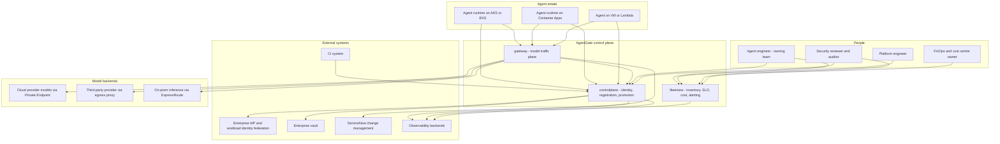
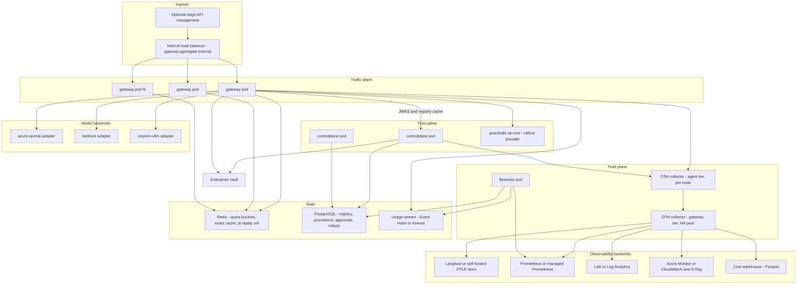
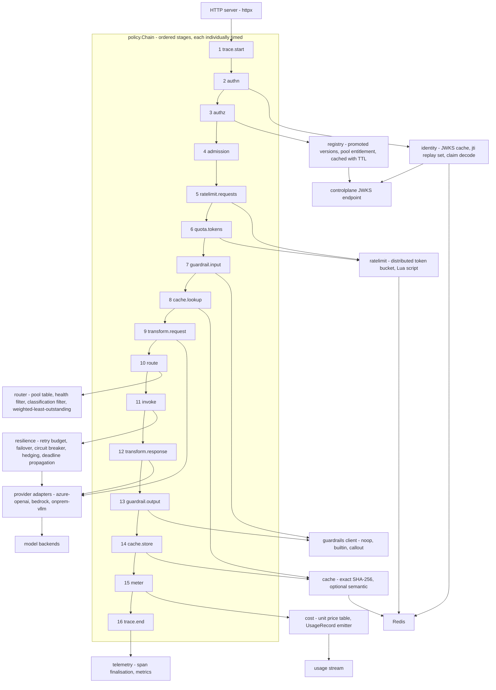
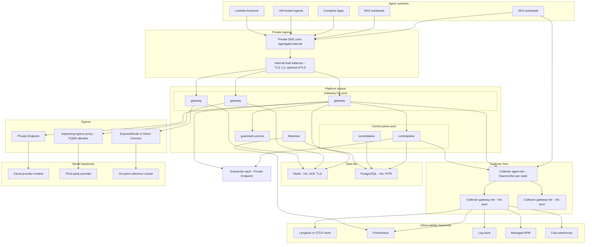

# 01 — Architecture

**Audience:** platform engineers, client architecture review board, client security review.
**Authority:** `SPEC.md`. Where this document appears to disagree with `SPEC.md`, `SPEC.md` wins and
this document is a defect. Where `SPEC.md` is silent, the choice is marked **[Decision]** with the
reasoning attached.

---

## 1. Context and constraints

AgentGate is the control plane every agent at the client passes through, regardless of where that
agent runs. It is one plane with three faces — **Traffic** (`gateway`), **Trust** (`controlplane`),
**Truth** (`fleetview` + the OTel pipeline).

### 1.1 The situation we are building into

| Constraint | What it actually means for the design |
|---|---|
| Regulated financial services client | Every network path needs a named review artefact before it carries traffic. The security review, not the code, is the critical path. Data classification is a first-class routing input, not a tag. |
| A first-generation gateway is already in production | Consumers integrate against a contract that exists today. We do not get to redesign it. AgentGate v1 *is* that contract, published as `api/openapi/gateway.v1.yaml`. |
| Gateway delivery is time-critical | The traffic plane must carry production traffic before the trust and truth planes are complete. The architecture must let identity and observability arrive incrementally without the wire contract moving. |
| Published interface is frozen | Fields may be added. Nothing is removed, retyped, or repurposed. Breaking change means `/v2` side-by-side with a published deprecation window. |
| Small senior team, distributed, limited daily overlap | Few components, sharp interfaces, written handover, no coordination-heavy designs. We buy simplicity with explicit trade-offs rather than optionality. |
| Multi-runtime agent estate | AKS, EKS, Container Apps, plain VMs, Lambda. Anything that requires a sidecar or a specific runtime is not deployable to the whole estate. |
| Cloud-neutral core, Azure and AWS mappings | The core is Go with interfaces at every cloud seam. Cloud specifics live in adapters and Terraform, never in policy code. |

### 1.2 What the platform is responsible for

1. Being the only path from an agent to a model, so that identity, quota, guardrails, cost and
   telemetry are enforceable in one place.
2. Knowing which agents exist, who owns them, what they cost, and which versions are allowed in
   production.
3. Producing telemetry that is trustworthy enough to be a promotion gate, not just a dashboard.

### 1.3 What it is explicitly not

- Not an agent framework. AgentGate does not orchestrate reasoning steps; agents do that.
- Not a prompt manager or evaluation harness. Those are adjacent products; the telemetry schema is
  designed to feed them, not to become them.
- Not a general-purpose API gateway. It is model traffic only.
- Not a model host. Backends are Azure OpenAI, Bedrock, and on-prem vLLM.

---

## 2. C4 Level 1 — System context

**Reading it.** Agents talk to two things: the gateway for model traffic, the control plane for
identity. Everything a human needs — inventory, spend, SLO state, promotion history — is served by
fleetview. Security reviewers get their evidence from the control plane's promotion records and
fleetview's attribution data, not from a spreadsheet maintained by hand.

---

## 3. C4 Level 2 — Container

### 3.1 Containers

| Container | Language / form | Responsibility | State |
|---|---|---|---|
| `gateway` | Go, stateless HTTP service | The 16-stage policy chain, routing, provider adapters, streaming | None local; Redis for shared counters |
| `controlplane` | Go, stateless HTTP service | Registration, RFC 8693 token exchange, JWKS publication, promotion gate, vault-backed secret issuance | PostgreSQL |
| `fleetview` | Go, stateless HTTP service + background workers | Fleet inventory, telemetry-trust computation, SLO/error-budget calculation, cost rollups, chargeback API | PostgreSQL, reads Prometheus and the usage stream |
| `guardrails` | Go service | `callout` guardrail implementation; wraps the managed content-safety service or the client's own filtering service | None |
| `mockprovider` | Go service | Deterministic provider used by the compatibility suite, load tests and local development | None |
| `agentctl` | Go CLI | Registration from CI, promotion requests, approvals, local diagnostics | None |
| `loadgen` | Go CLI | Load and soak generation with realistic token distributions | None |
| OTel collector, agent tier | Contrib collector | Per-node batch, `memory_limiter`, `k8sattributes` | Local queue |
| OTel collector, gateway tier | Contrib collector | Attribute stamping, redaction, tail sampling, routing, fan-out | Persistent sending queue |

**[Decision]** `guardrails` is a separate deployable even though it shares a repository and release
train with the rest. Content-safety callouts have a different latency profile and a different
failure mode from the gateway, and a regulated client will want to swap in their own filtering
service without redeploying the traffic plane.

---

## 4. C4 Level 3 — Gateway internals, policy chain as components

### 4.1 Stage contract

Every stage implements the same interface and is registered by name. The name is load-bearing: it
is the span name suffix (`gateway.policy.<stage>`) and the span attribute key
(`agentgate.policy.<stage>.duration_ms`). Stage names are part of the operational contract even
though they are not part of the wire contract — changing one invalidates dashboards and runbooks.

| Property | Rule |
|---|---|
| Ordering | Fixed, as listed. Stages are not reordered at runtime or by configuration. |
| Timing | Every stage is timed unconditionally, including the ones that no-op. |
| Short-circuit | A stage may terminate the request with a typed error carrying one of the frozen `code` values. Terminating stages still run `meter` and `trace.end`. |
| Mutation | A stage may mutate the request context. Only `transform.request` and `transform.response` may mutate provider-shaped payloads. |
| Purity of `invoke` | `invoke` owns all backend I/O. No other stage performs a backend call. |

**[Decision]** Stages 15 and 16 run on every terminal path including errors and client
disconnects. Otherwise a `client_closed_request` produces no usage record and no cost attribution,
which is exactly the case a finance team will ask about.

---

## 5. Deployment topology

### 5.1 Topology notes

| Element | Sizing and placement | Rationale |
|---|---|---|
| Gateway pool | Minimum 3 replicas per region, spread across availability zones, HPA on in-flight concurrency rather than CPU | Model traffic is I/O-bound; CPU is a poor scaling signal and lags badly on streaming workloads |
| Control plane pool | Minimum 2 replicas; not on the request hot path except for JWKS, which is cached | A control plane outage must not stop model traffic |
| Redis | HA with automatic failover, TLS, AOF persistence | Quota state loss degrades to permissive; see §8 |
| PostgreSQL | HA with point-in-time recovery, 35-day retention | Promotion approvals are audit evidence and must be recoverable |
| Collector agent tier | DaemonSet on Kubernetes; sidecar-less direct OTLP for Lambda and VMs | Not every runtime can host a DaemonSet; the gateway tier is the common funnel |
| Collector gateway tier | Separate HA deployment with persistent sending queue | Tail sampling requires seeing a whole trace, which only works at a funnel point |
| Egress paths | Three distinct paths with three distinct review artefacts | See `10-network-security.md` |

**[Decision]** Lambda and VM agents emit OTLP directly to the collector gateway tier, skipping the
agent tier. They lose `k8sattributes` enrichment, which they do not need, and gain one less hop.

---

## 6. Architectural principles

1. **One plane, three faces.** Identity is enforced *at* the gateway and telemetry originates *at*
   the gateway. Splitting them creates the seam the platform exists to remove.
2. **The wire contract is a liability we accept.** OpenAI-shaped, frozen, additive-only. Internal
   freedom is bought by external rigidity.
3. **Logical models, never provider deployment names.** Callers name capability; the platform names
   hardware. This is what makes failover and cost arbitrage possible at all.
4. **The token is the source of truth for ownership.** An agent cannot lie about who pays. Where
   self-reported attributes disagree with the token, the token wins and the disagreement is
   recorded rather than silently overwritten.
5. **Every stage is timed.** "Where did the latency go" is answered by data, not by argument.
6. **Telemetry is a control, not a dashboard.** It gates promotion. That forces it to be correct.
7. **Fail-closed where the classification demands it, fail-open where availability does.** The
   choice is per pool and is written down, not inferred.
8. **Cloud-neutral core, cloud-specific edges.** Interfaces at every seam; Azure and AWS are
   adapters and Terraform modules, not branches in policy code.
9. **Rollback is a weight change, not a deploy.** True for canary, migration and failover.
10. **Nothing enters production without a named owner, an on-call rota and a cost centre.**

---

## 7. Trade-offs taken

Each row states what we chose, what we rejected, and the cost we are knowingly paying.

### 7.1 One plane vs three independent services

| | |
|---|---|
| **Chosen** | One repository, one release train, three binaries sharing `internal/` packages. |
| **Rejected** | Three independently versioned services with their own APIs and teams. |
| **Why** | Identity enforcement and telemetry origination both live at the gateway. Separating them means the gateway calls a remote identity service on the hot path, and a remote telemetry service must be told what the gateway already knows. That is the seam this platform exists to avoid, and a small team cannot afford three integration surfaces. |
| **Cost paid** | Blast radius of a bad release is wider. Mitigated by separate deployables, independent rollout, and the gateway degrading to cached JWKS and cached registry when the control plane is down. |
| **Revisit when** | Any one plane needs a materially different release cadence, or the team grows past the point where one release train is a queue. |

### 7.2 OpenAI-compatible contract vs a bespoke agent API

| | |
|---|---|
| **Chosen** | Wire-compatible with the OpenAI Chat Completions shape, extended only by `x-agentgate-*` headers and ignorable SSE events. |
| **Rejected** | A purpose-built API expressing agent runs, tool loops and policy decisions natively. |
| **Why** | Existing SDKs and agent frameworks work unmodified, the migration can hold the contract fixed, and the external engineering team has nothing to learn. A bespoke API would be better shaped and would cost every consuming team a rewrite during a time-critical delivery. |
| **Cost paid** | We inherit an API shape that has no first-class place for policy metadata, so extensions live in headers and side-channel SSE events. Some AgentGate concepts have no natural home in the body. |
| **Revisit when** | `/v2`, if ever. Not before. |

### 7.3 Centralised gateway vs per-pod sidecar

| | |
|---|---|
| **Chosen** | Centralised gateway behind an internal load balancer. |
| **Rejected** | Sidecar or in-process library co-located with each agent. |
| **Why** | The estate includes Lambda and VMs where a sidecar is impossible or awkward. Distributed quota, circuit-breaker state, cache and cost attribution all want a shared view. A library version pinned into a hundred agent images cannot be patched on a security timeline. |
| **Cost paid** | One extra network hop, roughly 2–6 ms intra-region, and a shared failure domain. Mitigated by the p95 60 ms overhead SLO, HA pool, and the fact that provider latency dominates by two orders of magnitude. |
| **Revisit when** | A latency-critical workload appears where the added hop is more than 5% of total latency. |

### 7.4 Redis-backed quota vs in-memory per-pod quota

| | |
|---|---|
| **Chosen** | Distributed token bucket in Redis, single atomic Lua script; in-memory buckets with identical semantics for local and dev. |
| **Rejected** | Per-pod in-memory buckets with the limit divided by replica count. |
| **Why** | Divided limits are wrong under uneven load balancing, wrong during scale events, and wrong during rolling deploys — exactly when a quota matters. A token quota with reserve/settle needs a shared ledger to be meaningful. |
| **Cost paid** | One Redis round trip on the hot path, roughly 0.5–1.5 ms, and a dependency whose failure needs a defined behaviour. See §8 for the degradation rule. |
| **Revisit when** | Redis round-trip latency becomes a measurable share of the overhead budget, at which point local pre-reservation with periodic reconciliation is the next step. |

### 7.5 Tail sampling vs full trace fidelity

| | |
|---|---|
| **Chosen** | Tail sampling at the collector gateway tier: 100% of errors, guardrail blocks, failovers, and requests over p99 latency; 5% baseline. |
| **Rejected** | Keep every trace. Also rejected: head sampling at the SDK. |
| **Why** | Full fidelity at fleet scale is a storage and cost problem that grows with adoption, which is the wrong incentive for a platform trying to attract consumers. Head sampling discards the traces you most want before you know they are interesting. |
| **Cost paid** | A specific successful, fast, unremarkable request may not be retrievable. Metrics and usage records are unsampled, so aggregate correctness and billing are unaffected. |
| **Revisit when** | A regulatory requirement demands per-request trace retention, in which case the content pipeline model extends to traces. |

### 7.6 Semantic cache default-off

| | |
|---|---|
| **Chosen** | Exact cache on by policy; semantic cache off by default, enabled per pool and requiring a data-classification allowance. |
| **Rejected** | Semantic cache on by default with a high similarity threshold. |
| **Why** | Semantic matching changes the meaning of "the same question". In a financial-services context, two prompts that are 0.97 cosine-similar can differ by an account number, a date, or a negation. The saving is real but it is not worth an unexplainable answer to a regulator. |
| **Cost paid** | Lower cache hit rate and higher spend than the theoretical maximum. |
| **Revisit when** | Per-pool evidence shows an acceptable false-hit rate on a corpus the owning team has reviewed. |

### 7.7 Fail-closed guardrails for restricted data

| | |
|---|---|
| **Chosen** | Guardrail failure mode is declared per pool. `fail_closed` is the default for `data_classification=restricted`; `fail_open` is available for availability-first pools. |
| **Rejected** | Global fail-open, which maximises availability. Also rejected: global fail-closed, which makes the guardrail service a hard dependency of all model traffic. |
| **Why** | The correct answer differs by data. For restricted data, an unscanned response is a worse outcome than no response. For a low-classification internal helper, the opposite is true. Making it a global choice forces one of those two groups into the wrong behaviour. |
| **Cost paid** | Guardrail service availability becomes an availability dependency for restricted pools, and it must be engineered accordingly. Two behaviours to test, document and run books for. |
| **Revisit when** | Never as a principle; per-pool settings are reviewed with the owning team at promotion. |

### 7.8 Go service vs managed API-management policy expressions

| | |
|---|---|
| **Chosen** | Go service implementing the policy chain; managed API management optional at the edge for org-standard concerns only. |
| **Rejected** | Implementing routing, quota, retries and attribution as policy expressions in the managed AI-gateway product. |
| **Why** | Token-aware reserve/settle quota, streaming-windowed guardrails, circuit-breaker state shared across replicas, and per-stage timing are not expressible in policy-expression languages. They are testable Go with unit tests; policy XML is not. Cloud neutrality is also a stated requirement and policy expressions are the least portable artefact in either cloud. |
| **Cost paid** | We own the code, the CVEs, the on-call, and the performance work. |
| **Revisit when** | Never for the core; edge concerns like org-wide WAF and subscription keys stay in the managed product. |

### 7.9 Logical model indirection vs pass-through model names

| | |
|---|---|
| **Chosen** | Callers name a logical model. The gateway resolves logical model → pool → backend. |
| **Rejected** | Pass the provider deployment name straight through. |
| **Why** | Pass-through makes failover impossible, makes cost arbitrage impossible, and hard-codes provider names into a hundred agent repositories. Every future model migration would then be a consumer-side change. |
| **Cost paid** | An indirection consumers must learn, and a catalogue the platform must maintain. `GET /v1/models` exists to make it discoverable. |

### 7.10 Reserve/settle quota vs post-hoc metering

| | |
|---|---|
| **Chosen** | Estimate, reserve, settle. |
| **Rejected** | Meter actual usage after the fact and enforce on the next request. |
| **Why** | Post-hoc metering cannot stop the request that blows the budget, and with streaming and long generations a single request can be a material share of a minute's quota. Reserve/settle bounds the overshoot to one request. |
| **Cost paid** | Estimation error: over-reservation temporarily under-serves the agent. Settle releases the difference, so the error is transient and bounded by `max_tokens`. |

### 7.11 Redis-backed exact cache vs no cache in v1

| | |
|---|---|
| **Chosen** | Exact-match cache keyed by SHA-256 over normalised request fields, never shared across tenants. |
| **Rejected** | Ship v1 without caching to reduce surface area. |
| **Why** | Agentic workloads retry and re-plan; identical requests are common enough that the saving is visible in the first month, and `savings_usd` is how a shared platform justifies its existence to the teams funding it. |
| **Cost paid** | Cache correctness rules — skip above temperature 0.2, never for tool calls by default — are subtle and must be documented for consumers. |

### 7.12 Fleet-wide retry budget vs per-request retry policy only

| | |
|---|---|
| **Chosen** | Per-request budget capped at `retry_budget_ratio` of the deadline, *and* a fleet-wide cap of 10% of request volume. |
| **Rejected** | Per-request exponential backoff alone. |
| **Why** | Per-request policies are individually reasonable and collectively catastrophic. During a partial provider outage, well-behaved retries from every replica become the outage. The fleet cap converts a retry storm into fast failure. |
| **Cost paid** | Under fleet-wide stress some retryable requests are not retried, and callers see `provider_error` sooner. That is the intended behaviour. |

---

## 8. Scaling and capacity model

### 8.1 What scales with what

| Dimension | Primary driver | Scales | Notes |
|---|---|---|---|
| Gateway replicas | Concurrent in-flight requests, dominated by streaming | Horizontally, stateless | HPA on `agentgate.gateway.inflight` per pod, not CPU |
| Gateway memory | Concurrent streams and their buffers | Linearly with in-flight streams | See §8.3 |
| Redis | Requests per second times ops per request | Vertically then by shard on the bucket key | Bucket key `tenant:team:agent:env` shards naturally |
| PostgreSQL | Registered agents, promotions, rollup rows | Vertically for a long time | Write volume is low; rollups are the largest table |
| Collector gateway tier | Spans per second | Horizontally, but tail sampling requires trace-affine routing | Load-balancing exporter on trace id in the agent tier |
| Usage stream | Completed requests per second | Partitions on `cost_center` | One record per completed request, unsampled |
| Cost rollups | Requests per hour | Batch, off the hot path | Hourly and daily by cost centre |

### 8.2 Expected per-pod throughput

Working model for capacity planning, to be replaced by measured numbers from `loadgen` before GA.
**[Decision]** These are planning figures, stated so that capacity conversations have a starting
point, not measured commitments.

| Workload | Assumption | Per-pod capacity |
|---|---|---|
| Unary, short prompts | 60 ms gateway overhead budget, 800 ms provider latency, 2 vCPU / 2 GiB pod | ~600–900 concurrent in-flight; ~700 req/s bounded by provider concurrency long before CPU |
| Streaming, 500-token completions | 30 s average stream duration, heartbeat every 15 s | ~1,500–2,500 concurrent streams per pod, memory-bound not CPU-bound |
| Embeddings, batched | Small payloads, no streaming | ~2,000 req/s, CPU-bound on JSON handling |

The gateway is I/O-bound. In practice the binding constraint is almost never gateway CPU; it is
per-backend concurrency caps and provider-side rate limits.

### 8.3 Memory per in-flight stream

| Component | Estimate | Reasoning |
|---|---|---|
| Request context, claims, span, stage timings | ~8 KB | Fixed-size structures plus decoded claims |
| Request body retained for cache key and retry | Prompt size, typically 4–40 KB | Bounded by the admission size cap |
| Provider response buffer | ~16 KB | Chunked SSE reads |
| Guardrail output window | ~256 tokens, roughly 1 KB of text plus overhead, ~4 KB | The windowing buffer is the point of the design |
| Per-connection TLS and HTTP/2 state, both sides | ~64 KB | Dominated by the outbound connection |
| **Total working estimate** | **~100 KB per in-flight stream** | 2,500 streams ≈ 250 MB, plus runtime and heap headroom |

**[Decision]** Pods are sized 2 vCPU / 2 GiB with `GOMEMLIMIT` set to 80% of the container limit and
a hard in-flight ceiling that triggers load shedding before the runtime approaches the limit.
Shedding `batch` priority first is a SPEC requirement; the ceiling is what makes it actionable.

### 8.4 Connection and pool sizing

| Pool | Sizing rule | Default | Failure if wrong |
|---|---|---|---|
| Outbound HTTP to each backend | `MaxConnsPerHost` at or above the backend concurrency cap; `MaxIdleConnsPerHost` equal to steady-state concurrency | 256 / 128 | Too low: silent queueing that looks like provider latency. Too high: connection churn against the provider's limits |
| Redis | Pool size ≈ 2× peak concurrent requests per pod / pipeline depth | 64 per pod | Too low: quota stage becomes the latency spike |
| PostgreSQL from control plane | Bounded well below the server's `max_connections` with a shared pooler | 20 per pod | Connection exhaustion during a rollout |
| JWKS fetches | Single-flight, cached with TTL and background refresh | TTL 10 min, refresh at 5 min | Thundering herd against the control plane on key rotation |
| Registry lookups | Cached per agent-version with TTL, negative caching for unknown | TTL 30 s | Control-plane load proportional to gateway traffic |

**[Decision]** Idle connection timeouts on outbound pools are set below the shortest idle timeout of
any intermediary — load balancer, egress proxy, or provider — so the gateway always closes first
and never inherits a half-open connection. Default 60 s pending measurement of each path.

### 8.5 Known bottlenecks, in the order they will bite

1. **Per-backend provider quota.** Almost always the first ceiling. Mitigated by pools with
   multiple backends and a failover tier.
2. **Redis round trips on the hot path.** Two logical operations per request — RPM and TPM — issued
   as one script. Becomes visible above roughly 20k req/s per Redis primary.
3. **Guardrail callout latency for restricted pools.** Adds to both input path and every output
   window. This is the main reason `fail_closed` pools need their own capacity plan.
4. **Collector gateway tier during trace-volume spikes.** Tail sampling holds traces in memory until
   a decision; a spike becomes memory pressure. Bounded by `memory_limiter` and the sampling
   decision wait time.
5. **PostgreSQL rollup writes at month end.** Batch work colliding with reporting reads.

---

## 9. Failure domains and blast radius

| Failure domain | Trigger | Immediate blast radius | Degraded behaviour | Recovery |
|---|---|---|---|---|
| Single gateway pod | Crash, OOM, node loss | In-flight requests on that pod fail; streams end with an SSE `error` frame | LB removes it on `readyz`; other pods absorb | Automatic restart; capacity check if it recurs |
| Whole gateway pool in one zone | Zone outage | Capacity reduction; no functional loss if replicas span zones | Remaining zones serve; HPA scales | Automatic |
| All gateways | Bad release, config error, dependency failure | Total model-traffic outage for the estate | None — this is the platform's single largest risk | Rollback; canary and progressive delivery exist to prevent it |
| Redis unavailable | Failover, network partition | Quota and RPM enforcement lose their shared ledger; exact cache misses | **[Decision]** Fail-open on rate limiting with a hard per-pod local ceiling as a backstop, `agentgate.ratelimit.decisions` labelled to make it visible, and an alert. Rationale: a quota is a cost control, not a safety control; a safety control fails closed, a cost control fails open with an alarm. Cache degrades to miss, which is always safe. | Automatic on Redis recovery; monthly budget reconciles from usage records, which are unaffected |
| Control plane unavailable | Deploy, database failure | No new token exchanges, no registrations, no promotions | Gateway continues on cached JWKS and cached registry entries until TTL expiry. **[Decision]** JWKS cache is served stale for up to 24 h during a control-plane outage rather than failing authentication, since key material has not changed and rejecting all traffic is the worse failure | Automatic; agents with expiring tokens are the first affected |
| PostgreSQL unavailable | Failover, storage | Control plane read/write down; fleetview rollups stall | Model traffic unaffected | HA failover; PITR if data loss |
| Guardrail service unavailable | Deploy, upstream content-safety outage | Pools with `fail_closed` stop serving with `guardrail_blocked`; `fail_open` pools continue with `x-agentgate-guardrail` reflecting the bypass | Intentional and classification-dependent | Restore service; the failure mode is a per-pool policy decision reviewed at promotion |
| One backend unhealthy | Provider incident, quota exhaustion | Circuit breaker opens for that backend; traffic shifts within the tier | Transparent to callers except `x-agentgate-attempts` and `x-agentgate-provider` | Half-open probes; automatic close |
| All backends in a pool unhealthy | Regional provider outage | `no_healthy_backend` for that pool only; other pools unaffected | Failover tier is the mitigation; on-prem tier exists for this case | Provider recovery or manual tier promotion |
| Collector gateway tier down | Deploy, memory pressure | Telemetry loss; **not** a traffic outage | Agent-tier persistent queues buffer; `agentgate.telemetry.completeness` drops and alerts; promotion gate correctly starts failing | Restore; buffered spans flush |
| Usage stream unavailable | Broker outage | Chargeback records buffered | **[Decision]** Gateway buffers usage records to a local append-only file and replays on recovery; requests are never failed for a metering failure | Replay on recovery; reconciliation against the cloud bill catches gaps |
| Vault unavailable | Outage, credential expiry | No new client-credential issuance or rotation | Existing cached provider credentials continue until expiry; federated identity is unaffected | Restore; rotation runbook |
| Egress proxy down | Network change | Third-party provider backends unreachable; circuit breakers open | Failover to cloud-provider or on-prem tiers | Network team; the failover tier is the mitigation |

### 9.1 Blast-radius principle

The single largest concentrated risk in this architecture is that the gateway is on the path of all
model traffic. That risk is accepted deliberately — it is the same property that makes the platform
useful — and is managed by: multi-zone HA, progressive delivery with automatic rollback, a
compatibility suite that runs against every change, cached dependencies so control-plane and
telemetry failures are not traffic failures, and the explicit rule that only guardrails and
authentication may fail closed.

---

## 10. Cross-references

| Topic | Document |
|---|---|
| Request and error semantics, examples | `04-gateway-contract.md` |
| Policy chain walkthrough with failure branches | `02-flows.md` |
| Message-level detail per component | `03-sequences.md` |
| Identity, claims, promotion gate | `05-identity.md` |
| Telemetry schema and pipelines | `06-telemetry-schema.md` |
| SLIs, SLOs, alerts, error-budget policy | `07-slo-alerting.md` |
| Cost attribution and chargeback | `08-chargeback.md` |
| Migration from the legacy gateway | `09-migration.md` |
| Network paths, DNS, TLS, threat model | `10-network-security.md` |
| Delivery sequencing and open decisions | `11-delivery-plan.md` |
| Decision records | `adr/` |
