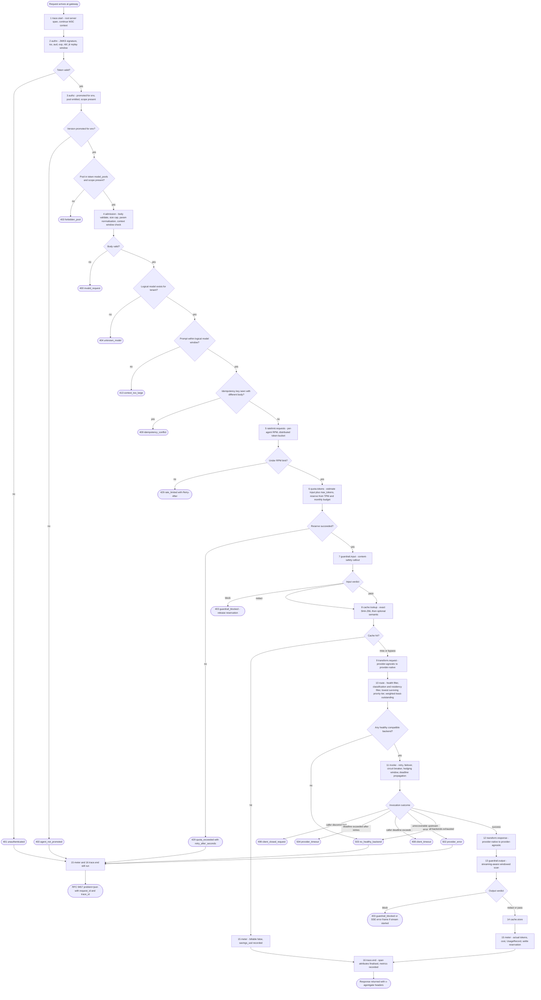
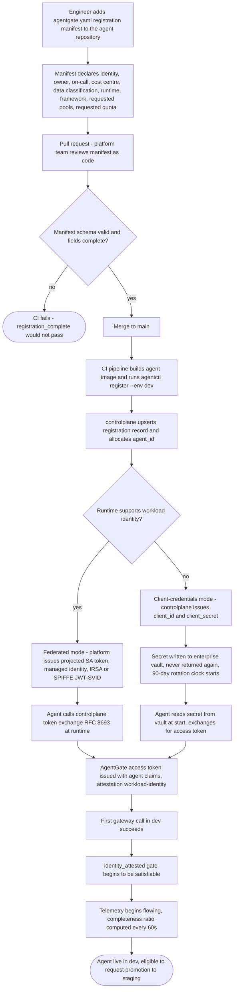
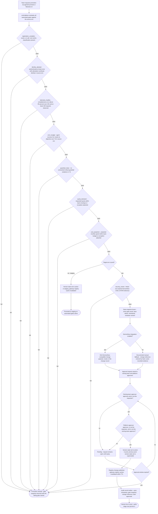
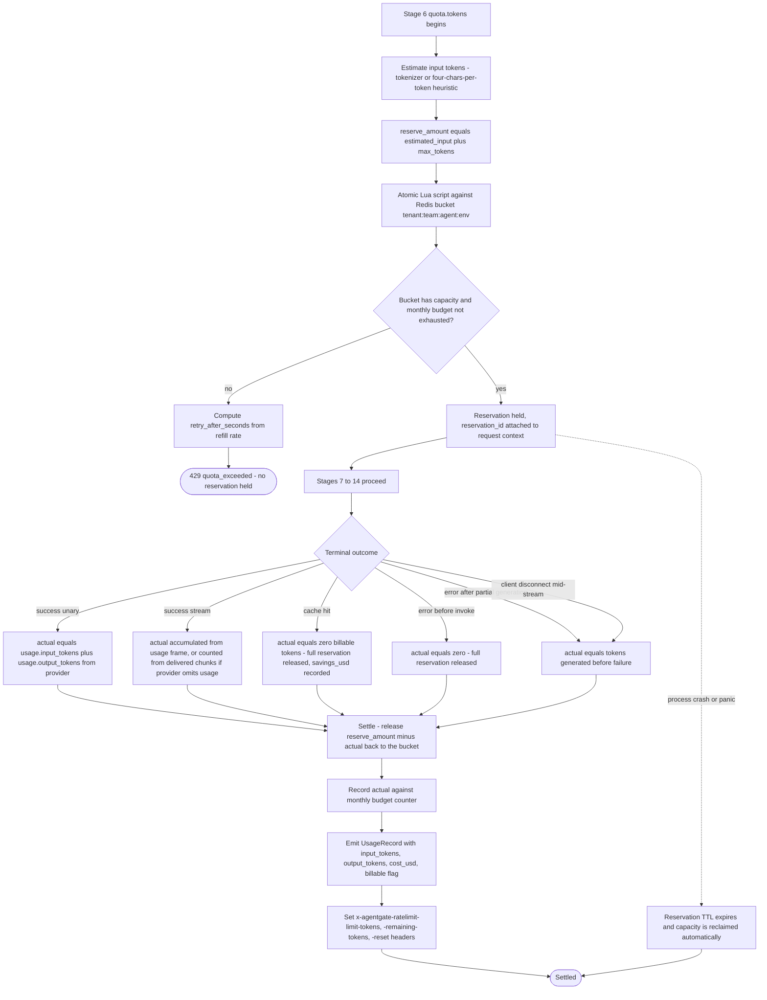
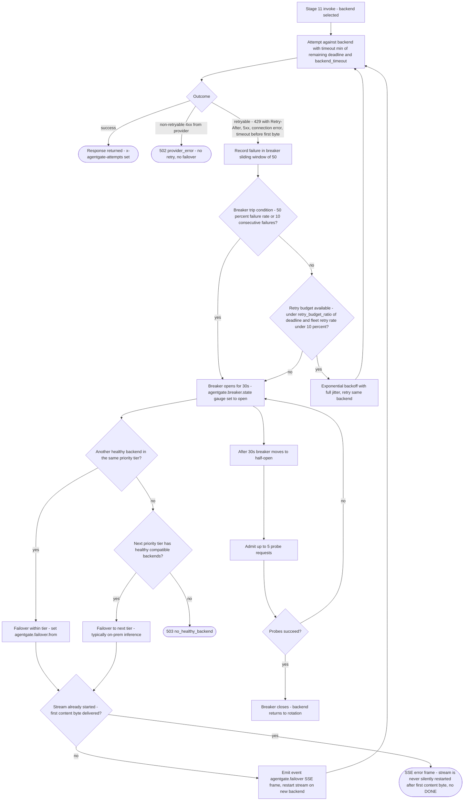
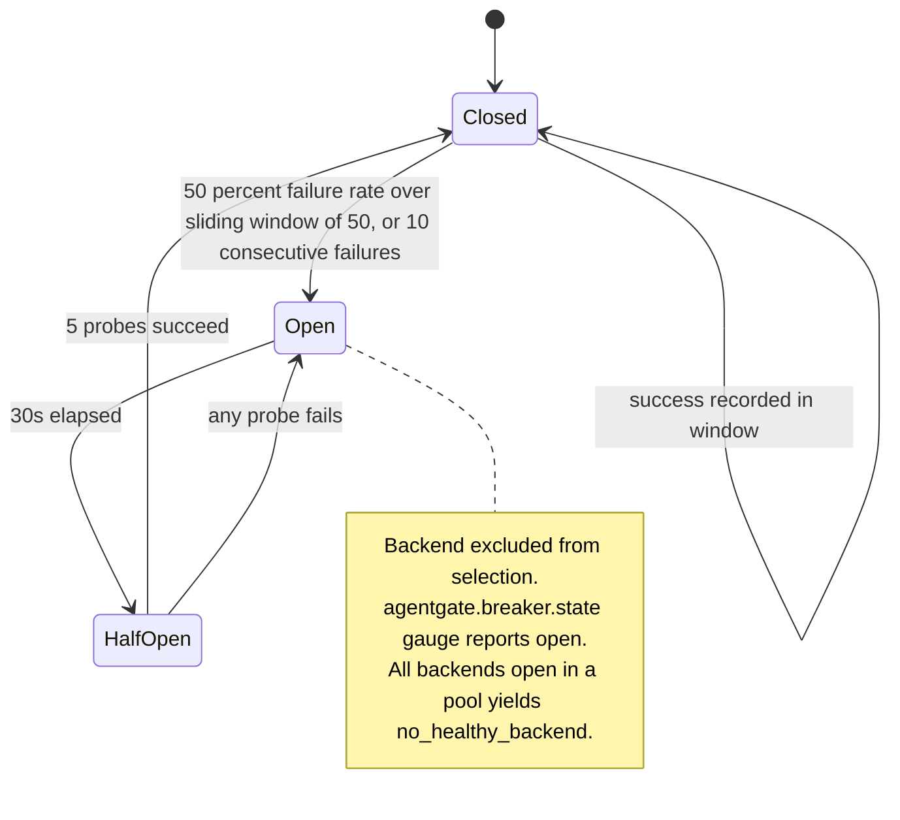
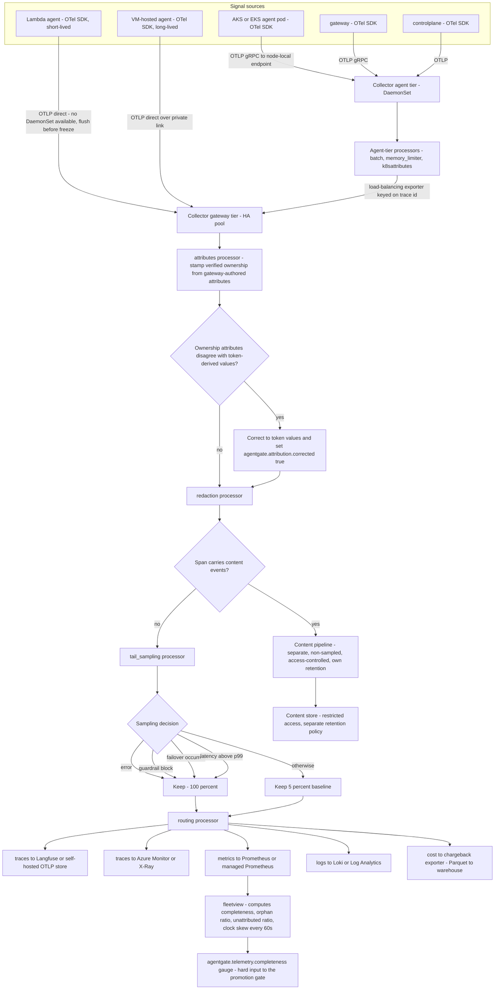
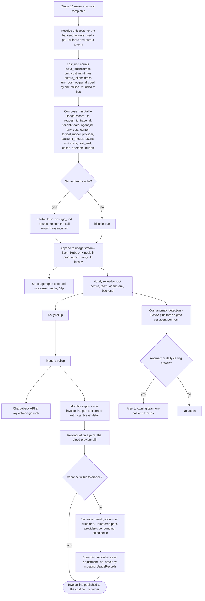
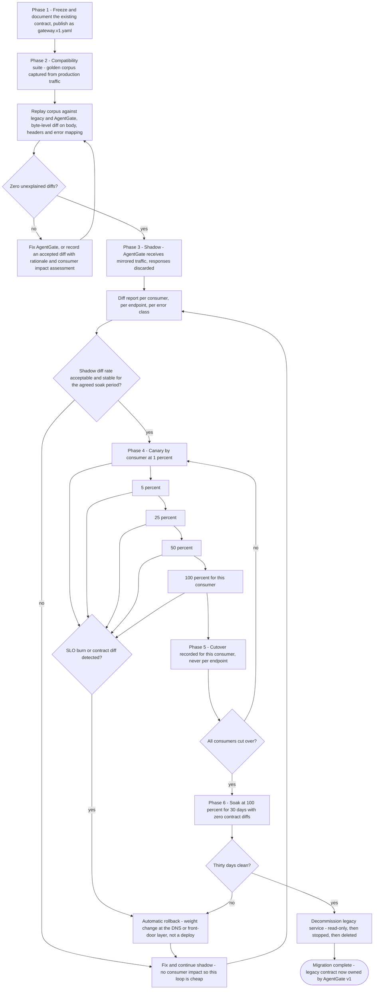
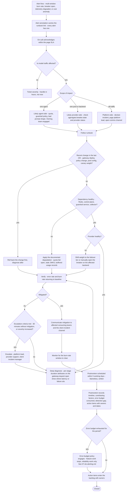

# 02 — Flows

Operational flows through AgentGate. Each flow has a diagram, a prose walkthrough, and an explicit
list of failure branches. Message-level detail with participants and timing is in
`03-sequences.md`; this document is about decision structure.

Conventions used throughout:

- Rectangles are actions, rhombi are decisions, rounded nodes are terminal states.
- Every terminal error names the frozen `code` from `SPEC.md` §2.4.
- Policy stage numbers match `SPEC.md` §3.2 exactly and are never renumbered.

---

## 1. End-to-end inference request — all 16 policy stages

### 1.1 Walkthrough

**Stages 1–4, admission.** `trace.start` opens the root `gateway.request` span, continuing the
caller's `traceparent` if present. `authn` verifies the JWT against JWKS fetched from the control
plane and cached, checking `iss`, `aud`, `exp`/`nbf`, and the `jti` replay window. `authz` is three
independent checks — the agent's version is promoted for the requested `env`, the resolved pool is
in the token's `model_pools`, and the required scope (`models:invoke` or `models:embed`) is present.
`admission` validates and normalises the body, applies the size cap, resolves the logical model, and
compares the estimated prompt size against the logical model's window.

**Stages 5–6, cost control.** RPM is checked first because it is cheaper and because a request that
fails RPM should not consume token-quota accounting. `quota.tokens` estimates input tokens plus
`max_tokens` and reserves that many from the agent's bucket, keyed `tenant:team:agent:env`, and also
checks the monthly budget. The reservation is the point at which a request has claimed capacity;
every terminal path after this point must release or settle it.

**Stages 7–8, safety and cache.** The input guardrail runs before cache lookup so that a blocked
prompt never becomes a cache key and never touches a provider. Cache lookup is exact-match first;
semantic match only if the pool has it enabled and the classification permits. A hit skips stages
9–14 entirely and goes straight to `meter`, where it is recorded with `billable:false` and a
`savings_usd` figure.

**Stages 9–12, the backend call.** `transform.request` converts the provider-agnostic body into
provider-native form. `route` applies the selection order from `SPEC.md` §3.1: health filter, then
classification and residency compatibility, then the lowest priority tier with survivors, then
weighted-least-outstanding within that tier. `invoke` owns all backend I/O and everything that
happens when it goes wrong. `transform.response` converts back.

**Stages 13–16, safety and accounting.** Output guardrail scanning is windowed for streams:
approximately 256-token windows are buffered, scanned, and released, so a violation is caught before
the caller sees it while keeping time-to-first-token acceptable. `cache.store` writes the entry with
the originating trace id, so a future hit is still fully attributable. `meter` settles the
reservation against actual usage, records cost, and emits the immutable `UsageRecord`. `trace.end`
finalises span attributes and records metrics.

### 1.2 Failure branches

| Branch | Code | Status | Reservation handling | Caller-visible signal |
|---|---|---|---|---|
| Signature, issuer, audience, expiry or replay failure | `unauthenticated` | 401 | None taken | `WWW-Authenticate`, problem+json |
| Version not promoted for env | `agent_not_promoted` | 403 | None taken | `detail` names the version and env |
| Pool not in entitlement, or scope missing | `forbidden_pool` | 403 | None taken | `detail` names the pool |
| Body malformed or unsupported parameter | `invalid_request` | 400 | None taken | `detail` names the field |
| Logical model unknown for tenant | `unknown_model` | 404 | None taken | `GET /v1/models` is the remedy |
| Prompt exceeds logical model window | `context_too_large` | 413 | None taken | `detail` carries estimated and maximum |
| Same idempotency key, different body | `idempotency_conflict` | 409 | None taken | 24 h key window |
| RPM exceeded | `rate_limited` | 429 | None taken | `Retry-After` |
| TPM or monthly budget exceeded | `quota_exceeded` | 429 | Reserve refused | `Retry-After`, `retry_after_seconds`, ratelimit headers |
| Input guardrail blocked | `guardrail_blocked` | 403 | Released in full | `x-agentgate-guardrail: blocked:<category>` |
| No healthy compatible backend at route time | `no_healthy_backend` | 503 | Released in full | `Retry-After` |
| All backends exhausted during invoke | `no_healthy_backend` | 503 | Released in full | `x-agentgate-attempts` reflects the attempts made |
| Upstream unrecoverable error | `provider_error` | 502 | Released in full | `x-agentgate-provider` names the last backend tried |
| Upstream deadline exceeded after retries | `provider_timeout` | 504 | Released in full | — |
| Caller deadline exceeded | `client_timeout` | 408 | Released in full | — |
| Caller disconnected mid-stream | `client_closed_request` | 499 | Settled at tokens actually generated | Nothing; the caller is gone. Usage record still written |
| Output guardrail blocked, unary | `guardrail_blocked` | 403 | Settled at actual | Response body replaced by problem+json |
| Output guardrail blocked, stream already started | — | Stream already 200 | Settled at actual | SSE `error` frame, no `[DONE]`, `x-agentgate-guardrail` already sent as `pass` in headers; the error frame carries the block |

The last row is the one consumers most often get wrong. Once the response headers are on the wire,
the status code is fixed. A guardrail block discovered mid-stream can only be signalled in-band.
This is documented in `04-gateway-contract.md` §6.

---

## 2. Agent onboarding — repo to identity

### 2.1 Walkthrough

Onboarding starts in the agent's own repository, not in a platform console. The registration
manifest is reviewed as code by the platform team, which is where the ownership, on-call and cost
centre fields actually get checked by a human. CI registers the agent in `dev` on every merge, so
the registry never drifts from what is deployed.

The branch at "runtime supports workload identity" is the single most consequential decision in
onboarding. Federated mode means no long-lived secret exists at any point. Client credentials mode
is a fallback that carries a 90-day rotation obligation and a vault dependency; teams choosing it
should know they are choosing operational work.

`identity_attested` cannot be satisfied by registration alone. The agent must actually authenticate
with `attestation=workload-identity` in the source environment — a registered agent that has never
run is not promotable, which is deliberate.

### 2.2 Failure branches

| Branch | Symptom | Resolution |
|---|---|---|
| Manifest missing owner, on-call, cost centre or classification | CI fails at schema validation | Fix the manifest; this is `registration_complete` shifted left |
| Requested pool does not exist for the tenant | Registration succeeds, `authz` later fails with `forbidden_pool` | Platform adds the pool or the team requests a different one |
| Requested quota exceeds team envelope | Registration succeeds; `quota_declared` gate fails at promotion | Attach an exception or reduce the request |
| Workload identity federation not configured for the runtime | Token exchange fails at runtime | Configure federation, or fall back to client credentials with the rotation obligation accepted |
| Client secret leaked or lost | Agent cannot authenticate | Rotation runbook; see flow 11 in `03-sequences.md` |
| Agent registers but never calls | `identity_attested` never satisfied | Expected; run the agent in dev before requesting promotion |

---

## 3. Promotion gate — dev to staging to prod

### 3.1 Walkthrough

Gates are evaluated in a fixed order and the first failure stops evaluation, but the response
returns the full snapshot with every gate's state so a team fixes everything in one pass rather than
discovering failures one at a time.

`telemetry_healthy` and `error_budget` are the two gates that cannot be satisfied by paperwork. They
require the agent to have actually run, correctly instrumented, at acceptable quality, in the source
environment. This is the mechanism that makes telemetry a control rather than a dashboard: an agent
whose traces do not arrive cannot reach production.

The two-party rule is enforced structurally, not by convention. The requester is excluded, and the
two approvers must be distinct and drawn from different groups — one owning-team, one platform.
Approvals are recorded with actor, timestamp and the exact evaluated gate snapshot, so an auditor
can reconstruct not just that a version was approved but what was true at the moment it was
approved.

The ServiceNow branch matters for delivery: the integration is not on the critical path. When it is
disabled, the documented manual path produces the same evidence, with the change reference entered
by hand. What is never optional is the evidence.

### 3.2 Failure branches

| Branch | Cause | What the team does |
|---|---|---|
| `telemetry_healthy` fails at 94% | Missing OTLP export from one replica, or clock skew | `fleetview` shows the per-agent completeness breakdown; fix instrumentation and wait for the 24 h window |
| `telemetry_healthy` fails on volume | Fewer than 100 requests in the source env | Generate representative traffic; a version with no evidence is not promotable |
| `error_budget` fails | The agent itself is failing, often from its own retry loop | Fix the agent; the gate is measuring the agent's own success SLI |
| `guardrail_clean` fails | Unresolved critical violation in the last 7 d | Resolve or formally accept the violation with a record |
| `cost_projection` fails | Projection based on staging volume exceeds budget | Attach a funded exception or reduce scope |
| `security_review` expired | The linked CHG or RITM aged out | Re-link a current reference; expiry is checked at evaluation, not at approval |
| One approval obtained, second never arrives | Approver unavailable | Request expires; re-request. **[Decision]** default approval window is 72 h |
| Requester attempts to self-approve | Structural rule violation | Rejected by the control plane, recorded as a rejected attempt in the audit trail |
| ServiceNow unavailable during a production incident fix | Integration down | Documented manual fallback with the same evidence. This is why the fallback exists |
| Rollback needed after promotion | Bad version in prod | Promote the previous version, which is a state change with its own two-party approval; **[Decision]** an emergency path allows a single platform approver to revert to a previously-active version, recorded as an emergency action and reviewed within 24 h |

---

## 4. Token quota reserve and settle lifecycle

### 4.1 Walkthrough

Reservation exists because post-hoc metering cannot stop the request that blows the budget. A single
long generation can be a material share of a minute's quota, so the platform claims capacity before
the request runs and returns the unused portion afterwards.

The estimate is deliberately conservative: input estimate plus the caller's `max_tokens`, which is
the maximum the request can possibly consume. Over-reservation temporarily under-serves the agent;
settle corrects it within the request's own lifetime.

Every terminal path settles, including errors and disconnects. A reservation that is never settled
is a slow quota leak, which is why reservations also carry a TTL — **[Decision]** the reservation
TTL is the request deadline plus 30 s, so a crashed pod cannot strand capacity for more than that.

The `x-agentgate-ratelimit-*` headers reflect post-settle state, so a caller pacing itself on those
headers sees the true remaining budget rather than the reserved-but-unused figure.

### 4.2 Failure branches

| Branch | Behaviour |
|---|---|
| Redis unavailable at reserve | Fail-open with a per-pod local ceiling as backstop; `agentgate.ratelimit.decisions` records the degraded decision and an alert fires. Rationale in `01-architecture.md` §9 |
| Redis unavailable at settle | Settle is retried with a bounded queue; if it never lands, the reservation TTL reclaims capacity and the monthly budget is reconciled from usage records, which are on a separate path |
| Provider omits usage on a stream | Tokens counted from delivered chunks using the same tokenizer as the estimate; `agentgate.usage.estimated=true` set on the span so the figure is not mistaken for authoritative |
| Monthly budget exhausted mid-minute | `quota_exceeded` with a `retry_after_seconds` reflecting the month boundary, not the bucket refill; the `detail` says which limit was hit |
| `max_tokens` omitted by caller | Logical model default is used for the reservation. **[Decision]** documented in `04-gateway-contract.md` because it affects a caller's effective quota |

---

## 5. Failover and circuit breaker

### 5.1 Breaker state machine

### 5.2 Walkthrough

Retries are attempted only for idempotent failures: 429 carrying `Retry-After`, 5xx, connection
errors, and timeouts that occur before the first byte. A timeout after the first byte is not
retryable because the provider may have already done the work and, for streams, the caller may
already have seen output.

Two budgets bound retries. The per-request budget caps time spent retrying at `retry_budget_ratio`
of the deadline, default 0.25. The fleet-wide budget caps retries at 10% of request volume, which is
what stops a partial provider outage from becoming a self-inflicted denial of service. When the
fleet budget is exhausted, retries stop and requests fail fast; this is the intended behaviour and
should be visible on `agentgate.retry.attempts`.

Failover moves within the tier first, then to the next priority tier. In the reference topology the
next tier is on-prem inference, which is why capacity there needs to be planned for provider-outage
load rather than steady-state load.

The stream case is the one with a real semantic constraint. Before the first content byte, the
caller has seen nothing, so restarting on another backend is invisible and correct; an
`event: agentgate.failover` frame is emitted so an observant client can record it. After the first
content byte, restarting would produce a response that is a concatenation of two different
generations. The contract forbids it: the stream ends with an SSE `error` frame and no `[DONE]`.

### 5.3 Failure branches

| Branch | Behaviour | Caller sees |
|---|---|---|
| Provider returns 429 without `Retry-After` | Treated as retryable with backoff derived from the schedule, not the header | Increased `x-agentgate-attempts` |
| All backends in tier open, next tier classification-incompatible | Not a valid failover target; classification filter runs before tier selection | `no_healthy_backend` |
| Breaker flaps — closes then immediately reopens | Half-open probe budget of 5 limits damage per cycle; sustained flapping raises the breaker-open alert | Elevated latency and attempts |
| Failover succeeds but on a more expensive backend | Correct behaviour; cost attributed to the backend actually used | `x-agentgate-provider`, `x-agentgate-cost-usd` reflect reality |
| Hedged request wins on the second backend | First attempt cancelled; only the winning attempt is billed | `x-agentgate-attempts` reflects attempts made |
| Deadline exhausted mid-failover | No further attempts | `provider_timeout` |
| Caller disconnects during failover | Attempt cancelled, reservation settled at actual | `client_closed_request` recorded, nothing delivered |

---

## 6. Telemetry flow — three runtimes into the collector tiers

### 6.1 Walkthrough

Three runtimes, two ingress paths. Kubernetes workloads and the platform services themselves emit to
a node-local collector, which batches, applies `memory_limiter`, and enriches with Kubernetes
attributes. Lambda and VM agents emit directly to the gateway tier because no DaemonSet exists for
them; they lose Kubernetes enrichment they do not need.

Lambda deserves specific attention: the execution environment can freeze immediately after the
handler returns, so the SDK must flush synchronously before returning. An unflushed Lambda span is
the most common cause of a completeness ratio that mysteriously sits at 90%.

The agent tier uses a load-balancing exporter keyed on trace id. This is not optional. Tail sampling
requires that every span of a trace arrives at the same gateway-tier instance; without trace-affine
routing the sampler sees fragments and makes inconsistent decisions.

Attribute stamping is where the platform's ownership guarantee is realised. The gateway derives
ownership from the verified token; the collector reconciles what the agent self-reported against
that. Disagreement is corrected in favour of the token and flagged with
`agentgate.attribution.corrected=true` so it is visible and fixable rather than silently papered
over.

The content pipeline is physically separate. Prompt and completion content never rides the sampled
trace path; it is emitted as span events on a dedicated pipeline with its own retention and access
control, redacted by the guardrail engine first. In production for this client the default is `off`.

### 6.2 Failure branches

| Branch | Effect | Detection |
|---|---|---|
| Agent-tier collector OOM | Spans dropped at the node | `memory_limiter` refusals; completeness ratio drops for agents on that node |
| Gateway-tier collector down | Agent-tier persistent queue buffers, then drops | Queue-size metric; completeness drop; **traffic is unaffected** |
| Load-balancing exporter misconfigured | Trace fragments split across samplers, inconsistent decisions | `orphan_span_ratio` rises sharply |
| Lambda does not flush before freeze | Missing agent spans, gateway spans present | `orphan_span_ratio` and completeness both degrade for that agent only |
| Clock skew on a VM agent | Spans appear out of order or with negative durations | `clock_skew_p99` metric; NTP remediation |
| Backend observability store rejects or throttles | Retry with backoff from the persistent sending queue | Exporter failure metrics |
| Content capture accidentally enabled in prod | Sensitive content in a store not provisioned for it | Configuration is asserted in the deploy pipeline and alerted on; see `06-telemetry-schema.md` §7 |

---

## 7. Cost attribution and chargeback

### 7.1 Walkthrough

Cost is computed at the moment of metering against the backend actually used, not the backend
requested. A request that failed over from a cheap backend to an expensive one is billed at the
expensive one, because that is what happened.

`UsageRecord` is immutable. Corrections are adjustment lines, never mutations. This is what makes
the record set usable as evidence: an auditor can replay the stream and arrive at the same number
that appeared on the invoice.

Cache hits are recorded rather than omitted. A hit with `billable:false` and a `savings_usd` figure
is how the platform demonstrates value to the teams funding it; omitting cache hits would make the
platform look less used than it is and hide the saving entirely.

Reconciliation against the cloud bill is the honest part of the design. The gateway's figure and the
provider's invoice will not agree exactly — rounding, provider-side batching discounts, and
unmetered paths all contribute. The process is to detect variance, explain it, and record an
adjustment, not to assume the gateway is right.

### 7.2 Failure branches

| Branch | Effect | Handling |
|---|---|---|
| Usage stream unavailable | Records buffered locally, replayed on recovery | Requests are never failed for a metering failure |
| Unit price table stale after a provider price change | Systematic cost error until corrected | Prices are versioned with effective dates; see `08-chargeback.md` §3 |
| Provider omits usage on a stream | Token counts estimated, `agentgate.usage.estimated=true` | Reconciliation catches systematic drift |
| `cost_center` missing from token | Cannot reach `env=prod` at all — the claim is required | `authz` refuses; this is a SPEC-level rule |
| Request fails after partial generation | Tokens generated are still billed, `billable:true` | The provider charged for them |
| Duplicate record from a stream replay | Deduplicated on `request_id` at rollup | `request_id` is unique per gateway request |

---

## 8. Migration — freeze to decommission

### 8.1 Walkthrough

The migration is a strangler with the contract held fixed. The key move is Phase 1: the existing
contract is documented and frozen as `gateway.v1.yaml`, and AgentGate v1 *is* that contract. No
consumer changes code, so no consumer has to be scheduled.

Cutover is per consumer, never per endpoint. A consumer that saw one behaviour on
`/v1/chat/completions` and another on `/v1/embeddings` would be debugging a difference the platform
created. Per-consumer cutover means a single consumer always sees one implementation.

Rollback at every stage is a weight change at the routing layer. This is the property that makes the
canary steps safe enough to be automatic: rollback is seconds, not a deploy cycle.

The 30-day zero-diff soak before decommission is not a formality. Monthly-cycle behaviours — month
end batch jobs, quarterly reporting agents — only appear in a window that long.

### 8.2 Failure branches

| Branch | Response |
|---|---|
| Corpus diff on an error mapping | Highest-priority class of diff. Error codes and statuses are frozen contract; a mismatch is a defect, not a difference of opinion |
| Diff only under load | Shadow at production volume before canary; concurrency-dependent behaviour will not appear in a replay harness |
| Consumer depends on undocumented legacy behaviour | Found in shadow. Either replicate it and document it as part of v1, or negotiate a change with that consumer before their canary |
| SLO burn during canary | Automatic rollback to 0% for that consumer; investigation before re-attempting |
| A consumer cannot be identified | Cutover is blocked for that traffic. **[Decision]** unattributed traffic remains on legacy until identified; migrating traffic whose owner is unknown means having no one to call when it breaks |
| Legacy service needed after decommission | Decommission is staged: read-only, then stopped but restorable for 30 days, then deleted |

---

## 9. Incident flow

### 9.1 Walkthrough

The first decision after acknowledgement is scope, because scope determines who is even involved.
One agent affected is usually not a platform incident: it is quota, a guardrail policy, or the
agent's own behaviour, and the owning team is the right responder. One pool or backend affected is
usually a provider incident and the mitigation is traffic shifting. All traffic affected is a
platform incident with a declared severity and a comms channel.

"Recent change?" comes before "deep diagnosis" deliberately. Rolling back a change is faster than
understanding it, and the architecture is built so that rollback is cheap — canary weights, pool
configuration, and promotion state are all reversible without a deploy.

Per-stage duration attributes are the diagnostic backbone. `agentgate.policy.<stage>.duration_ms` on
the `gateway.request` span answers "where did the latency go" directly. An incident where the answer
is not immediately visible in that data is itself a finding for the postmortem.

The error-budget policy branch at the end is not decorative. It is the mechanism that converts
reliability from an aspiration into a constraint on what the team is allowed to work on next.

### 9.2 Decision points, stated explicitly

| Decision | Criterion |
|---|---|
| Page vs ticket | Page for fast-burn windows and total-traffic impact. Ticket for slow burn, single-agent issues, and telemetry degradation that is not affecting traffic |
| Declare an incident | Model traffic affected across more than one consumer, or any duration of total outage |
| Roll back before diagnosing | Any change in the preceding 24 h that plausibly touches the symptom |
| Manually open a breaker | Provider is degraded in a way the automatic breaker is not catching, such as correct-status-code garbage responses |
| Escalate | 30 minutes without mitigation, severity increases, or a dependency owned by another team is implicated |
| Engage the owning team rather than the platform | Impact confined to one agent identity |
| Postmortem required | Any page, any customer-visible incident, any error-budget consumption above 10% of the period budget in a single event |
