# 03 — Sequences

Message-level sequences for the interactions that matter operationally. Participants are named after
real components. Policy stage numbers and names match `SPEC.md` §3.2 exactly.

Standing participant set:

| Participant | Component |
|---|---|
| `Agent` | The consuming agent process, any runtime |
| `Platform` | The agent's runtime platform issuing the platform token — Kubernetes, Entra, AWS STS, SPIFFE |
| `Gateway` | `gateway` service, the traffic plane |
| `ControlPlane` | `controlplane` service, the trust plane |
| `JWKS` | The control plane's JWKS endpoint, cached at the gateway |
| `Redis` | Distributed buckets, exact cache, `jti` replay set |
| `Guardrail` | `guardrails` service or the callout target |
| `ProviderA` | Primary backend, e.g. `azure-openai/gpt-4o-mini` |
| `ProviderB` | Secondary backend, e.g. `bedrock/claude-haiku` |
| `ProviderC` | Failover-tier backend, e.g. `onprem-vllm/llama-3.1-8b` |
| `Collector` | OTel collector, agent tier then gateway tier |
| `FleetView` | `fleetview` service |
| `Vault` | Enterprise vault |
| `CI` | The client's CI system |
| `ServiceNow` | Change management |

---

## 1. Cold start — workload identity to first call

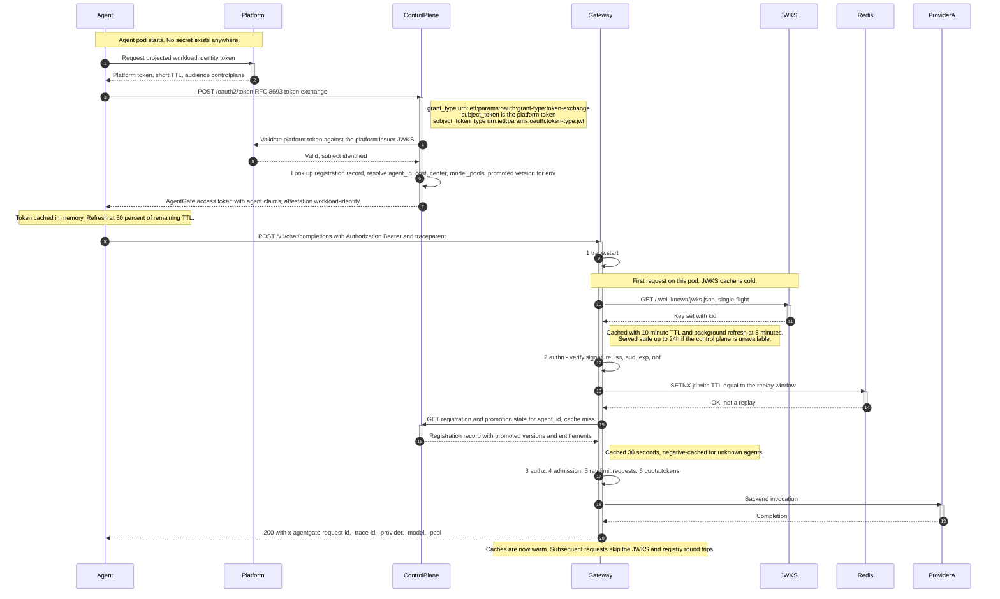
```mermaid
sequenceDiagram
  autonumber
  participant Agent
  participant Platform
  participant ControlPlane
  participant Gateway
  participant JWKS
  participant Redis
  participant ProviderA

  Note over Agent,Platform: Agent pod starts. No secret exists anywhere.

  Agent->>Platform: Request projected workload identity token
  activate Platform
  Platform-->>Agent: Platform token, short TTL, audience controlplane
  deactivate Platform

  Agent->>ControlPlane: POST /oauth2/token RFC 8693 token exchange
  activate ControlPlane
  Note right of ControlPlane: grant_type urn:ietf:params:oauth:grant-type:token-exchange<br/>subject_token is the platform token<br/>subject_token_type urn:ietf:params:oauth:token-type:jwt
  ControlPlane->>Platform: Validate platform token against the platform issuer JWKS
  Platform-->>ControlPlane: Valid, subject identified
  ControlPlane->>ControlPlane: Look up registration record, resolve agent_id, cost_center, model_pools, promoted version for env
  ControlPlane-->>Agent: AgentGate access token with agent claims, attestation workload-identity
  deactivate ControlPlane

  Note over Agent: Token cached in memory. Refresh at 50 percent of remaining TTL.

  Agent->>Gateway: POST /v1/chat/completions with Authorization Bearer and traceparent
  activate Gateway
  Gateway->>Gateway: 1 trace.start

  Note over Gateway,JWKS: First request on this pod. JWKS cache is cold.
  Gateway->>JWKS: GET /.well-known/jwks.json, single-flight
  activate JWKS
  JWKS-->>Gateway: Key set with kid
  deactivate JWKS
  Note right of Gateway: Cached with 10 minute TTL and background refresh at 5 minutes.<br/>Served stale up to 24h if the control plane is unavailable.

  Gateway->>Gateway: 2 authn - verify signature, iss, aud, exp, nbf
  Gateway->>Redis: SETNX jti with TTL equal to the replay window
  activate Redis
  Redis-->>Gateway: OK, not a replay
  deactivate Redis

  Gateway->>ControlPlane: GET registration and promotion state for agent_id, cache miss
  activate ControlPlane
  ControlPlane-->>Gateway: Registration record with promoted versions and entitlements
  deactivate ControlPlane
  Note right of Gateway: Cached 30 seconds, negative-cached for unknown agents.

  Gateway->>Gateway: 3 authz, 4 admission, 5 ratelimit.requests, 6 quota.tokens
  Gateway->>ProviderA: Backend invocation
  activate ProviderA
  ProviderA-->>Gateway: Completion
  deactivate ProviderA
  Gateway-->>Agent: 200 with x-agentgate-request-id, -trace-id, -provider, -model, -pool
  deactivate Gateway

  Note over Gateway: Caches are now warm. Subsequent requests skip the JWKS and registry round trips.
```

**Notes.** Cold start costs two extra round trips on the very first request per pod: JWKS and
registry. Both are single-flighted so a burst of concurrent first requests produces one fetch, not
one per request. The 24-hour stale-JWKS allowance is a deliberate availability choice — key material
has not changed, and rejecting all traffic during a control-plane outage is the worse failure.

---

## 2. Happy path — unary chat completion, every policy stage

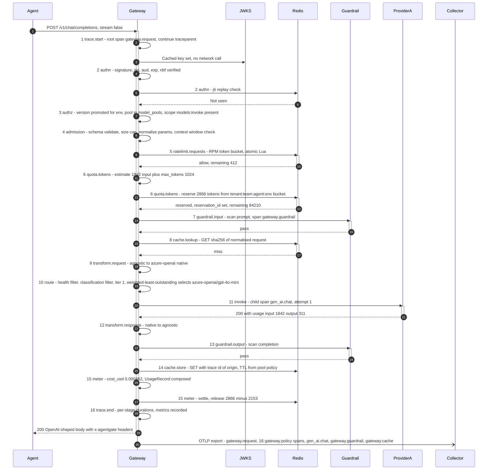
```mermaid
sequenceDiagram
  autonumber
  participant Agent
  participant Gateway
  participant JWKS
  participant Redis
  participant Guardrail
  participant ProviderA
  participant Collector

  Agent->>Gateway: POST /v1/chat/completions, stream false
  activate Gateway

  Gateway->>Gateway: 1 trace.start - root span gateway.request, continue traceparent
  Gateway->>JWKS: Cached key set, no network call
  Gateway->>Gateway: 2 authn - signature, iss, aud, exp, nbf verified
  Gateway->>Redis: 2 authn - jti replay check
  Redis-->>Gateway: Not seen
  Gateway->>Gateway: 3 authz - version promoted for env, pool in model_pools, scope models:invoke present
  Gateway->>Gateway: 4 admission - schema validate, size cap, normalise params, context window check

  Gateway->>Redis: 5 ratelimit.requests - RPM token bucket, atomic Lua
  activate Redis
  Redis-->>Gateway: allow, remaining 412
  deactivate Redis

  Gateway->>Gateway: 6 quota.tokens - estimate 1842 input plus max_tokens 1024
  Gateway->>Redis: 6 quota.tokens - reserve 2866 tokens from tenant:team:agent:env bucket
  activate Redis
  Redis-->>Gateway: reserved, reservation_id set, remaining 84210
  deactivate Redis

  Gateway->>Guardrail: 7 guardrail.input - scan prompt, span gateway.guardrail
  activate Guardrail
  Guardrail-->>Gateway: pass
  deactivate Guardrail

  Gateway->>Redis: 8 cache.lookup - GET sha256 of normalised request
  activate Redis
  Redis-->>Gateway: miss
  deactivate Redis

  Gateway->>Gateway: 9 transform.request - agnostic to azure-openai native
  Gateway->>Gateway: 10 route - health filter, classification filter, tier 1, weighted-least-outstanding selects azure-openai/gpt-4o-mini

  Gateway->>ProviderA: 11 invoke - child span gen_ai.chat, attempt 1
  activate ProviderA
  ProviderA-->>Gateway: 200 with usage input 1842 output 311
  deactivate ProviderA

  Gateway->>Gateway: 12 transform.response - native to agnostic
  Gateway->>Guardrail: 13 guardrail.output - scan completion
  activate Guardrail
  Guardrail-->>Gateway: pass
  deactivate Guardrail

  Gateway->>Redis: 14 cache.store - SET with trace id of origin, TTL from pool policy
  Gateway->>Gateway: 15 meter - cost_usd 0.000462, UsageRecord composed
  Gateway->>Redis: 15 meter - settle, release 2866 minus 2153
  Gateway->>Gateway: 16 trace.end - per-stage durations, metrics recorded

  Gateway-->>Agent: 200 OpenAI-shaped body with x-agentgate headers
  deactivate Gateway

  Gateway-)Collector: OTLP export - gateway.request, 16 gateway.policy spans, gen_ai.chat, gateway.guardrail, gateway.cache
```

**Notes.** The stage numbers on the diagram are the stage names on the span. A reader of a trace in
Langfuse sees exactly this shape. `x-agentgate-attempts` is 1, `x-agentgate-cache` is `miss`, and
the settle releases 713 tokens because the completion was shorter than `max_tokens`.

---

## 3. Streaming completion — SSE frames, heartbeat, usage, DONE

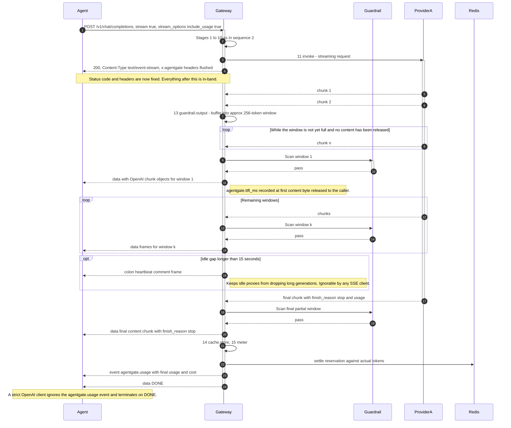
```mermaid
sequenceDiagram
  autonumber
  participant Agent
  participant Gateway
  participant Guardrail
  participant ProviderA
  participant Redis

  Agent->>Gateway: POST /v1/chat/completions, stream true, stream_options include_usage true
  activate Gateway
  Gateway->>Gateway: Stages 1 to 10 as in sequence 2
  Gateway->>ProviderA: 11 invoke - streaming request
  activate ProviderA

  Gateway-->>Agent: 200, Content-Type text/event-stream, x-agentgate headers flushed
  Note over Gateway,Agent: Status code and headers are now fixed. Everything after this is in-band.

  ProviderA-->>Gateway: chunk 1
  ProviderA-->>Gateway: chunk 2
  Gateway->>Gateway: 13 guardrail.output - buffer into approx 256-token window

  loop While the window is not yet full and no content has been released
    ProviderA-->>Gateway: chunk n
  end

  Gateway->>Guardrail: Scan window 1
  activate Guardrail
  Guardrail-->>Gateway: pass
  deactivate Guardrail
  Gateway-->>Agent: data with OpenAI chunk objects for window 1
  Note right of Gateway: agentgate.ttft_ms recorded at first content byte released to the caller.

  loop Remaining windows
    ProviderA-->>Gateway: chunks
    Gateway->>Guardrail: Scan window k
    Guardrail-->>Gateway: pass
    Gateway-->>Agent: data frames for window k
  end

  opt Idle gap longer than 15 seconds
    Gateway-->>Agent: colon heartbeat comment frame
    Note right of Gateway: Keeps idle proxies from dropping long generations. Ignorable by any SSE client.
  end

  ProviderA-->>Gateway: final chunk with finish_reason stop and usage
  deactivate ProviderA
  Gateway->>Guardrail: Scan final partial window
  Guardrail-->>Gateway: pass
  Gateway-->>Agent: data final content chunk with finish_reason stop

  Gateway->>Gateway: 14 cache.store, 15 meter
  Gateway->>Redis: settle reservation against actual tokens
  Gateway-->>Agent: event agentgate.usage with final usage and cost
  Gateway-->>Agent: data DONE
  deactivate Gateway

  Note over Agent: A strict OpenAI client ignores the agentgate.usage event and terminates on DONE.
```

**Notes.** Ordering is contractual: the `agentgate.usage` event is emitted **before** `[DONE]`, and
`[DONE]` is always last on a successful stream. The heartbeat is an SSE comment, not an event, so it
cannot be mistaken for data. Windowed guardrail scanning is what keeps a violation from reaching the
caller; the cost is that time-to-first-token includes one window of buffering, which is why the
window is ~256 tokens and not larger.

---

## 4a. Streaming failover **before** the first content byte

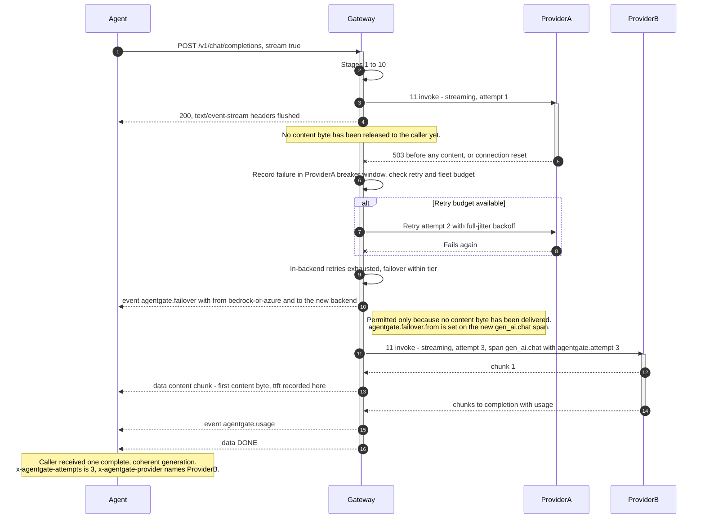
```mermaid
sequenceDiagram
  autonumber
  participant Agent
  participant Gateway
  participant ProviderA
  participant ProviderB

  Agent->>Gateway: POST /v1/chat/completions, stream true
  activate Gateway
  Gateway->>Gateway: Stages 1 to 10
  Gateway->>ProviderA: 11 invoke - streaming, attempt 1
  activate ProviderA

  Gateway-->>Agent: 200, text/event-stream headers flushed
  Note over Gateway: No content byte has been released to the caller yet.

  ProviderA--xGateway: 503 before any content, or connection reset
  deactivate ProviderA
  Gateway->>Gateway: Record failure in ProviderA breaker window, check retry and fleet budget

  alt Retry budget available
    Gateway->>ProviderA: Retry attempt 2 with full-jitter backoff
    ProviderA--xGateway: Fails again
  end

  Gateway->>Gateway: In-backend retries exhausted, failover within tier
  Gateway-->>Agent: event agentgate.failover with from bedrock-or-azure and to the new backend
  Note right of Gateway: Permitted only because no content byte has been delivered.<br/>agentgate.failover.from is set on the new gen_ai.chat span.

  Gateway->>ProviderB: 11 invoke - streaming, attempt 3, span gen_ai.chat with agentgate.attempt 3
  activate ProviderB
  ProviderB-->>Gateway: chunk 1
  Gateway-->>Agent: data content chunk - first content byte, ttft recorded here
  ProviderB-->>Gateway: chunks to completion with usage
  deactivate ProviderB

  Gateway-->>Agent: event agentgate.usage
  Gateway-->>Agent: data DONE
  deactivate Gateway

  Note over Agent: Caller received one complete, coherent generation.<br/>x-agentgate-attempts is 3, x-agentgate-provider names ProviderB.
```

## 4b. Streaming failure **after** the first content byte

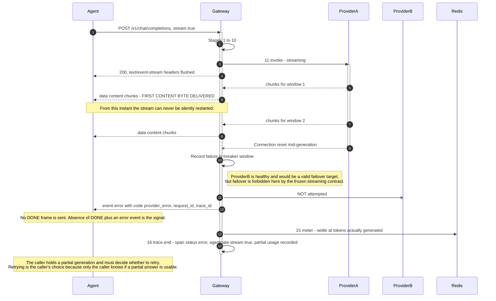
```mermaid
sequenceDiagram
  autonumber
  participant Agent
  participant Gateway
  participant ProviderA
  participant ProviderB
  participant Redis

  Agent->>Gateway: POST /v1/chat/completions, stream true
  activate Gateway
  Gateway->>Gateway: Stages 1 to 10
  Gateway->>ProviderA: 11 invoke - streaming
  activate ProviderA
  Gateway-->>Agent: 200, text/event-stream headers flushed

  ProviderA-->>Gateway: chunks for window 1
  Gateway-->>Agent: data content chunks - FIRST CONTENT BYTE DELIVERED
  Note over Gateway,Agent: From this instant the stream can never be silently restarted.

  ProviderA-->>Gateway: chunks for window 2
  Gateway-->>Agent: data content chunks
  ProviderA--xGateway: Connection reset mid-generation
  deactivate ProviderA

  Gateway->>Gateway: Record failure in breaker window
  Note right of Gateway: ProviderB is healthy and would be a valid failover target,<br/>but failover is forbidden here by the frozen streaming contract.

  Gateway-xProviderB: NOT attempted
  Gateway-->>Agent: event error with code provider_error, request_id, trace_id
  Note over Agent: No DONE frame is sent. Absence of DONE plus an error event is the signal.

  Gateway->>Redis: 15 meter - settle at tokens actually generated
  Gateway->>Gateway: 16 trace.end - span status error, agentgate.stream true, partial usage recorded
  deactivate Gateway

  Note over Agent: The caller holds a partial generation and must decide whether to retry.<br/>Retrying is the caller's choice because only the caller knows if a partial answer is usable.
```

**Notes.** These two diagrams exist as a pair because the difference between them is the single most
consequential streaming rule in the contract. Before first content byte, the caller has seen
nothing, so restarting is invisible and correct. After first content byte, restarting would splice
two different generations into one response. The platform will not do that. The caller gets a
partial result and an explicit error frame, and decides for itself.

---

## 5. Retry, breaker trip, tier failover, no healthy backend

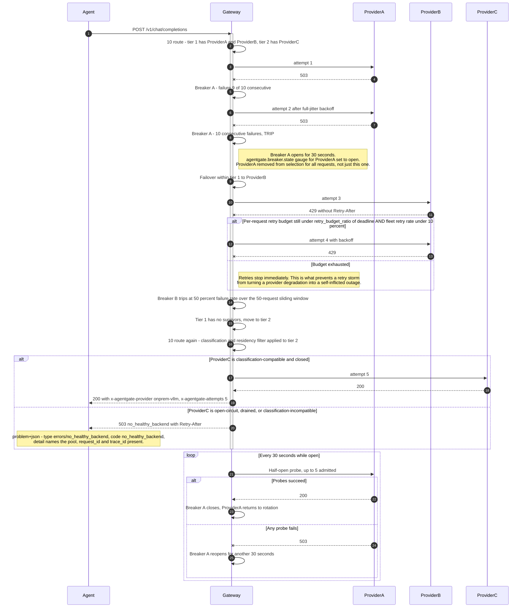
```mermaid
sequenceDiagram
  autonumber
  participant Agent
  participant Gateway
  participant ProviderA
  participant ProviderB
  participant ProviderC

  Agent->>Gateway: POST /v1/chat/completions
  activate Gateway
  Gateway->>Gateway: 10 route - tier 1 has ProviderA and ProviderB, tier 2 has ProviderC

  Gateway->>ProviderA: attempt 1
  ProviderA--xGateway: 503
  Gateway->>Gateway: Breaker A - failure 9 of 10 consecutive

  Gateway->>ProviderA: attempt 2 after full-jitter backoff
  ProviderA--xGateway: 503
  Gateway->>Gateway: Breaker A - 10 consecutive failures, TRIP
  Note right of Gateway: Breaker A opens for 30 seconds.<br/>agentgate.breaker.state gauge for ProviderA set to open.<br/>ProviderA removed from selection for all requests, not just this one.

  Gateway->>Gateway: Failover within tier 1 to ProviderB
  Gateway->>ProviderB: attempt 3
  ProviderB--xGateway: 429 without Retry-After

  alt Per-request retry budget still under retry_budget_ratio of deadline AND fleet retry rate under 10 percent
    Gateway->>ProviderB: attempt 4 with backoff
    ProviderB--xGateway: 429
  else Budget exhausted
    Note right of Gateway: Retries stop immediately. This is what prevents a retry storm<br/>from turning a provider degradation into a self-inflicted outage.
  end

  Gateway->>Gateway: Breaker B trips at 50 percent failure rate over the 50-request sliding window
  Gateway->>Gateway: Tier 1 has no survivors, move to tier 2

  Gateway->>Gateway: 10 route again - classification and residency filter applied to tier 2
  alt ProviderC is classification-compatible and closed
    Gateway->>ProviderC: attempt 5
    ProviderC-->>Gateway: 200
    Gateway-->>Agent: 200 with x-agentgate-provider onprem-vllm, x-agentgate-attempts 5
  else ProviderC is open-circuit, drained, or classification-incompatible
    Gateway-->>Agent: 503 no_healthy_backend with Retry-After
    Note over Agent: problem+json - type errors/no_healthy_backend, code no_healthy_backend,<br/>detail names the pool, request_id and trace_id present.
  end
  deactivate Gateway

  loop Every 30 seconds while open
    Gateway->>ProviderA: Half-open probe, up to 5 admitted
    alt Probes succeed
      ProviderA-->>Gateway: 200
      Gateway->>Gateway: Breaker A closes, ProviderA returns to rotation
    else Any probe fails
      ProviderA--xGateway: 503
      Gateway->>Gateway: Breaker A reopens for another 30 seconds
    end
  end
```

**Notes.** The breaker is per backend and shared across the pod's traffic, so tripping it protects
every request, not only the one that discovered the problem. Classification and residency filtering
is re-applied at tier 2: a failover target that would move restricted data to a non-compliant
backend is not a valid target, and the request fails with `no_healthy_backend` instead.

---

## 6. Quota reserve, partial completion, settle

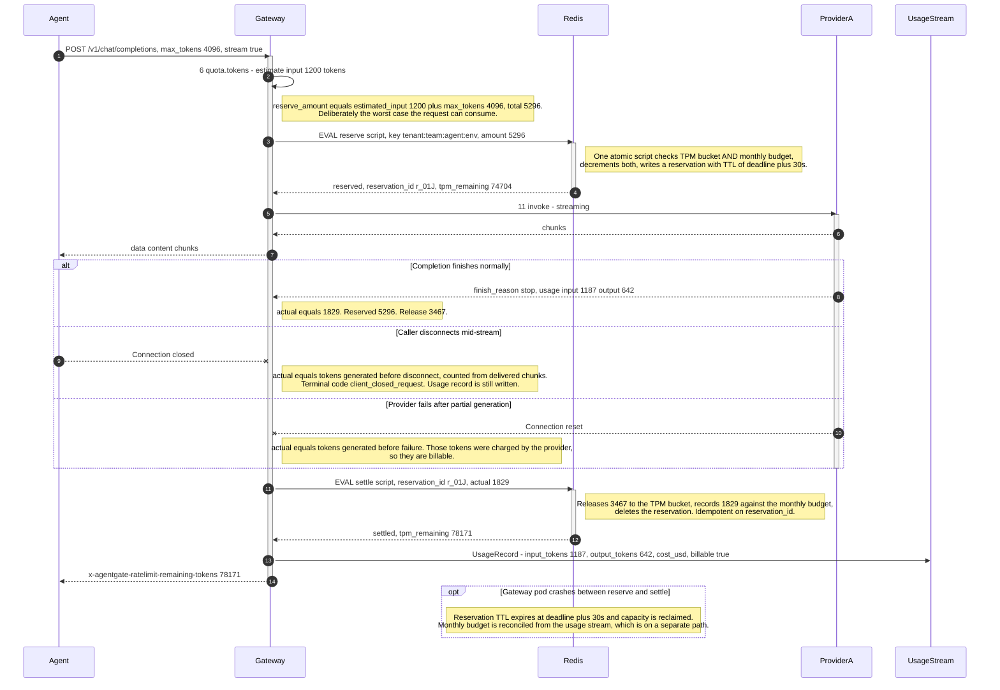
```mermaid
sequenceDiagram
  autonumber
  participant Agent
  participant Gateway
  participant Redis
  participant ProviderA
  participant Stream as UsageStream

  Agent->>Gateway: POST /v1/chat/completions, max_tokens 4096, stream true
  activate Gateway

  Gateway->>Gateway: 6 quota.tokens - estimate input 1200 tokens
  Note right of Gateway: reserve_amount equals estimated_input 1200 plus max_tokens 4096, total 5296.<br/>Deliberately the worst case the request can consume.

  Gateway->>Redis: EVAL reserve script, key tenant:team:agent:env, amount 5296
  activate Redis
  Note right of Redis: One atomic script checks TPM bucket AND monthly budget,<br/>decrements both, writes a reservation with TTL of deadline plus 30s.
  Redis-->>Gateway: reserved, reservation_id r_01J, tpm_remaining 74704
  deactivate Redis

  Gateway->>ProviderA: 11 invoke - streaming
  activate ProviderA
  ProviderA-->>Gateway: chunks
  Gateway-->>Agent: data content chunks

  alt Completion finishes normally
    ProviderA-->>Gateway: finish_reason stop, usage input 1187 output 642
    Note right of Gateway: actual equals 1829. Reserved 5296. Release 3467.
  else Caller disconnects mid-stream
    Agent--xGateway: Connection closed
    Note right of Gateway: actual equals tokens generated before disconnect, counted from delivered chunks.<br/>Terminal code client_closed_request. Usage record is still written.
  else Provider fails after partial generation
    ProviderA--xGateway: Connection reset
    Note right of Gateway: actual equals tokens generated before failure. Those tokens were charged by the provider,<br/>so they are billable.
  end
  deactivate ProviderA

  Gateway->>Redis: EVAL settle script, reservation_id r_01J, actual 1829
  activate Redis
  Note right of Redis: Releases 3467 to the TPM bucket, records 1829 against the monthly budget,<br/>deletes the reservation. Idempotent on reservation_id.
  Redis-->>Gateway: settled, tpm_remaining 78171
  deactivate Redis

  Gateway->>Stream: UsageRecord - input_tokens 1187, output_tokens 642, cost_usd, billable true
  Gateway-->>Agent: x-agentgate-ratelimit-remaining-tokens 78171
  deactivate Gateway

  opt Gateway pod crashes between reserve and settle
    Note over Redis: Reservation TTL expires at deadline plus 30s and capacity is reclaimed.<br/>Monthly budget is reconciled from the usage stream, which is on a separate path.
  end
```

---

## 7. Cache hit — exact, then the semantic path

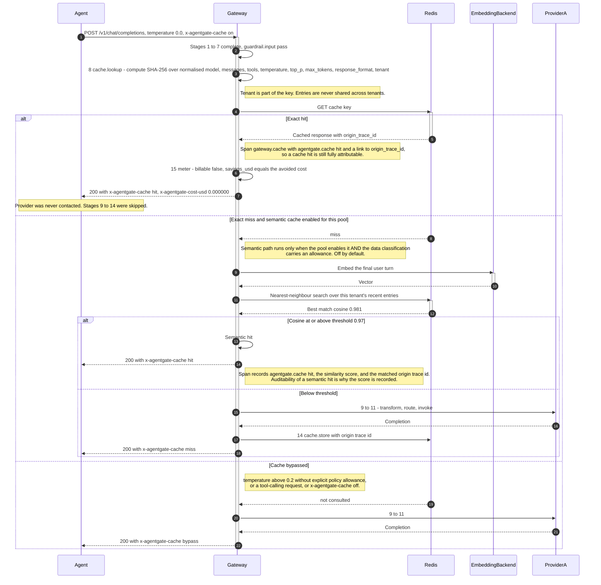
```mermaid
sequenceDiagram
  autonumber
  participant Agent
  participant Gateway
  participant Redis
  participant Embed as EmbeddingBackend
  participant ProviderA

  Agent->>Gateway: POST /v1/chat/completions, temperature 0.0, x-agentgate-cache on
  activate Gateway
  Gateway->>Gateway: Stages 1 to 7 complete, guardrail.input pass

  Gateway->>Gateway: 8 cache.lookup - compute SHA-256 over normalised model, messages, tools, temperature, top_p, max_tokens, response_format, tenant
  Note right of Gateway: Tenant is part of the key. Entries are never shared across tenants.

  Gateway->>Redis: GET cache key
  activate Redis

  alt Exact hit
    Redis-->>Gateway: Cached response with origin_trace_id
    deactivate Redis
    Note right of Gateway: Span gateway.cache with agentgate.cache hit and a link to origin_trace_id,<br/>so a cache hit is still fully attributable.
    Gateway->>Gateway: 15 meter - billable false, savings_usd equals the avoided cost
    Gateway-->>Agent: 200 with x-agentgate-cache hit, x-agentgate-cost-usd 0.000000
    Note over Agent: Provider was never contacted. Stages 9 to 14 were skipped.

  else Exact miss and semantic cache enabled for this pool
    Redis-->>Gateway: miss
    Note right of Gateway: Semantic path runs only when the pool enables it AND the data classification<br/>carries an allowance. Off by default.
    Gateway->>Embed: Embed the final user turn
    activate Embed
    Embed-->>Gateway: Vector
    deactivate Embed
    Gateway->>Redis: Nearest-neighbour search over this tenant's recent entries
    activate Redis
    Redis-->>Gateway: Best match cosine 0.981
    deactivate Redis

    alt Cosine at or above threshold 0.97
      Gateway->>Gateway: Semantic hit
      Gateway-->>Agent: 200 with x-agentgate-cache hit
      Note right of Gateway: Span records agentgate.cache hit, the similarity score, and the matched origin trace id.<br/>Auditability of a semantic hit is why the score is recorded.
    else Below threshold
      Gateway->>ProviderA: 9 to 11 - transform, route, invoke
      ProviderA-->>Gateway: Completion
      Gateway->>Redis: 14 cache.store with origin trace id
      Gateway-->>Agent: 200 with x-agentgate-cache miss
    end

  else Cache bypassed
    Note right of Gateway: temperature above 0.2 without explicit policy allowance,<br/>or a tool-calling request, or x-agentgate-cache off.
    Redis-->>Gateway: not consulted
    Gateway->>ProviderA: 9 to 11
    ProviderA-->>Gateway: Completion
    Gateway-->>Agent: 200 with x-agentgate-cache bypass
  end
  deactivate Gateway
```

---

## 8. Guardrail block — input, and streaming-windowed output

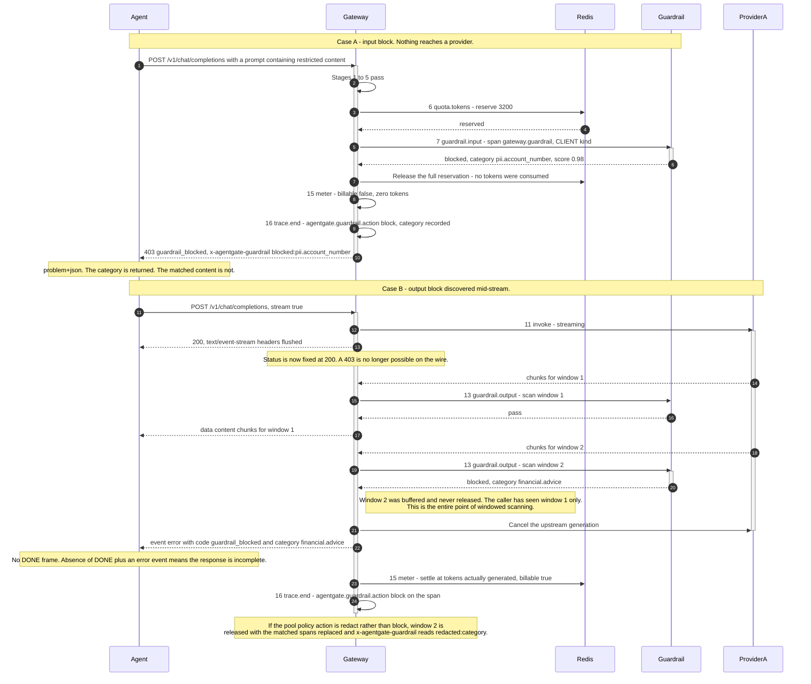
```mermaid
sequenceDiagram
  autonumber
  participant Agent
  participant Gateway
  participant Redis
  participant Guardrail
  participant ProviderA

  Note over Agent,Guardrail: Case A - input block. Nothing reaches a provider.

  Agent->>Gateway: POST /v1/chat/completions with a prompt containing restricted content
  activate Gateway
  Gateway->>Gateway: Stages 1 to 5 pass
  Gateway->>Redis: 6 quota.tokens - reserve 3200
  Redis-->>Gateway: reserved

  Gateway->>Guardrail: 7 guardrail.input - span gateway.guardrail, CLIENT kind
  activate Guardrail
  Guardrail-->>Gateway: blocked, category pii.account_number, score 0.98
  deactivate Guardrail

  Gateway->>Redis: Release the full reservation - no tokens were consumed
  Gateway->>Gateway: 15 meter - billable false, zero tokens
  Gateway->>Gateway: 16 trace.end - agentgate.guardrail.action block, category recorded
  Gateway-->>Agent: 403 guardrail_blocked, x-agentgate-guardrail blocked:pii.account_number
  deactivate Gateway
  Note over Agent: problem+json. The category is returned. The matched content is not.

  Note over Agent,ProviderA: Case B - output block discovered mid-stream.

  Agent->>Gateway: POST /v1/chat/completions, stream true
  activate Gateway
  Gateway->>ProviderA: 11 invoke - streaming
  activate ProviderA
  Gateway-->>Agent: 200, text/event-stream headers flushed
  Note over Gateway: Status is now fixed at 200. A 403 is no longer possible on the wire.

  ProviderA-->>Gateway: chunks for window 1
  Gateway->>Guardrail: 13 guardrail.output - scan window 1
  Guardrail-->>Gateway: pass
  Gateway-->>Agent: data content chunks for window 1

  ProviderA-->>Gateway: chunks for window 2
  Gateway->>Guardrail: 13 guardrail.output - scan window 2
  activate Guardrail
  Guardrail-->>Gateway: blocked, category financial.advice
  deactivate Guardrail
  Note right of Gateway: Window 2 was buffered and never released. The caller has seen window 1 only.<br/>This is the entire point of windowed scanning.

  Gateway->>ProviderA: Cancel the upstream generation
  deactivate ProviderA
  Gateway-->>Agent: event error with code guardrail_blocked and category financial.advice
  Note over Agent: No DONE frame. Absence of DONE plus an error event means the response is incomplete.

  Gateway->>Redis: 15 meter - settle at tokens actually generated, billable true
  Gateway->>Gateway: 16 trace.end - agentgate.guardrail.action block on the span
  deactivate Gateway

  Note over Gateway: If the pool policy action is redact rather than block, window 2 is<br/>released with the matched spans replaced and x-agentgate-guardrail reads redacted:category.
```

**Notes.** In the `fail_closed` configuration — the default for
`data_classification=restricted` — a guardrail service that is unreachable produces the same outcome
as a block. In `fail_open` pools the scan is skipped, the request proceeds, and the bypass is
recorded on the span and the `agentgate.guardrail.decisions` metric so it is countable.

---

## 9. Registration of a new agent version from CI

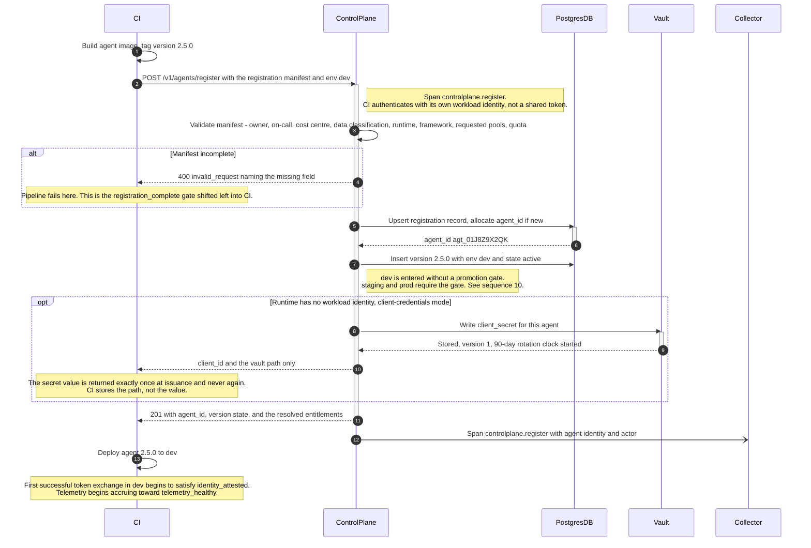
```mermaid
sequenceDiagram
  autonumber
  participant CI
  participant ControlPlane
  participant Postgres as PostgresDB
  participant Vault
  participant Collector

  CI->>CI: Build agent image, tag version 2.5.0
  CI->>ControlPlane: POST /v1/agents/register with the registration manifest and env dev
  activate ControlPlane
  Note right of ControlPlane: Span controlplane.register.<br/>CI authenticates with its own workload identity, not a shared token.

  ControlPlane->>ControlPlane: Validate manifest - owner, on-call, cost centre, data classification, runtime, framework, requested pools, quota

  alt Manifest incomplete
    ControlPlane-->>CI: 400 invalid_request naming the missing field
    Note over CI: Pipeline fails here. This is the registration_complete gate shifted left into CI.
  end

  ControlPlane->>Postgres: Upsert registration record, allocate agent_id if new
  activate Postgres
  Postgres-->>ControlPlane: agent_id agt_01J8Z9X2QK
  deactivate Postgres

  ControlPlane->>Postgres: Insert version 2.5.0 with env dev and state active
  Note right of ControlPlane: dev is entered without a promotion gate.<br/>staging and prod require the gate. See sequence 10.

  opt Runtime has no workload identity, client-credentials mode
    ControlPlane->>Vault: Write client_secret for this agent
    activate Vault
    Vault-->>ControlPlane: Stored, version 1, 90-day rotation clock started
    deactivate Vault
    ControlPlane-->>CI: client_id and the vault path only
    Note over CI: The secret value is returned exactly once at issuance and never again.<br/>CI stores the path, not the value.
  end

  ControlPlane-->>CI: 201 with agent_id, version state, and the resolved entitlements
  deactivate ControlPlane
  ControlPlane-)Collector: Span controlplane.register with agent identity and actor

  CI->>CI: Deploy agent 2.5.0 to dev
  Note over CI: First successful token exchange in dev begins to satisfy identity_attested.<br/>Telemetry begins accruing toward telemetry_healthy.
```

---

## 10. Promotion to production

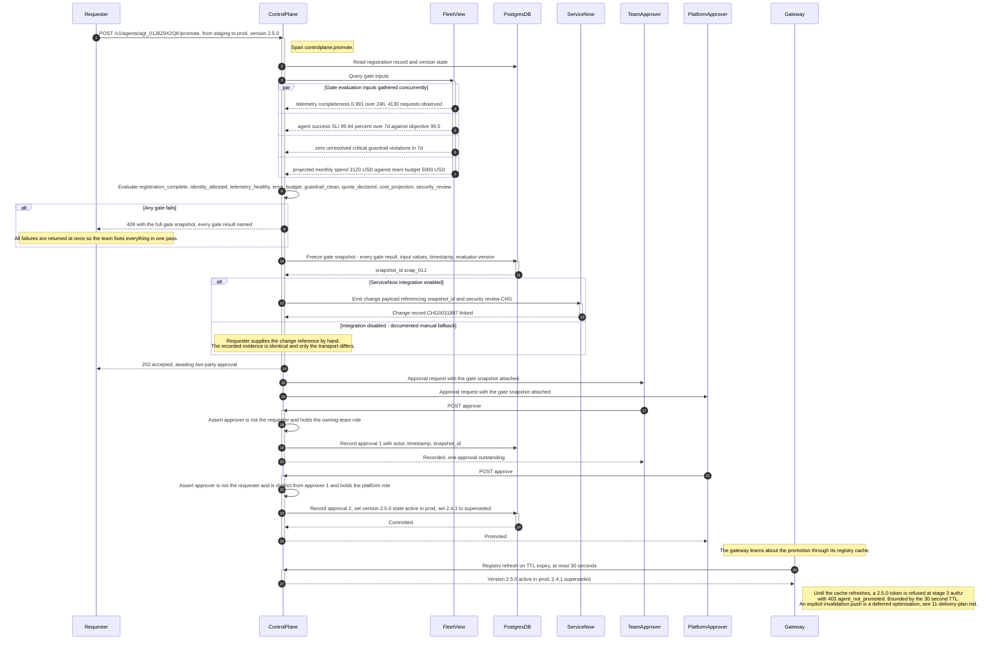
```mermaid
sequenceDiagram
  autonumber
  participant Requester
  participant ControlPlane
  participant FleetView
  participant Postgres as PostgresDB
  participant ServiceNow
  participant TeamApprover
  participant PlatformApprover
  participant Gateway

  Requester->>ControlPlane: POST /v1/agents/agt_01J8Z9X2QK/promote, from staging to prod, version 2.5.0
  activate ControlPlane
  Note right of ControlPlane: Span controlplane.promote.

  ControlPlane->>Postgres: Read registration record and version state
  ControlPlane->>FleetView: Query gate inputs

  activate FleetView
  par Gate evaluation inputs gathered concurrently
    FleetView-->>ControlPlane: telemetry completeness 0.991 over 24h, 4130 requests observed
  and
    FleetView-->>ControlPlane: agent success SLI 99.94 percent over 7d against objective 99.5
  and
    FleetView-->>ControlPlane: zero unresolved critical guardrail violations in 7d
  and
    FleetView-->>ControlPlane: projected monthly spend 3120 USD against team budget 5000 USD
  end
  deactivate FleetView

  ControlPlane->>ControlPlane: Evaluate registration_complete, identity_attested, telemetry_healthy, error_budget, guardrail_clean, quota_declared, cost_projection, security_review

  alt Any gate fails
    ControlPlane-->>Requester: 409 with the full gate snapshot, every gate result named
    Note over Requester: All failures are returned at once so the team fixes everything in one pass.
  end

  ControlPlane->>Postgres: Freeze gate snapshot - every gate result, input values, timestamp, evaluator version
  activate Postgres
  Postgres-->>ControlPlane: snapshot_id snap_01J
  deactivate Postgres

  alt ServiceNow integration enabled
    ControlPlane->>ServiceNow: Emit change payload referencing snapshot_id and security review CHG
    activate ServiceNow
    ServiceNow-->>ControlPlane: Change record CHG0031887 linked
    deactivate ServiceNow
  else Integration disabled - documented manual fallback
    Note over ControlPlane: Requester supplies the change reference by hand.<br/>The recorded evidence is identical and only the transport differs.
  end

  ControlPlane-->>Requester: 202 accepted, awaiting two-party approval
  deactivate ControlPlane

  ControlPlane->>TeamApprover: Approval request with the gate snapshot attached
  ControlPlane->>PlatformApprover: Approval request with the gate snapshot attached

  TeamApprover->>ControlPlane: POST approve
  activate ControlPlane
  ControlPlane->>ControlPlane: Assert approver is not the requester and holds the owning-team role
  ControlPlane->>Postgres: Record approval 1 with actor, timestamp, snapshot_id
  ControlPlane-->>TeamApprover: Recorded, one approval outstanding
  deactivate ControlPlane

  PlatformApprover->>ControlPlane: POST approve
  activate ControlPlane
  ControlPlane->>ControlPlane: Assert approver is not the requester and is distinct from approver 1 and holds the platform role
  ControlPlane->>Postgres: Record approval 2, set version 2.5.0 state active in prod, set 2.4.1 to superseded
  activate Postgres
  Postgres-->>ControlPlane: Committed
  deactivate Postgres
  ControlPlane-->>PlatformApprover: Promoted
  deactivate ControlPlane

  Note over Gateway: The gateway learns about the promotion through its registry cache.
  Gateway->>ControlPlane: Registry refresh on TTL expiry, at most 30 seconds
  activate ControlPlane
  ControlPlane-->>Gateway: Version 2.5.0 active in prod, 2.4.1 superseded
  deactivate ControlPlane
  Note right of Gateway: Until the cache refreshes, a 2.5.0 token is refused at stage 3 authz<br/>with 403 agent_not_promoted. Bounded by the 30 second TTL.<br/>An explicit invalidation push is a deferred optimisation, see 11-delivery-plan.md.
```

---

## 11. Secret rotation for a client-credentials agent, zero downtime

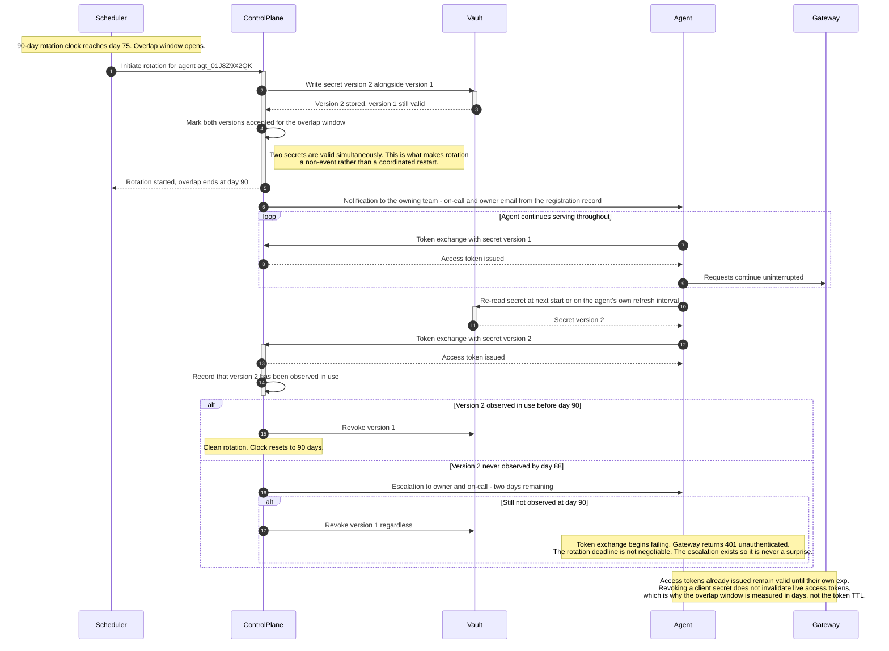
```mermaid
sequenceDiagram
  autonumber
  participant Scheduler
  participant ControlPlane
  participant Vault
  participant Agent
  participant Gateway

  Note over Scheduler: 90-day rotation clock reaches day 75. Overlap window opens.

  Scheduler->>ControlPlane: Initiate rotation for agent agt_01J8Z9X2QK
  activate ControlPlane
  ControlPlane->>Vault: Write secret version 2 alongside version 1
  activate Vault
  Vault-->>ControlPlane: Version 2 stored, version 1 still valid
  deactivate Vault
  ControlPlane->>ControlPlane: Mark both versions accepted for the overlap window
  Note right of ControlPlane: Two secrets are valid simultaneously. This is what makes rotation<br/>a non-event rather than a coordinated restart.
  ControlPlane-->>Scheduler: Rotation started, overlap ends at day 90
  deactivate ControlPlane

  ControlPlane->>Agent: Notification to the owning team - on-call and owner email from the registration record

  loop Agent continues serving throughout
    Agent->>ControlPlane: Token exchange with secret version 1
    ControlPlane-->>Agent: Access token issued
    Agent->>Gateway: Requests continue uninterrupted
  end

  Agent->>Vault: Re-read secret at next start or on the agent's own refresh interval
  activate Vault
  Vault-->>Agent: Secret version 2
  deactivate Vault

  Agent->>ControlPlane: Token exchange with secret version 2
  activate ControlPlane
  ControlPlane-->>Agent: Access token issued
  ControlPlane->>ControlPlane: Record that version 2 has been observed in use
  deactivate ControlPlane

  alt Version 2 observed in use before day 90
    ControlPlane->>Vault: Revoke version 1
    Note over ControlPlane: Clean rotation. Clock resets to 90 days.
  else Version 2 never observed by day 88
    ControlPlane->>Agent: Escalation to owner and on-call - two days remaining
    alt Still not observed at day 90
      ControlPlane->>Vault: Revoke version 1 regardless
      Note over Agent: Token exchange begins failing. Gateway returns 401 unauthenticated.<br/>The rotation deadline is not negotiable. The escalation exists so it is never a surprise.
    end
  end

  Note over Agent,Gateway: Access tokens already issued remain valid until their own exp.<br/>Revoking a client secret does not invalidate live access tokens,<br/>which is why the overlap window is measured in days, not the token TTL.
```

---

## 12. Trace propagation and span parentage

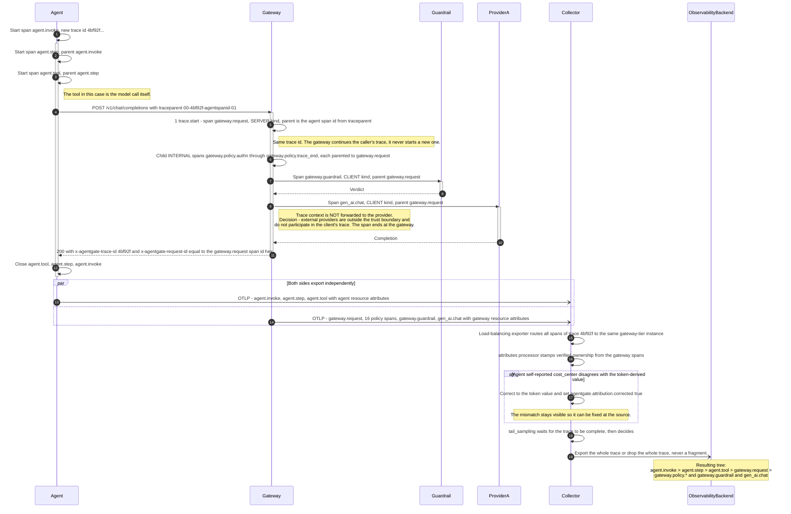
```mermaid
sequenceDiagram
  autonumber
  participant Agent
  participant Gateway
  participant Guardrail
  participant ProviderA
  participant Collector
  participant Backend as ObservabilityBackend

  Agent->>Agent: Start span agent.invoke, new trace id 4bf92f...
  activate Agent
  Agent->>Agent: Start span agent.step, parent agent.invoke
  Agent->>Agent: Start span agent.tool, parent agent.step
  Note right of Agent: The tool in this case is the model call itself.

  Agent->>Gateway: POST /v1/chat/completions with traceparent 00-4bf92f-agentspanid-01
  activate Gateway
  Gateway->>Gateway: 1 trace.start - span gateway.request, SERVER kind, parent is the agent span id from traceparent
  Note right of Gateway: Same trace id. The gateway continues the caller's trace, it never starts a new one.

  Gateway->>Gateway: Child INTERNAL spans gateway.policy.authn through gateway.policy.trace_end, each parented to gateway.request
  Gateway->>Guardrail: Span gateway.guardrail, CLIENT kind, parent gateway.request
  activate Guardrail
  Guardrail-->>Gateway: Verdict
  deactivate Guardrail

  Gateway->>ProviderA: Span gen_ai.chat, CLIENT kind, parent gateway.request
  activate ProviderA
  Note right of Gateway: Trace context is NOT forwarded to the provider.<br/>Decision - external providers are outside the trust boundary and<br/>do not participate in the client's trace. The span ends at the gateway.
  ProviderA-->>Gateway: Completion
  deactivate ProviderA

  Gateway-->>Agent: 200 with x-agentgate-trace-id 4bf92f and x-agentgate-request-id equal to the gateway.request span id hex
  deactivate Gateway
  Agent->>Agent: Close agent.tool, agent.step, agent.invoke
  deactivate Agent

  par Both sides export independently
    Agent-)Collector: OTLP - agent.invoke, agent.step, agent.tool with agent resource attributes
  and
    Gateway-)Collector: OTLP - gateway.request, 16 policy spans, gateway.guardrail, gen_ai.chat with gateway resource attributes
  end

  Collector->>Collector: Load-balancing exporter routes all spans of trace 4bf92f to the same gateway-tier instance
  Collector->>Collector: attributes processor stamps verified ownership from the gateway spans

  alt Agent self-reported cost_center disagrees with the token-derived value
    Collector->>Collector: Correct to the token value and set agentgate.attribution.corrected true
    Note over Collector: The mismatch stays visible so it can be fixed at the source.
  end

  Collector->>Collector: tail_sampling waits for the trace to be complete, then decides
  Collector-)Backend: Export the whole trace or drop the whole trace, never a fragment

  Note over Backend: Resulting tree:<br/>agent.invoke > agent.step > agent.tool > gateway.request ><br/>gateway.policy.* and gateway.guardrail and gen_ai.chat
```

**Notes.** Span parentage crosses the process boundary through `traceparent` alone. If the agent
omits it, the gateway starts a new trace and the agent's spans become orphans — which is precisely
what `orphan_span_ratio` measures and why it is a promotion-gate input.

---

## 13. Cost anomaly detection to on-call triage

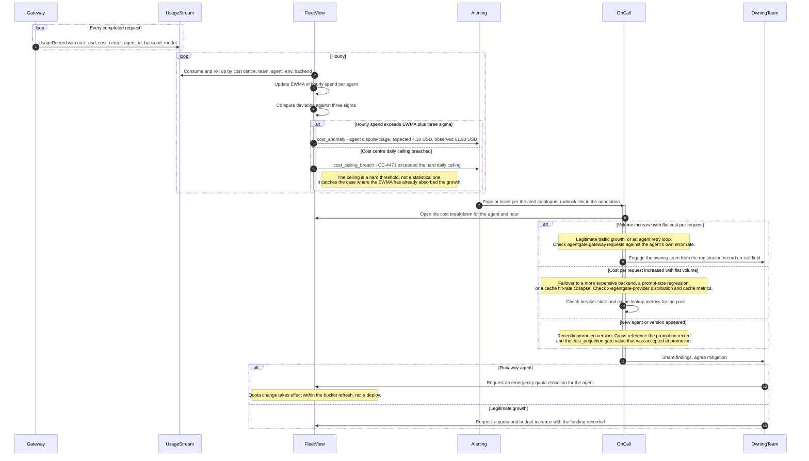
```mermaid
sequenceDiagram
  autonumber
  participant Gateway
  participant Stream as UsageStream
  participant FleetView
  participant Alerting
  participant OnCall
  participant OwningTeam

  loop Every completed request
    Gateway->>Stream: UsageRecord with cost_usd, cost_center, agent_id, backend_model
  end

  loop Hourly
    FleetView->>Stream: Consume and roll up by cost centre, team, agent, env, backend
    activate FleetView
    FleetView->>FleetView: Update EWMA of hourly spend per agent
    FleetView->>FleetView: Compute deviation against three sigma

    alt Hourly spend exceeds EWMA plus three sigma
      FleetView->>Alerting: cost_anomaly - agent dispute-triage, expected 4.10 USD, observed 61.80 USD
    else Cost centre daily ceiling breached
      FleetView->>Alerting: cost_ceiling_breach - CC-4471 exceeded the hard daily ceiling
      Note right of FleetView: The ceiling is a hard threshold, not a statistical one.<br/>It catches the case where the EWMA has already absorbed the growth.
    end
    deactivate FleetView
  end

  Alerting->>OnCall: Page or ticket per the alert catalogue, runbook link in the annotation
  activate OnCall
  OnCall->>FleetView: Open the cost breakdown for the agent and hour

  alt Volume increase with flat cost per request
    Note over OnCall: Legitimate traffic growth, or an agent retry loop.<br/>Check agentgate.gateway.requests against the agent's own error rate.
    OnCall->>OwningTeam: Engage the owning team from the registration record on-call field
  else Cost per request increased with flat volume
    Note over OnCall: Failover to a more expensive backend, a prompt-size regression,<br/>or a cache hit-rate collapse. Check x-agentgate-provider distribution and cache metrics.
    OnCall->>OnCall: Check breaker state and cache lookup metrics for the pool
  else New agent or version appeared
    Note over OnCall: Recently promoted version. Cross-reference the promotion record<br/>and the cost_projection gate value that was accepted at promotion.
  end

  OnCall->>OwningTeam: Share findings, agree mitigation
  deactivate OnCall

  alt Runaway agent
    OwningTeam->>FleetView: Request an emergency quota reduction for the agent
    Note over FleetView: Quota change takes effect within the bucket refresh, not a deploy.
  else Legitimate growth
    OwningTeam->>FleetView: Request a quota and budget increase with the funding recorded
  end
```

---

## 14. Migration shadow-traffic comparison

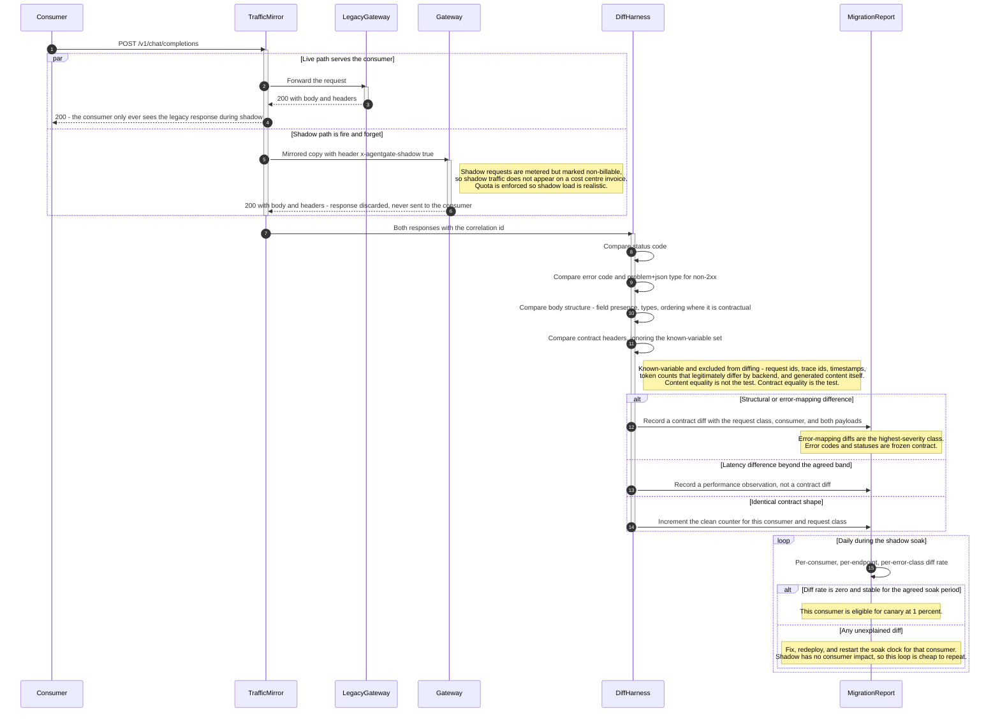
```mermaid
sequenceDiagram
  autonumber
  participant Consumer
  participant Mirror as TrafficMirror
  participant Legacy as LegacyGateway
  participant AgentGate as Gateway
  participant Diff as DiffHarness
  participant Report as MigrationReport

  Consumer->>Mirror: POST /v1/chat/completions
  activate Mirror

  par Live path serves the consumer
    Mirror->>Legacy: Forward the request
    activate Legacy
    Legacy-->>Mirror: 200 with body and headers
    deactivate Legacy
    Mirror-->>Consumer: 200 - the consumer only ever sees the legacy response during shadow
  and Shadow path is fire and forget
    Mirror->>AgentGate: Mirrored copy with header x-agentgate-shadow true
    activate AgentGate
    Note right of AgentGate: Shadow requests are metered but marked non-billable,<br/>so shadow traffic does not appear on a cost centre invoice.<br/>Quota is enforced so shadow load is realistic.
    AgentGate-->>Mirror: 200 with body and headers - response discarded, never sent to the consumer
    deactivate AgentGate
  end
  deactivate Mirror

  Mirror->>Diff: Both responses with the correlation id
  activate Diff
  Diff->>Diff: Compare status code
  Diff->>Diff: Compare error code and problem+json type for non-2xx
  Diff->>Diff: Compare body structure - field presence, types, ordering where it is contractual
  Diff->>Diff: Compare contract headers, ignoring the known-variable set

  Note right of Diff: Known-variable and excluded from diffing - request ids, trace ids, timestamps,<br/>token counts that legitimately differ by backend, and generated content itself.<br/>Content equality is not the test. Contract equality is the test.

  alt Structural or error-mapping difference
    Diff->>Report: Record a contract diff with the request class, consumer, and both payloads
    Note over Report: Error-mapping diffs are the highest-severity class.<br/>Error codes and statuses are frozen contract.
  else Latency difference beyond the agreed band
    Diff->>Report: Record a performance observation, not a contract diff
  else Identical contract shape
    Diff->>Report: Increment the clean counter for this consumer and request class
  end
  deactivate Diff

  loop Daily during the shadow soak
    Report->>Report: Per-consumer, per-endpoint, per-error-class diff rate
    alt Diff rate is zero and stable for the agreed soak period
      Note over Report: This consumer is eligible for canary at 1 percent.
    else Any unexplained diff
      Note over Report: Fix, redeploy, and restart the soak clock for that consumer.<br/>Shadow has no consumer impact, so this loop is cheap to repeat.
    end
  end
```

**Notes.** The diff harness tests contract equality, not content equality. Two implementations
calling different backends will produce different completions; that is expected and is not a diff.
What must be identical is status codes, error codes, problem+json structure, field presence and
types, and the contract headers. Error-mapping differences are treated as the most serious class
because a consumer's retry logic is written against them.
