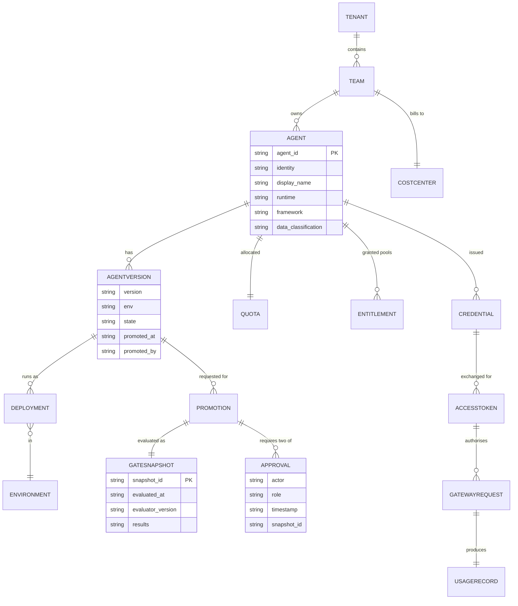
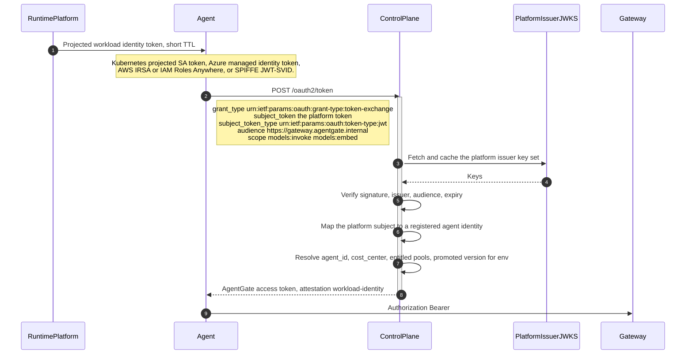
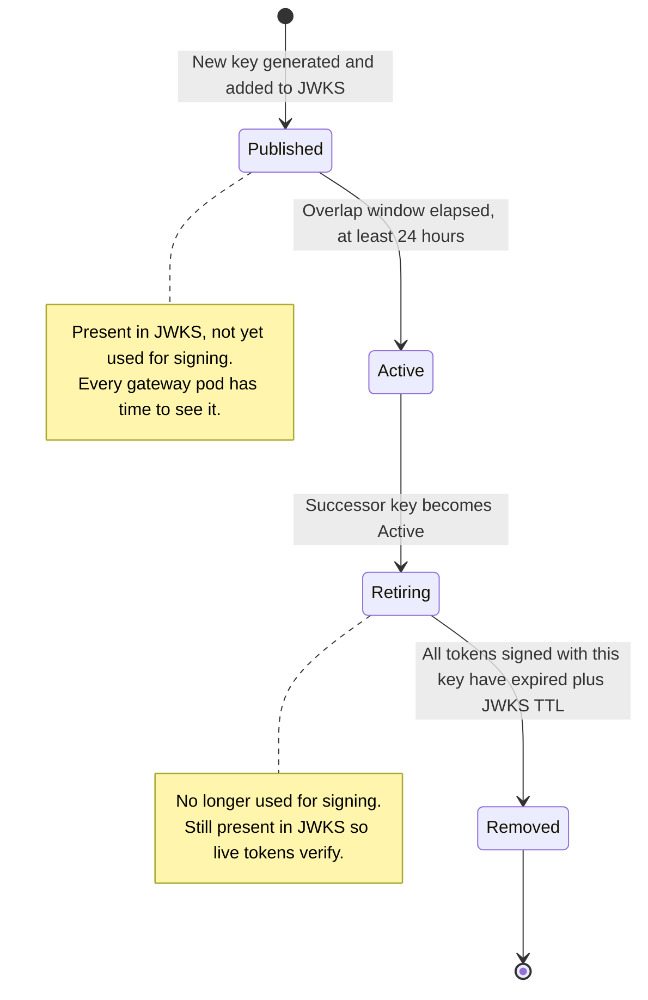
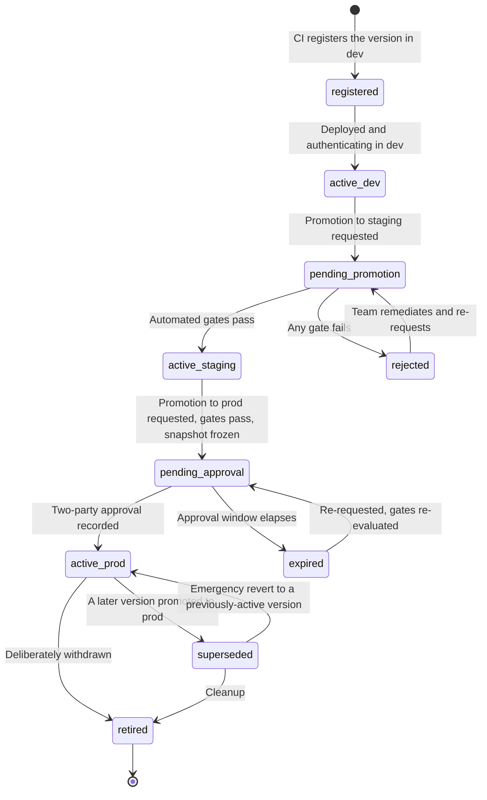
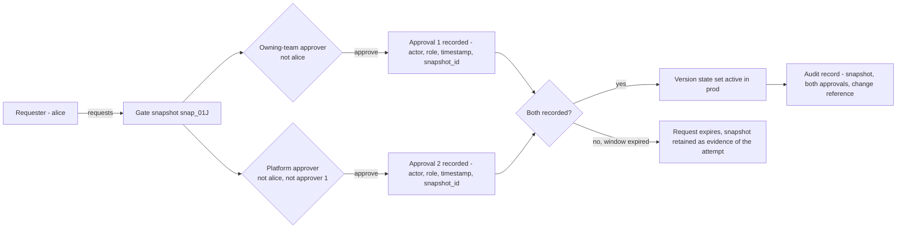
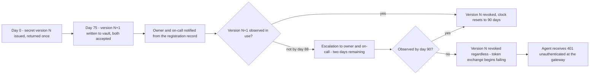

# 05 — Agent Identity, Registration and Promotion

**Audience:** platform engineers, agent engineers, client security reviewers and auditors.

This document specifies how an agent proves who it is, how that identity is issued and rotated, what
the gateway does with it, and how a version of an agent becomes allowed to run in production. It
expands `SPEC.md` §1 and the identity-relevant parts of §3.2.

---

## 1. The identity model

### 1.1 Identity URI

An agent's workload identity is a URI, stable across deployments, and is the primary key for
telemetry attribution, quota, chargeback and promotion.

```
agent://<tenant>/<team>/<agent-name>
```

Example: `agent://fsclient/payments-risk/dispute-triage`

A *deployment* of that agent is qualified by version and environment:

```
agent://fsclient/payments-risk/dispute-triage@2.4.1?env=prod
```

| Component | Rule | Why it matters |
|---|---|---|
| `tenant` | Lowercase, stable for the life of the client relationship | Tenancy boundary for cache, quota and data isolation |
| `team` | Maps to an owning team that has an on-call rota | Determines who is paged |
| `agent-name` | Stable across versions | The unit of ownership, quota and cost attribution |
| `@version` | Semantic version of the deployed artefact | The unit of promotion |
| `?env` | `dev` \| `staging` \| `prod` | The unit of isolation |

**The identity is not the deployment.** Two replicas of `dispute-triage@2.4.1` in prod share one
identity, one quota bucket and one cost line. That is deliberate: the platform attributes to the
thing a human owns, not to a pod.

### 1.2 Entity relationships



---

## 2. Two issuance modes

Both modes validate **identically** at the gateway. The gateway sees one thing: an AgentGate access
token signed by the control plane. The difference is entirely in how that token was obtained, and
what obligations the mode carries.

| | Federated workload identity | Client credentials |
|---|---|---|
| Preferred | Yes | Fallback only |
| Long-lived secret exists | **No, ever** | Yes, in the vault |
| Source of trust | The runtime platform | A secret the agent holds |
| Runtimes | AKS, EKS, Container Apps, Lambda, anything with SPIFFE or IRSA or managed identity | VMs and legacy runtimes with no workload identity |
| Claim `attestation` | `workload-identity` | `client-credentials` |
| Satisfies `identity_attested` gate | Yes | **No** |
| Rotation obligation | None | 90-day clock, owning team's responsibility |
| Blast radius of compromise | Bounded by the platform token's TTL, typically minutes | Until rotation or revocation |

### 2.1 Federated workload identity — RFC 8693 token exchange



The mapping from a platform subject to an agent identity is the security-critical step. It is
configured per runtime at registration and is not inferable from the token alone:

| Runtime | Platform subject | Mapping rule |
|---|---|---|
| AKS / EKS | `system:serviceaccount:<namespace>:<sa-name>` plus the cluster issuer URL | Namespace and service account must match the registration record. The cluster issuer must be an allowlisted issuer |
| Azure Container Apps | Managed identity object id | Object id bound to the registration record |
| Lambda | IAM role ARN via IAM Roles Anywhere or the function's execution role assertion | Role ARN bound to the registration record |
| VM with SPIFFE | SPIFFE ID `spiffe://<trust-domain>/<path>` | SPIFFE ID bound to the registration record |

**[Decision]** Issuer allowlisting is explicit, not wildcard. A new cluster is an operational change
with a review, not a self-service action. The alternative — trusting any issuer whose discovery
document resolves — would let anyone who can stand up an OIDC issuer mint agent identities.

### 2.2 Client credentials

Issued at registration for runtimes with no workload identity.

| Property | Rule |
|---|---|
| `client_id` | Returned at registration, non-secret, stable |
| `client_secret` | Returned **exactly once** at issuance and never again. Stored in the enterprise vault |
| Rotation | 90-day clock from issuance |
| Storage | Enterprise vault only. Never in a repository, image, environment variable baked into an image, or CI variable |
| Access | The agent reads it from the vault at start using its own vault identity |
| `attestation` claim | `client-credentials` |
| Promotion consequence | Cannot satisfy `identity_attested`, and therefore **cannot reach production** in this mode |

That last row is the important one, and it is the mechanism by which the platform drives the estate
toward federated identity without a mandate: client credentials work fine in dev and staging, and do
not get you to prod.

**[Decision]** Where a production runtime genuinely cannot support workload identity, the path is a
recorded, time-bounded exception attached to the promotion, reviewed at renewal — not a permanent
carve-out in the gate logic. The gate stays honest; the exception is visible.

---

## 3. Token claims

### 3.1 Reference

```json
{
  "iss": "https://controlplane.agentgate.internal",
  "aud": "https://gateway.agentgate.internal",
  "sub": "agent://fsclient/payments-risk/dispute-triage",
  "exp": 1767225600, "iat": 1767222000, "jti": "01J...",
  "agent_id": "agt_01J8Z9X2QK",
  "tenant": "fsclient",
  "team": "payments-risk",
  "agent_name": "dispute-triage",
  "agent_version": "2.4.1",
  "env": "prod",
  "cost_center": "CC-4471",
  "runtime": "aks",
  "scopes": ["models:invoke", "models:embed"],
  "model_pools": ["general-chat", "long-context"],
  "attestation": "workload-identity"
}
```

| Claim | Type | Required | Verified how | Used by |
|---|---|---|---|---|
| `iss` | string | yes | Must equal the configured control-plane issuer | Stage 2 `authn` |
| `aud` | string | yes | Must equal the gateway audience | Stage 2 `authn` |
| `sub` | string | yes | Must be a well-formed `agent://` URI | Attribution, `agentgate.agent.identity` |
| `exp` | number | yes | Not in the past, allowing clock skew | Stage 2 `authn` |
| `iat` | number | yes | Not in the future beyond skew | Stage 2 `authn` |
| `nbf` | number | no | If present, must be in the past | Stage 2 `authn` |
| `jti` | string | yes | Unique within the replay window | Stage 2 `authn` replay set |
| `agent_id` | string | yes | Must resolve in the registry | Attribution, quota key, chargeback |
| `tenant` | string | yes | Tenancy boundary | Cache key, quota key, isolation |
| `team` | string | yes | Must match the registration record | Attribution, on-call routing |
| `agent_name` | string | yes | Must match the registration record | Attribution |
| `agent_version` | string | yes | Checked against promoted versions for `env` | Stage 3 `authz` |
| `env` | string | yes | One of `dev`, `staging`, `prod` | Stage 3 `authz`, quota key |
| `cost_center` | string | **yes for `env=prod`** | Must be present; a token without it cannot reach prod | Chargeback |
| `runtime` | string | yes | Informational; reconciled against the registration record | Telemetry, capacity |
| `scopes` | array | yes | Endpoint-specific scope must be present | Stage 3 `authz` |
| `model_pools` | array | yes | Requested pool must be a member | Stage 3 `authz` |
| `attestation` | string | yes | `workload-identity` or `client-credentials` | `identity_attested` gate |

### 3.2 Rules the gateway enforces

1. **The token is the sole source of ownership.** Nothing about tenant, team, agent, version,
   environment or cost centre is read from the body or from a header.
2. **`cost_center` is mandatory for production.** A token without it cannot reach `env=prod`. This
   is a `SPEC.md` §1.2 rule and it exists so no production spend is unattributable.
3. **`x-agentgate-pool` cannot exceed the token.** An explicit pool override is rejected with 403
   `forbidden_pool` if the pool is not in `model_pools`.
4. **Version claims are checked against promotion state, not trusted.** A token asserting
   `agent_version=2.5.0` for `env=prod` is refused with 403 `agent_not_promoted` unless the registry
   says 2.5.0 is active in prod.

### 3.3 Token lifetime

**[Decision]** Access tokens are short-lived and per-version.

| Parameter | Value | Reasoning |
|---|---|---|
| Access token TTL | 15 minutes | Short enough that a leaked token has bounded value; long enough that exchange is not on the hot path |
| Refresh trigger | At 50% of remaining TTL | Avoids a thundering herd at expiry and tolerates a control-plane blip |
| Clock skew tolerance | 60 seconds on `exp`, `nbf`, `iat` | Larger tolerance meaningfully extends the life of a leaked token |
| `jti` replay window | 15 minutes, matching the TTL | A `jti` cannot be replayed within the window in which the token would still be valid |

No refresh tokens are issued. Re-authentication is a fresh token exchange, which is cheap in
federated mode and correct in both modes — a revoked agent stops working within one TTL rather than
holding a refresh token indefinitely.

---

## 4. JWKS and key rotation

The control plane publishes its signing keys at
`https://controlplane.agentgate.internal/.well-known/jwks.json`.

| Aspect | Behaviour |
|---|---|
| Gateway cache TTL | 10 minutes |
| Background refresh | At 5 minutes, so a refresh failure has 5 minutes of headroom |
| Concurrency | Single-flight. A burst of unknown-`kid` requests produces one fetch |
| Unknown `kid` | Triggers one immediate refresh, rate-limited to at most one per minute per pod, then 401 if still unknown |
| Stale-serve on control-plane outage | **[Decision]** Up to 24 hours. Key material has not changed; rejecting all traffic is the worse failure |
| Key rotation | Overlapping. The new key is published and served in the JWKS before any token is signed with it |
| Overlap window | **[Decision]** 24 hours minimum, so every gateway pod has refreshed several times before the old key is retired |
| Retirement | The old key is removed from the JWKS only after the longest possible token signed with it has expired, plus the JWKS TTL |



Emergency rotation — a suspected key compromise — skips the overlap window and accepts that in-flight
tokens signed with the compromised key fail. That is the correct trade in a compromise and is a
documented runbook, not an automated behaviour.

---

## 5. Replay protection

Stage 2 `authn` maintains a replay set keyed on `jti`.

| Aspect | Behaviour |
|---|---|
| Store | Redis, shared across gateway pods |
| Operation | `SET jti 1 NX EX <remaining-token-lifetime>` |
| On collision | 401 `unauthenticated` with `detail` indicating replay |
| TTL | The token's remaining lifetime, so the set never grows beyond one TTL of traffic |
| Memory cost | One small key per distinct token, not per request. A token used for 15 minutes at 600 rpm costs one key |
| Redis unavailable | **[Decision]** Replay checking degrades to per-pod in-memory, which is weaker but not absent, and an alert fires. Rationale: signature, issuer, audience and expiry are still fully verified; replay is the only weakened property, and failing all authentication on a Redis blip is a worse outcome than a 15-minute window of weakened replay protection |

**Honest limitation.** Per-pod fallback means a replayed token could succeed on a different pod
during a Redis outage. The exposure is bounded by the 15-minute TTL and requires an attacker to
already hold a valid token, at which point they can make requests anyway. Replay protection here is
defence in depth against token capture and reuse, not the primary control.

---

## 6. Scope model

| Scope | Grants | Granted to |
|---|---|---|
| `models:invoke` | `POST /v1/chat/completions`, and read access to `/v1/models` and `/v1/token-count` | Any registered agent whose manifest requests chat pools |
| `models:embed` | `POST /v1/embeddings`, and read access to `/v1/models` and `/v1/token-count` | Any registered agent whose manifest requests embedding pools |

**[Decision]** The scope set is deliberately minimal. Scopes express *what kind of model operation*
an agent may perform; entitlement to *specific capacity* is expressed by `model_pools`, and
*permission to run at all* is expressed by promotion state. Three orthogonal mechanisms, each with
one job:

| Question | Answered by |
|---|---|
| May this agent call chat completions at all? | `scopes` |
| May it use the `long-context` pool? | `model_pools` |
| May version 2.5.0 run in prod? | Promotion state |
| How much may it consume? | Quota |

Adding a scope per pool would collapse two of these into one and make entitlement changes require
token reissue. Keeping them separate means a pool entitlement change takes effect at the next token
exchange, and a promotion takes effect within the registry cache TTL — neither requires a deploy.

Control-plane scopes are separate and never appear in a gateway token:
`agents:register`, `agents:promote`, `agents:approve`, `agents:read`.

---

## 7. The registration record

```json
{
  "agent_id": "agt_01J8Z9X2QK",
  "identity": "agent://fsclient/payments-risk/dispute-triage",
  "display_name": "Dispute Triage Agent",
  "owner": {
    "team": "payments-risk",
    "email": "payments-risk@client.example",
    "oncall": "PD-PAYRISK",
    "cost_center": "CC-4471"
  },
  "runtime": "aks",
  "framework": "langgraph",
  "data_classification": "confidential",
  "requested_pools": ["general-chat", "long-context"],
  "quota": {
    "tokens_per_minute": 120000,
    "requests_per_minute": 600,
    "monthly_token_budget": 900000000
  },
  "versions": [
    { "version": "2.4.1", "env": "prod", "state": "active", "promoted_at": "...", "promoted_by": "..." },
    { "version": "2.5.0", "env": "staging", "state": "pending_promotion" }
  ]
}
```

### 7.1 Field semantics

| Field | Consumed by | Failure if wrong |
|---|---|---|
| `owner.team` | Attribution, alert routing | Alerts page the wrong team |
| `owner.email` | Notifications, rotation escalation | Rotation deadline arrives unannounced |
| `owner.oncall` | Paging integration | An incident has no responder |
| `owner.cost_center` | Chargeback, `cost_center` claim | Cannot reach prod |
| `data_classification` | Backend residency and classification filtering, guardrail failure mode default, semantic cache eligibility | Data routed to a non-compliant backend, or unnecessarily restricted |
| `requested_pools` | `model_pools` claim | 403 `forbidden_pool` at runtime |
| `quota` | Bucket configuration, `quota_declared` gate | Throttling that looks like a platform fault |
| `framework` | Telemetry, capacity planning | Cosmetic |
| `runtime` | Identity mapping, telemetry | Token exchange fails |

### 7.2 Version states



**[Decision]** Gates are re-evaluated on re-request, never reused from a previous evaluation. A
snapshot is evidence of what was true at a moment; it is not a reusable pass.

---

## 8. The promotion gate

`dev → staging → prod`. Every transition runs the automated gates. Production additionally requires
two-party human approval.

### 8.1 Automated gates

| Gate | Rule | Data source | Fails when |
|---|---|---|---|
| `registration_complete` | Owner, on-call, cost centre and data classification present | Registration record | A manifest field is missing. Should already have failed in CI |
| `identity_attested` | The agent has authenticated at least once with `attestation=workload-identity` in the source env | Control-plane token exchange log | The agent has never run, or runs in client-credentials mode |
| `telemetry_healthy` | ≥ 95% of the agent's gateway requests in the source env produced a complete, correctly-attributed trace over the last 24 h, **and** ≥ 100 requests observed | `fleetview` completeness computation | Instrumentation is missing, Lambda does not flush, `traceparent` is not propagated, or there is simply not enough traffic |
| `error_budget` | The agent's own success SLI ≥ its objective over the last 7 d in the source env | `fleetview` SLI computation | The agent is failing, often from its own retry loop |
| `guardrail_clean` | No unresolved critical guardrail violations in the last 7 d | Guardrail decision records | A critical violation is open |
| `quota_declared` | Requested quota ≤ the team's allocated envelope, or an exception is attached | Registration record and team envelope | The team is over-allocated |
| `cost_projection` | Projected monthly spend within the team's budget, or an exception is attached | `fleetview` cost projection from source-env usage | Projection exceeds budget |
| `security_review` | **`prod` only.** A linked, non-expired security review reference — ServiceNow CHG or RITM | The promotion request | Reference missing or expired at evaluation time |

Two of these — `telemetry_healthy` and `error_budget` — cannot be satisfied by paperwork. This is
the mechanism that makes telemetry a control rather than a dashboard.

### 8.2 The gate snapshot

Every evaluation produces an immutable snapshot:

```json
{
  "snapshot_id": "snap_01J9A2B3C4",
  "agent_id": "agt_01J8Z9X2QK",
  "version": "2.5.0",
  "from_env": "staging",
  "to_env": "prod",
  "evaluated_at": "2026-08-26T14:22:01Z",
  "evaluator_version": "1.4.0",
  "requested_by": "alice@client.example",
  "results": [
    {"gate": "registration_complete", "pass": true,
     "evidence": {"owner_email": "payments-risk@client.example", "oncall": "PD-PAYRISK",
                  "cost_center": "CC-4471", "data_classification": "confidential"}},
    {"gate": "identity_attested", "pass": true,
     "evidence": {"first_attested_at": "2026-08-11T09:14:22Z", "attestation": "workload-identity",
                  "env": "staging"}},
    {"gate": "telemetry_healthy", "pass": true,
     "evidence": {"completeness": 0.991, "window_hours": 24, "requests_observed": 4130,
                  "threshold": 0.95, "min_requests": 100}},
    {"gate": "error_budget", "pass": true,
     "evidence": {"sli": 0.9994, "objective": 0.995, "window_days": 7, "env": "staging"}},
    {"gate": "guardrail_clean", "pass": true,
     "evidence": {"unresolved_critical": 0, "window_days": 7}},
    {"gate": "quota_declared", "pass": true,
     "evidence": {"requested_tpm": 120000, "team_envelope_tpm": 400000, "exception": null}},
    {"gate": "cost_projection", "pass": true,
     "evidence": {"projected_monthly_usd": 3120.44, "team_budget_usd": 5000.00, "exception": null}},
    {"gate": "security_review", "pass": true,
     "evidence": {"reference": "CHG0031887", "expires_at": "2026-11-30T00:00:00Z"}}
  ],
  "overall": "pass"
}
```

The `evidence` object is what makes this auditable. It records not just that a gate passed but the
values it passed on, so an auditor reconstructing a decision six months later does not need the
metrics to still exist.

**[Decision]** `evaluator_version` is recorded because gate logic changes over time. Without it, a
historical snapshot cannot be interpreted against the rules that were actually in force.

### 8.3 The approval model

Two-party rule for production:

| Rule | Enforcement |
|---|---|
| One **owning-team approver** | Must hold the owning-team approver role for the agent's team |
| One **platform approver** | Must hold the platform approver role |
| Neither may be the requester | Structural check at approval time; a self-approval attempt is recorded as a rejected attempt |
| The two approvers must be distinct | A person holding both roles cannot satisfy both |
| Approval is against a specific snapshot | Approving `snap_01J9A2B3C4` approves that evaluation, not the version in general |
| Approval window | **[Decision]** 72 hours. After expiry the request is re-requested and gates are re-evaluated |



### 8.4 Audit evidence

For each production promotion the control plane retains, immutably:

| Artefact | Contents |
|---|---|
| Gate snapshot | Every gate result with its evidence values, evaluation timestamp, evaluator version |
| Approval records | Two records, each with actor, role, timestamp and the `snapshot_id` approved |
| Change reference | ServiceNow CHG or RITM, whether integrated or entered through the manual fallback |
| Version transition | Previous prod version, new prod version, effective timestamp |
| Rejected attempts | Self-approval attempts, expired requests, failed evaluations |

**Retention: [Decision] 7 years**, aligned to typical financial-services record-keeping. The records
are small; the cost of keeping them is far below the cost of not having them during an audit.

An auditor's question is usually "why was version 2.5.0 allowed into production on 26 August, and
who allowed it?" That is answerable from these five artefacts without reference to any system that
might have been decommissioned in the meantime.

### 8.5 ServiceNow integration and the manual fallback

The gate emits a ServiceNow-compatible change payload. When the integration is disabled or
unavailable, it falls back to a documented manual path **with the same recorded evidence**.

| | Integrated | Manual fallback |
|---|---|---|
| Change record | Created or linked automatically from the emitted payload | Created by hand in ServiceNow; the reference is entered into the promotion request |
| Gate snapshot | Attached and referenced | Attached and referenced — identical |
| Approvals | Recorded in AgentGate, referenced from the change | Recorded in AgentGate, referenced from the change — identical |
| Evidence completeness | Same | Same |
| What differs | Only the transport | Only the transport |

The integration is deliberately not on the critical path. In a regulated environment the change
system is frequently the thing that is down during exactly the incident you need to ship a fix for.
Making promotion structurally dependent on it would mean the platform cannot respond to an incident.
What is never optional is the evidence.

### 8.6 Emergency revert

**[Decision]** Reverting production to a **previously-active** version may be approved by a single
platform approver, recorded as an emergency action, and reviewed within 24 hours.

Justification: the two-party rule protects against introducing an unreviewed version. Reverting to a
version that already passed the full gate and already ran in production introduces nothing new. The
risk of a slow revert during an incident is greater than the risk of a single-approver revert to a
known-good state. Promoting a *new* version always requires two parties, including during an
incident.

---

## 9. Secret rotation

Applies to client-credentials agents only. Federated agents have nothing to rotate.



| Property | Value | Reasoning |
|---|---|---|
| Rotation period | 90 days | `SPEC.md` §1.1 |
| Overlap window opens | Day 75 | 15 days is long enough to survive a holiday period and a release freeze |
| Both secrets valid during overlap | Yes | This is what makes rotation zero-downtime — no coordinated restart is needed |
| Escalation | Day 88 to owner and on-call | So the deadline is never a surprise |
| Hard revocation | Day 90 | The deadline is not negotiable. A 90-day rotation that slips is not a 90-day rotation |
| Effect on live access tokens | None | Revoking a client secret does not invalidate already-issued access tokens; they expire on their own `exp`. This is why the overlap is measured in days, not token TTLs |

**Emergency rotation** — a suspected secret compromise — skips the overlap and revokes immediately.
The agent fails until it re-reads the vault. That is the correct trade in a compromise.

---

## 10. How agent-to-service auth differs from conventional service-to-service

This section is for reviewers who know service-to-service authentication well and want to understand
what is genuinely different here.

### 10.1 The differences

| Dimension | Conventional service-to-service | Agent-to-service in AgentGate |
|---|---|---|
| Credential lifetime | Often long-lived, sometimes years | 15-minute access tokens, obtained fresh; no refresh tokens |
| Identity granularity | Per service | **Per agent version.** `dispute-triage@2.4.1` and `@2.5.0` are different principals in the authorisation decision |
| Authorisation model | Role or network based, largely static | Capability-scoped and **promotion-gated**. Entitlement changes at the next token exchange; promotion changes within the registry cache TTL |
| Change control | Deploy-time | **Promotion-time, with two-party human approval and recorded evidence** |
| Cost | Not part of the identity model | `cost_center` is a required claim, and a production token cannot exist without it |
| Observability coupling | Independent concern | Telemetry quality is an authorisation input — an agent whose traces are untrustworthy cannot be promoted |
| Consumption bounds | Usually rate limits at best | Token-aware quota with reserve and settle, plus a monthly budget |
| Blast radius of compromise | Access to whatever the service could do, indefinitely | 15 minutes, one agent version, one environment, the pools that version was entitled to, bounded by its remaining quota |

### 10.2 Why per-version identity

An agent's behaviour is defined by its prompts, its tool set and its model configuration, all of
which change between versions in ways that are not visible in a code review of the calling code. A
version is therefore the smallest unit at which "is this safe to run in production" is a meaningful
question. Making the version part of the principal means the answer is enforceable at the gateway
rather than being a deployment convention.

The cost is real: every version bump requires a promotion, and promotion is not free. That is
intentional friction and it is where the two-party review actually happens.

### 10.3 The delegation problem, stated honestly

**This is the hardest unsolved part of the model and it should not be glossed over.**

Agents act on behalf of people. A dispute-triage agent invoked by a customer-service representative
is doing work attributable to that representative. Conventional systems handle this with
on-behalf-of flows: the calling service exchanges the user's token for a downstream token carrying
both the service and the user as principals, and downstream authorisation is the intersection of
what both may do.

AgentGate v1 does **not** implement on-behalf-of. The token identifies the agent, not the human who
triggered the run.

**What v1 actually provides:**

| Capability | Status |
|---|---|
| Agent identity | Yes, strong and per-version |
| Attribution of a run to a session or conversation | Yes, through `metadata.session_id` and `x-agentgate-session-id`, on every span |
| Attribution of a run to an end user | **No.** The gateway has no verified user principal |
| Authorisation as the intersection of agent and user rights | **No** |
| Data access control based on the invoking user | **No.** Whatever data the agent can reach, it can reach for any invocation |

**Why it is deferred rather than solved:**

1. **The delivery constraint is real.** The gateway must carry production traffic early. On-behalf-of
   requires a user token to exist at the point of agent invocation, which requires changes in every
   consuming application, not just in the platform. That is a multi-team programme, not a platform
   feature.
2. **The frozen contract does not have a place for it.** OpenAI-shaped requests carry no user
   principal. A second `Authorization`-class header would be a contract addition, which is
   permitted, but the semantics need to be right before they are frozen. Getting this wrong in v1
   would be worse than not having it.
3. **Multi-hop agents make it genuinely hard.** An agent that calls another agent that calls the
   gateway produces a delegation chain. Conventional on-behalf-of assumes a bounded chain with a
   human at the root. Agent chains can be dynamic, can fan out, and can include steps where no human
   is waiting. Modelling the chain correctly — and deciding whether authority attenuates at each hop
   — is unsolved in the industry, not just here.
4. **Attenuation semantics are undecided.** If a user with read access to accounts A and B invokes an
   agent that can read A, B and C, what may the run reach? The intersection is the safe answer and
   the one most systems choose, but it makes agents less useful in exactly the cases where they are
   most valuable, and the client has not yet made that policy decision.

**What we do instead, in v1:**

- Agent identity is per version and capability-scoped, so the *maximum* authority of any run is
  known, reviewed at promotion, and bounded.
- Data classification on the agent constrains which backends may serve it, so a `restricted` agent
  cannot have its data routed to a non-compliant backend regardless of who invoked it.
- `session_id` and `conversation_id` are carried on every span, so a run **is** traceable back to an
  application session even though it is not *authorised* against a user. This supports investigation
  after the fact; it does not prevent anything at request time.
- The gap is written down here, is on the risk register in `11-delivery-plan.md`, and is an explicit
  input to the v2 conversation.

**What this means for a security reviewer:** an agent's blast radius is its own entitlements, not
the intersection of its entitlements and its caller's. Agents handling data where per-user access
control is a requirement must enforce that in the agent's own data-access layer, before the model
call, and that requirement should be captured in the agent's security review at promotion. AgentGate
does not enforce it and does not claim to.

---

## 11. Threat notes specific to identity

| Threat | Control | Residual risk |
|---|---|---|
| Stolen access token | 15-minute TTL, `jti` replay set, audience binding to the gateway | 15-minute window of use from any network position that can reach the gateway. Mitigated by network controls, not by the token |
| Stolen client secret | Vault-only storage, 90-day rotation, emergency rotation runbook | Valid until detected and rotated. This is the primary reason federated identity is preferred |
| Forged platform token | Explicit issuer allowlist, signature verification against the platform issuer's JWKS, subject-to-agent mapping bound at registration | Compromise of an allowlisted issuer would be severe. Issuer additions are reviewed changes |
| Agent claims a cost centre it does not own | `cost_center` comes from the registration record, resolved by the control plane at exchange, never from the agent | None at the token layer; a wrong `cost_center` in the registration record is caught at manifest review |
| Agent claims a pool it is not entitled to | `model_pools` resolved by the control plane; `x-agentgate-pool` validated against the token at stage 3 | None |
| Unpromoted version reaches production | Stage 3 `authz` checks the registry, not the claim | Up to 30 seconds of registry cache staleness after a *demotion*. **[Decision]** accepted; an explicit invalidation push is a deferred optimisation |
| Self-approval of a promotion | Structural check, recorded as a rejected attempt | Collusion between two approvers. Mitigated by audit, not by the system |
| Replay during a Redis outage | Degraded to per-pod in-memory replay checking, with an alert | Documented in §5 |
| Control-plane compromise | Would allow minting arbitrary agent tokens. Vault-backed signing key, restricted network path, full audit of token exchange | The control plane is the trust root. This is inherent to the design and is why it has the tightest network and access controls in `10-network-security.md` |
