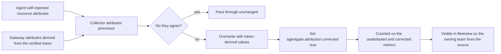
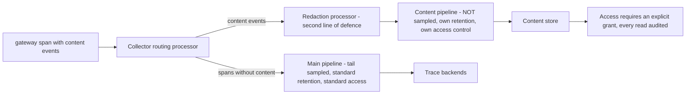

# 06 — Telemetry Schema

**Audience:** platform engineers implementing the pipeline, agent engineers instrumenting agents,
observability owners, security reviewers assessing what data leaves which boundary.

OpenTelemetry throughout, aligned to the `gen_ai.*` semantic conventions and extended with
`agentgate.*` for what those conventions do not cover: ownership, chargeback, policy execution and
promotion.

---

## 1. Design rules

1. **`gen_ai.*` where the convention covers it, `agentgate.*` where it does not.** We do not invent
   an attribute that has a standard name, and we do not overload a standard attribute with a
   non-standard meaning.
2. **The token is the source of truth for ownership.** The gateway stamps or corrects ownership
   attributes from the verified token. An agent cannot lie about who pays.
3. **Disagreement is recorded, not hidden.** Where an agent's self-reported attributes disagree with
   the token, the token wins **and** `agentgate.attribution.corrected=true` is set, so the mismatch
   is visible and fixable.
4. **High cardinality belongs on spans, never on metric labels.** Every attribute in this document
   carries a cardinality note.
5. **Content is not telemetry.** Prompts and completions travel a separate pipeline with separate
   retention and access control, and are off by default in production.
6. **Telemetry is a control.** It gates promotion. That forces it to be correct, which is why §8
   exists.

---

## 2. Resource attributes

Present on every signal from every runtime.

| Attribute | Type | Example | Source | Cardinality |
|---|---|---|---|---|
| `service.name` | string | `dispute-triage` | agent | Bounded by fleet size, ~hundreds |
| `service.version` | string | `2.4.1` | agent | Bounded, a few per agent |
| `service.namespace` | string | `payments-risk` | agent | Bounded, ~tens |
| `deployment.environment.name` | string | `prod` | agent | 3 |
| `agentgate.agent.id` | string | `agt_01J8Z9X2QK` | registry | Bounded by fleet size |
| `agentgate.agent.identity` | string | `agent://fsclient/payments-risk/dispute-triage` | token | Bounded by fleet size |
| `agentgate.tenant.id` | string | `fsclient` | token | Very low |
| `agentgate.team.id` | string | `payments-risk` | token | ~tens |
| `agentgate.owner.email` | string | `payments-risk@client.example` | registry | ~tens |
| `agentgate.cost_center` | string | `CC-4471` | token | ~tens |
| `agentgate.runtime` | string | `aks` \| `eks` \| `aca` \| `vm` \| `lambda` | agent | 5 |
| `agentgate.framework` | string | `langgraph` \| `semantic-kernel` \| `custom` | agent | Low |

### 2.1 Stamping and correction



| Attribute | Type | Meaning | Cardinality |
|---|---|---|---|
| `agentgate.attribution.corrected` | bool | The collector overrode a self-reported ownership attribute | 2 |
| `agentgate.attribution.corrected_fields` | string[] | Which attributes disagreed | Low |

A sustained non-zero correction rate for an agent is an instrumentation defect, not an attack. The
usual causes are a hard-coded team name in a copied config, or a cost centre that changed in the
registry but not in the agent's deployment.

---

## 3. Span taxonomy

| Span | Kind | Emitted by | Parent |
|---|---|---|---|
| `agent.invoke` | SERVER or INTERNAL | agent SDK | None, or the calling application's span |
| `agent.step` | INTERNAL | agent SDK | `agent.invoke` |
| `agent.tool` | CLIENT | agent SDK | `agent.step` |
| `gateway.request` | SERVER | gateway | The caller's span via `traceparent` |
| `gateway.policy.<stage>` | INTERNAL | gateway | `gateway.request` |
| `gateway.guardrail` | CLIENT | gateway | `gateway.request` |
| `gateway.cache` | INTERNAL | gateway | `gateway.request` |
| `gen_ai.chat` | CLIENT | gateway | `gateway.request` |
| `gen_ai.embeddings` | CLIENT | gateway | `gateway.request` |
| `controlplane.register` | SERVER | control plane | None, or CI's span |
| `controlplane.promote` | SERVER | control plane | None |
| `controlplane.token_exchange` | SERVER | control plane | None, or the agent's span |

### 3.1 Parentage tree

```mermaid
flowchart TD
  AI["agent.invoke - one agent run"] --> AS1["agent.step - classify"]
  AI --> AS2["agent.step - retrieve"]
  AI --> AS3["agent.step - summarise"]

  AS1 --> AT1["agent.tool - model call"]
  AS2 --> AT2["agent.tool - vector search, not via AgentGate"]
  AS2 --> AT3["agent.tool - model call"]
  AS3 --> AT4["agent.tool - model call"]

  AT1 --> GR1["gateway.request"]
  AT3 --> GR2["gateway.request"]
  AT4 --> GR3["gateway.request"]

  GR1 --> P1["gateway.policy.trace_start"]
  GR1 --> P2["gateway.policy.authn"]
  GR1 --> P3["gateway.policy.authz"]
  GR1 --> P4["gateway.policy.admission"]
  GR1 --> P5["gateway.policy.ratelimit_requests"]
  GR1 --> P6["gateway.policy.quota_tokens"]
  GR1 --> P7["gateway.policy.guardrail_input"]
  GR1 --> P8["gateway.policy.cache_lookup"]
  GR1 --> P9["gateway.policy.transform_request"]
  GR1 --> P10["gateway.policy.route"]
  GR1 --> P11["gateway.policy.invoke"]
  GR1 --> P12["gateway.policy.transform_response"]
  GR1 --> P13["gateway.policy.guardrail_output"]
  GR1 --> P14["gateway.policy.cache_store"]
  GR1 --> P15["gateway.policy.meter"]
  GR1 --> P16["gateway.policy.trace_end"]

  GR1 --> GG["gateway.guardrail - CLIENT, one per callout"]
  GR1 --> GC["gateway.cache - INTERNAL"]
  GR1 --> GA1["gen_ai.chat - attempt 1"]
  GR1 --> GA2["gen_ai.chat - attempt 2 after failover"]
```



**[Decision]** Span names use underscores where the policy stage name contains a dot
(`ratelimit.requests` becomes `gateway.policy.ratelimit_requests`), because a dotted segment inside a
dotted span name is ambiguous to most backends' filtering syntax. The **attribute** key retains the
SPEC form: `agentgate.policy.ratelimit.requests.duration_ms`.

**[Decision]** Retry attempts are sibling `gen_ai.chat` spans under `gateway.request`, not nested
spans. Nesting would imply a causal containment that does not exist and would distort the duration
of the first attempt.

---

## 4. Span attributes

### 4.1 `gateway.request` — SERVER

| Attribute | Type | Example | Cardinality |
|---|---|---|---|
| `http.request.method` | string | `POST` | 2 |
| `http.route` | string | `/v1/chat/completions` | 7 |
| `http.response.status_code` | int | `200` | ~15 |
| `agentgate.request_id` | string | `a1b2c3d4e5f60718` | Unbounded — span only, never a label |
| `agentgate.logical_model` | string | `general-chat` | Low, ~tens |
| `agentgate.pool` | string | `general-chat` | Low, ~tens |
| `agentgate.priority` | string | `interactive` \| `batch` | 2 |
| `agentgate.error.code` | string | `quota_exceeded` | 15, the frozen catalogue |
| `agentgate.cache` | string | `hit` \| `miss` \| `bypass` \| `refresh` | 4 |
| `agentgate.attempts` | int | `2` | Low |
| `agentgate.stream` | bool | `true` | 2 |
| `agentgate.ttft_ms` | int | `214` | Unbounded value, low-cardinality key |
| `agentgate.overhead_ms` | int | `41` | Gateway time excluding provider time — the latency SLI numerator |
| `agentgate.tokens.input` | int | `1842` | — |
| `agentgate.tokens.output` | int | `311` | — |
| `agentgate.cost.usd` | double | `0.001842` | — |
| `agentgate.guardrail.action` | string | `pass` \| `block` \| `redact` \| `annotate` | 4 |
| `agentgate.guardrail.category` | string | `pii.account_number` | Bounded by the policy vocabulary |
| `agentgate.usage.estimated` | bool | `true` when the provider omitted usage and tokens were counted locally | 2 |
| `agentgate.session_id` | string | `sess_123` | Unbounded — span only |
| `agentgate.conversation_id` | string | `conv_9` | Unbounded — span only |
| `agentgate.step` | string | `classify` | Should be low; consumer-controlled |
| `agentgate.tags` | string[] | `["dispute","tier2"]` | Should be low; consumer-controlled |
| `agentgate.policy.<stage>.duration_ms` | int | `agentgate.policy.authn.duration_ms = 2` | 16 keys, unbounded values |

The 16 per-stage duration attributes are the diagnostic backbone. `agentgate.overhead_ms` is their
sum minus the `invoke` stage's provider time, and is the quantity the latency SLO is defined on.

### 4.2 `gateway.policy.<stage>` — INTERNAL

| Attribute | Type | Notes |
|---|---|---|
| `agentgate.policy.stage` | string | The canonical SPEC name, e.g. `ratelimit.requests` |
| `agentgate.policy.index` | int | 1 through 16 |
| `agentgate.policy.outcome` | string | `ok` \| `short_circuit` \| `error` |
| `agentgate.policy.short_circuit_code` | string | Present when the stage terminated the request |

### 4.3 `gen_ai.chat` — CLIENT

The SPEC-specified set, reproduced exactly, with types and cardinality:

| Attribute | Type | Example | Cardinality |
|---|---|---|---|
| `gen_ai.system` | string | `azure.ai.openai` \| `aws.bedrock` \| `vllm` | 3–5 |
| `gen_ai.operation.name` | string | `chat` | 2 |
| `gen_ai.request.model` | string | `gpt-4o-mini` — concrete | ~tens |
| `gen_ai.response.model` | string | `gpt-4o-mini-2024-07-18` | ~tens |
| `gen_ai.request.max_tokens` | int | `1024` | — |
| `gen_ai.request.temperature` | double | `0.2` | — |
| `gen_ai.request.top_p` | double | `1.0` | — |
| `gen_ai.usage.input_tokens` | int | `1842` | — |
| `gen_ai.usage.output_tokens` | int | `311` | — |
| `gen_ai.response.finish_reasons` | string[] | `["stop"]` | ~5 |
| `agentgate.logical_model` | string | `general-chat` | ~tens |
| `agentgate.pool` | string | `general-chat` | ~tens |
| `agentgate.backend` | string | `azure-openai/gpt-4o-mini` | ~tens |
| `agentgate.attempt` | int | `2` | Low |
| `agentgate.failover.from` | string | `bedrock/claude-haiku` | ~tens, absent when no failover |
| `agentgate.cost.usd` | double | `0.001842` | — |
| `agentgate.cache` | string | `miss` | 4 |
| `agentgate.ttft_ms` | int | `214` | — |
| `agentgate.stream` | bool | `true` | 2 |

Added by AgentGate beyond the SPEC list, all optional and additive:

| Attribute | Type | Notes |
|---|---|---|
| `agentgate.backend.priority` | int | Tier the backend sits in. Distinguishes a same-tier failover from a tier drop |
| `agentgate.backend.timeout_ms` | int | Effective timeout for this attempt, `min(remaining deadline, backend_timeout)` |
| `agentgate.retry.reason` | string | `timeout` \| `connection` \| `status_5xx` \| `status_429` |
| `agentgate.breaker.state` | string | Breaker state for this backend at selection time |

### 4.4 `gen_ai.embeddings` — CLIENT

Same shape with `gen_ai.operation.name = embeddings`, `gen_ai.usage.input_tokens` populated and
`gen_ai.usage.output_tokens` absent. `agentgate.embeddings.input_count` records how many inputs were
batched.

### 4.5 `gateway.guardrail` — CLIENT

| Attribute | Type | Notes |
|---|---|---|
| `agentgate.guardrail.provider` | string | `noop` \| `builtin` \| `callout` |
| `agentgate.guardrail.phase` | string | `input` \| `output` |
| `agentgate.guardrail.action` | string | `pass` \| `block` \| `redact` \| `annotate` |
| `agentgate.guardrail.category` | string | The matched category, from the policy vocabulary |
| `agentgate.guardrail.score` | double | Confidence, where the provider supplies one |
| `agentgate.guardrail.window_index` | int | Output-stream window number |
| `agentgate.guardrail.failure_mode` | string | `fail_open` \| `fail_closed` |
| `agentgate.guardrail.bypassed` | bool | True when a `fail_open` pool proceeded without a verdict |

**The matched content is never an attribute.** Category and score only.

### 4.6 `gateway.cache` — INTERNAL

| Attribute | Type | Notes |
|---|---|---|
| `agentgate.cache` | string | `hit` \| `miss` \| `bypass` \| `refresh` |
| `agentgate.cache.kind` | string | `exact` \| `semantic` |
| `agentgate.cache.similarity` | double | Semantic hits only. Recorded so a semantic hit is auditable |
| `agentgate.cache.origin_trace_id` | string | The trace that produced the cached entry |
| `agentgate.cache.age_seconds` | int | How old the entry was at hit time |
| `agentgate.cache.savings_usd` | double | Cost avoided |

`agentgate.cache.origin_trace_id` is what makes a cache hit fully attributable: the answer the caller
received can be traced to the request that originally generated it.

### 4.7 `agent.*` — emitted by the agent SDK

| Span | Attribute | Type | Notes |
|---|---|---|---|
| `agent.invoke` | `agentgate.run.id` | string | The agent's own run identifier |
| | `agentgate.session_id` | string | Should match the header sent to the gateway |
| | `agentgate.conversation_id` | string | |
| | `agent.outcome` | string | `success` \| `failure` \| `abandoned` |
| `agent.step` | `agent.step.name` | string | Low cardinality. `classify`, `retrieve`, `summarise` |
| | `agent.step.index` | int | |
| `agent.tool` | `agent.tool.name` | string | Low cardinality |
| | `agent.tool.outcome` | string | `success` \| `error` |

Agents own the correctness of these. The gateway cannot stamp them because it does not see the
agent's internal structure — which is exactly why `orphan_span_ratio` exists.

### 4.8 `controlplane.*` — SERVER

| Span | Attribute | Notes |
|---|---|---|
| `controlplane.token_exchange` | `agentgate.attestation` | `workload-identity` \| `client-credentials` |
| | `agentgate.subject_issuer` | The platform issuer that vouched for the subject |
| | `agentgate.exchange.outcome` | `issued` \| `rejected` |
| `controlplane.register` | `agentgate.register.outcome` | `created` \| `updated` \| `rejected` |
| | `agentgate.actor` | The CI or human principal |
| `controlplane.promote` | `agentgate.promote.from_env` / `.to_env` | |
| | `agentgate.promote.snapshot_id` | Links the span to the immutable gate snapshot |
| | `agentgate.promote.outcome` | `promoted` \| `gate_failed` \| `awaiting_approval` \| `expired` |
| | `agentgate.promote.failed_gate` | Which gate failed, when one did |

---

## 5. Metric catalogue

The SPEC metric set, with types, labels, and a cardinality budget for each.

| Metric | Type | Labels | Cardinality estimate |
|---|---|---|---|
| `agentgate.gateway.requests` | counter | tenant, team, agent, env, pool, backend, status, code | 1 × 20 × 300 × 3 × 20 × 20 × 5 × 15 — see §5.1, this must be constrained |
| `agentgate.gateway.duration` | histogram | + stream | Request labels × 2 × buckets |
| `agentgate.gateway.ttft` | histogram | pool, backend | 20 × 20 × buckets = ~4,800 |
| `agentgate.gateway.tokens` | counter | + direction | Request labels × 2 |
| `agentgate.gateway.cost_usd` | counter | tenant, team, agent, env, cost_center, backend | 1 × 20 × 300 × 3 × 30 × 20 |
| `agentgate.gateway.inflight` | up-down counter | pool | ~20 |
| `agentgate.ratelimit.decisions` | counter | agent, decision | 300 × 3 = 900 |
| `agentgate.cache.lookups` | counter | pool, result | 20 × 4 = 80 |
| `agentgate.guardrail.decisions` | counter | pool, category, action | 20 × 30 × 4 = 2,400 |
| `agentgate.breaker.state` | gauge | backend, state | 20 × 3 = 60 |
| `agentgate.retry.attempts` | counter | backend, reason | 20 × 5 = 100 |
| `agentgate.fleet.agents` | gauge | env, state | 3 × 6 = 18 |
| `agentgate.telemetry.completeness` | gauge | agent, env | 300 × 3 = 900 |

### 5.1 Cardinality budget — the honest problem

The naive product for `agentgate.gateway.requests` is roughly 20 × 300 × 3 × 20 × 20 × 5 × 15, on
the order of 5.4 × 10⁸ label combinations. That is not a series count — most combinations never
occur — but it is not a bound either, and a metrics backend does not care about your intentions.

**[Decision] Cardinality controls, in force from day one:**

| Control | Rule |
|---|---|
| Hard budget | **150,000 active series** across all AgentGate metrics, monitored and alerted at 80% |
| `agent` label | Present on the metrics where per-agent enforcement or attribution is the point: `requests`, `tokens`, `cost_usd`, `ratelimit.decisions`, `telemetry.completeness`. **Absent** from `duration`, `ttft` and other histograms, where it multiplies by bucket count |
| Histograms | Never labelled with `agent`. Pool and backend only. Per-agent latency questions are answered from traces, which is what traces are for |
| `code` label | Only the 15 frozen error codes plus `ok`. Never a free-form string |
| `backend` label | Bounded by configuration. Adding a backend is a reviewed change |
| Recording rules | Per-team and per-cost-centre rollups are pre-aggregated at ingestion so dashboards do not fan out over `agent` |
| Emergency valve | A per-agent series ceiling; a single agent cannot exceed its share of the budget. Breaching it drops the `agent` label for that agent and raises an alert |
| Never a label | `request_id`, `trace_id`, `session_id`, `conversation_id`, `agent_version`, `logical_model` where it duplicates `pool` |

**`agent_version` is deliberately not a metric label.** It would multiply every per-agent series by
the number of live versions, and version-level questions are almost always asked about a specific
deployment window, which is a trace or a rollup query.

Realistic steady-state estimate with these controls: **40,000–70,000 active series** for a 300-agent
fleet, well inside the budget.

### 5.2 Derived and recording-rule metrics

| Name | Definition | Purpose |
|---|---|---|
| `agentgate:gateway:availability_sli` | Non-5xx and non-`no_healthy_backend` over total | Availability SLO |
| `agentgate:gateway:overhead_p95` | p95 of `agentgate.overhead_ms` | Latency SLO |
| `agentgate:cost:by_cost_center_hourly` | Sum of `cost_usd` by `cost_center` | Chargeback dashboards, anomaly baseline |
| `agentgate:cache:savings_usd_daily` | Sum of `savings_usd` | Platform value reporting |
| `agentgate:telemetry:fleet_completeness` | Fraction of agents with completeness ≥ 0.98 | Telemetry SLO |

---

## 6. Log schema

Structured JSON, one object per line, correlated to traces.

| Field | Type | Always | Notes |
|---|---|---|---|
| `timestamp` | RFC3339 with milliseconds | yes | |
| `severity` | string | yes | `DEBUG` \| `INFO` \| `WARN` \| `ERROR` |
| `body` | string | yes | Human-readable. Not parsed by anything |
| `trace_id` | string | when in a request | Correlates to the trace |
| `span_id` | string | when in a request | |
| `service.name` | string | yes | From the resource |
| `agentgate.request_id` | string | when in a request | |
| `agentgate.agent.identity` | string | when known | |
| `agentgate.tenant.id` / `.team.id` / `.cost_center` | string | when known | |
| `agentgate.error.code` | string | on errors | The frozen `code` |
| `agentgate.policy.stage` | string | when a stage logs | |
| `agentgate.event` | string | yes | Low-cardinality event name, see below |

**[Decision]** `agentgate.event` uses a fixed vocabulary so logs are queryable without regex:
`request.completed`, `request.rejected`, `backend.attempt`, `backend.failed`, `breaker.opened`,
`breaker.closed`, `quota.reserved`, `quota.settled`, `quota.refused`, `cache.hit`, `cache.stored`,
`guardrail.blocked`, `guardrail.bypassed`, `token.exchanged`, `token.rejected`, `agent.registered`,
`agent.promoted`, `promotion.gate_failed`, `approval.recorded`, `approval.rejected`,
`secret.rotated`, `usage.buffered`, `usage.replayed`.

**Never in a log line:** prompt or completion content, token values, client secrets, vault paths with
credentials, or any field the guardrail engine would have redacted. Log redaction runs in the
collector as a second line of defence, not as the only one.

**[Decision]** Retention: 30 days hot, 400 days cold for `severity>=WARN` and for every line carrying
`agentgate.event` in the audit subset (`agent.promoted`, `approval.*`, `token.rejected`,
`secret.rotated`). Ordinary `INFO` is 30 days only.

---

## 7. Content-capture policy

Prompt and completion content is **not** on spans by default.

| Setting | `AGENTGATE_CAPTURE_CONTENT` | Behaviour |
|---|---|---|
| Off | `off` | No content emitted anywhere. **Default in prod for this client** |
| Redacted | `redacted` | Content emitted as span events after guardrail redaction. **Default in non-prod** |
| Full | `full` | Content emitted verbatim. Never enabled in prod; requires a named approval to enable anywhere |

When enabled, content is emitted as span **events**, not attributes:

| Event | Attributes |
|---|---|
| `gen_ai.content.prompt` | `gen_ai.prompt` — the redacted or full prompt |
| `gen_ai.content.completion` | `gen_ai.completion` — the redacted or full completion |

### 7.1 The content pipeline



| Property | Main pipeline | Content pipeline |
|---|---|---|
| Sampled | Yes, tail sampling | **No.** Sampling content would make it unusable for the debugging it exists for |
| Retention | **[Decision]** 30 days | **[Decision]** 7 days |
| Access | Platform and owning teams | Explicit grant only, every read audited |
| Redaction | Not applicable | Guardrail redaction at the gateway, plus a collector-side redaction processor |
| Crosses to a managed backend | Yes | **No.** Content never leaves the self-hosted store |
| Data classification | Metadata about restricted data | **Is** the restricted data |

**[Decision]** The two-stage redaction is deliberate. The gateway redacts because it has the
guardrail engine and the policy context. The collector redacts again because a gateway
misconfiguration must not be the only thing standing between restricted content and a store not
provisioned for it.

### 7.2 Enforcement

Content capture in production is asserted, not assumed:

1. The production deployment pipeline fails if `AGENTGATE_CAPTURE_CONTENT` is anything other than
   `off`.
2. The gateway exports `agentgate.content_capture.mode` as a gauge; a non-zero value in prod raises a
   **page**, not a ticket.
3. The content pipeline's exporter is not configured at all in the production collector, so even a
   gateway misconfiguration has nowhere to send content.

Three independent controls, because this is the failure mode that ends a platform's relationship
with a regulated client.

---

## 8. Sampling policy

Tail sampling at the collector gateway tier.

| Policy | Rate | Rationale |
|---|---|---|
| Trace contains an error | **100%** | The traces you most need |
| Trace contains a guardrail block | **100%** | Compliance evidence |
| Trace contains a failover | **100%** | Resilience behaviour is rare and expensive to reproduce |
| Trace latency above p99 | **100%** | The tail is the SLO |
| Everything else | **5%** baseline | Enough for aggregate shape |

### 8.1 Why tail, not head

Head sampling decides before the trace is interesting. The decision would be made at the agent SDK,
before the gateway knows whether a failover occurred or the request took 12 seconds. Tail sampling
buys correctness at the cost of buffering.

### 8.2 What tail sampling requires

| Requirement | Implementation |
|---|---|
| All spans of a trace reach one sampler instance | Load-balancing exporter keyed on trace id at the agent tier. **Not optional** — without it the sampler sees fragments |
| A decision wait time | **[Decision]** 30 seconds, above the p99.9 request duration. A trace still open at 30 s is decided on what has arrived |
| Memory to hold undecided traces | Bounded by `memory_limiter`; a spike becomes back-pressure rather than an OOM |
| Late spans | **[Decision]** Late spans arriving after a keep decision are exported; late spans arriving after a drop decision are dropped. This produces occasional single-span traces in the backend, which is preferable to holding every trace for minutes |

### 8.3 What is never sampled

| Signal | Why |
|---|---|
| Metrics | Aggregate correctness. Metrics are pre-aggregated, not per-request |
| `UsageRecord` on the usage stream | Billing. A sampled invoice is not an invoice |
| Audit logs — promotions, approvals, token rejections, secret rotations | Evidence |
| Content pipeline | See §7.1 |

The practical consequence: a specific successful, fast, unremarkable request may not be retrievable
as a trace, but it is always retrievable as a usage record and always counted in the metrics. Cost
and availability numbers are exact; individual trace retrieval is probabilistic for uninteresting
requests.

---

## 9. Telemetry-trust metrics

Every 60 seconds `fleetview` computes, per agent per environment:

| Metric | Definition | Healthy | Alerts when |
|---|---|---|---|
| `completeness_ratio` | `traces_received / traces_expected`, where `traces_expected` is the gateway request count and `traces_received` is spans arriving with that agent's resource attributes | ≥ 0.98 | < 0.95 sustained 15 min |
| `orphan_span_ratio` | Spans whose parent never arrived, over total spans | < 0.01 | > 0.05 sustained 15 min |
| `unattributed_ratio` | Spans missing owner or cost-centre attributes, over total | 0 | > 0.001 |
| `clock_skew_p99` | p99 of agent-reported minus gateway-observed timestamps | < 2 s | > 5 s |

Exported as `agentgate.telemetry.completeness` and the related gauges, these drive the
`telemetry_degraded` alert and are a **hard input to the promotion gate**. An agent whose telemetry
is not trustworthy cannot be promoted to production.

### 9.1 Diagnosing each

| Symptom | Most likely cause | Fix |
|---|---|---|
| Completeness ~0.90, orphans normal | One replica not exporting, or a node-local collector dropping | Check `memory_limiter` refusals on that node |
| Completeness low, orphans high, runtime is `lambda` | Not flushing before freeze | Force a synchronous flush before the handler returns |
| Orphans high, completeness fine | `traceparent` not propagated from agent to gateway | Add the propagator to the HTTP client |
| Unattributed above zero | Agent emitting spans before resource attributes are configured | Configure the resource at SDK init, not lazily |
| Clock skew high | NTP drift on a VM | Fix NTP. Skew corrupts ordering and duration everywhere |
| Completeness above 1.0 | Duplicate export — two exporters configured, or a collector retry loop double-exporting | Fix the exporter configuration. A ratio above 1.0 is a defect, not a bonus |

---

## 10. Worked example — one agent run as a trace tree

A dispute-triage run: classify, retrieve context, summarise. Three gateway calls, one of which fails
over and one of which hits the cache.

**Trace id:** `4bf92f3577b34da6a3ce929d0e0e4736`

```
agent.invoke                             INTERNAL   4820ms
│  service.name=dispute-triage  service.version=2.4.1  service.namespace=payments-risk
│  deployment.environment.name=prod
│  agentgate.agent.id=agt_01J8Z9X2QK
│  agentgate.agent.identity=agent://fsclient/payments-risk/dispute-triage
│  agentgate.tenant.id=fsclient  agentgate.team.id=payments-risk
│  agentgate.owner.email=payments-risk@client.example
│  agentgate.cost_center=CC-4471  agentgate.runtime=aks  agentgate.framework=langgraph
│  agentgate.run.id=run_01J9B2  agentgate.session_id=sess_123
│  agentgate.conversation_id=conv_9  agent.outcome=success
│
├─ agent.step  step.name=classify  step.index=0        INTERNAL   1180ms
│  │
│  └─ agent.tool  tool.name=model_call  outcome=success  CLIENT   1174ms
│     │
│     └─ gateway.request                               SERVER    1169ms
│        http.request.method=POST  http.route=/v1/chat/completions
│        http.response.status_code=200
│        agentgate.request_id=a1b2c3d4e5f60718
│        agentgate.logical_model=general-chat  agentgate.pool=general-chat
│        agentgate.priority=interactive  agentgate.cache=miss
│        agentgate.attempts=1  agentgate.stream=false
│        agentgate.overhead_ms=38  agentgate.tokens.input=1842
│        agentgate.tokens.output=311  agentgate.cost.usd=0.000462
│        agentgate.guardrail.action=pass  agentgate.step=classify
│        agentgate.policy.trace.start.duration_ms=0
│        agentgate.policy.authn.duration_ms=2
│        agentgate.policy.authz.duration_ms=1
│        agentgate.policy.admission.duration_ms=3
│        agentgate.policy.ratelimit.requests.duration_ms=1
│        agentgate.policy.quota.tokens.duration_ms=2
│        agentgate.policy.guardrail.input.duration_ms=14
│        agentgate.policy.cache.lookup.duration_ms=1
│        agentgate.policy.transform.request.duration_ms=1
│        agentgate.policy.route.duration_ms=0
│        agentgate.policy.invoke.duration_ms=1131
│        agentgate.policy.transform.response.duration_ms=1
│        agentgate.policy.guardrail.output.duration_ms=11
│        agentgate.policy.cache.store.duration_ms=1
│        agentgate.policy.meter.duration_ms=1
│        agentgate.policy.trace.end.duration_ms=0
│        │
│        ├─ gateway.policy.authn         INTERNAL      2ms   outcome=ok
│        ├─ gateway.policy.authz         INTERNAL      1ms   outcome=ok
│        ├─ gateway.policy.quota_tokens  INTERNAL      2ms   outcome=ok
│        ├─ gateway.guardrail            CLIENT       14ms
│        │     provider=callout  phase=input  action=pass  failure_mode=fail_closed
│        ├─ gateway.cache                INTERNAL      1ms
│        │     agentgate.cache=miss  kind=exact
│        ├─ gen_ai.chat                  CLIENT     1131ms
│        │     gen_ai.system=azure.ai.openai  gen_ai.operation.name=chat
│        │     gen_ai.request.model=gpt-4o-mini
│        │     gen_ai.response.model=gpt-4o-mini-2024-07-18
│        │     gen_ai.request.max_tokens=1024  gen_ai.request.temperature=0.0
│        │     gen_ai.usage.input_tokens=1842  gen_ai.usage.output_tokens=311
│        │     gen_ai.response.finish_reasons=["stop"]
│        │     agentgate.logical_model=general-chat  agentgate.pool=general-chat
│        │     agentgate.backend=azure-openai/gpt-4o-mini  agentgate.backend.priority=1
│        │     agentgate.attempt=1  agentgate.cost.usd=0.000462
│        │     agentgate.cache=miss  agentgate.ttft_ms=214  agentgate.stream=false
│        └─ gateway.guardrail            CLIENT       11ms
│              provider=callout  phase=output  action=pass
│
├─ agent.step  step.name=retrieve  step.index=1        INTERNAL   1910ms
│  │
│  ├─ agent.tool  tool.name=vector_search  outcome=success  CLIENT  240ms
│  │     Not an AgentGate call. No gateway.request child.
│  │
│  └─ agent.tool  tool.name=model_call  outcome=success  CLIENT  1664ms
│     │
│     └─ gateway.request                               SERVER    1659ms
│        agentgate.request_id=b2c3d4e5f6071829
│        agentgate.pool=general-chat  agentgate.cache=miss
│        agentgate.attempts=3  agentgate.stream=true
│        agentgate.overhead_ms=52  agentgate.ttft_ms=602
│        agentgate.tokens.input=3140  agentgate.tokens.output=489
│        agentgate.cost.usd=0.000764  agentgate.step=retrieve
│        agentgate.policy.invoke.duration_ms=1607
│        │
│        ├─ gen_ai.chat  attempt 1                     CLIENT      412ms   STATUS ERROR
│        │     gen_ai.system=azure.ai.openai
│        │     agentgate.backend=azure-openai/gpt-4o-mini  agentgate.backend.priority=1
│        │     agentgate.attempt=1  agentgate.retry.reason=status_5xx
│        │     agentgate.breaker.state=closed
│        │
│        ├─ gen_ai.chat  attempt 2                     CLIENT      308ms   STATUS ERROR
│        │     agentgate.backend=azure-openai/gpt-4o-mini  agentgate.attempt=2
│        │     agentgate.retry.reason=status_5xx
│        │     agentgate.breaker.state=open      ← breaker tripped after this attempt
│        │
│        └─ gen_ai.chat  attempt 3                     CLIENT      887ms   STATUS OK
│              gen_ai.system=aws.bedrock
│              gen_ai.request.model=claude-haiku
│              agentgate.backend=bedrock/claude-haiku  agentgate.backend.priority=1
│              agentgate.attempt=3  agentgate.failover.from=azure-openai/gpt-4o-mini
│              agentgate.cost.usd=0.000764  agentgate.ttft_ms=602  agentgate.stream=true
│              Failover was permitted: no content byte had been delivered.
│              An event agentgate.failover was emitted on the SSE stream.
│
└─ agent.step  step.name=summarise  step.index=2       INTERNAL    128ms
   │
   └─ agent.tool  tool.name=model_call  outcome=success  CLIENT    124ms
      │
      └─ gateway.request                               SERVER      119ms
         agentgate.request_id=c3d4e5f607182930
         agentgate.pool=general-chat  agentgate.cache=hit
         agentgate.attempts=0  agentgate.overhead_ms=19
         agentgate.tokens.input=0  agentgate.tokens.output=0
         agentgate.cost.usd=0.000000  agentgate.step=summarise
         agentgate.policy.invoke.duration_ms=0
         │
         └─ gateway.cache                              INTERNAL     8ms
               agentgate.cache=hit  kind=exact
               agentgate.cache.origin_trace_id=9a8b7c6d5e4f30219a8b7c6d5e4f3021
               agentgate.cache.age_seconds=412
               agentgate.cache.savings_usd=0.000318
               No gen_ai.chat child. Stages 9 to 14 were skipped.
```

### 10.1 What this run tells you at a glance

| Question | Answer, and from where |
|---|---|
| Total cost of the run | 0.001226 USD. Sum of `agentgate.cost.usd` across the three `gateway.request` spans |
| Cost avoided | 0.000318 USD from the cache hit on the summarise step |
| Who pays | `CC-4471`, from the resource attributes, derived from the verified token |
| Where the time went | 4820 ms total; 3877 ms in provider calls, ~109 ms of gateway overhead across three requests, the remainder in the agent's own logic and a 240 ms vector search |
| Did anything go wrong | Yes. Two failed attempts on `azure-openai/gpt-4o-mini` in the retrieve step, breaker tripped, failed over to `bedrock/claude-haiku`. The caller never saw an error |
| Was this trace sampled | Kept at 100% — it contains errors and a failover |
| Is it attributable | Fully. Every span carries the resource attributes, and the cache hit links to its origin trace |
| Guardrail posture | `fail_closed`, consistent with `data_classification=confidential` on a restricted-capable pool |

Note the failover step's `agentgate.overhead_ms=52` against the simple step's `38`. The extra 14 ms
is the routing and breaker work across three attempts — visible, attributable, and bounded well
inside the 60 ms overhead SLO.

---

## 11. Managed vs self-hosted observability

### 11.1 The comparison

| Dimension | Azure Monitor / App Insights, AWS X-Ray + CloudWatch | Self-hosted Langfuse |
|---|---|---|
| Operational burden | None. Managed service, patched and scaled by the cloud provider | Real. A deployment, a database, upgrades, backups, capacity |
| Already reviewed by the client | **Yes.** Almost certainly already in the environment with an approved data-flow review | **No.** New review artefact required |
| Alerting and on-call integration | Mature, already wired to the client's paging | Weak. Not an alerting product |
| Retention cost at fleet scale | Expensive per GB; costs grow with adoption | Cheap. Storage is yours |
| `gen_ai.*` semantic understanding | Generic APM. Sees spans, not model calls. No native notion of prompt, completion, cost per token, or model version | **Native.** Built for LLM observability |
| Prompt and completion inspection | Poor. Content in a generic APM is a compliance problem and a UX problem | **Good.** This is the product's purpose |
| Cost-per-request attribution | Requires custom metrics and dashboards | Native |
| Trace-level model debugging for agent engineers | Painful | The reason to have it |
| Data residency and content handling | Content in a managed backend crosses a boundary that requires its own review, and in this client's case would probably not be approved | Content stays in the client's own network |
| Infrastructure correlation — pod restarts, node pressure, network | **Strong.** Already correlated with everything else the client runs | None |
| Vendor lock-in | Moderate. Query languages and alerting are not portable | Low. OTLP in, OTLP out |
| Failure mode | Provider outage takes observability with it | Yours to run, yours to break |

### 11.2 Recommendation — run both, in this split

**[Decision] Run both, with a deliberate division of responsibility. Do not attempt to pick one.**

| Signal | Destination | Reasoning |
|---|---|---|
| **Metrics** | **Prometheus / managed Prometheus, primary.** Mirrored to the managed APM where the client's dashboards already live | Metrics are cheap, low cardinality after the §5.1 controls, and drive alerting. Alerting must live where the on-call rota already is |
| **Alerting** | **Managed platform, exclusively** | Integration with the client's paging, escalation and incident tooling already exists and is already reviewed. Building a parallel alerting path is duplicated on-call surface |
| **Traces, sampled** | **Both.** Langfuse primary for engineers, managed APM for platform and infrastructure correlation | The two audiences ask different questions. An agent engineer asks "why did this run cost 40 cents"; a platform engineer asks "was this the node that was under memory pressure" |
| **Traces, content events** | **Langfuse only. Never the managed backend** | Content is the restricted data. It stays in the client's network, on a pipeline with its own retention and access control |
| **Logs** | **Managed log store, primary** | Log correlation with infrastructure events is the main use, and that is where the infrastructure logs already are |
| **Usage records and cost** | **Warehouse, exclusively.** Neither observability backend | Billing data is not telemetry. It is unsampled, immutable and needs SQL, joins and a retention policy measured in years |

### 11.3 Why not just one

**Managed only** fails for the agent engineer. A generic APM has no concept of a prompt, a
completion, a token cost or a model version. The engineer's core question — "why did this run behave
this way and what did it cost" — requires reading the actual model interaction, and putting that
content into a managed backend is exactly the data-flow the client will not approve. You end up with
a platform whose primary users cannot use its observability.

**Self-hosted only** fails for the platform engineer and for on-call. Langfuse is not an alerting
product and has no view of the infrastructure. It cannot tell you the latency spike coincided with a
node under memory pressure, and wiring a new alerting path into a regulated client's paging
infrastructure is a months-long review, not a configuration change. You end up unable to run the
platform.

### 11.4 The cost of running both

Stated plainly, because "run both" is easy to say:

| Cost | Size | Mitigation |
|---|---|---|
| Two backends to operate | Langfuse is a real deployment with a database and an upgrade path | It is one deployment, and traces are its only job |
| Export volume duplicated for traces | Sampled traces go to two places | Sampling is already at 5% baseline; the duplicated volume is small |
| Two places to look | Genuine cognitive cost | Mitigated by the split being **by question**, not by preference: alerts and infrastructure in managed, model behaviour and content in Langfuse. Runbooks name which one to open |
| Two sets of dashboards | Drift risk | Only the managed side has alert-backed dashboards. Langfuse dashboards are exploratory and are not part of the on-call path |

The routing is a collector concern, not an application concern. Agents and the gateway emit OTLP
once; the collector fans out. Changing the split later is a collector configuration change, not a
re-instrumentation.
