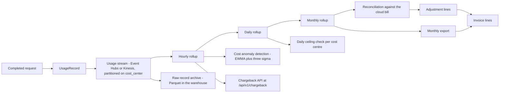
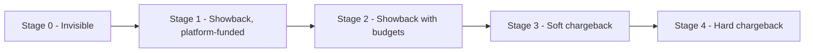
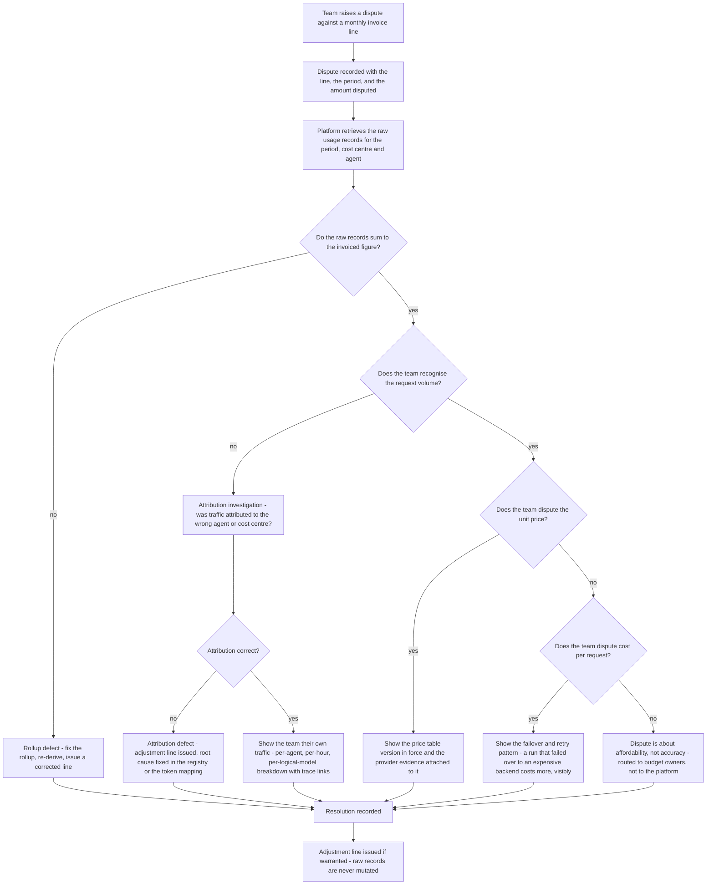

# 08 — Cost Attribution, Showback and Chargeback

**Audience:** platform engineers, FinOps, cost-centre owners, the client's finance function.

A shared platform justifies itself with numbers. This document specifies how those numbers are
produced, how they are kept honest, and how they become an invoice line.

---

## 1. Principles

1. **Every completed request produces exactly one immutable `UsageRecord`.** Including failures,
   cache hits and disconnects.
2. **Cost is attributed to the backend that actually served the request**, not the one requested. A
   failover to a more expensive backend is billed at the expensive backend.
3. **Records are never mutated.** Corrections are adjustment lines. This is what makes the record set
   usable as evidence.
4. **The `cost_center` claim is mandatory in production.** A token without it cannot reach `env=prod`,
   so no production spend is unattributable.
5. **Cache savings are recorded, not hidden.** A hit is a record with `billable:false` and a
   `savings_usd` figure.
6. **The gateway's number and the cloud bill will differ.** The process is to explain the variance,
   not to assume the gateway is right.

---

## 2. The usage record

### 2.1 Schema

```json
{
  "ts": "2026-08-26T14:22:01Z",
  "request_id": "a1b2c3d4e5f60718",
  "trace_id": "4bf92f3577b34da6a3ce929d0e0e4736",
  "tenant": "fsclient",
  "team": "payments-risk",
  "agent_id": "agt_01J8Z9X2QK",
  "env": "prod",
  "cost_center": "CC-4471",
  "logical_model": "general-chat",
  "provider": "azure-openai",
  "backend_model": "gpt-4o-mini",
  "input_tokens": 1842,
  "output_tokens": 311,
  "cached_tokens": 0,
  "unit_cost_input_per_1m": 0.15,
  "unit_cost_output_per_1m": 0.60,
  "cost_usd": 0.000462,
  "cache": "miss",
  "attempts": 1,
  "billable": true
}
```

### 2.2 Field reference

| Field | Type | Source | Notes |
|---|---|---|---|
| `ts` | RFC3339 UTC | Gateway, at stage 15 `meter` | Request completion, not start |
| `request_id` | string | Gateway | **Deduplication key.** Unique per gateway request |
| `trace_id` | string | Gateway | Joins the record to its trace, when the trace was sampled |
| `tenant` | string | Verified token | |
| `team` | string | Verified token | |
| `agent_id` | string | Verified token | |
| `env` | string | Verified token | |
| `cost_center` | string | Verified token | **The chargeback key** |
| `logical_model` | string | Request | What the caller asked for |
| `provider` | string | Routing outcome | `azure-openai`, `bedrock`, `onprem-vllm` |
| `backend_model` | string | Routing outcome | Concrete deployment that served it |
| `input_tokens` | int | Provider usage, or local count | Billed input tokens |
| `output_tokens` | int | Provider usage, or local count | Billed output tokens |
| `cached_tokens` | int | Provider usage | Provider-side prompt caching, where the provider reports it. Distinct from AgentGate's own cache |
| `unit_cost_input_per_1m` | decimal | Price table, resolved at metering time | Recorded on the record so the record is self-contained |
| `unit_cost_output_per_1m` | decimal | Price table | As above |
| `cost_usd` | decimal, 6 dp | Computed | See §2.3 |
| `cache` | string | Cache stage | `hit` \| `miss` \| `bypass` \| `refresh` |
| `attempts` | int | Invoke stage | Backend attempts made |
| `billable` | bool | Metering | `false` for cache hits and for requests that consumed no provider tokens |

**[Decision]** Extension fields added beyond the SPEC schema, all additive:

| Field | Type | Purpose |
|---|---|---|
| `savings_usd` | decimal, 6 dp | Present when `billable` is false and a cost was avoided |
| `error_code` | string | The frozen `code` when the request failed. Enables "how much are we spending on failures" |
| `agent_version` | string | Version-level cost analysis, which the metrics deliberately cannot answer |
| `pool` | string | Pool-level rollups |
| `estimated` | bool | `true` when token counts were locally counted because the provider omitted usage |
| `price_table_version` | string | Which price table version produced these unit costs |
| `shadow` | bool | `true` for migration shadow traffic. Metered for realism, never invoiced |

### 2.3 Cost computation

```
cost_usd = round(
    (input_tokens  * unit_cost_input_per_1m  / 1_000_000)
  + (output_tokens * unit_cost_output_per_1m / 1_000_000)
, 6)
```

Worked from the example above:

```
input  : 1842 * 0.15 / 1_000_000 = 0.0002763
output :  311 * 0.60 / 1_000_000 = 0.0001866
total  : 0.0004629  ->  rounded to 6 dp = 0.000462
```

**[Decision] Rounding is half-even at 6 decimal places, applied once, at the total** — never to the
input and output components separately. Rounding twice introduces a systematic bias that becomes
visible at hundreds of millions of requests. Six decimal places represents one ten-thousandth of a
cent, which is below the granularity of any provider's own billing.

Rollups sum the **unrounded** component values and round once at the rollup boundary, so a monthly
total is not the sum of a million individual roundings.

### 2.4 Records by outcome

| Outcome | Record written | `billable` | `cost_usd` | Notes |
|---|---|---|---|---|
| Successful unary or stream | Yes | `true` | Computed | The normal case |
| Cache hit, exact or semantic | Yes | `false` | `0.000000` | `savings_usd` records the avoided cost |
| Failed before reaching a provider — authn, authz, quota, guardrail input | Yes | `false` | `0.000000` | Zero-cost records still matter for volume analysis and for the availability SLI's denominator |
| Failed after partial generation | Yes | `true` | Computed on tokens generated | The provider charged for them |
| Client disconnected mid-stream | Yes | `true` | Computed on tokens generated | Same reasoning |
| Failover — multiple attempts | **One record** | `true` | Cost of the **successful** attempt | See §2.5 |
| Shadow traffic | Yes | `false` | Computed but not invoiced | `shadow: true` |

### 2.5 Failed attempts and their cost

A request that attempted three backends produces **one** record with `attempts: 3` and the cost of
the successful attempt.

**[Decision] Failed attempts are not billed to the consuming team.** Justification:

- The consumer did not choose the retry; the platform did.
- Billing failed attempts would make a consumer's cost depend on provider reliability they cannot
  influence, and would make the platform's own resilience behaviour a cost to its customers.
- Some providers do not charge for failed requests at all, so billing them would over-recover.

Providers that *do* charge for a partially-generated failed attempt create a genuine gap between what
the platform recovers and what the cloud bill shows. That gap is real, is surfaced in reconciliation
as the `failed_attempt_cost` variance category, and **[Decision]** is absorbed as platform overhead
rather than apportioned. Apportioning a few dollars a month across thirty cost centres costs more in
explanation than the money involved.

---

## 3. The pricing model

### 3.1 Structure

Prices are per backend, per token direction, per million tokens, versioned with effective dates.

```yaml
price_table_version: "2026-08-01"
effective_from: "2026-08-01T00:00:00Z"
currency: USD
backends:
  - backend: azure-openai/gpt-4o-mini
    unit_cost_input_per_1m: 0.15
    unit_cost_output_per_1m: 0.60
    source: provider_published
    verified_at: "2026-07-28"
  - backend: bedrock/claude-haiku
    unit_cost_input_per_1m: 0.25
    unit_cost_output_per_1m: 1.25
    source: provider_published
    verified_at: "2026-07-28"
  - backend: onprem-vllm/llama-3.1-8b
    unit_cost_input_per_1m: 0.04
    unit_cost_output_per_1m: 0.04
    source: internal_amortised
    basis: "GPU node amortisation over 36 months plus power and support, divided by measured throughput"
    verified_at: "2026-07-15"
    review_due: "2026-10-15"
```

| Property | Rule |
|---|---|
| Versioning | Every table has a version and an `effective_from`. Records carry `price_table_version` |
| Historical accuracy | A record is priced at the table in force when it was metered. Restating history is prohibited |
| Change process | A price change is a reviewed pull request with the provider's published price attached as evidence |
| Verification cadence | **[Decision]** Monthly for provider-published prices; quarterly for internal amortised prices |
| Missing price | A backend with no price entry cannot be enabled in production. The deploy fails |

### 3.2 On-prem unit cost

On-prem inference has no invoice, so its unit cost is an internal amortisation:

```
unit_cost_per_1m_tokens =
    ( GPU node cost amortised monthly
    + power and cooling
    + support and platform allocation )
  / ( measured tokens served per month )
```

**[Decision]** The measured-throughput denominator uses the trailing 3-month actual, not the
theoretical capacity. Using theoretical capacity would make on-prem look artificially cheap and would
distort routing economics — and since the failover tier is on-prem, that distortion would show up in
exactly the incidents where clear thinking matters.

The on-prem price is explicitly labelled `internal_amortised` on every record so nobody mistakes it
for an invoiced cost.

### 3.3 Discounts, commitments and reservations

**[Decision] v1 prices at list.** Enterprise agreements, committed-use discounts and reserved
capacity are **not** modelled per-request. They appear as a single reconciliation adjustment at the
cost-centre level.

Reasoning: a committed-use discount applies to aggregate consumption across the whole tenancy, and
apportioning it per request requires deciding whose requests consumed the committed capacity — a
question with no correct answer. Apportioning it at the cost-centre level, proportionally to metered
spend, is defensible and explicable. Doing it per request is neither.

This means **the platform's per-request cost is a list-price figure and is documented as such** in
every export. The reconciled cost-centre total is the invoiced figure.

---

## 4. Rollups



### 4.1 Rollup dimensions

| Level | Grain | Retention | Purpose |
|---|---|---|---|
| Raw records | Per request | **[Decision]** 400 days in Parquet | Dispute resolution, audit, re-derivation |
| Hourly | cost_center × team × agent × env × provider × backend_model × logical_model | 90 days | Anomaly detection, chargeback API |
| Daily | cost_center × team × agent × env × provider | 3 years | Trend analysis, ceiling checks |
| Monthly | cost_center × team × agent × env | **[Decision]** 7 years | Invoicing, audit |

Raw retention at 400 days covers a full year plus a month, so a year-over-year question and a
prior-year audit are both answerable from raw data rather than from a rollup somebody has to trust.

### 4.2 Rollup rules

| Rule | Detail |
|---|---|
| Deduplication | On `request_id`. Stream replay must be idempotent |
| Late arrival | Records arriving after their hour has been rolled are applied as a correction to that hour. **[Decision]** the hourly rollup is provisional for 4 hours and final after |
| Non-billable records | Included in volume counts, excluded from cost sums, summed separately as `savings_usd` |
| Shadow records | Excluded from every cost sum. Counted separately for migration reporting |
| Timezone | All rollups on UTC. The monthly boundary is UTC month end, stated on every export |

---

## 5. Cache savings

Recording savings is how a shared platform demonstrates its value to the teams funding it.

| Situation | Recorded as |
|---|---|
| Exact cache hit | `billable:false`, `cost_usd:0.000000`, `savings_usd` = what the call would have cost at the pool's **primary** backend price |
| Semantic cache hit | Same, plus `cache.similarity` on the trace |
| Provider-side prompt caching | `cached_tokens` populated; `cost_usd` reflects the provider's discounted price. Not an AgentGate saving and not counted as one |

**[Decision]** `savings_usd` is computed at the pool's **primary** backend price, not at the price of
whichever backend would have been selected. Selection is load-dependent and non-deterministic;
pricing a hypothetical at a non-deterministic price would make savings figures irreproducible. Using
the primary backend price is deterministic, reproducible, and slightly conservative when the primary
is not the most expensive option.

Reported monthly per cost centre:

| Figure | Definition |
|---|---|
| Gross model spend | What consumption would have cost with no cache |
| Net model spend | What it actually cost |
| Platform savings | `sum(savings_usd)` |
| Cache hit rate | Hits over cacheable lookups, excluding bypasses |
| Effective saving rate | Platform savings over gross spend |

**Honest framing.** Savings are attributed to the platform because the platform implemented the
cache. They are *not* a claim that the consuming team would otherwise have spent that money — a team
without a cache might have written its own, or might have made fewer redundant calls. The figure is
"cost avoided by requests that were actually made", and the export says so in those words.

---

## 6. Showback to chargeback maturity path

Moving from "here is what you used" to "this is charged to your cost centre" is an organisational
change, not a technical one. Attempting it before the numbers are trusted destroys trust in the
numbers.



| Stage | What the consuming team sees | Who pays | Enforcement | Exit criteria |
|---|---|---|---|---|
| **0 — Invisible** | Nothing | Platform | None | Usage records flowing, `cost_center` populated on 100% of production requests |
| **1 — Showback** | A monthly report of their consumption and cost | Platform | Quota only | Three consecutive months with reconciliation variance under 2%, and no unresolved disputes |
| **2 — Showback with budgets** | Report plus a budget they agreed to, with alerts at 80% | Platform | Quota, monthly budget alerts | Two months with no team exceeding budget without prior warning; anomaly detection SLI met |
| **3 — Soft chargeback** | An invoice line that appears in their cost-centre reporting but is not recharged | Cost centre, notionally | Quota, budget alerts, monthly budget cap enforced as `quota_exceeded` | Two quarters with the finance function accepting the figures without adjustment |
| **4 — Hard chargeback** | An invoice line that is actually recharged | Cost centre, actually | Full enforcement | This is the destination |

**[Decision] Do not skip stages, and expect Stage 1 to last at least two quarters.** The failure mode
is well understood: a team receives an invoice for a number they do not recognise, disputes it, and
from that point treats every platform figure as suspect. Recovering from that costs more than the
year spent moving carefully.

The technical capability for Stage 4 exists from day one. What changes between stages is what the
organisation does with the numbers, and how much confidence has been earned.

---

## 7. Disputes

### 7.1 The process



### 7.2 What makes a dispute answerable

| Question | Answered from |
|---|---|
| "We did not make these calls" | Raw records with `request_id`, `trace_id`, `agent_id` and `ts`; sampled traces for a subset |
| "This is not our agent" | The token-derived `cost_center` and the registration record's owner, plus `agentgate.attribution.corrected` if there was a mismatch |
| "The unit price is wrong" | `price_table_version` on the record, and the versioned table with its provider evidence |
| "Why did this cost more than last month" | Per-backend breakdown; failover to a more expensive backend is the usual answer |
| "The cache should have saved us more" | Cache hit rate, and the bypass reasons — temperature above 0.2 and tool-calling requests bypass by default |
| "We were charged for failures" | Records where `error_code` is set and `billable` is true, which is only partial generations |

**[Decision] Dispute SLA: initial response within 2 business days, resolution within 10.** A dispute
open longer than 10 days is escalated to the platform lead and the cost-centre owner jointly, because
an unresolved billing dispute is a relationship problem before it is an accounting problem.

---

## 8. Reconciliation against the cloud bill

### 8.1 Method

Monthly, per provider, at the tenancy level:

```
platform_metered_total  = sum(cost_usd) for the month, all cost centres, billable only
provider_invoiced_total = the provider's invoice for the same period and the same subscriptions
variance                = provider_invoiced_total - platform_metered_total
variance_pct            = variance / provider_invoiced_total
```

**[Decision] Tolerance: ±2%.** Inside tolerance the variance is absorbed as platform overhead and
recorded. Outside tolerance it is investigated before any invoice line is published.

### 8.2 Known variance categories

| Category | Direction | Cause | Handling |
|---|---|---|---|
| `discount_commitment` | Provider lower | Committed-use or enterprise discount not modelled per request | Apportioned at cost-centre level, proportional to metered spend |
| `failed_attempt_cost` | Provider higher | Provider charged for partially-generated failed attempts we did not bill | Absorbed as platform overhead |
| `rounding` | Either, tiny | 6 dp rounding across millions of records | Absorbed |
| `unmetered_path` | Provider higher | Traffic reaching a provider outside the gateway | **Investigated as a defect.** This means something is bypassing the gateway, which is a policy problem, not just a billing problem |
| `price_drift` | Either | Price table stale after a provider price change | Table corrected; prior records are **not** restated, and the drift is recorded as an adjustment |
| `provider_batching` | Provider lower | Provider-side batching discounts | Apportioned at cost-centre level |
| `token_count_drift` | Either | Provider's token accounting differs from ours, typically on estimated records | Systematic drift above 1% triggers a tokenizer review |
| `non_agent_usage` | Provider higher | Provider capacity used by something that is not an agent — a data science notebook on the same subscription | Excluded from the comparison by subscription scoping. If it cannot be excluded, it is reported separately |

### 8.3 The `unmetered_path` category is a security finding

If the provider's invoice shows consumption the gateway never saw, something is calling the model
provider directly. That defeats identity enforcement, guardrails, quota and attribution
simultaneously. It is raised as a security finding, not as a billing variance, and the remedy is a
network control — the provider's Private Endpoint should only be reachable from the gateway.

---

## 9. Monthly export

### 9.1 Format

Two artefacts per month per cost centre.

**Invoice summary — CSV, one row per cost centre:**

```csv
period_start,period_end,cost_center,team,tenant,env,requests_billable,requests_total,input_tokens,output_tokens,gross_spend_usd,savings_usd,net_spend_usd,adjustments_usd,invoiced_usd,price_table_version,pricing_basis,reconciliation_variance_pct,generated_at
2026-08-01T00:00:00Z,2026-09-01T00:00:00Z,CC-4471,payments-risk,fsclient,prod,1284119,1391044,2841002114,441829110,3204.18,84.06,3120.12,-61.44,3058.68,2026-08-01,list_price_with_cost_centre_adjustment,-1.2,2026-09-02T03:00:00Z
```

| Column | Meaning |
|---|---|
| `requests_billable` / `requests_total` | The difference is cache hits and zero-cost failures |
| `gross_spend_usd` | What consumption would have cost with no cache |
| `savings_usd` | Cost avoided by cache hits |
| `net_spend_usd` | `gross - savings`. The metered figure |
| `adjustments_usd` | Reconciliation adjustments, signed. Negative is a credit |
| `invoiced_usd` | `net_spend + adjustments`. **The figure that is charged** |
| `pricing_basis` | States plainly that per-request figures are list price and discounts are applied at cost-centre level |
| `reconciliation_variance_pct` | Published, not hidden. A team seeing −1.2% understands the number is reconciled and within tolerance |

**Detail — Parquet, one row per agent per day:**

Columns: `date`, `cost_center`, `team`, `agent_id`, `agent_identity`, `agent_version`, `env`,
`logical_model`, `pool`, `provider`, `backend_model`, `requests`, `requests_billable`,
`input_tokens`, `output_tokens`, `cached_tokens`, `cost_usd`, `savings_usd`, `attempts_total`,
`error_requests`, `price_table_version`.

Parquet because the detail file for a large cost centre is millions of rows and its consumers are
analysts with SQL, not people opening a spreadsheet.

### 9.2 Delivery

| Property | Value |
|---|---|
| Timing | **[Decision]** Third business day of the following month, after reconciliation completes |
| Destination | The client's finance data landing zone, plus the chargeback API |
| Provisional figures | The chargeback API serves current-month provisional figures continuously, clearly labelled `provisional: true` |
| Immutability | Once published, a monthly export is never regenerated. Corrections are a subsequent adjustment line in the following month's export, referencing the original period |

The immutability rule matters more than it looks. A finance function that has taken a figure into its
own systems cannot have it change underneath them. An error found in September against August is
corrected as a September adjustment referencing August, not by reissuing August.

### 9.3 Chargeback API

```
GET /api/v1/chargeback?cost_center=CC-4471&from=2026-08-01&to=2026-09-01&granularity=daily
```

```json
{
  "cost_center": "CC-4471",
  "period": {"from": "2026-08-01T00:00:00Z", "to": "2026-09-01T00:00:00Z"},
  "granularity": "daily",
  "provisional": false,
  "price_table_version": "2026-08-01",
  "pricing_basis": "list_price_with_cost_centre_adjustment",
  "totals": {
    "requests_total": 1391044,
    "requests_billable": 1284119,
    "input_tokens": 2841002114,
    "output_tokens": 441829110,
    "gross_spend_usd": 3204.18,
    "savings_usd": 84.06,
    "net_spend_usd": 3120.12,
    "adjustments_usd": -61.44,
    "invoiced_usd": 3058.68
  },
  "by_agent": [
    {
      "agent_id": "agt_01J8Z9X2QK",
      "agent_identity": "agent://fsclient/payments-risk/dispute-triage",
      "requests_billable": 903221,
      "net_spend_usd": 2140.77,
      "savings_usd": 61.02,
      "top_backend": "azure-openai/gpt-4o-mini"
    }
  ],
  "series": [
    {"date": "2026-08-01", "requests_billable": 41108, "net_spend_usd": 99.44, "savings_usd": 2.71}
  ]
}
```

Access is scoped: a team may read its own cost centres; FinOps may read all; the platform may read
all. Every read is logged.
