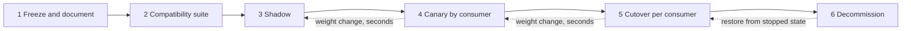
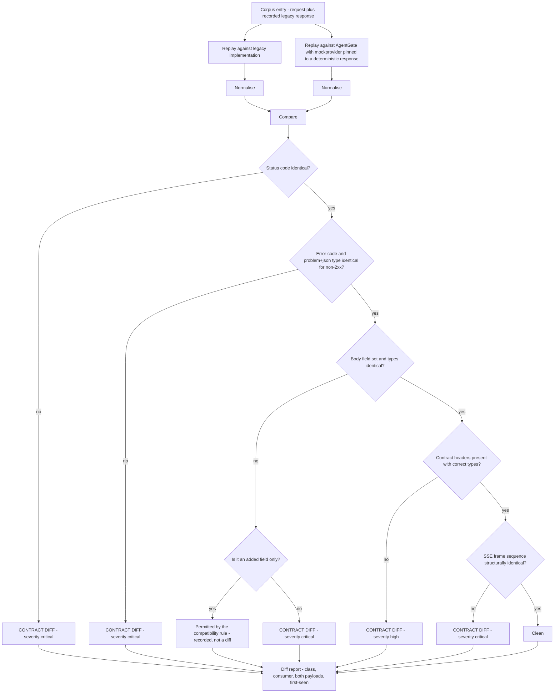
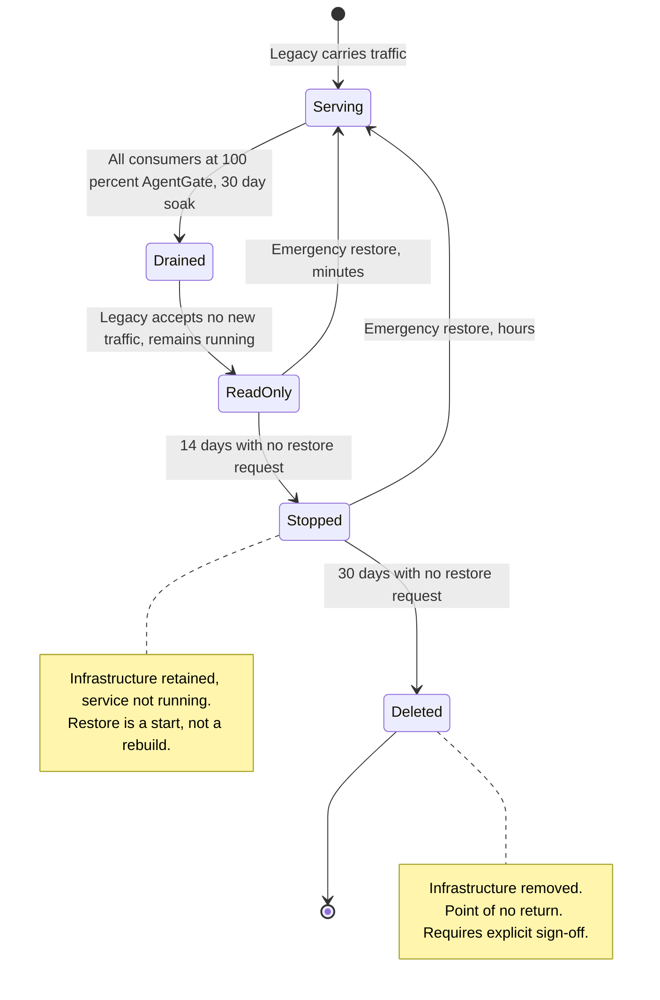

# 09 — Migration from the Legacy Gateway

**Audience:** platform engineers running the migration, consuming teams being migrated, the client's
change and release management function.

The client already runs a first-generation gateway that consumers integrate against. The migration is
a strangler with the contract held fixed. **No consumer changes code.** That is the entire strategy,
and every decision below follows from it.

---

## 1. Strategy

| Phase | Consumer impact | Rollback | Duration estimate |
|---|---|---|---|
| 1 Freeze and document | None | n/a | 2 weeks |
| 2 Compatibility suite | None | n/a | 3 weeks, then continuous |
| 3 Shadow | None | Turn off the mirror | 4 weeks minimum |
| 4 Canary | Bounded by weight | Weight change | 1–2 weeks per consumer, parallelisable |
| 5 Cutover | Full for that consumer | Weight change | Instant, then 2 weeks observation |
| 6 Decommission | None | Restore from stopped state for 30 days | 30 days after the last cutover |

**Two rules that are not negotiable:**

1. **Rollback at every stage is a weight change, not a deploy.** This is what makes automatic
   rollback safe enough to be automatic.
2. **Cutover is per consumer, never per endpoint.** A consumer that saw one behaviour on
   `/v1/chat/completions` and another on `/v1/embeddings` would be debugging a difference the
   platform created.

---

## 2. Phase 1 — Freeze and document

The existing contract is documented and published as `api/openapi/gateway.v1.yaml`. **AgentGate v1
*is* that contract.**

| Activity | Output |
|---|---|
| Capture the legacy contract from code, from traffic, and from consumer integrations | Draft OpenAPI document |
| Identify undocumented behaviours consumers depend on | A list of behaviours to either replicate or negotiate |
| Reconcile the draft against 30 days of production traffic | Every request and response shape seen in production is represented |
| Freeze | `gateway.v1.yaml` marked FROZEN, published, and made the compatibility target |

### 2.1 Undocumented behaviour

The hard part. A first-generation service accumulates behaviours nobody wrote down: a header that is
always present, an error body shape that differs from the documented one on a specific path, a field
that is null rather than absent.

| Discovery method | What it catches |
|---|---|
| Traffic capture over 30 days | Everything that actually occurs, weighted by frequency |
| Static reading of the legacy code | Paths that are rare but reachable |
| Consumer interviews | What consumers *believe* the contract is, which is sometimes different again |
| Consumer code review, where accessible | What consumers actually parse — the real contract |

**[Decision]** Where a legacy behaviour is clearly a defect, it is **still replicated in v1** unless
every consumer confirms they do not depend on it. Fixing a defect during a migration means the
migration is now also a behaviour change, and when something breaks nobody knows which change caused
it. Defects are fixed after cutover, as their own change, with their own rollback.

---

## 3. Phase 2 — Compatibility test corpus and diff harness

### 3.1 The corpus

A golden request/response corpus captured from production traffic.

| Property | Rule |
|---|---|
| Source | Production traffic capture, sanitised |
| Size target | **[Decision]** At least 10,000 request/response pairs, and at least 50 per consumer per endpoint |
| Coverage requirement | Every endpoint, every documented error code, every consumer, every request shape observed more than 10 times in 30 days |
| Sanitisation | Prompt and completion content replaced with structurally equivalent synthetic content. **Real content never enters the corpus** — it is a test fixture stored in a repository, not a content store |
| Structural preservation | Field presence, types, ordering, sizes, encodings and header sets are preserved exactly. Only the semantic content is replaced |
| Refresh | Monthly, so the corpus tracks how consumers actually use the service |
| Storage | Version-controlled alongside the code, so a corpus change is reviewable |

### 3.2 Corpus composition target

| Class | Share | Why |
|---|---|---|
| Unary chat completions, plain | 30% | The common case |
| Streaming chat completions | 25% | The most behaviourally complex path |
| Tool-calling requests | 10% | Different serialisation, cache bypass |
| Embeddings | 10% | Different endpoint shape |
| Documented error cases, all 15 codes | 15% | **The highest-value class** |
| Edge shapes — empty messages, maximum context, unusual parameter combinations, unicode, very long single messages | 10% | Where implementations diverge |

Error cases are over-represented relative to their production frequency because a consumer's retry
logic is written against error responses and an error-mapping difference breaks the consumer in a way
they cannot work around.

### 3.3 The diff harness

### 3.4 Normalisation — what is excluded from diffing

Diffing raw responses produces noise. These fields are normalised away before comparison:

| Excluded | Reason |
|---|---|
| `request_id`, `trace_id`, and their headers | Necessarily different |
| Timestamps, `created` fields | Necessarily different |
| Generated content — message content, embedding vectors | **Content equality is not the test. Contract equality is the test.** Two implementations calling different backends produce different completions |
| Token counts | Legitimately differ by backend and tokenizer |
| `x-agentgate-provider`, `-model`, `-attempts`, `-cost-usd` | Observability, not contract |
| `Date`, `Server`, connection headers | Infrastructure |

| Compared strictly | Reason |
|---|---|
| HTTP status | Contract |
| `code` and `type` on errors | Contract, and what retry logic branches on |
| Body field **presence** and **types** | Contract |
| Field ordering where the legacy contract guaranteed it | Some consumers parse positionally |
| `null` versus absent | A real and common source of consumer breakage |
| SSE frame **sequence** and event types | `[DONE]` present and last; `agentgate.usage` before `[DONE]`; heartbeat comments ignorable |
| Presence and types of contract headers | Contract |

### 3.5 Determinism

The corpus replay uses `mockprovider` on both sides, pinned to deterministic responses. Testing
against real providers would make every run produce different content and different token counts,
and the harness would drown in noise. Real-provider behaviour is validated in shadow, at production
volume, where it belongs.

### 3.6 Diff severity and handling

| Severity | Examples | Handling |
|---|---|---|
| **Critical** | Status code differs, error `code` differs, a field is missing or retyped, SSE sequence differs | Blocks all progress. Fix AgentGate |
| **High** | Contract header missing, `null` versus absent differs | Blocks canary for the affected consumer |
| **Medium** | Field ordering differs where ordering was not guaranteed | Assessed per consumer; documented if accepted |
| **Informational** | AgentGate added a field | Permitted by the compatibility rule. Recorded so it is known |

**[Decision]** An accepted diff requires a written rationale, a named consumer-impact assessment, and
sign-off from the affected consumer's team. "We think nobody depends on this" is not an assessment;
"we reviewed this consumer's parsing code and confirmed they ignore this field" is.

---

## 4. Phase 3 — Shadow

AgentGate receives mirrored production traffic. Responses are discarded. No consumer impact.

### 4.1 Mechanics

| Aspect | Decision |
|---|---|
| Mirror point | The front-door or routing layer, in front of the legacy gateway |
| Mirror mode | Asynchronous, fire-and-forget. **The mirror must never be able to add latency to or fail the live path** |
| Mirror rate | Ramp 1% → 10% → 50% → 100%, so shadow load is itself introduced gradually |
| Marking | `x-agentgate-shadow: true` on every mirrored request |
| Authentication | Shadow requests carry the real consumer's credentials. Testing with different credentials tests a different code path |
| Quota | **Enforced**, so shadow load is realistic and the quota path is exercised |
| Billing | Metered with `shadow: true`, **excluded from every cost sum**. Shadow traffic never appears on an invoice |
| Provider calls | **Real.** Shadow calls hit real providers and cost real money |
| Correlation | A correlation id links the live and shadow responses for diffing |
| Duration | **[Decision]** Minimum 4 weeks at 100% mirror before any consumer canaries, so a monthly-cycle workload is observed at least once |

### 4.2 Shadow costs real money

Shadow doubles model spend for the mirrored share. That is a real budget line and it must be funded
before shadow starts.

**[Decision]** The mirror rate ramp exists partly to manage this: 100% mirror for 4 weeks doubles the
model bill for a month. Where the client will not fund that, the alternative is a **sampled shadow**
— 25% mirror for 16 weeks — which observes the same behaviours at a quarter of the cost over four
times the duration. The trade is money against calendar, and it is the client's decision. It is
raised explicitly in Phase 1, not discovered when the bill arrives.

Shadow spend is reported separately from consumer spend in every cost export, so nobody mistakes it
for consumption growth.

### 4.3 Non-idempotent side effects

Shadowing is safe here because model inference has no side effects beyond cost and quota. If a future
endpoint acquires side effects — writing to a store, triggering a workflow — it cannot be shadowed
this way, and that constraint is recorded against any such proposal.

### 4.4 Exit criteria per consumer

| Criterion | Threshold |
|---|---|
| Contract diff rate | **Zero critical and zero high diffs** over the soak period |
| Volume observed | At least 4 weeks at the agreed mirror rate, including at least one month-end |
| Coverage | Every endpoint that consumer uses, and at least one instance of every error code that consumer's traffic produces |
| Latency | AgentGate p95 within the agreed band of legacy p95. **[Decision]** within 1.2× |
| Availability | AgentGate error rate on shadow traffic no worse than legacy over the soak |
| Telemetry | Shadow requests produce complete, correctly-attributed traces |

---

## 5. Phase 4 — Canary

### 5.1 Weights

Per consumer: **1% → 5% → 25% → 50% → 100%**, weighted at the DNS or front-door layer.

| Weight | Minimum soak | Rationale |
|---|---|---|
| 1% | 24 hours | Catches anything that shadow's discarded responses could not — client-side parsing, timeout behaviour, connection reuse |
| 5% | 24 hours | First point at which the consumer's own error rate is statistically meaningful |
| 25% | 48 hours | Includes a full daily cycle |
| 50% | 48 hours | Load-dependent behaviour appears here |
| 100% | 14 days observation before cutover is recorded | Weekly cycles |

**[Decision]** Soak times are minimums, not schedules. A weight is advanced by a human decision after
reviewing the criteria, never automatically. Rollback, by contrast, **is** automatic.

### 5.2 Automatic rollback triggers

Rollback is to the **previous weight**, not to zero, except where noted. Every trigger reduces the
weight within seconds and pages the platform on-call.

| Trigger | Threshold | Rolls back to | Reasoning |
|---|---|---|---|
| Consumer error rate increase | AgentGate error rate > 1.5× the legacy rate for the same consumer over 10 minutes | Previous weight | The consumer is experiencing failures they did not have |
| Any critical contract diff in live traffic | 1 occurrence | **Zero** | A contract diff reaching a consumer is the one thing this whole migration exists to prevent |
| Gateway availability burn | Fast-burn alert firing, from `07-slo-alerting.md` | Zero | Platform-wide problem |
| Latency regression | AgentGate p95 > 1.5× legacy p95 for the same consumer over 15 minutes | Previous weight | |
| TTFT regression, streaming consumers | AgentGate p95 TTFT > 1.5× legacy over 15 minutes | Previous weight | |
| `no_healthy_backend` rate | > 0.1% of that consumer's requests over 5 minutes | Previous weight | Pool configuration problem |
| Telemetry completeness | < 0.95 for that consumer over 15 minutes | Previous weight | We would be flying blind on the rest of the canary |
| Cost per request | > 1.3× the legacy cost per request for that consumer over 1 hour | Previous weight | Usually routing to a more expensive backend than intended |

**[Decision]** After any automatic rollback, weight advancement for that consumer is **blocked
pending human review**. An automatic system that rolls back and then automatically retries is a
system that flaps.

### 5.3 Consumer ordering

**[Decision]** Order consumers by blast radius, ascending, with one deliberate exception.

| Order | Consumer profile | Reasoning |
|---|---|---|
| 1 | Internal platform tooling, non-production-critical | Fastest feedback, lowest cost of being wrong |
| 2 | A **medium-complexity, engaged** consumer — streaming, tool calls, a team who will engage | The deliberate exception. A trivially simple first consumer proves almost nothing; this one surfaces real problems while the stakes are still low |
| 3 | Low-volume production consumers | |
| 4 | High-volume production consumers | |
| 5 | The most business-critical consumer | Last, with everything learned from the others |

---

## 6. Phase 5 — Per-consumer cutover checklist

Completed and signed off per consumer. Retained as the migration's evidence.

### 6.1 Pre-cutover

- [ ] Consumer identified and mapped to their traffic with certainty — client certificate, source
      range, API credential, or agent identity.
- [ ] Consumer's owning team identified, with a named contact and an on-call rota.
- [ ] Consumer's endpoints and request classes enumerated and present in the corpus.
- [ ] Corpus coverage: at least 50 pairs per endpoint for this consumer.
- [ ] Zero critical and zero high contract diffs in shadow for the full soak.
- [ ] Every error code this consumer's traffic produces has been observed identically in shadow.
- [ ] Streaming behaviour validated if the consumer streams: `[DONE]` present and last, heartbeat
      tolerated, `agentgate.usage` ordering correct.
- [ ] Consumer's client read timeout confirmed above 15 seconds.
- [ ] Consumer's client-side retry behaviour understood and documented.
- [ ] Quota and rate limits configured to match or exceed what the consumer receives on legacy.
- [ ] Consumer's agents registered, with owner, on-call, cost centre and data classification.
- [ ] Consumer's traffic maps to a cost centre.
- [ ] Latency and TTFT within the agreed band throughout the shadow soak.
- [ ] Telemetry completeness ≥ 0.98 for this consumer's shadow traffic.
- [ ] Rollback tested for this consumer — weight moved down and back up in a controlled window.
- [ ] Consumer's team notified with the schedule, the rollback plan, and a direct contact.
- [ ] Change record raised.

### 6.2 During canary

- [ ] Weight advanced only after the minimum soak and a human review of the criteria.
- [ ] Diff monitoring active on live traffic at every weight.
- [ ] Consumer's team has a channel to report anything anomalous, and knows to use it.
- [ ] Automatic rollback triggers armed and verified as armed.

### 6.3 Post-cutover

- [ ] 14 days at 100% with zero contract diffs.
- [ ] Consumer's error rate at or below the legacy baseline.
- [ ] Consumer's cost per request within the expected band.
- [ ] Consumer confirms no observed behaviour change.
- [ ] Legacy traffic for this consumer is zero and has been for 14 days.
- [ ] Cutover recorded with the date, the weights and dates of each step, and any incidents.

---

## 7. Communications plan

| Audience | What they get | When | Channel |
|---|---|---|---|
| Consuming team, before shadow | That shadow is starting, that there is no impact, that no action is required | 1 week before | Email plus their team channel |
| Consuming team, before canary | Schedule, weights, rollback plan, direct contact, what to watch for | 1 week before | Email plus a 30-minute walkthrough |
| Consuming team, at each weight step | Confirmation of the step and current status | Same day | Team channel |
| Consuming team, on rollback | What happened, that they are back on legacy, what happens next | **Within 30 minutes** | Direct contact plus channel |
| Consuming team, post-cutover | Confirmation, and where to raise anything | Same day | Email |
| All consumers | Migration status: who is where, what is next | Weekly | A status page, not an email |
| Client change management | Change records per consumer cutover | Per the client's process | ServiceNow |
| Platform leadership | Progress, risks, budget position including shadow cost | Fortnightly | Written status |
| Client security | Diff summary, any accepted diffs with rationale | At each phase gate | Written |

**[Decision]** Rollback communication is the most important item in this table and has the tightest
SLA. A consuming team that discovers a rollback from their own dashboards before hearing from the
platform will not trust the next step. 30 minutes is achievable because rollback is automatic and
alerting is already wired; the message can be templated in advance.

---

## 8. Phase 6 — Decommission

### 8.1 Criteria

All must hold:

| Criterion | Threshold |
|---|---|
| All consumers cut over | 100% of identified consumers at 100% AgentGate |
| Soak at 100% | **30 consecutive days** |
| Contract diffs | **Zero** over the 30 days |
| Legacy traffic | Zero for 30 days, verified from legacy access logs, not from routing configuration |
| Unattributed traffic | Zero. See §8.3 |
| Availability | AgentGate has met its availability SLO for a full 28-day window |
| Consumer sign-off | Every consuming team has confirmed no observed behaviour change |
| Runbooks | Legacy runbooks retired or ported |
| Client change record | Decommission change approved |

### 8.2 Staged decommission

The staging is what makes the decommission decision reversible for 44 days after the last consumer
cuts over. The cost of retaining stopped infrastructure for six weeks is trivial next to the cost of
needing it back and not having it.

### 8.3 Unattributed traffic

**[Decision]** Traffic that cannot be attributed to a known consumer **stays on legacy** and blocks
decommission until identified.

Migrating traffic whose owner is unknown means having nobody to call when it breaks and nobody to
sign off that it works. If, after investigation, traffic genuinely has no owner, the correct action
is to **turn it off** under a change record and see who complains — not to migrate it silently. That
is a deliberate, recorded decision with a rollback, and it is a better outcome than carrying unowned
traffic into a new platform.

---

## 9. Risks and mitigations

| # | Risk | Likelihood | Impact | Mitigation | Residual |
|---|---|---|---|---|---|
| 1 | An undocumented legacy behaviour is discovered only after cutover | Medium | High | 30-day traffic capture in Phase 1; 4-week shadow at production volume; consumer code review where accessible; staged decommission allows restore | A behaviour occurring less than monthly could still be missed. The 30-day post-cutover soak is the last net |
| 2 | Shadow cost is not funded and shadow is cut short | Medium | High | Cost raised explicitly in Phase 1 with the sampled-shadow alternative priced; shadow spend reported separately | If shadow is shortened, monthly-cycle behaviours are not observed. Recorded as an accepted risk if it happens |
| 3 | A consumer cannot be identified | Medium | Medium | Identification is a Phase 1 activity, not a Phase 5 discovery; unattributed traffic blocks decommission | Decommission delayed. This is the intended outcome |
| 4 | Error-mapping difference reaches a consumer | Low | High | Error cases over-represented in the corpus at 15%; error `code` and status compared strictly; a critical diff in live traffic rolls back to zero | Consumer retry logic misbehaves briefly. Rollback is seconds |
| 5 | Streaming behaviour differs under load in a way replay cannot catch | Medium | High | Shadow at production volume with real providers; TTFT trigger on canary; streaming consumers canaried with extra care | Concurrency-dependent behaviour is genuinely hard to catch. Accepted, mitigated by gradual weights |
| 6 | Legacy and AgentGate both serve one consumer during a routing error | Low | Medium | Cutover per consumer, never per endpoint; routing configuration reviewed and tested per consumer; automated assertion that a consumer's traffic goes to exactly one implementation | Brief inconsistency. Detected by the assertion within one scrape interval |
| 7 | AgentGate's own dependencies fail during canary | Medium | Medium | Documented degradation for every dependency, in `01-architecture.md` §9; canary weight reduction is a mitigation available to on-call | Consumers on canary see a reduced-quality service for the duration |
| 8 | Migration consumes the error budget, blocking its own progress | Medium | Medium | Error-budget policy pauses canary advancement in the Constrained state, which is the correct behaviour | Migration takes longer. Accepted |
| 9 | Team fatigue from a long migration | Medium | Medium | Consumers parallelised where their profiles are independent; automation of diffing and weight steps; written handover protocol | Real. Sequencing consumers by profile allows some parallelism |
| 10 | The client's change process becomes the bottleneck | High | Medium | One umbrella change with per-consumer child records agreed in Phase 1; the manual fallback for promotion applies to migration change records too | Calendar risk. Raised early because in this environment the review is the critical path |
| 11 | A consumer's client library behaves differently against AgentGate for a reason unrelated to the contract — connection reuse, HTTP/2 negotiation, header casing | Medium | Medium | 1% canary specifically exists to catch this, because shadow discards responses and never exercises the consumer's client | Caught at 1%, affecting 1% of that consumer's traffic |
| 12 | Decommission proceeds and legacy is needed | Low | High | Staged decommission with 44 days of restorability; explicit sign-off before deletion | After deletion, rebuild. Which is why deletion is a separate, signed decision |
