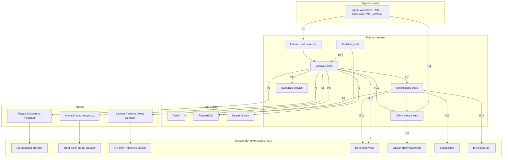
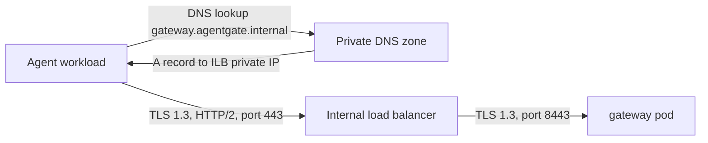
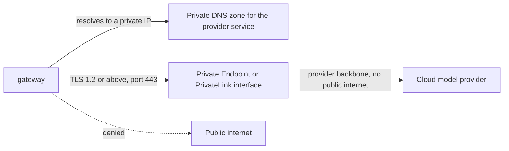
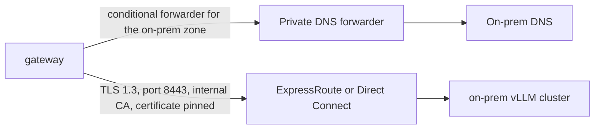
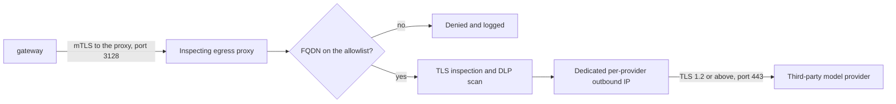
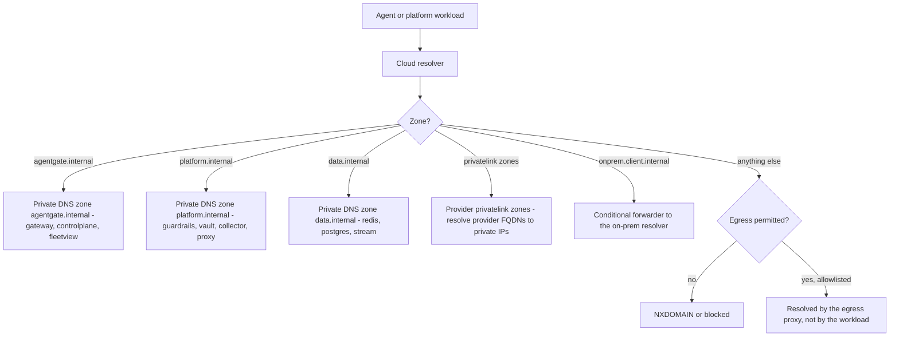
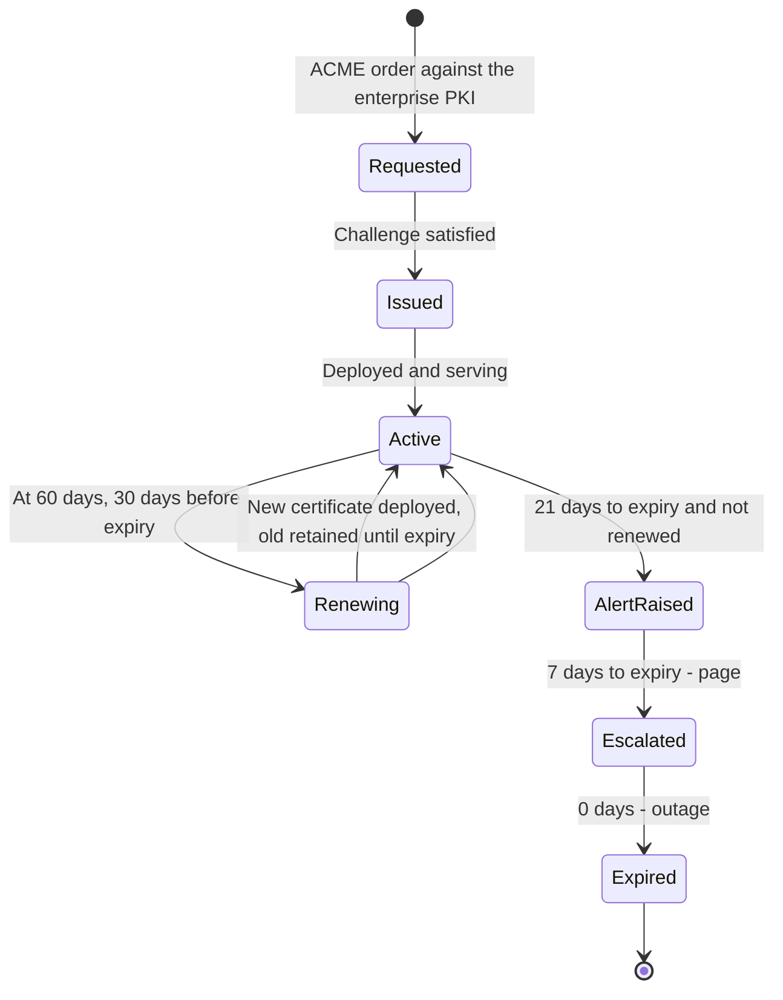

# 10 — Network, DNS, TLS and Security

**Audience:** the client's network, security and compliance review functions; platform engineers
producing the review artefacts.

In this environment the security review, not the code, is the critical path. Every path in this
document ships with its diagram, its exact FQDNs and ports, the data classification crossing it, and
the review artefact it requires — so a review can start without a discovery exercise first.

---

## 1. Network paths — overview

| ID | Path | Review artefact required |
|---|---|---|
| P1 | Agent → Gateway | Standard internal |
| P2 | Gateway → cloud model provider | Firewall + data-flow review |
| P3 | Gateway → on-prem inference | Network + crypto review |
| P4 | Gateway → third-party model provider | Third-party risk + DLP review |
| P5 | Gateway → guardrails service | Standard internal, plus data-flow if the callout target is external |
| P6 | Gateway → Redis | Standard internal |
| P7 | Gateway → control plane | Standard internal |
| P8 | Control plane / fleetview → PostgreSQL | Standard internal |
| P9 | Gateway → usage stream | Standard internal |
| P10 | Gateway / control plane → vault | Secrets review |
| P11 | Everything → OTel collector | Standard internal |
| P12 | Collector → observability backend | Data-residency review |
| P13 | Control plane → ServiceNow | Standard internal integration |
| P14 | Control plane → enterprise IdP | Identity review |
| P15 | fleetview → gateway `/metrics` | Standard internal |

---

## 2. Path detail

### 2.1 P1 — Agent to Gateway

| Property | Value |
|---|---|
| FQDN | `gateway.agentgate.internal` |
| Port | 443 inbound to the ILB; 8443 ILB to pod |
| Protocol | HTTP/2 over TLS 1.3 |
| mTLS | Optional, enabled per tenant where the client requires it |
| Authentication | Bearer token, always. mTLS is defence in depth, never a substitute |
| Source | Agent subnets only; NSG or security group denies all other sources |
| Data classification crossing | Up to **restricted** — prompts may contain the client's most sensitive data |
| Review | Standard internal |
| Idle timeout | ILB idle timeout **must exceed 60 s** or long generations are dropped. Recommended 300 s |

**The ILB idle timeout is the single most common cause of unexplained stream truncation.** The 15 s
SSE heartbeat exists so a correctly configured intermediary never idles out; an ILB configured with a
30 s idle timeout and no keepalive awareness will still cut long generations.

### 2.2 P2 — Gateway to cloud model provider

| Property | Value |
|---|---|
| FQDN, Azure | `<resource>.openai.azure.com`, resolved by the private DNS zone `privatelink.openai.azure.com` |
| FQDN, AWS | `bedrock-runtime.<region>.amazonaws.com`, resolved through a PrivateLink interface endpoint |
| Port | 443 |
| Protocol | HTTPS, TLS 1.2 minimum, TLS 1.3 preferred |
| Public egress | **None.** The gateway subnet has no route to the internet for this traffic |
| Authentication | Provider-managed identity. **No API keys in configuration** |
| Data classification crossing | Up to **restricted**, subject to the backend's classification label |
| Review | **Firewall + data-flow review** |
| Residency | Backend classification and residency labels are a routing filter at stage 10 `route`, so a restricted request cannot be routed to a backend in the wrong region |

### 2.3 P3 — Gateway to on-prem inference

| Property | Value |
|---|---|
| FQDN | `inference.onprem.client.internal` |
| Port | 8443 |
| Protocol | HTTPS, TLS 1.3 |
| Certificates | Issued by the client's **internal CA**. The gateway pins the internal CA, not a public trust store |
| Transport | ExpressRoute or Direct Connect. Never the public internet |
| DNS | Conditional forwarder from the cloud private zone to the on-prem resolver |
| Data classification crossing | Up to **restricted**. This path exists precisely so restricted workloads have a compliant backend |
| Review | **Network + crypto review** |
| Capacity note | This is the failover tier. It must be sized for provider-outage load, not steady-state load |

**[Decision]** Certificate pinning is to the internal CA, not to a leaf certificate. Leaf pinning
breaks every 90-day rotation and turns a routine renewal into an outage. CA pinning gives the
security property — only certificates the client issued are trusted on this path — without the
operational fragility.

### 2.4 P4 — Gateway to third-party model provider

| Property | Value |
|---|---|
| Proxy endpoint | `egress-proxy.platform.internal:3128` |
| Gateway to proxy | mTLS, client certificate from the enterprise PKI |
| Allowlist | Explicit FQDN allowlist per provider. Wildcards are not permitted |
| Outbound IP | Dedicated per provider, so the provider can allowlist the client in return |
| TLS inspection | Performed at the proxy. The gateway must trust the proxy's inspection CA on this path only |
| Data classification crossing | **Confidential maximum.** Restricted data is not routed to third-party providers — enforced by the backend classification label at stage 10, not by convention |
| Review | **Third-party risk + DLP review** |

**The classification limit on this path is enforced in code, not policy.** A backend serving a
third-party provider carries a classification label of `confidential`, and stage 10 `route` filters
by compatibility. A restricted request will not select it, and if no compatible backend survives the
filter the request fails with `no_healthy_backend` rather than being routed somewhere non-compliant.

### 2.5 P5 to P9 — Internal platform paths

| ID | Path | FQDN and port | Protocol | Classification | Notes |
|---|---|---|---|---|---|
| P5 | Gateway → guardrails | `guardrails.platform.internal:8443` | HTTPS, TLS 1.3, mTLS | **Restricted** — the guardrail sees full prompt and completion content | If the callout target is an external content-safety service, this becomes a data-flow review path, not a standard internal one |
| P6 | Gateway → Redis | `redis.data.internal:6380` | RESP over TLS | Confidential — cached responses and quota state | TLS mandatory. `requirepass` plus ACLs. No public endpoint |
| P7 | Gateway → control plane | `controlplane.agentgate.internal:8443` | HTTPS, TLS 1.3 | Internal — claims and registration metadata | JWKS is publicly readable **within the platform network only** |
| P8 | Control plane / fleetview → PostgreSQL | `pg.data.internal:5432` | PostgreSQL over TLS, `verify-full` | Confidential — registration, approvals, rollups | Workload identity authentication, no passwords |
| P9 | Gateway → usage stream | `eventhub.data.internal:9093` or Kinesis endpoint | Kafka over TLS or AWS SDK over PrivateLink | Confidential — usage metadata, no content | Workload identity |

### 2.6 P10 — Gateway and control plane to vault

| Property | Value |
|---|---|
| FQDN | `vault.platform.internal`, resolved through a Private Endpoint |
| Port | 443 |
| Authentication | **Workload identity. No static credentials anywhere on this path** |
| Data classification crossing | **Restricted** — client secrets and provider credentials |
| Review | **Secrets review** |
| Access scope | The gateway reads provider credentials only. The control plane reads and writes agent client secrets. Neither can read the other's paths |

### 2.7 P11 and P12 — Telemetry

| ID | Path | Endpoint | Protocol | Classification |
|---|---|---|---|---|
| P11 | Everything → collector | `otel-collector.platform.internal:4317` gRPC, `:4318` HTTP | OTLP over TLS | Confidential normally; **restricted** when content capture is enabled |
| P12 | Collector → observability backend | Per backend | OTLP or vendor protocol over TLS | Confidential; **restricted never leaves the self-hosted store** |

| Backend | Connectivity | Content permitted |
|---|---|---|
| Langfuse or self-hosted OTLP store | In-network, no egress | **Yes** — this is the only destination content may reach |
| Prometheus or managed Prometheus | Private Endpoint | No. Metrics only |
| Loki or Log Analytics | Private Endpoint | No. Log redaction enforced at the collector |
| Azure Monitor or CloudWatch and X-Ray | Private Endpoint where available, otherwise egress proxy with FQDN allowlist | **No. Enforced by not configuring the content exporter at all in the production collector** |
| Cost warehouse | Private Endpoint | No. Usage metadata only |

Review: **data-residency review**, because P12 is where telemetry can leave a boundary.

### 2.8 P13 to P15 — Integrations

| ID | Path | Endpoint | Notes |
|---|---|---|---|
| P13 | Control plane → ServiceNow | `<instance>.service-now.com:443` via egress proxy, FQDN allowlisted | Change payloads. Contains agent identity, version, gate results. **No prompt content, ever** |
| P14 | Control plane → enterprise IdP | Per the client's IdP, via Private Endpoint or proxy | Platform-issuer JWKS fetch for token exchange, plus human authentication for approvals |
| P15 | fleetview → gateway `/metrics` | `gateway.agentgate.internal:9090/metrics` | Network-restricted to the platform scrape range. **Never reachable from agent subnets** |

---

## 3. DNS strategy

| Zone | Contents | Linked to |
|---|---|---|
| `agentgate.internal` | `gateway`, `controlplane`, `fleetview` | Agent VNets and the platform VNet |
| `platform.internal` | `guardrails`, `vault`, `otel-collector`, `egress-proxy` | Platform VNet only |
| `data.internal` | `redis`, `pg`, `eventhub` | Platform VNet only |
| `privatelink.openai.azure.com`, `privatelink.*` | Provider Private Endpoint records | Platform VNet only |
| `onprem.client.internal` | Conditional forwarder to the on-prem resolver | Platform VNet only |

### 3.1 Split-horizon

`gateway.agentgate.internal` resolves **only** inside the client's networks. There is no public
record. A resolution attempt from outside returns NXDOMAIN, and there is no public route regardless.

**[Decision]** The same FQDN is used in every environment, with the environment distinguished by
which VNet the workload sits in and which private zone that VNet is linked to. `dev`, `staging` and
`prod` each have their own zone linkage.

This is deliberate: it means an agent's configuration is **identical across environments**, so a
promotion cannot fail because someone forgot to change a URL. The token's `env` claim, not the
hostname, determines which environment the agent is operating in — and the token is verified, whereas
a hostname is a string in a config file.

The cost is that a misconfigured VNet linkage sends traffic to the wrong environment's gateway.
Mitigated by: the token's `env` claim is checked against the gateway's own configured environment at
stage 3 `authz`, and a mismatch is refused. **[Decision]** this cross-check is mandatory and is what
makes shared hostnames safe.

### 3.2 Forwarders and resolution order

| Workload location | Resolver | Forwarding |
|---|---|---|
| Cloud, any subnet | Cloud-provided resolver | Private zones by linkage; `onprem.client.internal` conditionally forwarded to the on-prem resolver; everything else blocked or proxied |
| On-prem inference cluster | On-prem resolver | Cloud private zones conditionally forwarded to the cloud resolver inbound endpoint |

Both directions are needed: the gateway resolves on-prem names, and on-prem services resolve the
collector's name to send telemetry.

---

## 4. TLS and certificate lifecycle

### 4.1 Standards

| Path class | Minimum TLS | Cipher policy | Client authentication |
|---|---|---|---|
| Agent → Gateway | 1.3 | Enterprise standard suite | Bearer token; mTLS optional |
| Platform internal | 1.3 | Enterprise standard suite | mTLS where both ends are ours |
| Gateway → cloud provider | 1.2 minimum, 1.3 preferred | Provider-constrained | Managed identity |
| Gateway → on-prem | 1.3 | Enterprise standard suite | mTLS, internal CA pinned |
| Gateway → egress proxy | 1.3 | Enterprise standard suite | mTLS |
| Proxy → third party | 1.2 minimum | Provider-constrained | None; proxy identity is the outbound IP |

### 4.2 Lifecycle

| Property | Value |
|---|---|
| Issuer | Enterprise PKI |
| Lifetime | 90 days |
| Automation | ACME |
| Renewal trigger | 60 days, giving 30 days of margin |
| Alert | Ticket at 21 days remaining, **page at 7 days** |
| Rotation impact | Zero downtime. New certificate deployed alongside; connections drain naturally |
| Pinning | CA-level only, never leaf. See §2.3 |
| Inventory | Every certificate is exported as `agentgate_certificate_expiry_seconds` so expiry is a metric, not a calendar reminder |

**[Decision]** A certificate reaching 7 days is a page, not a ticket, because certificate expiry is a
total outage with a known date. There is no excuse for being surprised by it, and the paging
threshold reflects that it is the last chance to act.

---

## 5. Data classification by boundary

| Boundary | Highest classification permitted | Enforced by | Failure mode if wrong |
|---|---|---|---|
| Agent → Gateway | Restricted | The agent's own classification, declared at registration | Data reaches the gateway that the agent should not be handling. Out of AgentGate's scope; the agent's own controls apply |
| Gateway → guardrails | Restricted | Deployment. Guardrails must sit in the same trust zone as the gateway | An external guardrail callout becomes a data-flow review path |
| Gateway → cloud provider via Private Endpoint | Restricted, per the backend's label | Stage 10 `route` classification filter | Would be a compliance breach. This is why the filter is in the routing path, not in configuration review |
| Gateway → on-prem | Restricted | Stage 10 filter | As above |
| Gateway → third party via proxy | **Confidential** | Stage 10 filter plus the backend's classification label | Restricted data at a third party. The highest-consequence failure in this document |
| Gateway → Redis | Confidential — cached responses | Never shared across tenants; TLS; short TTL | Cross-tenant cache leakage. Prevented by tenant being part of the cache key |
| Gateway → usage stream | Confidential metadata only. **No content** | Schema. `UsageRecord` has no content field | — |
| Collector → self-hosted store | Restricted, when content capture is on | Content pipeline separation | — |
| Collector → managed APM | **Confidential metadata only** | The content exporter is not configured in the production collector | Content in a managed backend. Prevented by three independent controls, see `06-telemetry-schema.md` §7.2 |
| Control plane → ServiceNow | Internal metadata only | Schema. Change payloads contain agent identity and gate results, never content | — |

---

## 6. Threat model

STRIDE, for the two components that hold the trust: the gateway and the control plane.

### 6.1 Gateway

| # | STRIDE | Threat | Control | Residual risk |
|---|---|---|---|---|
| G1 | Spoofing | An unregistered workload calls the gateway | Bearer token required on every `/v1/*`; signature, `iss`, `aud`, `exp`, `nbf` verified against JWKS at stage 2 | Requires a valid token. Reduces to token theft, G2 |
| G2 | Spoofing | A stolen access token is replayed | 15-minute TTL; `jti` replay set in Redis; audience bound to the gateway; network reachability restricted to agent subnets | 15-minute window from a position that can already reach the gateway. Weakened during a Redis outage, see `05-identity.md` §5 |
| G3 | Spoofing | An agent claims a different team or cost centre | All ownership is derived from the verified token, never from the body or headers; the collector re-stamps and flags disagreement | None at the token layer |
| G4 | Tampering | Request body modified in transit | TLS 1.3 on every path; optional mTLS | Requires TLS compromise |
| G5 | Tampering | Cache poisoning — an attacker plants a response another tenant receives | Cache key includes tenant; entries never shared across tenants; key is SHA-256 over normalised request fields | A tenant can poison its **own** cache. Bounded by `x-agentgate-cache: refresh` and TTL |
| G6 | Tampering | Semantic cache returns a materially different answer | Semantic cache off by default; per-pool enablement requires a classification allowance; 0.97 threshold; similarity recorded on the span | Real and acknowledged. This is the reason for ADR 0009 |
| G7 | Repudiation | An agent denies making a request | Immutable `UsageRecord` per request with `request_id`, `trace_id` and token-derived identity; unsampled | None material |
| G8 | Information disclosure | Prompt content reaches a store not provisioned for it | Content off by default in prod; separate content pipeline; three independent enforcement controls | The residual is a simultaneous failure of all three, which is why there are three |
| G9 | Information disclosure | Error `detail` leaks internal structure or another tenant's data | `detail` is generated from a fixed template set; no upstream error body is echoed verbatim | Requires a template review at each new error path |
| G10 | Information disclosure | Restricted data routed to a third-party provider | Backend classification labels; stage 10 classification filter; failing with `no_healthy_backend` rather than routing non-compliantly | Requires a mislabelled backend. Backend configuration is a reviewed change |
| G11 | Information disclosure | `/metrics` exposes tenant data to an agent | Network-restricted to the platform scrape range, unreachable from agent subnets; no high-cardinality identifiers as labels | None |
| G12 | Denial of service | One agent exhausts capacity | Per-agent RPM and TPM buckets; monthly budget; load shedding sheds `batch` before `interactive`; per-backend concurrency caps | A very large `max_tokens` reserves heavily. Bounded by the agent's own quota |
| G13 | Denial of service | Retry storm during a provider degradation | Per-request retry budget at 25% of deadline; **fleet-wide retry cap at 10% of volume**; circuit breakers | Fleet cap converts a storm into fast failure, which is the intent |
| G14 | Denial of service | Very large request bodies | Admission size cap at stage 4 before any expensive work | None material |
| G15 | Denial of service | Slow-read client holding streams open | Write deadlines per frame; in-flight ceiling; heartbeat proves liveness both ways | Bounded by the concurrency ceiling |
| G16 | Elevation of privilege | Agent uses a pool it is not entitled to | `model_pools` in the verified token; `x-agentgate-pool` validated against it at stage 3 | None |
| G17 | Elevation of privilege | Unpromoted version reaches production | Stage 3 checks the registry, not the claim | Up to 30 s of registry cache staleness after a demotion. Accepted, documented |
| G18 | Elevation of privilege | Guardrail bypassed to reach restricted content | `fail_closed` default for `data_classification=restricted`; bypasses counted and alerted at a zero threshold | A `fail_open` pool misconfigured for restricted data. Caught at promotion review |

### 6.2 Control plane

| # | STRIDE | Threat | Control | Residual risk |
|---|---|---|---|---|
| C1 | Spoofing | Forged platform token yields an agent token | Explicit issuer allowlist, no wildcards; signature verified against the platform issuer's JWKS; subject-to-agent mapping bound at registration | Compromise of an allowlisted issuer. Issuer additions are reviewed changes |
| C2 | Spoofing | Stolen client secret | Vault-only storage; 90-day rotation; emergency rotation runbook; `client-credentials` cannot satisfy `identity_attested` so cannot reach prod | Valid until detected. The primary reason federated identity is preferred |
| C3 | Tampering | Registration record modified to change ownership or quota | Registration is a reviewed manifest in the agent's repository; changes are audited with actor and timestamp | An attacker with repository write and CI access. Mitigated by the client's own SCM controls |
| C4 | Tampering | Gate snapshot altered after evaluation | Snapshots are immutable and referenced by id from approvals and audit records | Requires database write access, which is the C7 case |
| C5 | Repudiation | An approver denies approving | Approvals record actor, role, timestamp and `snapshot_id`; retained 7 years | Collusion between two approvers. Addressed by audit, not by the system |
| C6 | Repudiation | Ambiguity about why a version was promoted | The snapshot records every gate's result **and its input values**, plus `evaluator_version` | None material |
| C7 | Information disclosure | Control-plane database exposes registration data | TLS `verify-full`; workload identity; private subnet; no public endpoint | Standard database exposure risk |
| C8 | Information disclosure | JWKS endpoint reveals more than public keys | Serves public key material only, and is reachable only within the platform network | None |
| C9 | Denial of service | Token-exchange flood | Rate limiting per subject; the gateway's JWKS cache means gateway traffic does not depend on the control plane per request | Control-plane outage does not stop model traffic, by design |
| C10 | Elevation of privilege | Self-approval of a promotion | Structural check: requester excluded, approvers must be distinct and from different roles; rejected attempts recorded | Collusion |
| C11 | Elevation of privilege | Emergency revert used to install an unreviewed version | Emergency revert is restricted to **previously-active** versions only; recorded and reviewed within 24 h | An older version with a known problem could be reinstalled. Reviewed within 24 h |
| C12 | Elevation of privilege | Control-plane compromise mints arbitrary agent tokens | Signing key in the vault, accessed by workload identity; tightest network restrictions of any component; every token exchange audited | **This is the trust root.** Compromise is total. Inherent to the design; mitigated by concentrating controls here |

### 6.3 The two most consequential residual risks

1. **Control-plane compromise (C12).** The control plane signs the tokens that the gateway trusts.
   Compromise means arbitrary agent identity. This cannot be designed away; it can only be
   concentrated and defended. It is why the control plane has the tightest network restrictions, why
   its signing key lives in the vault, and why every token exchange is audited.
2. **Restricted data reaching a third-party provider (G10).** The consequence is regulatory, not
   operational. It is defended in the routing path rather than in configuration review, so that a
   mistake produces `no_healthy_backend` rather than a compliance breach.

---

## 7. Compliance controls mapped to implementation

The column that matters is the third one: what the code actually does. A control that exists only as
a policy statement is recorded as such.

| Control area | Requirement | What the code does | Evidence |
|---|---|---|---|
| Access control | Only authorised workloads may invoke models | Stage 2 `authn` verifies signature, issuer, audience, expiry and replay. Stage 3 `authz` checks promotion state, pool entitlement and scope | `controlplane.token_exchange` spans; `agentgate.gateway.requests` by `code` |
| Least privilege | Agents hold only the entitlements they need | `model_pools` and `scopes` resolved from the registration record at exchange, never self-asserted | Registration records; token claims |
| Segregation of duties | No individual may unilaterally place code in production | Two-party approval with the requester structurally excluded and the approvers required to be distinct and from different roles | Approval records with actor, role, timestamp, `snapshot_id` |
| Change management | Production changes are recorded and approved | Gate snapshot plus ServiceNow change reference, or the documented manual fallback with identical evidence | Gate snapshots, change references, retained 7 years |
| Audit trail | Production actions are reconstructable | Immutable snapshots, approvals, usage records; audit-class logs retained 400 days; promotion evidence 7 years | Log and record stores |
| Data classification | Data does not cross a boundary it is not permitted to cross | Backend classification and residency labels are a **filter in stage 10 `route`**; incompatible routing fails with `no_healthy_backend` | Routing configuration; `agentgate.backend` on spans |
| Data minimisation | Content is not retained beyond need | Content capture off by default in prod; separate pipeline; 7-day retention when enabled | `agentgate_content_capture_mode` gauge; pipeline configuration |
| Content safety | Model input and output are screened | Stage 7 and stage 13 guardrails; `fail_closed` default for restricted; output scanning windowed so a violation never reaches the caller | `agentgate.guardrail.decisions`; `gateway.guardrail` spans |
| Encryption in transit | All traffic encrypted | TLS 1.3 on internal paths, 1.2 minimum externally; no plaintext path exists in configuration | Deployment configuration; TLS scanning |
| Encryption at rest | Stored data encrypted | Provider-managed encryption on PostgreSQL, Redis, the usage stream and object storage | Infrastructure configuration |
| Key management | Keys are managed, rotated and not embedded | Signing key in the vault; provider credentials via managed identity; client secrets vault-only with 90-day rotation | Vault audit log; `agentgate_client_secret_age_days` |
| Certificate management | Certificates do not expire unexpectedly | ACME automation, 90-day lifetime, renewal at 60 days, ticket at 21 days, page at 7 | `agentgate_certificate_expiry_seconds` |
| Availability | The service meets its commitment | Multi-zone HA, circuit breakers, failover tiers, load shedding, documented degradation per dependency | Availability SLI, error-budget reporting |
| Capacity management | Consumption is bounded and attributed | Reserve/settle token quota, RPM limits, monthly budgets, per-backend concurrency caps | `agentgate.ratelimit.decisions`; usage records |
| Cost control | Spend is attributed and monitored | `cost_center` is a required claim for prod; immutable usage records; EWMA anomaly detection plus hard daily ceilings | Chargeback exports; cost alerts |
| Monitoring | The service is observable and alerted | Full OTel pipeline; per-stage timing; burn-rate alerting; every alert has a runbook | Alert catalogue in `07-slo-alerting.md` |
| Telemetry integrity | Monitoring can be trusted | Completeness, orphan, unattributed and clock-skew metrics computed every 60 s, and a **hard promotion-gate input** | `agentgate.telemetry.completeness`; gate snapshots |
| Third-party risk | Third-party data flows are controlled | Egress proxy with FQDN allowlist, mTLS, dedicated outbound IP, DLP inspection, classification capped at confidential **in the routing filter** | Proxy configuration and logs; backend labels |
| Incident management | Incidents are handled and learned from | Runbook per alert; documented incident flow; blameless postmortem within 5 working days; error-budget policy | Incident records; postmortems |
| Business continuity | The service survives component loss | Documented failure domains and degradation; multi-zone; PITR on PostgreSQL | `01-architecture.md` §9 |

### 7.1 Controls that are policy, not code

Stated honestly, because a reviewer will ask:

| Control | Status |
|---|---|
| Approver collusion prevention | Policy and audit only. The system prevents self-approval; it cannot prevent two people agreeing to approve carelessly |
| Agent-side data access control | **Not implemented by AgentGate.** An agent's access to data is the agent's own concern; see the delegation discussion in `05-identity.md` §10.3 |
| Per-user authorisation of agent runs | **Not implemented.** No on-behalf-of flow in v1. Documented as a gap with reasoning |
| Prompt-injection resistance | Partial. Guardrails screen for categories; they do not solve prompt injection, and nothing in this platform claims to |
| Model output correctness | Out of scope. The platform controls who calls what, at what cost, with what screening. It does not evaluate whether the answer is right |
