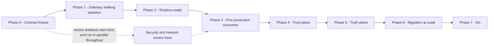

# 11 — Delivery Plan

**Audience:** the delivery team, the client's programme function, platform leadership.

The constraints that shape this plan:

1. The gateway must carry production traffic **early**.
2. The published interface **cannot change** once consumers depend on it.
3. The team is **small and senior**, distributed, with limited daily overlap.
4. Several architectural decisions are **still open** and must not block phase 0.
5. In this environment the **security review is the critical path**, not the code.

The plan is therefore ordered by what freezes first, not by what is most interesting to build.

---

## 1. Shape of the plan



The security review track starts in Phase 0 and runs in parallel with everything. It is drawn
separately because it is not a phase — it is a dependency that gates Phase 3 and cannot be
compressed by working harder on the code.

---

## 2. Phase 0 — Contract freeze

| | |
|---|---|
| **Outcome** | `api/openapi/gateway.v1.yaml` published and FROZEN. `04-gateway-contract.md` published to the external engineering team. The compatibility guarantee is stated and committed to. |
| **Duration** | 2–3 weeks |

**Delivered:**

- Legacy contract captured from 30 days of production traffic, from static reading of the legacy
  code, and from consumer interviews.
- `gateway.v1.yaml` covering all seven endpoints, every request and response field, all 15 error
  codes, and the streaming frame grammar.
- The compatibility rule written down and agreed: fields may be added; nothing removed, retyped or
  repurposed; a breaking change means `/v2` side by side.
- Undocumented legacy behaviours enumerated, each marked *replicate* or *negotiate*.
- The first network path diagrams and data-flow descriptions submitted to security review.

**Deliberately deferred:**

| Deferred | Until |
|---|---|
| Any implementation beyond a contract-conformance skeleton | Phase 1 |
| Provider adapters beyond one | Phase 1 |
| Identity, quota, guardrails, cache, telemetry | Phases 1–5 |
| `controlplane.v1.yaml` | Phase 4 — it is not consumer-facing and is not frozen |

**Exit criteria:**

- [ ] `gateway.v1.yaml` reviewed and signed off by the external engineering team.
- [ ] Every error code has a documented cause and an example.
- [ ] Streaming frame grammar specified including heartbeat, `agentgate.usage`, `agentgate.failover`,
      `error` and `[DONE]` ordering.
- [ ] The first-content-byte failover rule is written down and understood by the consuming teams.
- [ ] Security review track opened with the first artefacts submitted.
- [ ] Shadow cost estimated and the funding decision taken. See `09-migration.md` §4.2.

**Risks:**

| Risk | Mitigation |
|---|---|
| The frozen contract is wrong in a way discovered later | The corpus in Phase 2 is the check. A defect found before any consumer depends on `/v1` is fixable; after is `/v2` |
| Consumers assume the freeze means AgentGate is nearly done | Publish the compatibility guarantee **and** the delivery plan together |
| Freezing before understanding legacy edge cases | 30-day capture, not a week; consumer code review where accessible |

---

## 3. Phase 1 — Gateway walking skeleton

| | |
|---|---|
| **Outcome** | A gateway that implements the full 16-stage policy chain structurally, with real behaviour in the stages that cannot be added later without changing the contract, and honest no-ops elsewhere. |
| **Duration** | 4–5 weeks |

**Why a walking skeleton rather than vertical slices.** The stage order and the timing attributes are
part of the operational contract. Building the chain end to end first — even with no-op stages —
means every later feature drops into a slot that already exists, is already timed, and already
appears on the span. Building stage by stage would mean the trace shape changes with every release,
which invalidates dashboards and runbooks repeatedly.

**Delivered with real behaviour:**

| Stage | Why it cannot wait |
|---|---|
| 1 `trace.start` / 16 `trace.end` | Span shape is part of the operational contract |
| 4 `admission` | Body validation and error mapping **are** the contract |
| 9 `transform.request` / 12 `transform.response` | Provider abstraction; the whole point of the logical model |
| 10 `route` | Pool and backend selection including the classification filter |
| 11 `invoke` | Retry, failover, circuit breaker, deadline propagation. Streaming semantics including the first-content-byte rule |
| 15 `meter` | Usage record shape must be right before records accumulate |

**Delivered as instrumented no-ops:**

| Stage | Behaviour in Phase 1 |
|---|---|
| 2 `authn` | Validates a static token; the JWKS path is stubbed |
| 3 `authz` | Permits everything; records what it would have decided |
| 5 `ratelimit.requests` / 6 `quota.tokens` | In-memory buckets with the production semantics; Redis in Phase 2 |
| 7 `guardrail.input` / 13 `guardrail.output` | `noop` provider; the windowing machinery for streams is built now because it affects TTFT and therefore the SLO |
| 8 `cache.lookup` / 14 `cache.store` | Bypass; the key derivation is implemented and tested |

Also delivered: one provider adapter (`azure-openai`), `mockprovider`, `loadgen`, `/healthz`,
`/readyz`, `/metrics`, and the container and Kubernetes deployment.

**Deliberately deferred:** the control plane entirely; Redis; guardrail providers beyond `noop`;
semantic cache; fleetview; chargeback rollups; the second and third provider adapters.

**Exit criteria:**

- [ ] All 16 stages present, named per SPEC, individually timed, emitting
      `agentgate.policy.<stage>.duration_ms`.
- [ ] Contract conformance tests pass against `gateway.v1.yaml`.
- [ ] Streaming works end to end: heartbeat, `agentgate.usage`, `[DONE]`, and both failover cases.
- [ ] Circuit breaker parameters implemented per SPEC and unit-tested at the boundaries.
- [ ] `loadgen` establishes a per-pod throughput and memory baseline, replacing the planning figures
      in `01-architecture.md` §8.2.
- [ ] p95 gateway overhead under 60 ms against `mockprovider`.

**Risks:**

| Risk | Mitigation |
|---|---|
| Streaming semantics are harder than they look — they usually are | Build them first, in Phase 1, not last. The first-content-byte rule is a design constraint, not a feature |
| The no-op stages are never filled in | Each is a tracked item with a named phase, and each emits a metric showing it is a no-op |
| Overhead budget is blown before real stages are added | Baseline early with `loadgen`; the 60 ms budget is tracked from Phase 1, not measured at the end |

---

## 4. Phase 2 — Shadow-ready

| | |
|---|---|
| **Outcome** | AgentGate can receive mirrored production traffic and be diffed against legacy. |
| **Duration** | 4–5 weeks |

**Delivered:** the compatibility corpus of at least 10,000 pairs; the diff harness with the
normalisation rules from `09-migration.md` §3.4; Redis-backed distributed rate limiting and quota
with reserve/settle; the exact cache; the `builtin` guardrail provider; the remaining provider
adapters (`bedrock`, `onprem-vllm`); OTel export with the full span and metric schema; the usage
stream and record emission; shadow-traffic marking and non-billable metering.

**Deliberately deferred:** the control plane; the `callout` guardrail provider; semantic cache;
fleetview and cost rollups; the promotion gate.

**Exit criteria:**

- [ ] Corpus meets the coverage targets, including all 15 error codes.
- [ ] Zero critical and zero high diffs against the corpus.
- [ ] Redis quota semantics verified under concurrency, including settle-on-crash via TTL.
- [ ] Telemetry completeness ≥ 0.98 for gateway-originated spans.
- [ ] Usage records emitted for every terminal path including errors and disconnects.
- [ ] Shadow mirror configured and ramping.

**Risks:**

| Risk | Mitigation |
|---|---|
| The corpus is too small or unrepresentative | Coverage is a numeric exit criterion, not a judgement |
| Shadow spend is unfunded | Decided in Phase 0; the sampled-shadow alternative is priced |
| Redis becomes the latency bottleneck | Single Lua script for both limits; measured in Phase 1's baseline harness |

---

## 5. Phase 3 — First production consumer

| | |
|---|---|
| **Outcome** | AgentGate carries real production traffic for one consumer, at 100%. |
| **Duration** | 4 weeks, of which most is soak |

**This is the phase the whole plan is arranged around.** Everything before it exists to make it safe;
everything after it happens on a platform that is already in production.

**Delivered:** the security review artefacts for paths P1, P2, P6, P9 and P11 **approved**; the
`callout` guardrail provider with `fail_open` and `fail_closed` modes; multi-zone HA; the alert
catalogue and runbooks for every alert; the on-call rota; the canary weighting mechanism with
automatic rollback triggers; the first consumer taken through the full checklist.

**Deliberately deferred:** the control plane — the first consumer authenticates with a statically
configured token issued out of band, which is a **recorded, time-bounded exception** closed in Phase
4; fleetview; chargeback; the promotion gate; semantic cache.

**The static-token exception is the most significant compromise in this plan.** It exists because the
gateway must carry production traffic early and because the control plane's security review is longer
than the gateway's. It is recorded as a risk with a named closure date, is limited to one consumer,
and the token is short-lived and rotated manually on a weekly basis. It is not a pattern; it is a
bridge.

**Exit criteria:**

- [ ] Security review approved for every path the first consumer's traffic crosses.
- [ ] One consumer at 100% AgentGate for 14 days with zero contract diffs.
- [ ] Availability SLI met over those 14 days.
- [ ] Every alert has fired at least once in a game day and its runbook has been followed.
- [ ] Rollback exercised in a controlled window, not only in theory.
- [ ] On-call rota live with the acknowledgement SLA met.

**Risks:**

| Risk | Mitigation |
|---|---|
| Security review is not complete when the code is | Review track started in Phase 0; artefacts submitted incrementally; this risk is why the track is drawn in parallel |
| The static-token exception becomes permanent | Named closure date, single consumer, weekly manual rotation so it is visibly annoying |
| A production incident in week one damages confidence | Consumer chosen for engagement and tolerance, not for size; rollback is seconds |

---

## 6. Phase 4 — Trust plane

| | |
|---|---|
| **Outcome** | Real agent identity. The static-token exception is closed. |
| **Duration** | 5–6 weeks |

**Delivered:** the control plane with RFC 8693 token exchange for all four federation sources; JWKS
publication with overlapping rotation; registration via `agentctl` from CI; the registration record
and manifest schema; client-credentials issuance with vault storage and 90-day rotation; the
promotion gate with all eight automated gates; two-party approval with immutable snapshots; the
ServiceNow integration and its manual fallback; real `authn` and `authz` at the gateway including the
`jti` replay set and the registry cache.

**Deliberately deferred:** fleetview's UI — `agentctl` and the API are sufficient; chargeback
rollups; semantic cache. Note that `telemetry_healthy` and `error_budget` gates depend on fleetview
computations, so those two gates ship in Phase 5; until then they evaluate as **not yet available**
and **block promotion**, rather than passing by default. A gate that cannot be evaluated is a gate
that fails.

**Exit criteria:**

- [ ] Token exchange working from AKS, EKS, Container Apps and at least one non-Kubernetes runtime.
- [ ] JWKS rotation exercised end to end with no traffic impact.
- [ ] Promotion gate blocks on each of the eight gates, verified per gate.
- [ ] Two-party approval enforced structurally; self-approval attempts rejected and recorded.
- [ ] ServiceNow integration works, and the manual fallback produces identical evidence.
- [ ] Static-token exception closed and the token revoked.
- [ ] Control-plane availability SLI met over 14 days.

**Risks:**

| Risk | Mitigation |
|---|---|
| Federation configuration differs per runtime in unexpected ways | Prove each runtime in dev before the phase's exit criteria; runtimes are independent workstreams |
| The promotion gate is seen as bureaucracy | The gate is introduced with the two gates that provide obvious value first — `registration_complete` and `identity_attested` — and the rest follow |
| Control-plane security review slips | It is the longest review in the programme and is started in Phase 0, not Phase 4 |

---

## 7. Phase 5 — Truth plane

| | |
|---|---|
| **Outcome** | Fleet visibility, SLO reporting, cost attribution, and telemetry that is trustworthy enough to gate promotion. |
| **Duration** | 4–5 weeks |

**Delivered:** `fleetview` with fleet inventory, per-agent SLI computation, error-budget reporting;
the telemetry-trust computations every 60 s; the `telemetry_healthy` and `error_budget` gates
activated; the collector gateway tier with tail sampling and trace-affine routing; the content
pipeline configuration, with production capture off and its three enforcement controls; hourly, daily
and monthly cost rollups; the chargeback API; the monthly export; cost anomaly detection.

**Deliberately deferred:** hard chargeback — the platform is at showback maturity stage 1; semantic
cache; a self-service portal.

**Exit criteria:**

- [ ] Completeness, orphan, unattributed and clock-skew metrics computed per agent per env.
- [ ] `telemetry_healthy` and `error_budget` gates active and blocking.
- [ ] Tail sampling verified: 100% of errors, guardrail blocks, failovers and over-p99 traces kept.
- [ ] Content capture verified `off` in prod by all three controls independently.
- [ ] Chargeback reconciliation against the cloud bill within 2% for one full month.
- [ ] Cost anomaly detection has surfaced at least one genuine anomaly.

**Risks:**

| Risk | Mitigation |
|---|---|
| Trace-affine routing is misconfigured and sampling makes inconsistent decisions | `orphan_span_ratio` is the detector, and it is an exit criterion |
| Reconciliation variance exceeds tolerance | Variance categories defined in advance so investigation is structured |
| Metric cardinality escapes | Hard budget and an alert at 80%, in force from Phase 2 |

---

## 8. Phase 6 — Migration at scale

| | |
|---|---|
| **Outcome** | All consumers migrated; legacy drained. |
| **Duration** | 10–16 weeks, dominated by soak times and the client's change process |

**Delivered:** every consumer through the checklist in `09-migration.md` §6; per-consumer canary and
cutover; the weekly migration status page; the decommission decision.

**Deliberately deferred:** legacy deletion — the staged decommission runs 44 days beyond the last
cutover.

**Exit criteria:**

- [ ] All identified consumers at 100% for 30 days with zero contract diffs.
- [ ] No unattributed traffic remaining on legacy.
- [ ] Legacy in the `Stopped` state.
- [ ] Every consuming team has signed off no observed behaviour change.

**Risks:** covered in full in `09-migration.md` §9. The dominant one for this phase is that the
client's change process, not the engineering, sets the pace.

---

## 9. Phase 7 — GA

| | |
|---|---|
| **Outcome** | AgentGate is the client's model traffic plane, operated to a stated service level, with the open decisions closed. |
| **Duration** | 4 weeks |

**Delivered:** legacy deleted after sign-off; the open decisions in §10 resolved and recorded as
ADRs; a self-service onboarding path so a new agent does not need platform involvement; capacity plan
based on measured rather than modelled figures; showback advanced to maturity stage 2; documentation
handed to the client's run function.

**Exit criteria:**

- [ ] 28-day window with all SLOs met and error budget positive.
- [ ] A new agent onboarded end to end by a consuming team with no platform involvement.
- [ ] Every open decision in §10 either resolved with an ADR or explicitly re-deferred with a date.
- [ ] Run function has taken on-call ownership or joined the rota.

---

## 10. What we decide now versus what stays open

Several architectural decisions are genuinely still open. The discipline is to distinguish decisions
that **must** be made now — because they are hard to reverse or because something is frozen around
them — from those that can be deferred without cost.

### 10.1 Decided now — reversal is expensive

| # | Decision | Why now | Reversal cost | ADR |
|---|---|---|---|---|
| 1 | OpenAI-compatible frozen wire contract | Everything else assumes it; consumers depend on it from Phase 3 | `/v2` and a deprecation programme | 0001 |
| 2 | Go for gateway and control plane | Determines hiring, libraries, deployment; changing it is a rewrite | Total rewrite | 0002 |
| 3 | One plane, three binaries, one repository | Shapes the module boundaries and the release train | Significant refactor | 0003 |
| 4 | Reserve/settle token quota | The usage record schema and the caller-visible headers depend on it | Contract change to the ratelimit headers | 0004 |
| 5 | Redis for distributed limits | On the hot path; determines pod sizing and the degradation story | Moderate; the interface is abstracted | 0005 |
| 6 | Circuit breaker parameters | Cheap to tune, but the shape — 3-state, sliding window, per backend — is structural | Low for values, moderate for shape | 0006 |
| 7 | Logical model indirection | Consumers address logical models from Phase 0 | Contract change | 0001 |
| 8 | Per-version agent identity | The registration record, promotion gate and quota keys are built on it | Significant | `05-identity.md` §1 |
| 9 | Content capture off by default in prod | A default that has ever been `on` in prod cannot be un-collected | Cannot be reversed for data already collected | 0008 |
| 10 | Fail-closed guardrails for restricted data | A regulated client's approval depends on it; changing it later reopens the review | Reopens the security review | 0010 |
| 11 | Two-party promotion approval | Segregation of duties is a compliance control; retrofitting it means re-reviewing every prior promotion | High, and reputational | 0011 |
| 12 | Strangler migration with a frozen contract | The alternative — asking consumers to change — is a different programme | Total | 0013 |

### 10.2 Deliberately open — decide later, at lower cost

| # | Open decision | Why it can wait | Decide by | Cost of deciding late | Cost of deciding early and wrong |
|---|---|---|---|---|---|
| 1 | Whether semantic cache is ever enabled, and for which pools | Off by default; per-pool enablement is configuration | Phase 7 | None. It is additive | Enabling it before evidence risks an unexplainable answer in a regulated context |
| 2 | Which observability backends are primary long term | Collector routing is configuration, not instrumentation | Phase 5 | Low. Re-point the exporter | Committing to one backend before either audience has used it |
| 3 | Hedging window parameters, or whether to hedge at all | Off until measured; the machinery exists in stage 11 | Phase 5 | Low | Hedging without measurement multiplies provider cost for uncertain latency gain |
| 4 | Whether managed API management sits at the edge | An additive layer in front of an unchanged gateway | Phase 6 | Low | Building policy logic into a layer that cannot express it |
| 5 | Hard chargeback timing | Follows the maturity path; the capability exists from Phase 5 | Phase 7 or later | None | Invoicing before the numbers are trusted destroys trust in the numbers permanently |
| 6 | Multi-region active-active | Single region until traffic justifies it | Post-GA | Moderate. State is already shared-nothing except Redis and PostgreSQL | Multi-region complexity before it is needed is the classic premature-scaling failure |
| 7 | On-behalf-of / delegation model | Requires consumer-side change across many teams; needs the contract addition to be right | v2 scoping | High if a wrong design is frozen | **Freezing a wrong delegation model in v1 is the single worst outcome available.** See `05-identity.md` §10.3 |
| 8 | Which agent framework, if any, the platform blesses | The platform is framework-agnostic by design | Never, ideally | None | Blessing a framework creates a migration obligation the platform did not want |
| 9 | Guardrail category taxonomy and thresholds | Per-pool policy, changed without a deploy | Continuous | None | Categories that do not match the client's actual risk vocabulary |
| 10 | Whether the on-prem tier is failover-only or a primary tier for restricted workloads | Routing configuration and capacity planning | Phase 5 | Moderate — it is a capacity commitment | Buying GPU capacity for a routing pattern that turns out to be wrong |
| 11 | Self-service onboarding depth | `agentctl` and the API are sufficient until agent count grows | Phase 7 | Low | Building a portal before the workflow has stabilised |
| 12 | Per-pool rather than per-agent quota | The bucket key already supports `pool:backend` | Post-GA | Low | Added complexity before shared-capacity contention is observed |

### 10.3 The rule

**A decision is made now if and only if something being frozen depends on it, or reversal would be
expensive.** Everything else is deliberately left open, with the option preserved in the code —
interfaces at the seam, configuration rather than compilation — and a date by which it is revisited.

The failure mode this avoids is a small team spending Phase 1 arguing about multi-region topology
while the contract, which is actually frozen, goes unexamined.

---

## 11. Written-handover protocol

The team is distributed with limited daily overlap. Synchronous coordination is scarce and must not
be the mechanism by which work continues. The protocol below is mandatory, not cultural.

### 11.1 Principles

1. **The written artefact is the source of truth, not the conversation that produced it.** A decision
   that exists only in a call did not happen.
2. **Handover is written before the overlap window, not during it.** Overlap is for the things that
   genuinely need a conversation.
3. **Every open thread has exactly one named owner.** Shared ownership across time zones is no
   ownership.
4. **Blocked is a state that must be visible without asking.**

### 11.2 The daily handover note

Written by each engineer at the end of their working day, in the team channel, in this shape. It
takes ten minutes and it is not optional.

```
HANDOVER <date> <name>

DONE
- <what changed, with the PR or commit link>

IN FLIGHT
- <what is half-done, where exactly it is, and what state the branch is in>
- <what the next concrete step is - written so someone else could take it>

BLOCKED
- <what is blocked, on whom or what, since when, and what would unblock it>

DECIDED
- <any decision taken today, with the reasoning in one sentence>
- <if it is architectural, the ADR number, or "ADR needed">

NEEDS A HUMAN
- <anything requiring a synchronous conversation, and why async will not do>

RISKS NOTICED
- <anything that made you uneasy today, even without a proposal>
```

**"IN FLIGHT" is the load-bearing section.** "Working on the quota stage" is useless; "reserve script
is written and passing unit tests; settle path is stubbed at `ratelimit/settle.go:41`; next step is
the crash-recovery TTL test; branch `quota-settle` pushed" lets someone else continue.

### 11.3 The overlap window

**[Decision]** A single 90-minute overlap window daily, at a time that is unpleasant for nobody and
ideal for nobody. Agenda:

| Slot | Content |
|---|---|
| First 15 min | Anything from `NEEDS A HUMAN` in the last 24 h of handover notes |
| Next 30 min | Decisions requiring more than one person, in priority order |
| Next 30 min | Whatever the current phase's riskiest item is, worked on together |
| Last 15 min | Confirming ownership of every open thread |

If the window has nothing in `NEEDS A HUMAN` and no pending decisions, it is cancelled that day. A
meeting that runs because it is scheduled is how a distributed team loses its async discipline.

### 11.4 Decision records

| Decision type | Recorded as | Timing |
|---|---|---|
| Architectural, hard to reverse | An ADR in `docs/adr/` | Before implementation, reviewed asynchronously with a 48-hour comment window |
| Architectural, easy to reverse | A `DECIDED` line in the handover note, and an ADR only if it later proves load-bearing | Same day |
| Operational — a threshold, a timeout, a runbook step | A pull request to the relevant document | With the change |
| Anything decided in the overlap window | Written up by the person who proposed it, same day | Same day, always |

**The 48-hour asynchronous comment window on ADRs is the mechanism that makes distributed
architecture work.** It gives every time zone a full working day to object, and it means a decision
made in one geography is not a decision imposed on another.

### 11.5 Phase handover

At each phase boundary, a written phase-handover document:

| Section | Content |
|---|---|
| What shipped | Against the phase's delivered list |
| What did not, and why | Honestly. A deferred item with a reason is fine; a silently dropped item is not |
| What was deferred, and to which phase | With the tracking item |
| What we learned that changes the plan | The most valuable section, and the one most often skipped |
| Exit criteria evidence | Each criterion with the evidence link, not a tick |
| New risks | Added to the register with owners |
| Open decisions, updated | The §10.2 table, revised |

### 11.6 On-call handover

Weekly, written, at the start of each rota. See `07-slo-alerting.md` §7. Minimum contents: open
incidents; error-budget position; in-flight canaries and migration weights; known-degraded
dependencies; anything deliberately silenced and until when.

**[Decision]** An alert that has been silenced without an expiry time is treated as an incident in
its own right. Silences without expiry are how a team stops noticing that it stopped noticing.

---

## 12. Team shape and load

| Role | Count | Primary phases |
|---|---|---|
| Gateway and resilience | 2 | 1, 2, 3 |
| Identity and control plane | 1 | 4, with review artefacts from Phase 0 |
| Telemetry and cost | 1 | 5, with schema work from Phase 1 |
| Migration and consumer engagement | 1 | 2, 3, 6 |
| Platform lead — also on the rota | 1 | All, plus the security review track |

Five senior engineers. The plan assumes each owns an area outright and that ownership does not
rotate mid-phase. The two-person gateway pairing in Phases 1–3 is deliberate: it is the component
with the most concentrated risk and the least tolerance for a single point of knowledge.

**The security review track is the platform lead's standing commitment from Phase 0 onward.** It is
not a task that fits between other tasks. In this environment the review is the critical path, and
treating it as background work is the most reliable way to miss the Phase 3 date.
