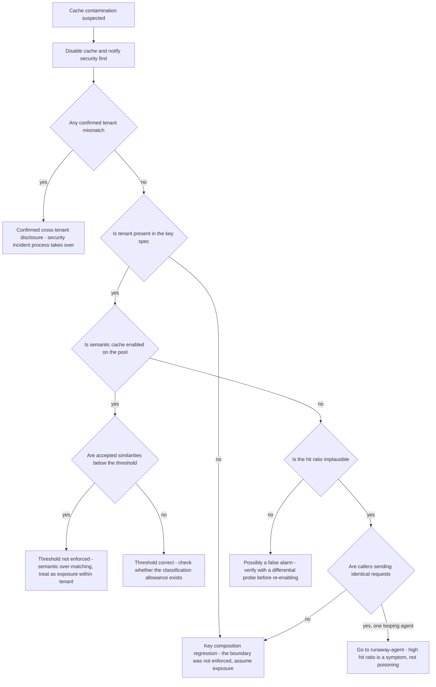

# Runbook: CachePoisoningSuspected

## 1. Alert

| Field | Value |
|---|---|
| Name | `CachePoisoningSuspected` |
| Severity | SEV1 (page primary + secondary + security duty officer) |
| Routing | `PD-AGENTGATE-PRIMARY`, `PD-AGENTGATE-SECONDARY`, security duty officer |
| Contract | Exact cache keyed on SHA-256 over normalised model, messages, tools, temperature, top_p, max_tokens, response_format **and tenant**; never shared across tenants (SPEC §3.5) |

```promql
# A cache entry served to a tenant other than the one that created it. Must always be zero.
- alert: CachePoisoningSuspected
  expr: sum(rate(agentgate_cache_tenant_mismatch_total[5m])) > 0
  for: 0m
  labels: { severity: sev1 }
  annotations:
    summary: "Cache entry served across a tenant boundary"
    runbook_url: https://docs.internal/agentgate/runbooks/cache-poisoning-suspected.md

# Hit ratio implausibly high - the key is collapsing distinct requests together
- alert: CacheHitRatioImplausible
  expr: |
    sum by (pool) (rate(agentgate_cache_lookups_total{result="hit"}[10m]))
    / sum by (pool) (rate(agentgate_cache_lookups_total[10m])) > 0.85
  for: 10m
  labels: { severity: sev2 }

# Semantic matches below the configured threshold are being accepted
- alert: CacheSemanticThresholdViolation
  expr: |
    histogram_quantile(0.01,
      sum by (le, pool) (rate(agentgate_cache_semantic_similarity_bucket{result="hit"}[10m]))) < 0.97
  for: 5m
  labels: { severity: sev1 }
```

## 2. What this means

A cached response may have been served to a request that should not have received it. In a
financial-services tenant this is the most serious failure this platform can have: one tenant or
team seeing another's model output is a data-leakage event, not a performance bug.

Three mechanisms produce it:

1. **Key collision** — the cache key omits a field it must include, so two different requests hash
   the same. Tenant is part of the key by contract; if it is missing, the boundary is gone.
2. **Semantic over-matching** — the cosine threshold (default 0.97) is too low or is not being
   enforced, so "the same question" stops meaning the same thing (SPEC §3.5).
3. **Deliberate poisoning** — an attacker crafts a request that populates a cache entry another
   caller will hit.

Treat every instance as case 1 until you have evidence otherwise, because case 1 is both the most
likely and the most damaging.

## 3. Impact

Potential cross-tenant or cross-team disclosure of model output. Even without cross-tenant leakage,
callers receive answers to questions they did not ask, which for an agent means acting on wrong
data. There is also a correctness angle that is easy to overlook: a poisoned cache is
indistinguishable from a correctly-functioning one from the caller's side, so nobody reports it.

## 4. First 5 minutes

**Stop the exposure first, then investigate.** This is the one runbook where mitigation precedes
diagnosis.

```bash
export CTX=prod-eastus NS=agentgate PROM=https://prometheus.internal
```

1. Disable the cache fleet-wide, immediately. It costs money and latency; that is an acceptable
   trade against possible disclosure.

```bash
agentctl --context "$CTX" cache disable --all-pools \
  --reason "INC-1234 suspected cache cross-tenant contamination"
promtool query instant "$PROM" 'sum by (result) (rate(agentgate_cache_lookups_total[1m]))'
# result="bypass" should be all that remains within ~30 seconds
```

2. Notify the security duty officer. Do not wait for confirmation that it is real.

3. **Preserve evidence before purging.** The cache contents are the evidence.

```bash
redis-cli -u "$REDIS_URL" --no-auth-warning --scan --pattern 'ag:cache:*' --count 500 \
  > /tmp/inc-1234-cache-keys.txt
wc -l /tmp/inc-1234-cache-keys.txt
agentctl --context "$CTX" cache export --output /tmp/inc-1234-cache-snapshot.json.gz \
  --justification "INC-1234 suspected contamination, security duty officer notified"
```

The export is access-controlled and audited; it contains response content. Handle it as
restricted-classification data and do not attach it to a ticket.

4. Confirm or rule out a tenant boundary crossing:

```bash
promtool query instant "$PROM" 'sum by (tenant, pool) (increase(agentgate_cache_tenant_mismatch_total[24h]))'
kubectl --context "$CTX" -n "$NS" logs deploy/gateway --since=6h \
  | jq -c 'select(.msg=="cache hit") | {tenant, entry_tenant, pool, trace_id}' \
  | jq -c 'select(.tenant != .entry_tenant)' | head -20
```

Any output from that second command is a confirmed cross-tenant hit. Say so explicitly to the
security duty officer with the trace ids.

5. Check key composition against the contract:

```bash
agentctl --context "$CTX" cache key-spec --pool general-chat -o json | jq '.'
# Must include: model, messages, tools, temperature, top_p, max_tokens, response_format, tenant
```

A missing field here is the root cause, and you have found it in five minutes.

6. Check semantic settings if the pool has it enabled:

```bash
agentctl --context "$CTX" cache semantic show --pool general-chat -o json \
  | jq '{enabled, threshold, classification_allowance, scope}'
promtool query instant "$PROM" '
histogram_quantile(0.01, sum by (le, pool) (rate(agentgate_cache_semantic_similarity_bucket{result="hit"}[1h])))'
```

Semantic caching requires a data-classification allowance (SPEC §3.5). If it is enabled on a pool
without one, that is a separate finding to report.

## 5. Diagnosis decision tree



## 6. Mitigations

### 6.1 Cache disabled (already done in step 1)

Verify it stayed off and that cost and latency moved as expected — that movement is your proof the
cache is genuinely bypassed:

```bash
promtool query instant "$PROM" 'sum by (result) (rate(agentgate_cache_lookups_total[2m]))'
promtool query instant "$PROM" '
sum(rate(agentgate_gateway_cost_usd_total[5m])) / sum(rate(agentgate_gateway_requests_total[5m]))'
```

### 6.2 Purge the cache after evidence is preserved (blast radius: cost and latency)

Only after the export in step 3 has completed and the security duty officer has confirmed they have
what they need.

```bash
agentctl --context "$CTX" cache purge --all-pools \
  --reason "INC-1234 contamination, evidence exported to /tmp/inc-1234-cache-snapshot.json.gz"
redis-cli -u "$REDIS_URL" --no-auth-warning --scan --pattern 'ag:cache:*' --count 500 | wc -l
```

Purge by pattern, never `FLUSHDB` — the same Redis holds rate-limit buckets, breaker state and the
JTI replay window (see [redis-unavailable.md](redis-unavailable.md)).

### 6.3 Fix the key specification and roll it out (blast radius: the change)

```bash
kubectl --context "$CTX" -n "$NS" rollout undo deploy/gateway     # if a deploy caused it
# or apply the corrected key spec:
kubectl --context "$CTX" -n "$NS" apply -f deploy/k8s/overlays/prod/gateway-config.yaml
kubectl --context "$CTX" -n "$NS" rollout restart deploy/gateway
agentctl --context "$CTX" cache key-spec --pool general-chat -o json | jq '.fields'
```

### 6.4 Disable semantic caching (blast radius: hit ratio)

Semantic matching is off by default and optional per pool (SPEC §3.5). If it is implicated, turn it
off and leave it off until the threshold enforcement has a test.

```bash
agentctl --context "$CTX" cache semantic disable --all-pools \
  --reason "INC-1234 similarity threshold not enforced"
```

### 6.5 Re-enable the cache — only after proof (blast radius: reintroduces the risk)

Do not re-enable on the basis that the alert stopped. Run the differential probe: two tenants, the
same prompt, and confirm neither sees the other's response.

```bash
for tenant in fsclient-a fsclient-b; do
  TOKEN=$(agentctl --context "$CTX" token mint --tenant "$tenant" --agent probe --env staging)
  echo -n "$tenant: "
  curl -sS -D- -o /tmp/resp-$tenant.json -X POST "$GW/v1/chat/completions" \
    -H "Authorization: Bearer $TOKEN" -H 'content-type: application/json' \
    -H 'x-agentgate-cache: on' \
    -d '{"model":"general-chat","messages":[{"role":"user","content":"cache boundary probe 7f3a"}],"max_tokens":32,"temperature":0}' \
    | grep -i 'x-agentgate-cache:'
done
# Expected: both report miss on first run. Repeat: each tenant hits its OWN entry only.
diff <(jq -r '.choices[0].message.content' /tmp/resp-fsclient-a.json) \
     <(jq -r '.choices[0].message.content' /tmp/resp-fsclient-b.json) > /dev/null \
  && echo "IDENTICAL CONTENT - investigate before enabling" || echo "distinct content - expected"
```

Then re-enable one pool at a time, lowest classification first, watching
`agentgate_cache_tenant_mismatch_total` at each step:

```bash
agentctl --context "$CTX" cache enable --pool general-chat --reason "INC-1234 verified isolated"
promtool query instant "$PROM" 'sum(rate(agentgate_cache_tenant_mismatch_total[5m]))'
```

## 7. Rollback

| Mitigation | Undo |
|---|---|
| 6.1 | Re-enabling the cache is 6.5, and it is gated on evidence, not on time elapsed |
| 6.2 | A purge is irreversible. That is why the export in step 3 is mandatory and comes first |
| 6.3 | Re-deploy only a build whose key spec is covered by an isolation test |
| 6.4 | Re-enable semantic caching only per pool, with the classification allowance verified and the threshold assertion in the test suite |
| 6.5 | If any mismatch appears during staged re-enablement, disable immediately and return to 6.1 |

## 8. Escalation

- Security duty officer **before** you finish triage, not after. This is a suspected data-disclosure
  event and their process governs from that point.
- Client incident manager immediately on any confirmed cross-tenant hit. In a regulated environment
  this is likely reportable, and the reporting clock starts at discovery, not at confirmation.
- Page L2 and assign an IC. Nobody works a suspected disclosure alone.
- Do not communicate findings about which tenant saw what outside the incident channel until the
  security duty officer directs it. Preliminary disclosure claims that turn out wrong cause their
  own damage.

## 9. Post-incident

This postmortem has a mandatory evidence set:

```bash
# Every cache hit in the exposure window with tenant and entry tenant
kubectl --context "$CTX" -n "$NS" logs deploy/gateway --since=24h \
  | jq -c 'select(.msg=="cache hit") | {ts, tenant, entry_tenant, pool, agent, trace_id}' \
  > /tmp/inc-1234-cache-hits.jsonl

# Config history for the key spec
agentctl --context "$CTX" audit list --since 30d --kind cache -o json > /tmp/inc-1234-cache-audit.json
git log --oneline -- deploy/k8s/overlays/prod/gateway-config.yaml | head -20
```

Answer, with evidence rather than reasoning:

1. Did any response cross a tenant boundary? If yes: which tenants, how many responses, what window.
2. Did any response cross a team boundary within a tenant?
3. How long was the defective key specification in production? Check git history, not memory — the
   answer is often much longer than the alert window.
4. Why did no test catch it? A cross-tenant cache isolation test belongs in the integration suite and
   in `test/load/k6/multitenant.js`.
5. What did the cache contain at the time of the incident, and has it been securely disposed of?

The action item that always applies: the tenant field must be structurally impossible to omit from
the key, not merely present in a config file. A config value that can be edited to remove a security
boundary will eventually be edited.

## 10. Related

- [redis-unavailable.md](redis-unavailable.md) — same Redis, different failure
- [cost-anomaly.md](cost-anomaly.md) — a cache disabled fleet-wide changes the cost curve sharply
- [runaway-agent.md](runaway-agent.md) — high hit ratio is usually this, not poisoning
- [incident-response.md](incident-response.md) — regulated-environment disclosure comms
- `test/load/k6/multitenant.js`
- Dashboards: `$GRAFANA/d/agentgate-cost`, `$GRAFANA/d/agentgate-infra`

Last game-day exercise: 2026-08-04 (tenant removed from the key spec in staging, detection measured).
