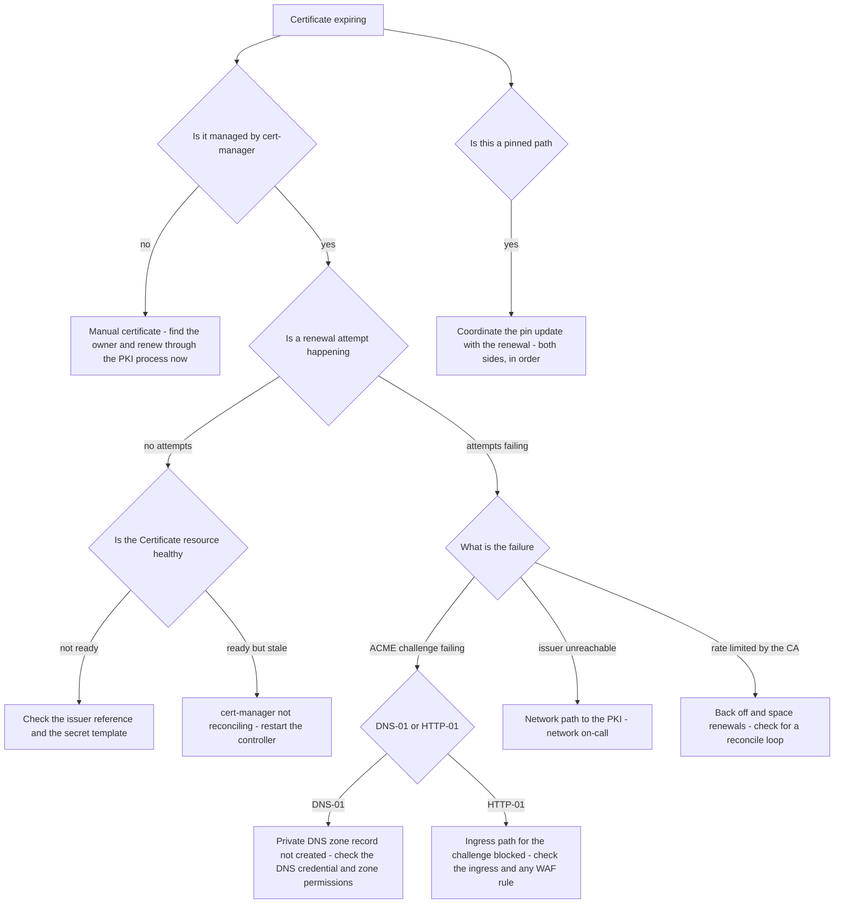

# Runbook: CertificateExpiringSoon

## 1. Alert

| Field | Value |
|---|---|
| Name | `CertificateExpiringSoon` |
| Severity | SEV3 at 21d, SEV2 at 7d, SEV1 at 48h or already expired |
| Routing | Jira `AGP` at SEV3; `PD-AGENTGATE-PRIMARY` at SEV2 and above |
| Policy | Enterprise PKI, ACME-automated, 90-day rotation, expiry alert at 21 days (SPEC §8) |

```promql
- alert: CertificateExpiringSoon
  expr: agentgate_certificate_expiry_seconds < 86400 * 21
  for: 1h
  labels: { severity: sev3 }
  annotations:
    summary: "Certificate for {{ $labels.host }} expires in {{ $value | humanizeDuration }}"
    runbook_url: https://docs.internal/agentgate/runbooks/certificate-expiry.md

- alert: CertificateExpiringUrgent
  expr: agentgate_certificate_expiry_seconds < 86400 * 7
  for: 15m
  labels: { severity: sev2 }

- alert: CertificateExpiringCritical
  expr: agentgate_certificate_expiry_seconds < 3600 * 48
  for: 5m
  labels: { severity: sev1 }

# ACME renewal is failing - the reason the 21-day alert exists
- alert: CertificateRenewalFailing
  expr: increase(certmanager_certificate_renewal_errors_total[1h]) > 0
  for: 30m
  labels: { severity: sev2 }
```

## 2. What this means

A TLS certificate on one of the platform's paths is approaching expiry and automated renewal has
not replaced it. The 90-day rotation is ACME-automated, so this alert almost always means the
automation is stuck rather than that a human forgot. The 21-day window exists to give room for the
enterprise PKI's own approval and issuance timelines, which are not fast.

The path matters. AgentGate has several TLS paths with different failure consequences (SPEC §8):
agent-to-gateway, gateway-to-cloud-provider, gateway-to-on-prem with internal CA pinning,
gateway-to-third-party via the inspecting proxy, and collector-to-observability-backend. Pinned
paths are the dangerous ones — a renewed certificate with a different chain breaks a pinned peer
even though the certificate is perfectly valid.

## 3. Impact

None until expiry. At expiry, the affected path fails completely and abruptly: TLS handshake
failures, which surface as connection errors and trip circuit breakers within a minute or two. An
expired gateway-facing certificate stops every agent. An expired provider-facing certificate takes
out one backend and looks exactly like provider degradation until someone reads the error text.

## 4. First 5 minutes

At SEV3 this is a business-hours ticket. At SEV1 work it now.

```bash
export CTX=prod-eastus NS=agentgate PROM=https://prometheus.internal
```

1. What is expiring, when, and on which path?

```bash
promtool query instant "$PROM" 'sort(agentgate_certificate_expiry_seconds / 86400)'
kubectl --context "$CTX" -n "$NS" get certificates.cert-manager.io -o wide
```

2. Verify against the live endpoint rather than trusting the metric:

```bash
for host in gateway.agentgate.internal controlplane.agentgate.internal fleetview.agentgate.internal; do
  echo "== $host"
  echo | openssl s_client -connect "$host:443" -servername "$host" 2>/dev/null \
    | openssl x509 -noout -subject -issuer -dates -fingerprint -sha256
done
```

3. Why is renewal not happening?

```bash
kubectl --context "$CTX" -n "$NS" describe certificate gateway-tls | tail -30
kubectl --context "$CTX" -n "$NS" get certificaterequests -o wide | tail -10
kubectl --context "$CTX" -n "$NS" get orders,challenges -o wide 2>/dev/null | tail -20
kubectl --context "$CTX" -n cert-manager logs deploy/cert-manager --since=1h | grep -iE 'error|fail' | tail -30
```

4. Is the ACME issuer reachable and healthy?

```bash
kubectl --context "$CTX" get clusterissuer enterprise-pki -o yaml | grep -A 10 'status:'
POD=$(kubectl --context "$CTX" -n cert-manager get pod -l app=cert-manager -o name | head -1)
kubectl --context "$CTX" -n cert-manager exec "$POD" -- \
  curl -sS -o /dev/null -w '%{http_code}\n' --max-time 5 https://acme.pki.internal/directory
```

5. Is this a pinned path? Check before renewing anything on the on-prem route:

```bash
kubectl --context "$CTX" -n "$NS" get cm gateway-config -o jsonpath='{.data.tls\.pinned_peers}{"\n"}'
```

If the answer is non-empty, renewing without updating the pin is how you cause the outage you are
trying to prevent.

6. Inventory anything the ACME automation does not cover — manually-issued certificates are the ones
   that actually expire:

```bash
agentctl --context "$CTX" tls inventory -o json \
  | jq -r '.[] | select(.managed_by != "cert-manager") | "\(.host)\t\(.not_after)\t\(.managed_by)\t\(.owner)"'
```

## 5. Diagnosis decision tree



## 6. Mitigations

### 6.1 Force a renewal (blast radius: one certificate)

```bash
kubectl --context "$CTX" -n "$NS" annotate certificate gateway-tls \
  cert-manager.io/issue-temporary-certificate="true" --overwrite
kubectl --context "$CTX" cert-manager renew gateway-tls -n "$NS"
kubectl --context "$CTX" -n "$NS" get certificate gateway-tls -w
```

Verify the new certificate is actually being served — a renewed secret that no pod has reloaded is
a common trap:

```bash
echo | openssl s_client -connect gateway.agentgate.internal:443 \
  -servername gateway.agentgate.internal 2>/dev/null | openssl x509 -noout -dates
```

### 6.2 Reload the consumers of the certificate (blast radius: rolling restart)

Most components watch the secret and reload; if one does not:

```bash
kubectl --context "$CTX" -n "$NS" rollout restart deploy/gateway
kubectl --context "$CTX" -n "$NS" rollout status deploy/gateway --timeout=300s
```

A PDB of 75% minAvailable means this is safe during traffic, but do it during a quiet window if you
have the choice.

### 6.3 Fix the ACME challenge (blast radius: renewal only)

DNS-01 against a private zone is the usual failure in this environment:

```bash
kubectl --context "$CTX" -n "$NS" describe challenge $(kubectl --context "$CTX" -n "$NS" get challenges -o name | head -1)
# Confirm the TXT record is actually present in the private zone:
dig +short TXT _acme-challenge.gateway.agentgate.internal @10.0.0.10
```

If the record is missing, the DNS credential has lost its zone permission — a frequent side effect
of a subscription or IAM policy change.

### 6.4 Update a certificate pin alongside the renewal (blast radius: one path — ORDER MATTERS)

For the on-prem inference path with internal CA pinning (SPEC §8):

```bash
# 1. Get the new chain's SPKI pin from the issued certificate
echo | openssl s_client -connect onprem-inference.agentgate.internal:443 2>/dev/null \
  | openssl x509 -pubkey -noout | openssl pkey -pubin -outform der \
  | openssl dgst -sha256 -binary | base64

# 2. Add the new pin ALONGSIDE the old one - never replace in one step
kubectl --context "$CTX" -n "$NS" patch cm gateway-config --type merge \
  -p '{"data":{"tls.pinned_peers":"onprem-inference.agentgate.internal=sha256/OLDPIN,sha256/NEWPIN"}}'
kubectl --context "$CTX" -n "$NS" rollout restart deploy/gateway

# 3. Renew the peer certificate
# 4. Confirm connectivity, then remove the old pin
```

Both pins present during the transition is what makes this safe. Replacing the pin in one step
breaks the path at the exact moment the certificate changes.

### 6.5 Issue a manual certificate (blast radius: one certificate — break-glass)

When ACME cannot be fixed before expiry. Requires the PKI team and a change reference; issuance is
not instant, which is why the alert fires at 21 days.

```bash
openssl req -new -newkey rsa:3072 -nodes \
  -keyout /tmp/gateway.key -out /tmp/gateway.csr \
  -subj "/CN=gateway.agentgate.internal/O=FS Client/OU=Platform" \
  -addext "subjectAltName=DNS:gateway.agentgate.internal"
# Submit the CSR through the PKI request process with the change reference.
# On issuance:
kubectl --context "$CTX" -n "$NS" create secret tls gateway-tls-manual \
  --cert=/tmp/gateway.crt --key=/tmp/gateway.key --dry-run=client -o yaml \
  | kubectl --context "$CTX" -n "$NS" apply -f -
shred -u /tmp/gateway.key
```

Record the manual certificate in the inventory with an owner and an expiry date, and open a ticket
to bring it back under ACME. Manual certificates are how the next expiry incident starts.

## 7. Rollback

| Mitigation | Undo |
|---|---|
| 6.1 | The previous certificate remains valid until its expiry; cert-manager keeps the old secret revision. `kubectl rollout undo` on the consumer restores the previously loaded material |
| 6.2 | `kubectl --context "$CTX" -n "$NS" rollout undo deploy/gateway` |
| 6.3 | Revert any DNS or ingress change you made |
| 6.4 | Restore the previous `tls.pinned_peers` value from git and restart. Because both pins were present, rolling back is safe at any point in the sequence — that is the reason for the ordering |
| 6.5 | Point the consumer back at the cert-manager-managed secret once ACME is fixed, and revoke the manual certificate through the PKI process |

## 8. Escalation

- 21 days: ticket to the platform team, business hours.
- 7 days: page, and engage the PKI team — enterprise issuance can take days and the clock is real.
- 48 hours or expired: SEV1, page L2, engage the PKI team and the network on-call together.
- Pinned-path changes: coordinate with the owner of the peer. A pin update is a two-sided change and
  must not be made unilaterally.
- If a certificate expires in production, it is a postmortem-worthy incident regardless of duration.
  Certificate expiry is entirely predictable and entirely preventable, and treating it as routine is
  how it happens again.

## 9. Post-incident

```bash
agentctl --context "$CTX" tls inventory -o json > /tmp/inc-tls-inventory.json
kubectl --context "$CTX" -n "$NS" get certificates -o yaml > /tmp/inc-certs.yaml
kubectl --context "$CTX" -n cert-manager logs deploy/cert-manager --since=24h > /tmp/inc-certmanager.log
```

Capture: why automated renewal did not happen; how long the automation had been failing before the
21-day alert fired (this is usually much longer than anyone expects, and it is the real finding);
whether any path is pinned and whether the pin process was followed; and every manually-managed
certificate discovered in the inventory during triage, each with an owner and a date to bring it
under automation.

Standing check for the monthly review: the count of certificates not managed by cert-manager. That
number should trend to zero.

## 10. Related

- [secret-rotation-overdue.md](secret-rotation-overdue.md)
- [jwks-rotation-failure.md](jwks-rotation-failure.md)
- [no-healthy-backend.md](no-healthy-backend.md) — an expired peer certificate presents this way
- [operational-readiness-review.md](operational-readiness-review.md)
- Dashboards: `$GRAFANA/d/agentgate-infra`

Last game-day exercise: 2026-05-05 (expired the on-prem peer certificate in staging with pinning on).
