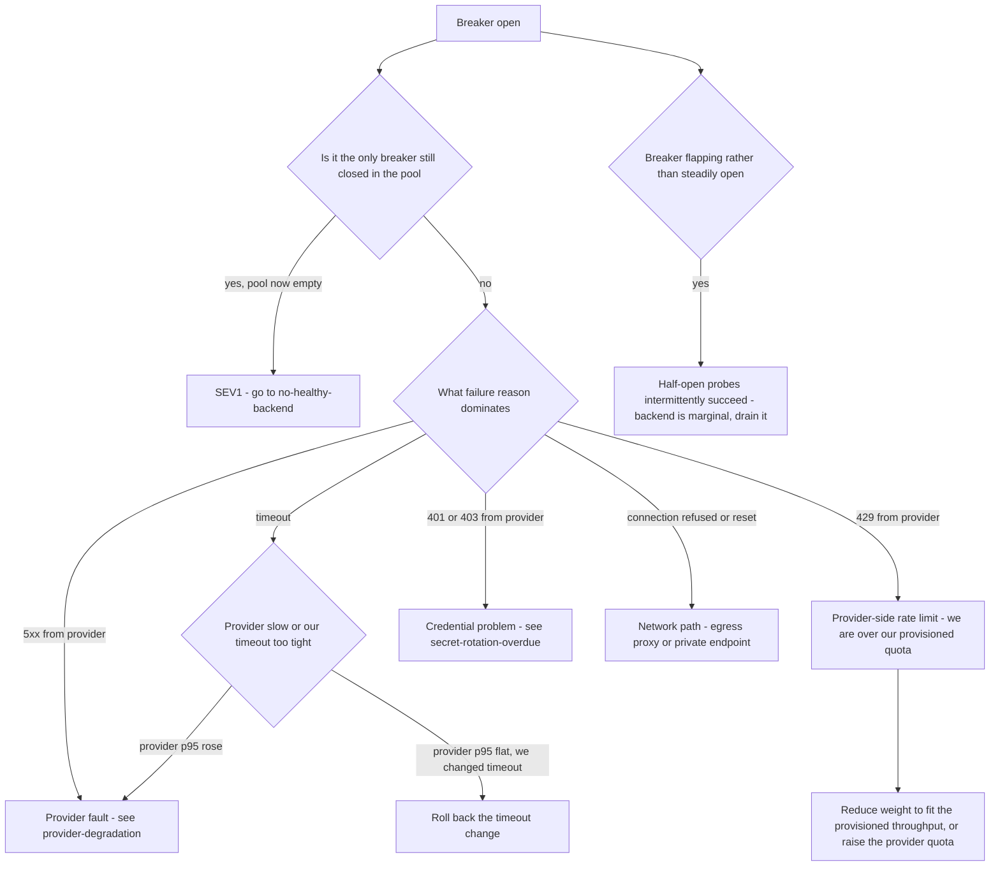

# Runbook: CircuitBreakerOpen

## 1. Alert

| Field | Value |
|---|---|
| Name | `CircuitBreakerOpen` |
| Severity | SEV2 (page) — SEV1 if it is the last closed breaker in a pool |
| Routing | `PD-AGENTGATE-PRIMARY` |
| Config | 3-state, sliding window 50 requests, trips at 50% failure or 10 consecutive failures, opens 30s, half-open admits 5 probes (SPEC §3.3) |

```promql
- alert: CircuitBreakerOpen
  expr: agentgate_breaker_state{state="open"} == 1
  for: 2m
  labels: { severity: sev2 }
  annotations:
    summary: "Circuit breaker open for {{ $labels.backend }}"
    runbook_url: https://docs.internal/agentgate/runbooks/circuit-breaker-open.md

- alert: CircuitBreakerFlapping
  expr: changes(agentgate_breaker_state{state="closed"}[15m]) > 6
  for: 5m
  labels: { severity: sev2 }
```

## 2. What this means

One backend failed enough requests in its last 50 — half of them, or ten in a row — that the
gateway has stopped sending it traffic for 30 seconds. This is the system working: it is refusing
to spend caller deadlines on a backend that is not answering. The alert exists because a breaker
that stays open, or flaps repeatedly, means the backend is genuinely broken rather than briefly
unlucky, and the pool is now running on reduced capacity with less headroom for the next failure.

## 3. Impact

Usually none directly visible — failover moves traffic to the remaining backends in the tier, or
to the priority-2 tier. Second-order effects are what matter: remaining backends carry more load
and may saturate; if the failover tier is on-prem, quality and context window change under callers'
feet; and `x-agentgate-attempts` on responses rises, which some consuming teams alert on. If this
is the last closed breaker in the pool, impact is total — see
[no-healthy-backend.md](no-healthy-backend.md).

## 4. First 5 minutes

```bash
export CTX=prod-eastus NS=agentgate PROM=https://prometheus.internal
```

1. Which backend, and is the pool still viable?

```bash
promtool query instant "$PROM" 'agentgate_breaker_state == 1'
promtool query instant "$PROM" 'count by (pool) (agentgate_breaker_state{state="closed"} == 1)'
```

2. Why did it trip? Get the failure reasons and the error codes:

```bash
promtool query instant "$PROM" '
sum by (backend, reason) (rate(agentgate_retry_attempts_total[5m]))'
promtool query instant "$PROM" '
sum by (backend, status, code) (rate(agentgate_gateway_requests_total{env="prod",status=~"5.."}[5m]))'
kubectl --context "$CTX" -n "$NS" logs deploy/gateway --since=10m \
  | jq -c 'select(.msg=="backend attempt failed") | {backend,status,err,attempt}' | tail -30
```

3. Is the remaining capacity absorbing the load, or about to fall over?

```bash
promtool query instant "$PROM" 'sum by (pool) (agentgate_gateway_inflight)'
promtool query instant "$PROM" '
sum by (backend) (rate(agentgate_gateway_requests_total{pool="general-chat"}[2m]))'
```

4. Probe the backend yourself from inside the mesh:

```bash
POD=$(kubectl --context "$CTX" -n "$NS" get pod -l app=gateway -o name | head -1)
kubectl --context "$CTX" -n "$NS" exec "$POD" -- \
  curl -sS -o /dev/null -w 'code=%{http_code} total=%{time_total}\n' --max-time 10 \
  https://fsclient-eastus.openai.azure.internal/openai/deployments/gpt-4o-mini/chat/completions
```

5. Check the provider's own status before assuming it is ours:

```bash
agentctl --context "$CTX" provider status --provider azure-openai
```

## 5. Diagnosis decision tree



## 6. Mitigations

### 6.1 Let it work (blast radius: none)

A breaker that opens once, probes, and closes has done its job. If the pool is serving normally and
the breaker closed within a couple of minutes, record it and move on. Do not reset breakers
reflexively; a reset that re-admits traffic to a broken backend spends caller deadlines.

### 6.2 Reduce the backend's weight instead of removing it (blast radius: one pool)

Right move when the backend is rate-limited by the provider rather than broken:

```bash
agentctl --context "$CTX" pool set-weights --pool general-chat \
  --weight azure-openai/gpt-4o-mini=20 --weight bedrock/claude-haiku=80 --reason "INC-1234 provider 429s"
```

Expected effect: request rate to the throttled backend falls below its provisioned limit; 429s
stop; breaker closes. Verify:

```bash
promtool query instant "$PROM" '
sum by (backend) (rate(agentgate_gateway_requests_total{status="429",pool="general-chat"}[2m]))'
```

### 6.3 Drain the backend (blast radius: one backend)

For a flapping or persistently broken backend. Draining is cleaner than letting the breaker cycle,
because each cycle costs five probe requests' worth of caller latency.

```bash
agentctl --context "$CTX" backend drain --pool general-chat --backend azure-openai/gpt-4o-mini \
  --reason "INC-1234 flapping breaker" --ttl 4h
```

Verify the pool still has headroom afterwards:

```bash
promtool query instant "$PROM" 'count by (pool) (agentgate_breaker_state{state="closed"} == 1)'
promtool query instant "$PROM" 'sum by (pool) (agentgate_gateway_inflight)'
```

### 6.4 Widen the per-backend timeout (blast radius: caller deadlines)

Only when the evidence is that the provider is slow but succeeding, and our timeout is cutting it
off. This trades latency for success and is frequently the wrong trade for interactive pools.

```bash
agentctl --context "$CTX" backend set --pool general-chat --backend bedrock/claude-haiku \
  --timeout 45s --reason "INC-1234 provider p95 32s"
```

Verify success rate improves and that `client_timeout` (408) does not rise in its place:

```bash
promtool query instant "$PROM" '
sum by (code) (rate(agentgate_gateway_requests_total{pool="general-chat"}[2m]))'
```

### 6.5 Loosen the breaker threshold (blast radius: one backend, risky)

Last resort, and only when you are certain the failures are a measurement artefact — for example a
backend whose health probe path 404s while real traffic succeeds.

```bash
agentctl --context "$CTX" breaker configure --backend onprem-vllm/llama-3.1-8b \
  --failure-ratio 0.7 --consecutive-failures 20 --reason "INC-1234" --ttl 2h
```

## 7. Rollback

| Mitigation | Undo |
|---|---|
| 6.2 | Restore committed weights from `deploy/k8s/overlays/prod/pools.yaml` after 30 min of closed breaker |
| 6.3 | `agentctl --context "$CTX" backend undrain --pool general-chat --backend azure-openai/gpt-4o-mini`, then watch the breaker for 15 minutes before leaving |
| 6.4 | `agentctl --context "$CTX" backend set --pool general-chat --backend bedrock/claude-haiku --timeout 20s` — a widened timeout left in place quietly degrades the latency SLO |
| 6.5 | `agentctl --context "$CTX" breaker configure --backend onprem-vllm/llama-3.1-8b --reset-to-defaults`. This one **must** be undone before the incident closes; a loosened breaker is a disabled safety device |

## 8. Escalation

- If breakers on two or more providers open within the same five minutes, stop treating them as
  independent — that is a shared dependency (network, egress proxy, DNS, credentials) and belongs
  to network or security on-call. Escalate immediately.
- If the pool is down to one closed breaker, raise to SEV1 pre-emptively rather than waiting for
  `NoHealthyBackend`.
- Provider 429s that persist after weight reduction: this is a capacity purchase decision, not an
  incident fix. Escalate to the platform lead with the observed throughput and the provisioned
  limit.

## 9. Post-incident

```bash
promtool query range "$PROM" 'agentgate_breaker_state' \
  --start "$(date -u -d '-3 hours' +%FT%TZ)" --end "$(date -u +%FT%TZ)" --step 30s > /tmp/inc-breaker-state.txt
promtool query range "$PROM" 'sum by (backend, reason) (rate(agentgate_retry_attempts_total[5m]))' \
  --start "$(date -u -d '-3 hours' +%FT%TZ)" --end "$(date -u +%FT%TZ)" --step 1m > /tmp/inc-retry-reasons.txt
```

Capture: how many requests were served by failover while the breaker was open, whether any caller
saw a 5xx that should have failed over, whether the trip threshold fired too early or too late for
this failure shape, and — if you changed breaker configuration — proof that you changed it back.

## 10. Related

- [no-healthy-backend.md](no-healthy-backend.md)
- [provider-degradation.md](provider-degradation.md)
- [retry-storm.md](retry-storm.md)
- [secret-rotation-overdue.md](secret-rotation-overdue.md) — expired credentials trip breakers
- Dashboards: `$GRAFANA/d/agentgate-pools`

Last game-day exercise: 2026-07-14 (mockprovider fault injection at 60% failure rate).
