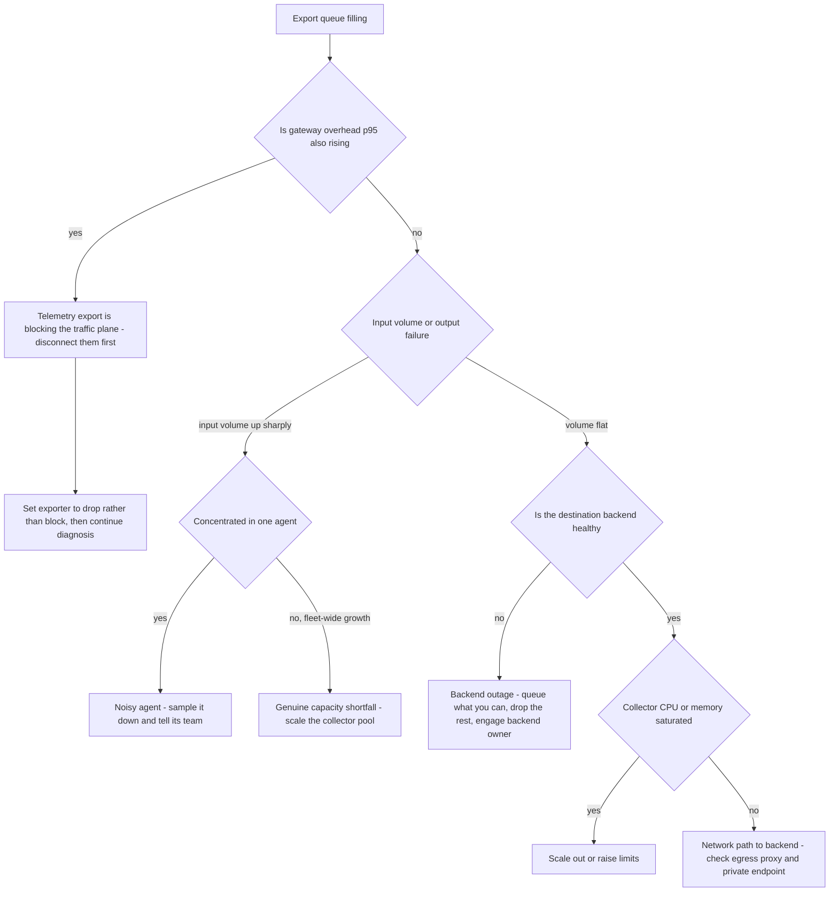

# Runbook: CollectorBackpressure

## 1. Alert

| Field | Value |
|---|---|
| Name | `CollectorBackpressure` |
| Severity | SEV2 (page) — telemetry loss is silent and compounding |
| Routing | `PD-AGENTGATE-PRIMARY` |

```promql
- alert: CollectorBackpressure
  expr: |
    otelcol_exporter_queue_size / otelcol_exporter_queue_capacity > 0.8
  for: 10m
  labels: { severity: sev2 }
  annotations:
    summary: "Collector export queue {{ $value | humanizePercentage }} full on {{ $labels.exporter }}"
    runbook_url: https://docs.internal/agentgate/runbooks/collector-backpressure.md

- alert: CollectorDroppingSpans
  expr: sum by (processor) (rate(otelcol_processor_dropped_spans[5m])) > 0
  for: 5m
  labels: { severity: sev2 }

- alert: CollectorRefusingSpans
  expr: sum by (processor) (rate(otelcol_processor_refused_spans[5m])) > 0
  for: 5m
  labels: { severity: sev2 }

- alert: CollectorMemoryLimiterActive
  expr: rate(otelcol_processor_memory_limiter_refused_spans[5m]) > 0
  for: 5m
  labels: { severity: sev2 }
```

## 2. What this means

The OTel collector pool cannot push telemetry to its backends as fast as it is arriving, so its
export queue is filling. When the queue fills, the memory limiter starts refusing spans and the
receiver pushes back on senders. Two things then happen: telemetry is lost, and — critically —
the gateway's own OTLP export can start blocking, which turns a telemetry incident into a latency
incident on the traffic plane.

The pipeline has two tiers (SPEC §4.4): a per-node agent collector and an HA gateway pool. Work out
which tier is backed up before you touch anything; they have different fixes.

## 3. Impact

- Immediate: telemetry gaps, falling completeness, [telemetry-incomplete.md](telemetry-incomplete.md)
  firing shortly after this one.
- Secondary: promotion gates start failing for agents whose completeness drops.
- Dangerous: if the gateway's exporter blocks on a full queue, request latency rises for every
  caller. Check `agentgate:gateway_overhead:p95_1m` early — an export-induced latency regression is
  the reason this alert is SEV2 rather than SEV3.
- Cost pipeline: the chargeback exporter shares the pool. Dropped cost events mean revenue data
  loss, which is not recoverable from spans.

## 4. First 5 minutes

```bash
export CTX=prod-eastus NS=agentgate PROM=https://prometheus.internal
```

1. Which tier and which exporter?

```bash
promtool query instant "$PROM" '
otelcol_exporter_queue_size / otelcol_exporter_queue_capacity'
promtool query instant "$PROM" 'sum by (exporter) (rate(otelcol_exporter_send_failed_spans[5m]))'
promtool query instant "$PROM" 'sum by (exporter) (rate(otelcol_exporter_sent_spans[5m]))'
```

2. Is the gateway plane being harmed? Answer this before anything else.

```bash
promtool query instant "$PROM" 'agentgate:gateway_overhead:p95_1m{env="prod"}'
promtool query instant "$PROM" '
histogram_quantile(0.95, sum by (le, stage) (rate(agentgate_gateway_policy_duration_seconds_bucket[5m])))'
```

3. Is it input volume or output failure?

```bash
promtool query instant "$PROM" 'sum(rate(otelcol_receiver_accepted_spans[5m]))'
promtool query instant "$PROM" 'sum(rate(otelcol_receiver_refused_spans[5m]))'
# Compare against an hour ago:
promtool query instant "$PROM" 'sum(rate(otelcol_receiver_accepted_spans[5m] offset 1h))'
```

Volume up sharply → a noisy agent. Volume flat with rising queue → the backend is slow or down.

4. Which backend is refusing?

```bash
kubectl --context "$CTX" -n "$NS" logs deploy/otel-collector-gateway --since=10m \
  | grep -iE 'export|permanent error|context deadline' | tail -30
promtool query instant "$PROM" 'up{job=~"langfuse|loki|prometheus-remote-write"}'
```

5. Collector resource state:

```bash
kubectl --context "$CTX" -n "$NS" top pods -l app=otel-collector-gateway
kubectl --context "$CTX" -n "$NS" get pods -l app=otel-collector-gateway
promtool query instant "$PROM" 'otelcol_process_memory_rss / 1024 / 1024'
```

6. Find the noisiest producer — one agent emitting far too many spans is a common trigger:

```bash
promtool query instant "$PROM" '
topk(5, sum by (agent) (rate(agentgate_spans_emitted_total[5m])))'
```

## 5. Diagnosis decision tree



## 6. Mitigations

### 6.1 Protect the traffic plane first (blast radius: telemetry only)

If gateway latency is being harmed, break the coupling immediately. Losing telemetry is bad; making
every agent slow is worse.

```bash
kubectl --context "$CTX" -n "$NS" patch cm gateway-config --type merge \
  -p '{"data":{"otlp.export_blocking":"false","otlp.export_timeout":"2s"}}'
kubectl --context "$CTX" -n "$NS" rollout restart deploy/gateway
```

Expected effect: gateway overhead p95 returns to baseline; `agentgate_spans_dropped_total` starts
incrementing, which is the visible price. Verify both:

```bash
promtool query instant "$PROM" 'agentgate:gateway_overhead:p95_1m{env="prod"}'
promtool query instant "$PROM" 'sum(rate(agentgate_spans_dropped_total[2m]))'
```

### 6.2 Scale the collector pool out (blast radius: cost)

```bash
kubectl --context "$CTX" -n "$NS" scale deploy/otel-collector-gateway --replicas=9
kubectl --context "$CTX" -n "$NS" rollout status deploy/otel-collector-gateway --timeout=300s
```

Expected effect: queue utilisation falls within 2–3 minutes if the bottleneck is collector CPU.
If it does not move, the bottleneck is downstream and scaling made it worse by adding senders.
Verify with `otelcol_exporter_queue_size / otelcol_exporter_queue_capacity`.

### 6.3 Reduce sampling to cut volume (blast radius: telemetry fidelity)

Tail sampling keeps 100% of errors, guardrail blocks, failovers and >p99 latency, plus a 5%
baseline (SPEC §4.4). Cut the baseline, never the error classes.

```bash
kubectl --context "$CTX" -n "$NS" patch cm otel-collector-gateway-config --type merge \
  -p '{"data":{"tail_sampling.baseline_percent":"1"}}'
kubectl --context "$CTX" -n "$NS" rollout restart deploy/otel-collector-gateway
```

Expected effect: accepted-to-exported ratio drops roughly 4 percentage points of total volume;
queue drains. Completeness will fall — expect `TelemetryDegraded` to fire and silence it explicitly
rather than letting it look like a second incident.

### 6.4 Sample down one noisy agent (blast radius: one agent)

Better than fleet-wide sampling if one producer is responsible.

```bash
agentctl --context "$CTX" telemetry sample set \
  --agent agent://fsclient/payments-risk/dispute-triage --rate 0.05 \
  --reason "INC-1234 emitting 40x baseline spans" --ttl 4h
```

Then tell that team — an agent emitting 40x baseline usually has a span inside a loop.

### 6.5 Shed the lowest-value pipeline (blast radius: one signal)

Priority order when you must drop something: logs first, then baseline traces, then metrics.
**Never** the cost pipeline — its data is not reconstructible.

```bash
kubectl --context "$CTX" -n "$NS" patch cm otel-collector-gateway-config --type merge \
  -p '{"data":{"pipelines.logs.enabled":"false"}}'
kubectl --context "$CTX" -n "$NS" rollout restart deploy/otel-collector-gateway
```

### 6.6 Raise the memory limiter ceiling (blast radius: collector stability)

Only when pods have headroom on the node. Raising the limiter without raising the pod limit turns
refusals into OOMKills, which lose more data than the refusals did.

```bash
kubectl --context "$CTX" -n "$NS" set resources deploy/otel-collector-gateway \
  --limits=memory=6Gi --requests=memory=4Gi
kubectl --context "$CTX" -n "$NS" patch cm otel-collector-gateway-config --type merge \
  -p '{"data":{"memory_limiter.limit_mib":"4800","memory_limiter.spike_limit_mib":"1200"}}'
kubectl --context "$CTX" -n "$NS" rollout restart deploy/otel-collector-gateway
```

## 7. Rollback

| Mitigation | Undo |
|---|---|
| 6.1 | Restore `otlp.export_blocking` to its committed value from `deploy/k8s/overlays/prod/`. Do this only once the queue has been below 40% for 30 min |
| 6.2 | Reduce replicas in business hours, one step at a time |
| 6.3 | `kubectl patch cm otel-collector-gateway-config --type merge -p '{"data":{"tail_sampling.baseline_percent":"5"}}'` and restart. Revert within 24h — a reduced baseline distorts every latency percentile derived from traces |
| 6.4 | `agentctl --context "$CTX" telemetry sample reset --agent agent://...` after the team fixes the span loop |
| 6.5 | Re-enable the logs pipeline and confirm log volume returns; note the gap window so nobody searches for logs that were never stored |
| 6.6 | Restore committed resource values; do not leave an ad-hoc memory limit in place |

## 8. Escalation

- If the traffic plane is being harmed and 6.1 does not fix it within 10 minutes, raise to SEV1 —
  at that point this is a gateway latency incident.
- Backend outage (Langfuse, Loki, managed Prometheus): engage that backend's owner directly and in
  parallel; there is nothing collector-side that fixes a dead destination.
- If the cost pipeline dropped events, notify the cost owner and finance contact the same day and
  record the window. Cost data loss is not recoverable from other signals.
- If the content pipeline (SPEC §4.2) is affected, involve the security duty officer — it has
  separate retention and access-control obligations.

## 9. Post-incident

```bash
promtool query range "$PROM" 'otelcol_exporter_queue_size / otelcol_exporter_queue_capacity' \
  --start "$(date -u -d '-6 hours' +%FT%TZ)" --end "$(date -u +%FT%TZ)" --step 1m > /tmp/inc-queue.txt
promtool query range "$PROM" 'sum(rate(otelcol_processor_dropped_spans[5m]))' \
  --start "$(date -u -d '-6 hours' +%FT%TZ)" --end "$(date -u +%FT%TZ)" --step 1m > /tmp/inc-drops.txt
kubectl --context "$CTX" -n "$NS" logs deploy/otel-collector-gateway --since=6h > /tmp/inc-collector.log
```

Capture: the span-loss estimate in absolute counts; whether cost events were among them; whether
gateway latency was affected and for how long; the trigger (volume growth, backend outage, or a
config change); and whether the collector pool is sized against the current fleet rather than the
fleet it was sized for. Update `test/load/capacity-model.md` with the observed spans-per-request
figure if it has drifted from the model.

## 10. Related

- [telemetry-incomplete.md](telemetry-incomplete.md)
- [trace-attribution-broken.md](trace-attribution-broken.md)
- [gateway-latency-regression.md](gateway-latency-regression.md)
- `test/load/capacity-model.md` — collector throughput per span
- Dashboards: `$GRAFANA/d/agentgate-telemetry-trust`, `$GRAFANA/d/agentgate-infra`

Last game-day exercise: 2026-07-28 (blackholed the trace backend for 20 minutes in staging).
