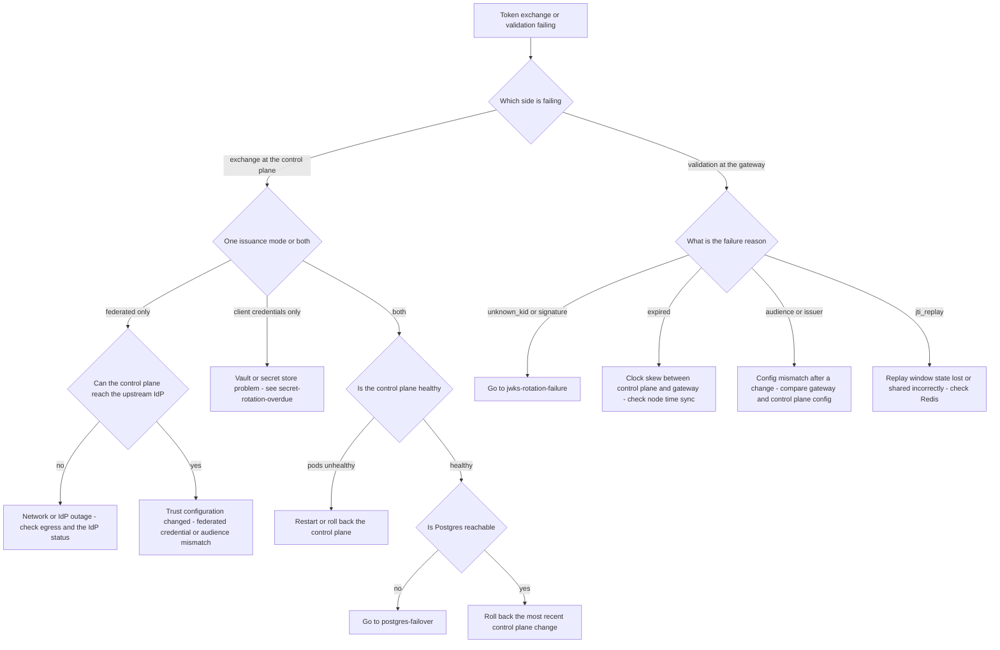

# Runbook: ControlPlaneTokenExchangeFailures

## 1. Alert

| Field | Value |
|---|---|
| Name | `ControlPlaneTokenExchangeFailures` |
| Severity | SEV1 (page primary + secondary) |
| Routing | `PD-AGENTGATE-PRIMARY`, auto-page `PD-AGENTGATE-SECONDARY` |
| SLO | Token exchange success 99.95%, p95 < 150ms; error budget 20m per 28d (SPEC §5) |

```promql
# agentgate:controlplane_token_exchange:error_ratio_rate5m
  sum(rate(agentgate_controlplane_token_exchange_total{result!="success"}[5m]))
/ sum(rate(agentgate_controlplane_token_exchange_total[5m]))

- alert: ControlPlaneTokenExchangeFailures
  expr: agentgate:controlplane_token_exchange:error_ratio_rate5m > 0.005
  for: 3m
  labels: { severity: sev1 }
  annotations:
    runbook_url: https://docs.internal/agentgate/runbooks/controlplane-token-exchange-failures.md

- alert: ControlPlaneTokenExchangeLatency
  expr: |
    histogram_quantile(0.95,
      sum by (le) (rate(agentgate_controlplane_token_exchange_duration_seconds_bucket[5m]))) > 0.150
  for: 10m
  labels: { severity: sev2 }

# The downstream symptom at the gateway
- alert: GatewayAuthenticationFailures
  expr: |
    sum(rate(agentgate_identity_token_validations_total{result="fail"}[5m]))
    / sum(rate(agentgate_identity_token_validations_total[5m])) > 0.02
  for: 5m
  labels: { severity: sev1 }
```

## 2. What this means

Agents cannot get, or cannot use, an AgentGate access token. The control plane exchanges a platform
token — a Kubernetes projected SA token, an Entra managed identity token, an IRSA or SPIFFE
JWT-SVID — for an AgentGate token via RFC 8693 (SPEC §1.1). If that exchange fails, the agent has
no credential; if the gateway cannot validate what it issued, the credential is useless. Either
way, agents that need a fresh token stop working.

The characteristic shape of this incident is a **slow-motion outage**: agents holding valid tokens
keep working until expiry, then drop off one by one. It looks mild for the first few minutes and
then accelerates. Do not judge severity by the request rate you see at minute two.

## 3. Impact

New agent deployments cannot authenticate at all. Running agents fail as their tokens expire —
typically over the token lifetime window, so expect a rolling failure spreading across the fleet.
At the gateway this appears as `401 unauthenticated` (SPEC §2.4), which is a 4xx and therefore does
**not** burn the availability error budget — another case where the SLO dashboard looks fine while
the platform is unusable. Watch `agentgate_identity_token_validations_total`, not the availability
SLI.

## 4. First 5 minutes

```bash
export CTX=prod-eastus NS=agentgate PROM=https://prometheus.internal CP=https://controlplane.agentgate.internal
```

1. Exchange failures or validation failures — which end?

```bash
promtool query instant "$PROM" '
sum by (result, mode) (rate(agentgate_controlplane_token_exchange_total[5m]))'
promtool query instant "$PROM" '
sum by (result, reason) (rate(agentgate_identity_token_validations_total[5m]))'
```

`reason` on validation failures is the fastest signal available: `signature`, `expired`, `issuer`,
`audience`, `jti_replay`, `unknown_kid`.

2. Is the control plane up and serving?

```bash
kubectl --context "$CTX" -n "$NS" get pods -l app=controlplane -o wide
curl -sS -o /dev/null -D- "$CP/readyz"
kubectl --context "$CTX" -n "$NS" logs deploy/controlplane --since=10m --tail=200 \
  | jq -c 'select(.level=="error") | {msg, err, mode, tenant}' | tail -30
```

3. Is one issuance mode affected or both? Federated workload identity and client credentials fail
   for entirely different reasons:

```bash
promtool query instant "$PROM" '
sum by (mode, result) (rate(agentgate_controlplane_token_exchange_total[5m]))'
```

4. Can the control plane reach the upstream identity provider it validates platform tokens against?

```bash
POD=$(kubectl --context "$CTX" -n "$NS" get pod -l app=controlplane -o name | head -1)
kubectl --context "$CTX" -n "$NS" exec "$POD" -- \
  curl -sS -o /dev/null -w 'entra=%{http_code} %{time_total}\n' --max-time 5 \
  https://login.microsoftonline.com/common/discovery/v2.0/keys
kubectl --context "$CTX" -n "$NS" exec "$POD" -- \
  curl -sS -o /dev/null -w 'k8s-oidc=%{http_code} %{time_total}\n' --max-time 5 \
  https://kubernetes.default.svc/openid/v1/jwks
```

5. Is our own signing key healthy? A key problem presents as exchange success plus validation
   failure — go to [jwks-rotation-failure.md](jwks-rotation-failure.md) if so:

```bash
curl -sS "$CP/.well-known/jwks.json" | jq '{keys: [.keys[] | {kid, alg, use}]}'
promtool query instant "$PROM" 'agentgate_controlplane_jwks_key_age_seconds / 86400'
```

6. Is Postgres reachable? Exchange writes an issuance record and reads registry state:

```bash
psql "$AGENTGATE_PG_URL" -tAc "select 1;" && echo "pg ok"
promtool query instant "$PROM" 'pg_up{instance=~".*agentgate.*"}'
```

7. Reproduce it end to end with a real exchange:

```bash
SA_TOKEN=$(kubectl --context "$CTX" -n "$NS" create token agentgate-probe --audience=api://agentgate)
curl -sS -D- -X POST "$CP/oauth2/token" \
  -H 'content-type: application/x-www-form-urlencoded' \
  -d 'grant_type=urn:ietf:params:oauth:grant-type:token-exchange' \
  -d 'subject_token_type=urn:ietf:params:oauth:token-type:jwt' \
  --data-urlencode "subject_token=$SA_TOKEN" \
  -d 'audience=https://gateway.agentgate.internal' | tail -5
```

## 5. Diagnosis decision tree



## 6. Mitigations

### 6.1 Roll back the most recent control plane change (blast radius: the change)

```bash
kubectl --context "$CTX" -n "$NS" rollout history deploy/controlplane | tail -5
kubectl --context "$CTX" -n "$NS" rollout undo deploy/controlplane
kubectl --context "$CTX" -n "$NS" rollout status deploy/controlplane --timeout=180s
```

Verify with the end-to-end exchange from step 7 and with the error ratio.

### 6.2 Restart the control plane (blast radius: brief exchange latency)

For a stuck IdP key cache or a leaked connection pool:

```bash
kubectl --context "$CTX" -n "$NS" rollout restart deploy/controlplane
kubectl --context "$CTX" -n "$NS" rollout status deploy/controlplane --timeout=180s
```

Exchange latency spikes briefly during restart as key caches refill. Verify:

```bash
promtool query instant "$PROM" 'agentgate:controlplane_token_exchange:error_ratio_rate5m'
```

### 6.3 Fix the trust configuration (blast radius: one issuance mode)

Compare live configuration against git — an audience or issuer mismatch after a change is the most
common non-outage cause:

```bash
kubectl --context "$CTX" -n "$NS" get cm controlplane-config -o jsonpath='{.data.oidc\.trusted_issuers}{"\n"}'
kubectl --context "$CTX" -n "$NS" get cm gateway-config -o jsonpath='{.data.authn\.expected_issuer}{"\n"}{.data.authn\.expected_audience}{"\n"}'
diff <(kubectl --context "$CTX" -n "$NS" get cm controlplane-config -o yaml) \
     <(git show HEAD:deploy/k8s/overlays/prod/controlplane-config.yaml)
kubectl --context "$CTX" -n "$NS" apply -f deploy/k8s/overlays/prod/controlplane-config.yaml
kubectl --context "$CTX" -n "$NS" rollout restart deploy/controlplane
```

### 6.4 Extend token lifetime to slow the bleed (blast radius: security posture, time-boxed)

Buys time for agents whose tokens are about to expire while you fix the root cause. It lengthens
the window during which a leaked token is usable, so it is time-boxed and recorded.

```bash
agentctl --context "$CTX" identity set-token-ttl --minutes 60 \
  --reason "INC-1234 exchange failing, extending to slow fleet drop-off" \
  --approver ic@client.example --ttl 4h
```

Verify newly issued tokens carry the longer expiry, and watch validation failures flatten:

```bash
promtool query instant "$PROM" 'sum(rate(agentgate_identity_token_validations_total{result="fail",reason="expired"}[2m]))'
```

### 6.5 Fail over the control plane to the paired region (blast radius: control plane)

The gateway can validate tokens issued by either region's control plane provided both keys are in
the published JWKS. Confirm that before you switch:

```bash
curl -sS "$CP/.well-known/jwks.json" | jq '[.keys[].kid]'
agentctl --context prod-westus health check --deep
scripts/frontdoor-weight.sh --service controlplane --set prod-eastus=0 --set prod-westus=100 --reason "INC-1234"
```

### 6.6 Emergency static credential path (blast radius: security — LAST RESORT)

There is a documented break-glass path for issuing short-lived credentials when the exchange path
is unavailable. It requires two-party approval and produces a recorded, individually revocable
credential per agent. It is **not** in this runbook: it lives in the sealed break-glass procedure,
and using it requires the security duty officer on the call. If you are considering it, escalate.

## 7. Rollback

| Mitigation | Undo |
|---|---|
| 6.1 | Re-deploy a fixed build only |
| 6.2 | Nothing to undo |
| 6.3 | `git revert` and re-apply if the config change you made was itself wrong |
| 6.4 | `agentctl --context "$CTX" identity set-token-ttl --minutes 15` — restore the standard TTL as soon as exchange is healthy, and confirm. A long-lived token TTL left in place is a security finding |
| 6.5 | Fail back after 30 min of clean exchange metrics in the target region, ramping weights |
| 6.6 | Every break-glass credential must be revoked and the issuance reviewed before the incident closes |

## 8. Escalation

- Page L2 immediately. This is a SEV1 and the failure spreads as tokens expire.
- Security duty officer at 15 minutes: identity is a security control and its failure has to be
  visible to security regardless of cause.
- If the upstream IdP (Entra, the cluster OIDC issuer, AWS STS) is the cause, engage that platform's
  owner and open the vendor bridge if managed.
- Client incident manager at 30 minutes; fleet-wide agent authentication failure is unmistakably
  consumer-visible.
- **Never** disable token validation at the gateway to restore service. There is no approval level
  at which that is the right answer; it converts an availability incident into an unauthenticated
  gateway.

## 9. Post-incident

```bash
promtool query range "$PROM" 'sum by (result, mode) (rate(agentgate_controlplane_token_exchange_total[5m]))' \
  --start "$(date -u -d '-6 hours' +%FT%TZ)" --end "$(date -u +%FT%TZ)" --step 1m > /tmp/inc-exchange.txt
promtool query range "$PROM" 'sum by (reason) (rate(agentgate_identity_token_validations_total{result="fail"}[5m]))' \
  --start "$(date -u -d '-6 hours' +%FT%TZ)" --end "$(date -u +%FT%TZ)" --step 1m > /tmp/inc-validation.txt
kubectl --context "$CTX" -n "$NS" logs deploy/controlplane --since=6h > /tmp/inc-controlplane.log
psql "$AGENTGATE_PG_URL" -c "
select date_trunc('minute', ts) m, mode, result, count(*)
  from token_issuance_log where ts >= now() - interval '6 hours'
 group by 1,2,3 order by 1;" > /tmp/inc-issuance.txt
```

Capture: the exact error-budget consumption against the 20m/28d control-plane budget; how many
agents lost service and over what window as tokens expired; whether any break-glass credential was
issued, and its revocation evidence; and whether extended TTL was used and restored. Answer
explicitly whether any request was served without a validated token — the expected answer is no,
and it must be demonstrated, not assumed.

## 10. Related

- [jwks-rotation-failure.md](jwks-rotation-failure.md)
- [secret-rotation-overdue.md](secret-rotation-overdue.md)
- [postgres-failover.md](postgres-failover.md)
- [redis-unavailable.md](redis-unavailable.md) — the JTI replay window lives there
- [trace-attribution-broken.md](trace-attribution-broken.md) — claims drive attribution
- Dashboards: `$GRAFANA/d/agentgate-controlplane`

Last game-day exercise: 2026-07-14 (upstream IdP blackholed for 15 minutes in staging).
