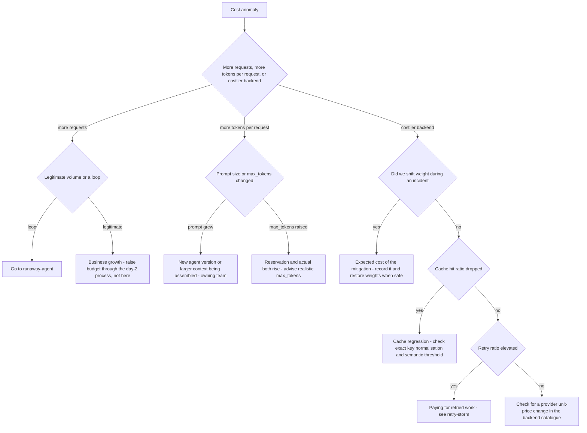

# Runbook: CostAnomaly / CostCenterDailyCeilingBreached

## 1. Alert

| Field | Value |
|---|---|
| Name | `CostAnomaly` (ticket), `CostCenterDailyCeilingBreached` (page) |
| Severity | SEV3 / SEV2 |
| Routing | Jira `AGP` + team channel / `PD-AGENTGATE-PRIMARY` + cost owner |
| SLO | Anomaly surfaced before the consuming team reports it, 95% (SPEC §5) |
| Detector | EWMA + 3σ per agent per hour, plus a hard daily-spend ceiling per cost centre (SPEC §5) |

```promql
# recording rules
# agentgate:cost:hourly_by_agent
sum by (agent, team, cost_center) (increase(agentgate_gateway_cost_usd_total{env="prod"}[1h]))

# agentgate:cost:ewma_1h_by_agent  - exponentially weighted mean over the trailing 7 days
# agentgate:cost:sigma_1h_by_agent - stddev over the same window
# (both produced by a recording rule chain in agentgate-cost.rules.yaml)

- alert: CostAnomaly
  expr: |
    agentgate:cost:hourly_by_agent
      > agentgate:cost:ewma_1h_by_agent + 3 * agentgate:cost:sigma_1h_by_agent
    and agentgate:cost:hourly_by_agent > 5
  for: 15m
  labels: { severity: sev3 }
  annotations:
    summary: "{{ $labels.agent }} hourly spend {{ $value }} USD is 3 sigma above its baseline"
    runbook_url: https://docs.internal/agentgate/runbooks/cost-anomaly.md

- alert: CostCenterDailyCeilingBreached
  expr: |
    sum by (cost_center) (increase(agentgate_gateway_cost_usd_total{env="prod"}[24h]))
      > on(cost_center) group_left agentgate_cost_center_daily_ceiling_usd
  for: 5m
  labels: { severity: sev2 }
```

The `and ... > 5` guard exists because 3σ on a near-zero baseline fires on noise. An agent that
normally spends $0.10/hour going to $2/hour is interesting but not a page.

## 2. What this means

An agent is spending materially more than its own recent history predicts, or a cost centre has
crossed its hard daily ceiling. Cost in AgentGate is computed per request from the backend's unit
prices and attributed to `cost_center` (SPEC §6), so this is real money with a named owner, not an
estimate. The SLO here is unusual and worth remembering at 03:00: our objective is to *tell the
team before they tell us*. If they opened the ticket first, we missed the SLO even if we fix it in
five minutes.

## 3. Impact

Financial, not availability. Nothing is broken from a caller's perspective — which is exactly why
this needs a human, because the system will happily keep spending. In a financial-services client
an uncontrolled spend event against a cost centre has budget-approval consequences and will be
asked about. A daily-ceiling breach may also mean the monthly budget is consumed early, at which
point `quota_exceeded` starts rejecting legitimate traffic and this becomes an availability
problem for that agent.

## 4. First 5 minutes

```bash
export CTX=prod-eastus PROM=https://prometheus.internal
```

1. Who, how much, and since when?

```bash
promtool query instant "$PROM" '
topk(10, sum by (agent, team, cost_center) (increase(agentgate_gateway_cost_usd_total{env="prod"}[1h])))'
promtool query instant "$PROM" '
sum by (cost_center) (increase(agentgate_gateway_cost_usd_total{env="prod"}[24h]))'
```

2. What drove it — more calls, bigger calls, or a more expensive backend? These are three different
   problems.

```bash
# calls
promtool query instant "$PROM" '
sum by (agent) (rate(agentgate_gateway_requests_total{env="prod"}[1h]))
  / sum by (agent) (rate(agentgate_gateway_requests_total{env="prod"}[1h] offset 24h))'

# tokens per call
promtool query instant "$PROM" '
sum by (agent) (rate(agentgate_gateway_tokens_total{env="prod"}[1h]))
  / sum by (agent) (rate(agentgate_gateway_requests_total{env="prod"}[1h]))'

# backend mix
promtool query instant "$PROM" '
sum by (agent, backend) (increase(agentgate_gateway_cost_usd_total{env="prod"}[1h]))'
```

3. Confirm from the authoritative source. Metrics are for alerting; usage records are the ledger:

```bash
psql "$AGENTGATE_PG_URL" -c "
select date_trunc('hour', ts) h, agent_id, backend_model,
       count(*) reqs,
       sum(input_tokens) in_tok, sum(output_tokens) out_tok,
       round(sum(cost_usd)::numeric, 2) usd
  from usage_records
 where ts >= now() - interval '6 hours' and env='prod' and cost_center='CC-4471'
 group by 1,2,3 order by usd desc limit 20;"
```

4. Cache behaviour — a cache that stopped hitting is a very common cost anomaly with no code change
   behind it:

```bash
promtool query instant "$PROM" '
sum by (pool) (rate(agentgate_cache_lookups_total{result="hit"}[1h]))
  / sum by (pool) (rate(agentgate_cache_lookups_total[1h]))'
```

5. Retries — billed work that produced no answer:

```bash
promtool query instant "$PROM" '
sum(rate(agentgate_retry_attempts_total[1h])) / sum(rate(agentgate_gateway_requests_total[1h]))'
```

6. Did a version ship?

```bash
psql "$AGENTGATE_PG_URL" -c "
select a.identity, v.version, v.env, v.promoted_at, v.promoted_by
  from agent_versions v join agents a using (agent_id)
 where v.promoted_at >= now() - interval '24 hours' order by v.promoted_at desc;"
```

## 5. Diagnosis decision tree



## 6. Mitigations

The default action is **notify, do not throttle**. Spending money is not an outage, and cutting a
team off without warning creates one.

### 6.1 Notify the owning team with specifics (blast radius: none)

```bash
psql "$AGENTGATE_PG_URL" -tAc \
  "select owner->>'email', owner->>'oncall', owner->>'cost_center'
     from agents where identity='agent://fsclient/payments-risk/dispute-triage';"
curl -sS "$FLEET/api/v1/chargeback?cost_center=CC-4471&from=$(date -u -d '-24 hours' +%F)&to=$(date -u +%F)" \
  -H "Authorization: Bearer $AGENTGATE_PROBE_TOKEN" | jq '.'
```

Send them: hourly spend now vs baseline, the driver from step 2, and the version correlation.

### 6.2 Restore cache behaviour (blast radius: one pool, positive)

If the hit ratio collapsed:

```bash
agentctl --context "$CTX" cache stats --pool general-chat
agentctl --context "$CTX" cache semantic enable --pool general-chat --threshold 0.97 \
  --reason "INC-1234 restoring hit ratio"
```

Verify the ratio recovers and cost per request falls:

```bash
promtool query instant "$PROM" '
sum(rate(agentgate_gateway_cost_usd_total[10m])) / sum(rate(agentgate_gateway_requests_total[10m]))'
```

Do **not** enable semantic caching on a pool that lacks the data-classification allowance
(SPEC §3.5) to save money. That trade is not ours to make.

### 6.3 Route to a cheaper backend (blast radius: one pool, quality)

```bash
agentctl --context "$CTX" pool set-weights --pool general-chat \
  --weight azure-openai/gpt-4o-mini=80 --weight bedrock/claude-haiku=20 --reason "INC-1234 cost"
```

Only with the owning team's agreement — model choice affects their results, and a quality
regression they did not ask for costs more than the money saved.

### 6.4 Cap the agent's throughput (blast radius: one agent)

When spend is clearly pathological and the team is unreachable:

```bash
agentctl --context "$CTX" quota set --agent agent://fsclient/payments-risk/dispute-triage \
  --env prod --tokens-per-minute 40000 --reason "INC-1234 cost ceiling breach, team paged" --ttl 4h
```

Expected effect: spend rate falls proportionally; the agent gets `429 quota_exceeded` for the
excess. This is a deliberate degradation of someone else's service. Page their on-call **before or
at the same time**, never after.

### 6.5 Hard stop (blast radius: one agent, total)

Reserved for a confirmed runaway or a suspected compromised credential.

```bash
agentctl --context "$CTX" agent suspend --agent agent://fsclient/payments-risk/dispute-triage \
  --env prod --reason "INC-1234 suspected runaway, cost 40x baseline" --approver ic@client.example
```

Requires IC approval and immediate notification. See [runaway-agent.md](runaway-agent.md).

## 7. Rollback

| Mitigation | Undo |
|---|---|
| 6.2 | `agentctl --context "$CTX" cache semantic disable --pool general-chat` if latency suffers |
| 6.3 | Restore committed weights from `deploy/k8s/overlays/prod/pools.yaml` |
| 6.4 | `agentctl --context "$CTX" quota reset --agent agent://... --env prod` once the team confirms the driver is fixed. TTL expires it automatically; confirm rather than assume |
| 6.5 | `agentctl --context "$CTX" agent resume --agent agent://... --env prod --approver ...` — requires the same approval level as the suspension |

## 8. Escalation

- Daily ceiling breach: page the cost owner for that cost centre and the platform lead. This is the
  one alert where a finance stakeholder is on the escalation path from the start.
- Projected monthly overrun: escalate to L4 during business hours with the projection, not at
  03:00. A spend curve is not an emergency.
- Suspected credential compromise (spend from an agent that should be idle, or from an unexpected
  runtime): security duty officer immediately, and suspend first. Cost anomalies are a legitimate
  detection channel for stolen credentials.
- If the anomaly was reported by the consuming team before our alert fired, record it — that is an
  SLO miss on the 95% detection objective and belongs in the monthly review.

## 9. Post-incident

```bash
psql "$AGENTGATE_PG_URL" -c "
select date_trunc('hour', ts) h, round(sum(cost_usd)::numeric,2) usd, count(*) reqs,
       round(avg(input_tokens)::numeric,0) avg_in, round(avg(output_tokens)::numeric,0) avg_out,
       count(*) filter (where cache='hit') hits
  from usage_records
 where ts >= now() - interval '48 hours' and cost_center='CC-4471' and env='prod'
 group by 1 order by 1;" > /tmp/inc-cost.txt
```

Capture: total excess spend in dollars; the driver; time from onset to detection (the SLO number);
whether the team found out from us or from their own bill; and whether the `cost_projection`
promotion gate should have predicted it. If a version shipped that changed cost per request by more
than 2x, the gate needs a tighter check — that is a finding, not an observation.

## 10. Related

- [runaway-agent.md](runaway-agent.md)
- [quota-saturation.md](quota-saturation.md)
- [retry-storm.md](retry-storm.md) — retried work is billed work
- [cache-poisoning-suspected.md](cache-poisoning-suspected.md) — a cache incident with a cost signature
- [trace-attribution-broken.md](trace-attribution-broken.md) — spend with no owner
- Dashboards: `$GRAFANA/d/agentgate-cost`

Last game-day exercise: 2026-06-30 (synthetic 20x spend on a staging agent, measured detection lag).
