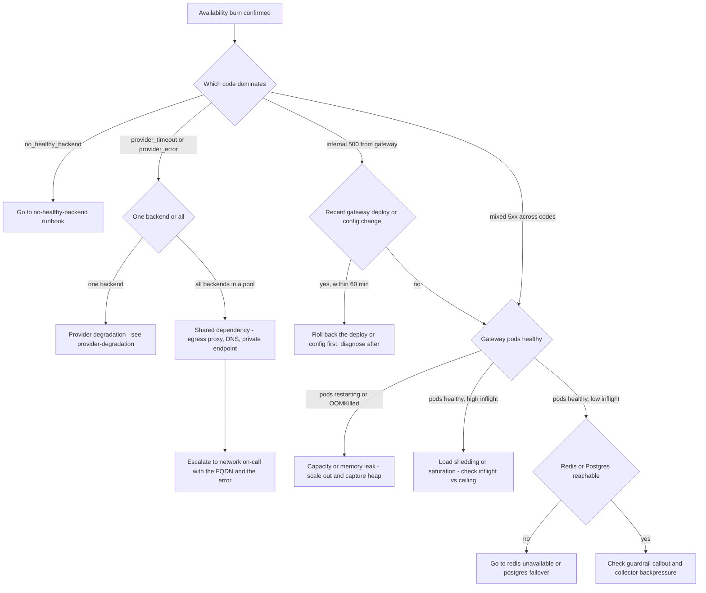

# Runbook: GatewayAvailabilityBurnFast / GatewayAvailabilityBurnSlow

## 1. Alert

| Field | Value |
|---|---|
| Name | `GatewayAvailabilityBurnFast` (page), `GatewayAvailabilityBurnSlow` (ticket) |
| Severity | SEV1 for fast burn, SEV3 for slow burn |
| Routing | `PD-AGENTGATE-PRIMARY` (fast), Jira `AGP` queue (slow) |
| SLO | Gateway availability 99.9% over 28d, error budget 40m19s (SPEC §5) |
| Rules file | `deploy/prometheus/rules/agentgate-slo.rules.yaml` |

SLI, as recorded:

```promql
# agentgate:gateway_availability:ratio_rate5m
  sum(rate(agentgate_gateway_requests_total{env="prod",status!~"5..",code!="no_healthy_backend"}[5m]))
/ sum(rate(agentgate_gateway_requests_total{env="prod"}[5m]))

# agentgate:gateway_error:ratio_rate5m  (and the 30m / 1h / 6h / 3d twins)
1 - agentgate:gateway_availability:ratio_rate5m
```

Fast page — 2% of budget in 1h, and 5% in 6h, each with a short confirmation window:

```promql
(
    agentgate:gateway_error:ratio_rate1h  > (14.4 * 0.001)
and agentgate:gateway_error:ratio_rate5m  > (14.4 * 0.001)
)
or
(
    agentgate:gateway_error:ratio_rate6h  > (6 * 0.001)
and agentgate:gateway_error:ratio_rate30m > (6 * 0.001)
)
```

Slow ticket — 10% of budget in 3 days:

```promql
    agentgate:gateway_error:ratio_rate3d > (1 * 0.001)
and agentgate:gateway_error:ratio_rate6h > (1 * 0.001)
```

## 2. What this means

The gateway is returning errors that count against availability — 5xx responses, or
`no_healthy_backend` — fast enough that the 28-day error budget will be gone well before the
window closes. At a burn rate of 14.4 the entire budget disappears in under two days. This alert
does not tell you *why*; it tells you that consuming agents are being refused service right now
and that you have minutes, not hours. Note what is **not** counted: 4xx from quota, rate limits,
guardrail blocks and bad requests are the platform working correctly and do not burn budget.

## 3. Impact

Every agent whose traffic passes through the affected gateway pods. In practice: chat and
embedding calls fail, agent frameworks surface the failure as a tool or model error, and a
LangGraph or Semantic Kernel run either retries into the same wall or aborts mid-workflow.
Consuming teams see 502/503/504 in their own dashboards and will open tickets within minutes.
For `payments-risk` agents in the dispute-triage path, a failed run means a case sits unclassified,
which has a downstream SLA of its own. Streaming callers may have received partial content before
the failure, which is worse than a clean error because the agent's own state may be inconsistent.

## 4. First 5 minutes

```bash
export CTX=prod-eastus NS=agentgate PROM=https://prometheus.internal GW=https://gateway.agentgate.internal
```

1. Confirm it is real and find the shape of it — error ratio split by `code`:

```bash
promtool query instant "$PROM" '
topk(10,
  sum by (code, status) (rate(agentgate_gateway_requests_total{env="prod", status=~"5.."}[5m]))
)'
```

2. Is it everything, or one pool / one backend / one tenant?

```bash
promtool query instant "$PROM" '
sum by (pool) (rate(agentgate_gateway_requests_total{env="prod",status=~"5.."}[5m]))
  / sum by (pool) (rate(agentgate_gateway_requests_total{env="prod"}[5m]))'

promtool query instant "$PROM" '
topk(5, sum by (backend) (rate(agentgate_gateway_requests_total{env="prod",status=~"5.."}[5m])))'

promtool query instant "$PROM" '
topk(5, sum by (tenant, team) (rate(agentgate_gateway_requests_total{env="prod",status=~"5.."}[5m])))'
```

3. How much budget is left? This decides the severity you declare.

```bash
promtool query instant "$PROM" '
1 - (avg_over_time(agentgate:gateway_error:ratio_rate5m[28d]) / 0.001)'
# Result is the fraction of the 40m19s budget remaining. Below 0.25 → SEV1 regardless of rate.
```

4. Is the gateway itself healthy, or is this upstream?

```bash
kubectl --context "$CTX" -n "$NS" get pods -l app=gateway -o wide
kubectl --context "$CTX" -n "$NS" top pods -l app=gateway
kubectl --context "$CTX" -n "$NS" get events --sort-by=.lastTimestamp | tail -20
curl -sS -o /dev/null -D- "$GW/readyz"
```

5. Did something change? Deploys and config changes are the cause more often than anything else.

```bash
kubectl --context "$CTX" -n "$NS" rollout history deploy/gateway | tail -5
kubectl --context "$CTX" -n "$NS" get cm gateway-config -o jsonpath='{.metadata.annotations.agentgate\.io/updated-at}{"\n"}'
```

6. Take one real failing request end to end and read the headers. This usually names the cause:

```bash
curl -sS -D- -o /dev/null -X POST "$GW/v1/chat/completions" \
  -H "Authorization: Bearer $AGENTGATE_PROBE_TOKEN" \
  -H 'content-type: application/json' \
  -d '{"model":"general-chat","messages":[{"role":"user","content":"ping"}],"max_tokens":8}' \
  | grep -Ei 'x-agentgate-|retry-after|^HTTP'
```

Open, in this order: `$GRAFANA/d/agentgate-gateway-slo`, then `$GRAFANA/d/agentgate-pools`.

## 5. Diagnosis decision tree



## 6. Mitigations

Ordered smallest blast radius first. Do not skip ahead unless the diagnosis is unambiguous.

### 6.1 Roll back the most recent change (blast radius: the change)

If a gateway deploy or `gateway-config` change landed within the burn window, this is almost
certainly it. Roll back before you finish diagnosing.

```bash
kubectl --context "$CTX" -n "$NS" rollout undo deploy/gateway
kubectl --context "$CTX" -n "$NS" rollout status deploy/gateway --timeout=180s
```

Expected effect: error ratio falls within one scrape interval plus pod start time, typically 2–3
minutes. Verify:

```bash
promtool query instant "$PROM" 'agentgate:gateway_error:ratio_rate5m'
```

### 6.2 Drain the single failing backend (blast radius: one backend)

If one backend dominates the 5xx and failover capacity exists in the pool:

```bash
agentctl --context "$CTX" backend drain --pool general-chat --backend azure-openai/gpt-4o-mini \
  --reason "INC-1234 5xx burn" --ttl 60m
```

Expected effect: the backend stops receiving new requests; in-flight requests finish; traffic
shifts to the remaining weight in the tier, then to the priority-2 failover tier. Verify:

```bash
promtool query instant "$PROM" '
sum by (backend) (rate(agentgate_gateway_requests_total{env="prod",pool="general-chat"}[2m]))'
# The drained backend should fall to zero within ~60s.
```

### 6.3 Shift pool weights away from a degraded provider (blast radius: one pool)

```bash
agentctl --context "$CTX" pool set-weights --pool general-chat \
  --weight azure-openai/gpt-4o-mini=10 --weight bedrock/claude-haiku=90 \
  --reason "INC-1234"
agentctl --context "$CTX" pool show --pool general-chat
```

Expected effect: request share follows the new weights within roughly 30 seconds; cost per request
changes, which is acceptable during an incident but must be noted for chargeback.

### 6.4 Scale the gateway out (blast radius: cost, none functional)

If inflight is at the ceiling and shedding is active:

```bash
kubectl --context "$CTX" -n "$NS" scale deploy/gateway --replicas=24
kubectl --context "$CTX" -n "$NS" rollout status deploy/gateway --timeout=300s
```

Expected effect: `agentgate_gateway_shed_total` stops increasing; inflight per pod drops.
Verify:

```bash
promtool query instant "$PROM" 'sum(rate(agentgate_gateway_shed_total[2m]))'
promtool query instant "$PROM" 'sum by (pool) (agentgate_gateway_inflight)'
```

### 6.5 Shed batch traffic deliberately (blast radius: batch-priority agents)

Protects interactive agents at the cost of batch ones. This is a policy decision; announce it in
the incident channel before you run it.

```bash
agentctl --context "$CTX" admission set --tier batch --max-concurrency 0 \
  --reason "INC-1234 protecting interactive tier" --ttl 30m
```

Expected effect: `x-agentgate-request-priority: batch` requests receive 429 with `Retry-After`;
interactive error ratio recovers. Verify with the split:

```bash
promtool query instant "$PROM" '
sum by (code) (rate(agentgate_gateway_requests_total{env="prod",status="429"}[2m]))'
```

### 6.6 Regional failover (blast radius: everything, but recovers everything)

Last resort, and only with L4 approval. Shifts the front door to the paired region.

```bash
agentctl --context prod-westus health check --deep     # confirm the target region is actually healthy
scripts/frontdoor-weight.sh --set prod-eastus=0 --set prod-westus=100 --reason "INC-1234"
```

Expected effect: new requests land in `prod-westus` within DNS/front-door propagation, 30–90s.
In-flight streams in `prod-eastus` terminate with an SSE `error` frame. Verify:

```bash
promtool query instant "$PROM" 'sum by (region) (rate(agentgate_gateway_requests_total[2m]))'
```

## 7. Rollback

| Mitigation | Undo |
|---|---|
| 6.1 rollout undo | `kubectl --context "$CTX" -n "$NS" rollout undo deploy/gateway --to-revision=<the one you left>` after the fix is verified in staging |
| 6.2 backend drain | `agentctl --context "$CTX" backend undrain --pool general-chat --backend azure-openai/gpt-4o-mini` — the TTL also expires it automatically |
| 6.3 weight shift | `agentctl --context "$CTX" pool set-weights --pool general-chat --weight azure-openai/gpt-4o-mini=60 --weight bedrock/claude-haiku=40` (the committed values live in `deploy/k8s/overlays/prod/pools.yaml`; restore from git, do not restore from memory) |
| 6.4 scale out | Leave it. Scale back down in business hours after 24h of stable traffic, via the HPA min replica setting, not manually |
| 6.5 batch shed | `agentctl --context "$CTX" admission reset --tier batch` |
| 6.6 regional failover | Fail back only after 30 min of clean SLI in the target region and an explicit IC decision: `scripts/frontdoor-weight.sh --set prod-eastus=100 --set prod-westus=0`. Ramp 25/50/100 rather than switching in one step |

Every `agentctl` mutation is recorded with actor, reason and timestamp. Retrieve the change log for
the postmortem:

```bash
agentctl --context "$CTX" audit list --since 4h --kind mutation -o json | jq -r '.[] | "\(.ts) \(.actor) \(.command) \(.reason)"'
```

## 8. Escalation

- **Immediately (do not wait):** if the burn rate is above 14.4 and there is no obvious change to
  roll back, page L2 secondary. Two people, one driving, one reading.
- **At 15 minutes unmitigated:** assign an IC formally if you have not; declare SEV1 in
  `#inc-agentgate`; start the client comms clock (30 min for first external update).
- **At 45 minutes unmitigated:** L4 platform engineering lead.
- **Provider-caused:** open the vendor bridge in parallel with mitigation — do not serialise.
- **If remaining error budget drops below 25%:** notify the service owner and the client incident
  manager even if the incident is over, because the next incident this month is a SEV1 by rule.

## 9. Post-incident

Capture while it is fresh — most of this is unavailable in a week:

```bash
# Alert and SLI window
promtool query range "$PROM" 'agentgate:gateway_error:ratio_rate5m' \
  --start "$(date -u -d '-3 hours' +%FT%TZ)" --end "$(date -u +%FT%TZ)" --step 1m > /tmp/inc-1234-sli.txt

# Error mix by code
promtool query range "$PROM" 'sum by (code) (rate(agentgate_gateway_requests_total{env="prod",status=~"5.."}[5m]))' \
  --start "$(date -u -d '-3 hours' +%FT%TZ)" --end "$(date -u +%FT%TZ)" --step 1m > /tmp/inc-1234-codes.txt

# Pod-level evidence before it rotates out
kubectl --context "$CTX" -n "$NS" logs deploy/gateway --since=3h --tail=-1 > /tmp/inc-1234-gateway.log
kubectl --context "$CTX" -n "$NS" describe pods -l app=gateway > /tmp/inc-1234-pods.txt

# Change log
agentctl --context "$CTX" audit list --since 6h -o json > /tmp/inc-1234-audit.json
```

Also record: three example `x-agentgate-request-id` / `x-agentgate-trace-id` pairs from failed
requests, the exact budget consumed, which consuming teams noticed and how they found out (their
own alerting or ours), and the wall-clock gap between first customer impact and the page firing.
That gap is the number that improves detection.

## 10. Related

- [no-healthy-backend.md](no-healthy-backend.md) — when `code="no_healthy_backend"` dominates
- [provider-degradation.md](provider-degradation.md) — one provider, one region
- [retry-storm.md](retry-storm.md) — availability burn that is self-inflicted
- [circuit-breaker-open.md](circuit-breaker-open.md)
- [redis-unavailable.md](redis-unavailable.md) — admission control failing closed
- [incident-response.md](incident-response.md) — declaring and communicating
- Dashboards: `$GRAFANA/d/agentgate-gateway-slo`, `$GRAFANA/d/agentgate-pools`

Last game-day exercise: 2026-07-14 (regional failover, 6.6 path).
