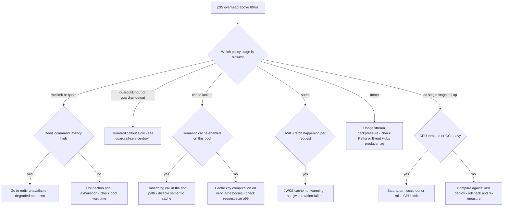

# Runbook: GatewayLatencyRegression

## 1. Alert

| Field | Value |
|---|---|
| Name | `GatewayLatencyRegression` |
| Severity | SEV2 (page) |
| Routing | `PD-AGENTGATE-PRIMARY` |
| SLO | p95 gateway overhead, excluding provider time, < 60ms for 99% of minutes (SPEC §5) |

```promql
# recording rule
# agentgate:gateway_overhead:p95_1m
histogram_quantile(0.95,
  sum by (le, env) (rate(agentgate_gateway_duration_seconds_bucket{phase="overhead"}[1m])))

# alert: sustained breach
- alert: GatewayLatencyRegression
  expr: agentgate:gateway_overhead:p95_1m{env="prod"} > 0.060
  for: 10m
```

The companion budget alert, which catches death by a thousand minutes rather than a hard breach:

```promql
- alert: GatewayLatencyBudgetBurn
  expr: avg_over_time((agentgate:gateway_overhead:p95_1m{env="prod"} > bool 0.060)[6h:1m]) > 0.01
  for: 30m
```

## 2. What this means

AgentGate itself is slow — not the model provider. `phase="overhead"` is wall-clock time minus
the time spent inside the backend call, so this is the cost of our own policy chain: auth, rate
limiting, quota reservation in Redis, guardrail callout, cache lookup, transformation, routing,
metering. The p95 of that has been above 60ms for ten minutes. Every consuming agent is paying
this tax on every call, and an agent that makes six model calls per run pays it six times.

Check `phase` before you do anything else. If `phase="total"` is up but `phase="overhead"` is flat,
this is provider latency and this is the wrong runbook — go to
[provider-degradation.md](provider-degradation.md).

## 3. Impact

Not an outage; a tax. Multi-step agents feel it multiplied by their step count, so a 40ms
regression becomes a quarter of a second on a six-step dispute-triage run. Interactive agents with
a human waiting are the first to complain. Batch agents may not notice at all. Callers that set
tight deadlines start seeing `client_timeout` (408) and their own retries add load, which is how a
latency regression becomes an availability incident — watch for that transition.

## 4. First 5 minutes

```bash
export CTX=prod-eastus NS=agentgate PROM=https://prometheus.internal
```

1. Confirm the split between our time and provider time:

```bash
promtool query instant "$PROM" '
histogram_quantile(0.95, sum by (le, phase) (rate(agentgate_gateway_duration_seconds_bucket{env="prod"}[5m])))'
```

2. Find the slow stage. This is the whole point of per-stage timing (SPEC §3.2) — do not guess:

```bash
promtool query instant "$PROM" '
topk(5, histogram_quantile(0.95,
  sum by (le, stage) (rate(agentgate_gateway_policy_duration_seconds_bucket{env="prod"}[5m]))))'
```

Stages, in execution order: `trace.start authn authz admission ratelimit.requests quota.tokens
guardrail.input cache.lookup transform.request route invoke transform.response guardrail.output
cache.store meter trace.end`.

3. Check the two stages that call the network and are the usual culprits:

```bash
# Redis: rate limit + quota + cache
promtool query instant "$PROM" '
histogram_quantile(0.99, sum by (le, command) (rate(agentgate_redis_command_duration_seconds_bucket[5m])))'

# Guardrail callout
promtool query instant "$PROM" '
histogram_quantile(0.95, sum by (le, provider) (rate(agentgate_guardrail_callout_duration_seconds_bucket[5m])))'
```

4. Is it saturation rather than a code path?

```bash
promtool query instant "$PROM" 'sum by (pool) (agentgate_gateway_inflight)'
kubectl --context "$CTX" -n "$NS" top pods -l app=gateway
promtool query instant "$PROM" '
rate(container_cpu_cfs_throttled_seconds_total{namespace="agentgate",pod=~"gateway-.*"}[5m])'
promtool query instant "$PROM" 'rate(go_gc_duration_seconds_count{job="gateway"}[5m])'
```

5. Did anything change?

```bash
kubectl --context "$CTX" -n "$NS" rollout history deploy/gateway | tail -5
agentctl --context "$CTX" audit list --since 6h --kind mutation
```

6. Take one slow trace and read it. One trace beats ten dashboards here:

```bash
curl -sS -D- -o /dev/null -X POST "$GW/v1/chat/completions" \
  -H "Authorization: Bearer $AGENTGATE_PROBE_TOKEN" -H 'content-type: application/json' \
  -d '{"model":"general-chat","messages":[{"role":"user","content":"ping"}],"max_tokens":8}' \
  | grep -i 'x-agentgate-trace-id'
# Open $GRAFANA/d/agentgate-gateway-latency and paste the trace id into the trace panel.
```

## 5. Diagnosis decision tree



## 6. Mitigations

### 6.1 Roll back the last gateway change (blast radius: the change)

```bash
kubectl --context "$CTX" -n "$NS" rollout undo deploy/gateway
kubectl --context "$CTX" -n "$NS" rollout status deploy/gateway --timeout=180s
```

Expected effect: p95 overhead returns to baseline within 3–5 minutes. Verify with
`agentgate:gateway_overhead:p95_1m`.

### 6.2 Disable semantic cache on the affected pool (blast radius: one pool, cost only)

Semantic matching puts an embedding call in the request path. It is optional by design (SPEC §3.5).

```bash
agentctl --context "$CTX" cache semantic disable --pool general-chat --reason "INC-1234 latency"
```

Expected effect: `cache.lookup` stage p95 drops to sub-millisecond; cache hit ratio falls, cost per
request rises. Verify:

```bash
promtool query instant "$PROM" '
sum by (result) (rate(agentgate_cache_lookups_total{pool="general-chat"}[2m]))'
```

### 6.3 Scale out (blast radius: cost)

```bash
kubectl --context "$CTX" -n "$NS" scale deploy/gateway --replicas=24
```

Only if CPU throttling or inflight-per-pod is the evidence. Scaling a lock-contention or
downstream-latency problem makes it worse, not better. Verify throttling stops:

```bash
promtool query instant "$PROM" '
sum(rate(container_cpu_cfs_throttled_seconds_total{namespace="agentgate",pod=~"gateway-.*"}[2m]))'
```

### 6.4 Widen the Redis connection pool (blast radius: Redis)

If `agentgate_redis_pool_wait_seconds` is non-trivial while Redis server latency is fine:

```bash
kubectl --context "$CTX" -n "$NS" patch cm gateway-config --type merge \
  -p '{"data":{"redis.pool_size":"64","redis.min_idle_conns":"16"}}'
kubectl --context "$CTX" -n "$NS" rollout restart deploy/gateway
```

Expected effect: pool wait time approaches zero. Verify with
`histogram_quantile(0.99, sum by (le) (rate(agentgate_redis_pool_wait_seconds_bucket[2m])))`.

### 6.5 Switch guardrail callout to the local builtin engine (blast radius: detection quality)

Only for pools whose policy is `fail_open`. **Never** for a pool with
`data_classification=restricted` without risk-and-compliance approval — see
[day-2-operations.md](day-2-operations.md#8-switching-guardrail-failure-mode).

```bash
agentctl --context "$CTX" guardrail set-provider --pool general-chat --provider builtin \
  --reason "INC-1234, callout p95 3.2s" --ttl 60m
```

## 7. Rollback

| Mitigation | Undo |
|---|---|
| 6.1 | Re-deploy the fixed build; do not re-apply the reverted one |
| 6.2 | `agentctl --context "$CTX" cache semantic enable --pool general-chat --threshold 0.97` |
| 6.3 | Reduce HPA `minReplicas` back in business hours, one step at a time, watching p95 |
| 6.4 | `kubectl patch cm gateway-config --type merge -p '{"data":{"redis.pool_size":"32","redis.min_idle_conns":"8"}}'` then rollout restart. Restore the committed value from `deploy/k8s/overlays/prod/` rather than typing one |
| 6.5 | `agentctl --context "$CTX" guardrail set-provider --pool general-chat --provider callout` — do this the moment the callout service recovers, and confirm the pool's decisions resume |

## 8. Escalation

- If overhead p95 is above 200ms, treat it as an availability incident in waiting: callers with
  deadlines will start timing out. Raise to SEV1 and page L2.
- If the slow stage is `guardrail.*` and the pool is `fail_closed`, involve risk and compliance
  before you change anything about guardrail behaviour.
- If Redis is the cause and it is a managed service, engage the cloud provider in parallel.
- If the regression traces to a specific build, involve the domain owner for that code path; a
  latency regression that shipped is a release-process finding, not just an incident.

## 9. Post-incident

- Export the per-stage p95 range for the incident window; the stage breakdown is the story:

```bash
promtool query range "$PROM" \
  'histogram_quantile(0.95, sum by (le, stage) (rate(agentgate_gateway_policy_duration_seconds_bucket{env="prod"}[5m])))' \
  --start "$(date -u -d '-4 hours' +%FT%TZ)" --end "$(date -u +%FT%TZ)" --step 1m > /tmp/inc-stages.txt
```

- Save two trace ids: one from before the regression, one from during. Side by side they are the
  clearest artefact a postmortem can have.
- Record how many minutes of the "99% of minutes" objective were consumed this month.
- If a build caused it, note whether the load test in `test/load/` would have caught it. If not,
  the fix is a threshold in `test/load/k6/baseline.js`, not a promise to be careful.

## 10. Related

- [gateway-ttft-regression.md](gateway-ttft-regression.md) — the streaming equivalent
- [provider-degradation.md](provider-degradation.md) — when it is their time, not ours
- [redis-unavailable.md](redis-unavailable.md)
- [guardrail-service-down.md](guardrail-service-down.md)
- [collector-backpressure.md](collector-backpressure.md) — export blocking can show up as overhead
- Dashboards: `$GRAFANA/d/agentgate-gateway-latency`, `$GRAFANA/d/agentgate-gateway-slo`

Last game-day exercise: 2026-06-02 (injected 500ms Redis latency).
