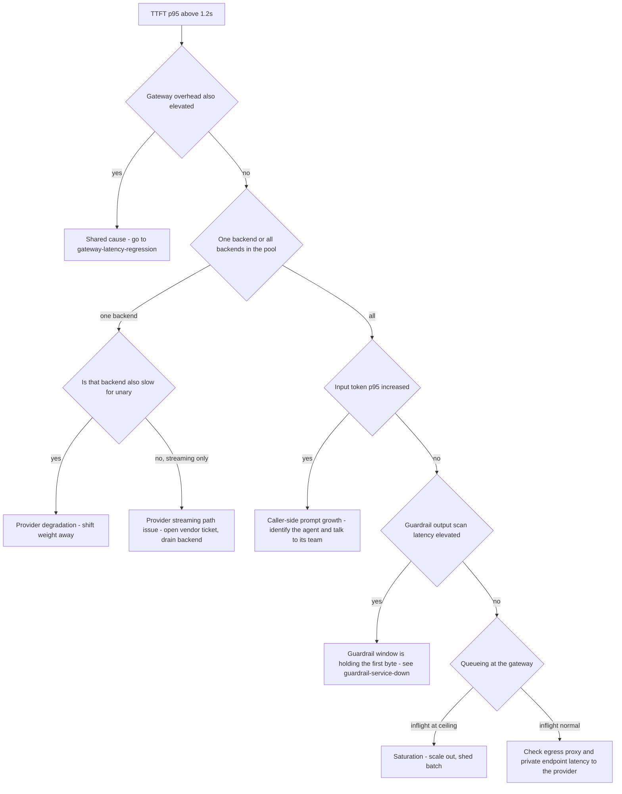

# Runbook: GatewayTTFTRegression

## 1. Alert

| Field | Value |
|---|---|
| Name | `GatewayTTFTRegression` |
| Severity | SEV2 (page) |
| Routing | `PD-AGENTGATE-PRIMARY` |
| SLO | p95 time-to-first-token < 1200ms, 99% (SPEC §5) |

```promql
# agentgate:gateway_ttft:p95_5m
histogram_quantile(0.95, sum by (le, pool) (rate(agentgate_gateway_ttft_seconds_bucket[5m])))

- alert: GatewayTTFTRegression
  expr: agentgate:gateway_ttft:p95_5m > 1.2
  for: 10m
  labels: { severity: sev2 }
  annotations:
    runbook_url: https://docs.internal/agentgate/runbooks/gateway-ttft-regression.md
```

## 2. What this means

Streaming requests are taking more than 1.2 seconds to produce their first token at p95. TTFT is
gateway overhead **plus** provider prefill **plus** anything we do before releasing the first byte
— which, for AgentGate, includes the output guardrail's first 256-token scan window (SPEC §3.6).
A human is usually waiting on the other end of a streaming response, so this is the metric users
feel most directly even though nothing has failed.

## 3. Impact

Interactive agents look frozen. Chat surfaces show a spinner past the point where users start
clicking again, which generates duplicate requests and inflates load. Agents with a client-side
first-token deadline abort and retry, producing `client_closed_request` (499) on our side. Batch
and unary callers are unaffected — check the `stream` label before you assume fleet-wide impact.

## 4. First 5 minutes

```bash
export CTX=prod-eastus NS=agentgate PROM=https://prometheus.internal GW=https://gateway.agentgate.internal
```

1. Scope it: which pool, which backend?

```bash
promtool query instant "$PROM" '
histogram_quantile(0.95, sum by (le, pool, backend) (rate(agentgate_gateway_ttft_seconds_bucket[5m])))'
```

2. Is it us or the provider? Compare TTFT against gateway overhead on the same window:

```bash
promtool query instant "$PROM" '
histogram_quantile(0.95, sum by (le) (rate(agentgate_gateway_duration_seconds_bucket{phase="overhead",stream="true"}[5m])))'
```

If overhead is flat near 40ms and TTFT is 2s, the prefill is the provider's.

3. Check the output guardrail window, which sits directly between prefill and first byte:

```bash
promtool query instant "$PROM" '
histogram_quantile(0.95, sum by (le, provider) (rate(agentgate_guardrail_callout_duration_seconds_bucket[5m])))'
promtool query instant "$PROM" 'agentgate_guardrail_failmode'
```

4. Are prompts suddenly much larger? Prefill time scales with input tokens.

```bash
promtool query instant "$PROM" '
histogram_quantile(0.95, sum by (le, agent) (rate(agentgate_gateway_request_tokens_bucket{direction="input"}[10m])))'
promtool query instant "$PROM" '
topk(5, sum by (agent) (rate(agentgate_gateway_tokens_total{direction="input",env="prod"}[10m])))'
```

5. Measure it yourself, end to end, and look at the frame timing:

```bash
curl -sS -N -X POST "$GW/v1/chat/completions" \
  -H "Authorization: Bearer $AGENTGATE_PROBE_TOKEN" -H 'content-type: application/json' \
  -H 'accept: text/event-stream' \
  -d '{"model":"general-chat","stream":true,"stream_options":{"include_usage":true},
       "messages":[{"role":"user","content":"count to five"}],"max_tokens":64}' \
  | ts '%.s' | head -20
# The delta between the request and the first "data:" line is the observed TTFT.
```

6. Open `$GRAFANA/d/agentgate-streaming`. The TTFT-by-backend heatmap tells you in one glance
   whether this is one backend or the whole tier.

## 5. Diagnosis decision tree



## 6. Mitigations

### 6.1 Shift weight to the faster backend (blast radius: one pool)

```bash
promtool query instant "$PROM" '
histogram_quantile(0.95, sum by (le, backend) (rate(agentgate_gateway_ttft_seconds_bucket{pool="general-chat"}[5m])))'

agentctl --context "$CTX" pool set-weights --pool general-chat \
  --weight azure-openai/gpt-4o-mini=20 --weight bedrock/claude-haiku=80 --reason "INC-1234 TTFT"
```

Expected effect: pool p95 TTFT moves toward the faster backend's value within 2–3 minutes.

### 6.2 Reduce the output guardrail window (blast radius: detection granularity)

The window size trades TTFT against how much text is scanned before release. Halving it halves the
guardrail contribution to TTFT.

```bash
agentctl --context "$CTX" guardrail set-window --pool general-chat --tokens 128 \
  --reason "INC-1234" --ttl 4h
```

Expected effect: TTFT drops by roughly the time to generate 128 tokens on that backend. Verify on
the streaming dashboard and confirm guardrail decisions are still being made:

```bash
promtool query instant "$PROM" 'sum by (action) (rate(agentgate_guardrail_decisions_total[5m]))'
```

Do not set this below 64 tokens: small windows increase callout QPS sharply and can push the
guardrail service into its own incident.

### 6.3 Drain a backend whose streaming path is broken (blast radius: one backend)

```bash
agentctl --context "$CTX" backend drain --pool general-chat --backend azure-openai/gpt-4o-mini \
  --reason "INC-1234 streaming prefill 4s" --ttl 2h
```

Verify traffic moved and TTFT recovered:

```bash
promtool query instant "$PROM" 'sum by (backend) (rate(agentgate_gateway_requests_total{pool="general-chat",stream="true"}[2m]))'
```

### 6.4 Scale out (blast radius: cost)

Only when inflight is at ceiling. Streaming connections hold a goroutine and a buffer for their
whole life, so streaming saturation arrives before CPU saturation does.

```bash
kubectl --context "$CTX" -n "$NS" scale deploy/gateway --replicas=24
promtool query instant "$PROM" 'sum by (pool) (agentgate_gateway_inflight)'
```

### 6.5 Ask the heavy agent to shrink its prompt (blast radius: one agent, slow but correct)

If one agent's input token p95 tripled, the fix is theirs. Get their on-call from the registry and
call them; do not open a ticket and go back to bed.

```bash
psql "$AGENTGATE_PG_URL" -tAc \
  "select owner->>'email', owner->>'oncall' from agents where agent_id = 'agt_01J8Z9X2QK';"
```

## 7. Rollback

| Mitigation | Undo |
|---|---|
| 6.1 | Restore committed weights from `deploy/k8s/overlays/prod/pools.yaml` once the backend's TTFT is back under 1s for 30 min |
| 6.2 | `agentctl --context "$CTX" guardrail set-window --pool general-chat --tokens 256`. The TTL expires it automatically; do not rely on that during a change freeze |
| 6.3 | `agentctl --context "$CTX" backend undrain --pool general-chat --backend azure-openai/gpt-4o-mini`, then watch TTFT for 15 min before walking away |
| 6.4 | HPA `minReplicas` back down in business hours |
| 6.5 | Nothing to roll back; close the loop with the team in the postmortem |

## 8. Escalation

- TTFT above 5s at p95 for more than 15 minutes: raise to SEV1. At that point interactive agents
  are effectively unusable even though availability looks perfect.
- One provider, one region, and unary is fine: vendor bridge, and drain the backend rather than
  waiting for them.
- Guardrail window changes on a `fail_closed` or `restricted` pool: risk and compliance approval
  required before the change, not after.

## 9. Post-incident

- Export TTFT percentiles by backend across the window, plus the inter-token series — they
  separate "slow to start" from "slow throughout":

```bash
promtool query range "$PROM" \
  'histogram_quantile(0.95, sum by (le, backend) (rate(agentgate_gateway_ttft_seconds_bucket[5m])))' \
  --start "$(date -u -d '-4 hours' +%FT%TZ)" --end "$(date -u +%FT%TZ)" --step 1m > /tmp/inc-ttft.txt
```

- Record whether any caller hit a first-token deadline and retried, and how much extra load that
  produced. That number justifies the client-side guidance we give consuming teams.
- Note the guardrail window value in force during the incident and whether it was changed.
- Confirm `test/load/k6/streaming.js` thresholds match the SLO; if the incident was invisible to
  the load test, fix the test.

## 10. Related

- [streaming-stalls.md](streaming-stalls.md) — stalls after the first token
- [gateway-latency-regression.md](gateway-latency-regression.md)
- [provider-degradation.md](provider-degradation.md)
- [guardrail-service-down.md](guardrail-service-down.md)
- Dashboards: `$GRAFANA/d/agentgate-streaming`, `$GRAFANA/d/agentgate-pools`

Last game-day exercise: 2026-05-19 (guardrail callout latency injection).
