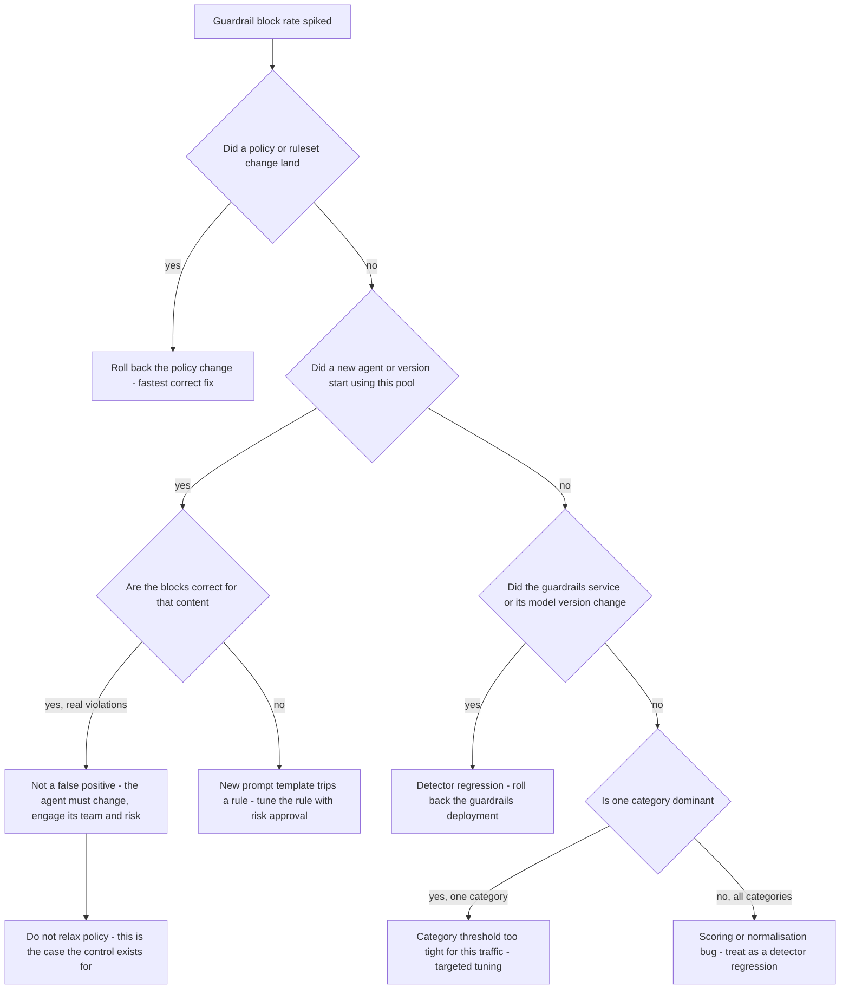

# Runbook: GuardrailFalsePositiveSpike

## 1. Alert

| Field | Value |
|---|---|
| Name | `GuardrailFalsePositiveSpike` |
| Severity | SEV2 (page) |
| Routing | `PD-AGENTGATE-PRIMARY`; risk and compliance notified before any policy change |
| Error code | `403 guardrail_blocked`, response header `x-agentgate-guardrail: blocked:<category>` (SPEC §2.3, §2.4) |

```promql
- alert: GuardrailFalsePositiveSpike
  expr: |
    sum by (pool, category) (rate(agentgate_guardrail_decisions_total{action="block"}[10m]))
      > 5 * sum by (pool, category) (rate(agentgate_guardrail_decisions_total{action="block"}[1h] offset 24h))
    and sum by (pool, category) (rate(agentgate_guardrail_decisions_total{action="block"}[10m])) > 0.1
  for: 10m
  labels: { severity: sev2 }
  annotations:
    summary: "Guardrail blocks for {{ $labels.category }} on {{ $labels.pool }} are 5x baseline"
    runbook_url: https://docs.internal/agentgate/runbooks/guardrail-false-positive-spike.md

# Block ratio high enough that the pool is effectively unusable
- alert: GuardrailBlockRatioHigh
  expr: |
    sum by (pool) (rate(agentgate_guardrail_decisions_total{action="block"}[10m]))
    / sum by (pool) (rate(agentgate_guardrail_decisions_total[10m])) > 0.10
  for: 10m
  labels: { severity: sev2 }
```

## 2. What this means

Guardrail blocks have jumped well above their normal rate for a category and pool. Three things
produce that, and they need very different responses:

1. **A policy or ruleset change** made the detector stricter — our change, our fix.
2. **Traffic genuinely changed** — a new agent, a new prompt template, or real content that should
   be blocked. Not a false positive at all.
3. **A detector regression** — a model or regex update misfiring.

The alert is named "false positive spike" because that is the usual cause, but you must not assume
it. Treating real blocks as false positives and relaxing the policy is the worst possible outcome
of this runbook.

## 3. Impact

Agents on the affected pool receive `403 guardrail_blocked` and cannot complete their work. This is
a 4xx, so it does **not** burn the availability error budget — the SLO dashboard will look healthy
while a business function is stopped. Consuming teams experience it as "the platform is rejecting
our requests" and often report it as a bug in their own code first. If the blocks are on output
scanning, callers may have received partial streamed content before the block, so their state can
be inconsistent.

## 4. First 5 minutes

```bash
export CTX=prod-eastus NS=agentgate PROM=https://prometheus.internal
```

1. Which pool, which category, which agents?

```bash
promtool query instant "$PROM" '
topk(10, sum by (pool, category, action) (rate(agentgate_guardrail_decisions_total[10m])))'
promtool query instant "$PROM" '
topk(10, sum by (agent, team) (rate(agentgate_gateway_requests_total{code="guardrail_blocked"}[10m])))'
```

2. Input scan or output scan? They have different causes and different fixes:

```bash
promtool query instant "$PROM" '
sum by (stage, category) (rate(agentgate_guardrail_decisions_total{action="block"}[10m]))'
```

3. **Did we change anything?** Check the policy and ruleset versions before touching traffic:

```bash
agentctl --context "$CTX" guardrail policy show --pool general-chat -o json \
  | jq '{provider, failure_mode, ruleset_version, categories, thresholds, window_tokens}'
agentctl --context "$CTX" audit list --since 24h --kind guardrail
kubectl --context "$CTX" -n "$NS" rollout history deploy/guardrails | tail -5
```

4. **Did traffic change?** A new agent or a new version appearing at the same moment is the answer:

```bash
promtool query instant "$PROM" '
sum by (agent) (rate(agentgate_gateway_requests_total{pool="general-chat"}[10m]))
  - sum by (agent) (rate(agentgate_gateway_requests_total{pool="general-chat"}[10m] offset 24h))'
psql "$AGENTGATE_PG_URL" -c "
select a.identity, v.version, v.env, v.promoted_at from agent_versions v join agents a using (agent_id)
 where v.promoted_at >= now() - interval '24 hours' order by v.promoted_at desc;"
```

5. Look at actual blocked samples. This is the only way to judge false vs true positive, and it
   requires the content pipeline, which is access-controlled (SPEC §4.2). If you are not authorised,
   escalate to someone who is rather than guessing:

```bash
agentctl --context "$CTX" guardrail samples --pool general-chat --category pii --limit 5 \
  --justification "INC-1234 false positive triage" -o json | jq '.[] | {trace_id, category, score, redacted_excerpt}'
```

Every access to this command is itself audited. Provide a real justification.

6. Measure the business impact so you can size the response:

```bash
promtool query instant "$PROM" '
sum(rate(agentgate_gateway_requests_total{code="guardrail_blocked"}[5m]))
  / sum(rate(agentgate_gateway_requests_total{env="prod"}[5m]))'
```

## 5. Diagnosis decision tree



## 6. Mitigations

The controlling rule: **relaxing a guardrail is a control change and needs risk-and-compliance
approval.** Rolling back a change *we* made is not, because it restores the approved state. Prefer
rollback over tuning every time.

### 6.1 Roll back the policy or ruleset change (blast radius: the change)

```bash
agentctl --context "$CTX" guardrail policy rollback --pool general-chat \
  --to-version 2026-08-19.3 --reason "INC-1234 false positive spike after ruleset update"
agentctl --context "$CTX" guardrail policy show --pool general-chat | jq '.ruleset_version'
```

Expected effect: block rate returns to baseline within one to two minutes. Verify:

```bash
promtool query instant "$PROM" '
sum by (pool, category) (rate(agentgate_guardrail_decisions_total{action="block"}[2m]))'
```

### 6.2 Roll back the guardrails deployment (blast radius: the change)

```bash
kubectl --context "$CTX" -n "$NS" rollout undo deploy/guardrails
kubectl --context "$CTX" -n "$NS" rollout status deploy/guardrails --timeout=180s
```

### 6.3 Change the action from `block` to `annotate` for one category (blast radius: one category — APPROVAL REQUIRED)

Keeps detection and the audit record while unblocking traffic. It is the least-bad relaxation
because nothing stops being observed.

```bash
agentctl --context "$CTX" guardrail set-action --pool general-chat --category pii --action annotate \
  --reason "INC-1234 suspected false positives, blocking a business path" \
  --approver risk-duty@client.example --change-ref CHG0045512 --ttl 4h
```

Expected effect: requests succeed with `x-agentgate-guardrail: pass` and an annotation on the span;
`agentgate_guardrail_decisions_total{action="annotate"}` rises while `action="block"` falls. Verify
that detections are still being recorded — if the annotate counter is zero, you have disabled
detection, not relaxed it.

### 6.4 Raise the category threshold (blast radius: one category — APPROVAL REQUIRED)

More surgical than 6.3 when the score distribution shows a clear separation:

```bash
agentctl --context "$CTX" guardrail samples --pool general-chat --category pii --limit 50 \
  --justification "INC-1234 threshold analysis" -o json | jq '[.[].score] | sort'
agentctl --context "$CTX" guardrail set-threshold --pool general-chat --category pii --threshold 0.85 \
  --reason "INC-1234 scores cluster at 0.72 for legitimate content" \
  --approver risk-duty@client.example --change-ref CHG0045512 --ttl 8h
```

### 6.5 Exempt a specific agent (blast radius: one agent — APPROVAL REQUIRED)

When one agent's legitimate content trips a rule and the rest of the pool is fine:

```bash
agentctl --context "$CTX" guardrail exemption create \
  --agent agent://fsclient/payments-risk/dispute-triage --category pii \
  --reason "INC-1234 dispute text legitimately contains account identifiers" \
  --approver risk-duty@client.example --change-ref CHG0045512 --expires 72h
```

This one has a real chance of being the *correct permanent answer* for a dispute-handling agent —
but it must go through the normal exception process afterwards, not live on as an incident artefact.

### 6.6 Do nothing to the policy (blast radius: none)

If the blocks are correct, the mitigation is on the caller's side. Tell the owning team what is
being blocked and why, involve risk and compliance, and hold the line. Write this decision down
explicitly — "we chose not to relax the control" is a defensible position only if it is recorded.

## 7. Rollback

| Mitigation | Undo |
|---|---|
| 6.1 / 6.2 | Re-apply the new ruleset only after it has been evaluated against the golden corpus in the compatibility suite |
| 6.3 | `agentctl --context "$CTX" guardrail set-action --pool general-chat --category pii --action block` — must be restored before the incident closes, with the window recorded |
| 6.4 | `agentctl --context "$CTX" guardrail set-threshold --pool general-chat --category pii --threshold 0.70` (the approved value; read it from `deploy/k8s/overlays/prod/guardrail-policy.yaml`, do not recall it) |
| 6.5 | `agentctl --context "$CTX" guardrail exemption revoke --agent agent://... --category pii` at expiry, or convert it to an approved standing exception through the exception process |

Every relaxation in 6.3–6.5 carries a TTL. Confirm each one is closed out and record the exact
window during which detection was weakened.

## 8. Escalation

- Risk and compliance duty contact **before** any of 6.3–6.5, not after. An on-call engineer cannot
  approve their own control relaxation.
- If a business-critical path is fully blocked and risk approval is not obtainable within 30
  minutes, escalate to L4 and the client incident manager. The decision to keep a control in place
  while a business function is down is a management decision.
- If sample review shows the blocks are real and severe (actual PII leakage, actual policy
  violation), stop and escalate to the security duty officer — the story is now about what that
  agent is sending, not about our thresholds.
- Detector regression from a vendor ruleset update: vendor bridge.

## 9. Post-incident

```bash
promtool query range "$PROM" 'sum by (pool, category, action) (rate(agentgate_guardrail_decisions_total[5m]))' \
  --start "$(date -u -d '-12 hours' +%FT%TZ)" --end "$(date -u +%FT%TZ)" --step 5m > /tmp/inc-guardrail-decisions.txt
agentctl --context "$CTX" audit list --since 24h --kind guardrail -o json > /tmp/inc-guardrail-audit.json
```

Record, as a compliance section in the ticket:

| Field | Value |
|---|---|
| Pool and category affected | |
| Blocks judged false positive, count and evidence | |
| Blocks judged correct, count | |
| Relaxations applied, with approver and change reference | |
| Window during which detection was weakened, UTC start and end | |
| Confirmation that the approved policy is restored | |

And the engineering finding: a ruleset change that produced a 5x block-rate spike in production
should have been caught by shadow evaluation against the golden corpus first. If there is no such
gate for guardrail rulesets, that is the action item.

## 10. Related

- [guardrail-service-down.md](guardrail-service-down.md)
- [day-2-operations.md](day-2-operations.md#8-switching-guardrail-failure-mode)
- [operational-readiness-review.md](operational-readiness-review.md) — `guardrail_clean` is a promotion gate
- [incident-response.md](incident-response.md) — regulated-environment comms
- Dashboards: `$GRAFANA/d/agentgate-guardrails`

Last game-day exercise: 2026-06-02 (ruleset with a deliberately over-broad PII regex in staging).
