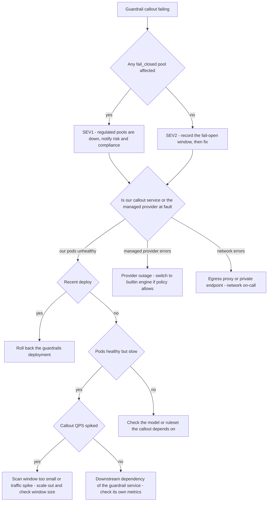

# Runbook: GuardrailServiceDown

## 1. Alert

| Field | Value |
|---|---|
| Name | `GuardrailServiceDown` |
| Severity | SEV1 if any affected pool is `fail_closed`; SEV2 otherwise |
| Routing | `PD-AGENTGATE-PRIMARY`; risk and compliance duty contact notified on SEV1 |
| Policy | Failure mode is per pool: `fail_open` for availability-first pools, `fail_closed` for regulated pools, and `fail_closed` is the default for `data_classification=restricted` (SPEC §3.6) |

```promql
- alert: GuardrailServiceDown
  expr: |
    sum(rate(agentgate_guardrail_callout_failures_total[3m]))
    / sum(rate(agentgate_guardrail_decisions_total[3m])) > 0.25
  for: 3m
  labels: { severity: sev2 }
  annotations:
    runbook_url: https://docs.internal/agentgate/runbooks/guardrail-service-down.md

- alert: GuardrailServiceDownFailClosed
  expr: |
    (
      sum(rate(agentgate_guardrail_callout_failures_total[3m]))
      / sum(rate(agentgate_guardrail_decisions_total[3m])) > 0.25
    )
    and on() (count(agentgate_guardrail_failmode{mode="fail_closed"} == 1) > 0)
  for: 2m
  labels: { severity: sev1 }

- alert: GuardrailCalloutLatency
  expr: |
    histogram_quantile(0.95, sum by (le) (rate(agentgate_guardrail_callout_duration_seconds_bucket[5m]))) > 1.0
  for: 10m
  labels: { severity: sev2 }
```

## 2. What this means

The content-safety callout is failing or too slow. What happens next depends entirely on each
pool's declared failure mode, and this is the fact to establish first:

- **`fail_closed` pools** — requests are rejected with `403 guardrail_blocked`. This is an outage
  for those pools, and it is the *correct* behaviour: we do not serve regulated traffic unscanned.
- **`fail_open` pools** — requests proceed unscanned. Nobody sees an error. Content is flowing
  without content-safety checks, which is a control gap that must be recorded even though no alert
  will ever be raised by a caller.

Both states are serious. One is loud, one is silent, and the silent one is the one that gets
missed.

## 3. Impact

`fail_closed`: total loss of service for every agent on those pools. In this client that is the
restricted-classification workloads — the ones with the least tolerance for both failure modes.

`fail_open`: no visible impact, and a period during which prompts and completions were not scanned
for PII or policy violations. That window must be recorded precisely, because someone will ask for
it — the start time, end time, affected pools, and request count are a regulatory-relevant record.

## 4. First 5 minutes

```bash
export CTX=prod-eastus NS=agentgate PROM=https://prometheus.internal
```

1. **Which pools are `fail_closed`?** Everything else follows from this.

```bash
promtool query instant "$PROM" 'agentgate_guardrail_failmode == 1'
agentctl --context "$CTX" guardrail policy list -o json \
  | jq -r '.[] | "\(.pool)\t\(.failure_mode)\t\(.provider)\t\(.classification)"'
```

2. Failure or slowness, and which provider?

```bash
promtool query instant "$PROM" 'sum by (provider, reason) (rate(agentgate_guardrail_callout_failures_total[3m]))'
promtool query instant "$PROM" '
histogram_quantile(0.95, sum by (le, provider) (rate(agentgate_guardrail_callout_duration_seconds_bucket[5m])))'
```

3. Is our own callout service up, or is the managed provider down?

```bash
kubectl --context "$CTX" -n "$NS" get pods -l app=guardrails -o wide
kubectl --context "$CTX" -n "$NS" logs deploy/guardrails --since=10m --tail=100 | jq -c 'select(.level=="error")'
POD=$(kubectl --context "$CTX" -n "$NS" get pod -l app=gateway -o name | head -1)
kubectl --context "$CTX" -n "$NS" exec "$POD" -- curl -sS -o /dev/null -w '%{http_code} %{time_total}\n' \
  --max-time 5 http://guardrails.agentgate.svc.cluster.local:8083/healthz
```

4. Measure the caller-visible effect:

```bash
promtool query instant "$PROM" '
sum by (pool, action) (rate(agentgate_guardrail_decisions_total[3m]))'
promtool query instant "$PROM" '
sum by (pool) (rate(agentgate_gateway_requests_total{code="guardrail_blocked"}[3m]))'
```

5. If any pool is `fail_open` and failing, **start the clock now** and write it down:

```bash
echo "GUARDRAIL FAIL-OPEN WINDOW START: $(date -u +%FT%TZ)" | tee -a /tmp/inc-1234-failopen.txt
promtool query instant "$PROM" 'sum(rate(agentgate_gateway_requests_total{env="prod"}[1m])) * 60'
```

6. TTFT check — the output guardrail sits in the streaming path, so a slow callout shows up as a
   TTFT regression before it shows up as a failure:

```bash
promtool query instant "$PROM" 'agentgate:gateway_ttft:p95_5m'
```

## 5. Diagnosis decision tree



## 6. Mitigations

Read this before choosing: **changing a pool's failure mode from `fail_closed` to `fail_open` is a
control change, not an operational one.** An on-call engineer may not do it alone. It requires the
risk-and-compliance duty contact's approval and a recorded change reference. Everything above it in
this list is available without that approval — exhaust those first.

### 6.1 Restart or roll back the guardrails service (blast radius: the change)

```bash
kubectl --context "$CTX" -n "$NS" rollout restart deploy/guardrails
kubectl --context "$CTX" -n "$NS" rollout status deploy/guardrails --timeout=180s
# if a deploy correlates with onset:
kubectl --context "$CTX" -n "$NS" rollout undo deploy/guardrails
```

Verify the failure ratio collapses:

```bash
promtool query instant "$PROM" '
sum(rate(agentgate_guardrail_callout_failures_total[2m])) / sum(rate(agentgate_guardrail_decisions_total[2m]))'
```

### 6.2 Scale the guardrails service out (blast radius: cost)

```bash
kubectl --context "$CTX" -n "$NS" scale deploy/guardrails --replicas=12
promtool query instant "$PROM" '
histogram_quantile(0.95, sum by (le) (rate(agentgate_guardrail_callout_duration_seconds_bucket[2m])))'
```

### 6.3 Switch to the `builtin` engine (blast radius: detection coverage — keeps scanning)

This is the right move when the managed provider is down. `builtin` does regex/entropy PII
detection and denylists (SPEC §3.6) — weaker than the managed service, but it is still scanning,
so the pool does not go unscanned and does not go down.

```bash
agentctl --context "$CTX" guardrail set-provider --pool general-chat --provider builtin \
  --reason "INC-1234 managed provider outage" --ttl 4h
```

Verify decisions resume:

```bash
promtool query instant "$PROM" 'sum by (pool, action) (rate(agentgate_guardrail_decisions_total[2m]))'
```

For a `restricted` pool this substitution also needs risk-and-compliance sign-off, because it
changes what is being detected. Ask; do not assume.

### 6.4 Increase the output scan window (blast radius: TTFT)

If the callout is being overwhelmed by QPS from small windows:

```bash
agentctl --context "$CTX" guardrail set-window --pool general-chat --tokens 512 \
  --reason "INC-1234 reducing callout QPS" --ttl 4h
```

Expected effect: callout QPS halves; TTFT rises. Verify both.

### 6.5 Change failure mode to `fail_open` (blast radius: control coverage — APPROVAL REQUIRED)

Only with the risk-and-compliance duty contact's explicit approval and a change reference. Record
the exact window.

```bash
agentctl --context "$CTX" guardrail set-failmode --pool regulated-chat --mode fail_open \
  --reason "INC-1234 restricted pool down 40 min, RC approval by <name>" \
  --approver risk-duty@client.example --change-ref CHG0045512 --ttl 2h
echo "FAIL-OPEN ENABLED: $(date -u +%FT%TZ) pool=regulated-chat approver=<name> ref=CHG0045512" \
  | tee -a /tmp/inc-1234-failopen.txt
```

Verify service restores and count exactly what flows unscanned:

```bash
promtool query instant "$PROM" '
sum(rate(agentgate_gateway_requests_total{pool="regulated-chat"}[1m])) * 60'
```

The TTL is not optional. A `fail_open` window that outlives its approval is an audit finding.

## 7. Rollback

| Mitigation | Undo |
|---|---|
| 6.1 | Re-deploy a fixed build only |
| 6.2 | Scale back in business hours |
| 6.3 | `agentctl --context "$CTX" guardrail set-provider --pool general-chat --provider callout` the moment the managed provider recovers. Confirm decision counts return to their normal category mix, not just that requests succeed |
| 6.4 | `agentctl --context "$CTX" guardrail set-window --pool general-chat --tokens 256` |
| 6.5 | `agentctl --context "$CTX" guardrail set-failmode --pool regulated-chat --mode fail_closed` — **this must be closed out before the incident is closed**, with the end timestamp appended to the fail-open record. The TTL is a backstop, not the plan |

## 8. Escalation

- Any `fail_closed` pool down: SEV1, page L2, and notify the risk-and-compliance duty contact
  within 15 minutes. They are a decision-maker here, not an observer.
- Any `fail_open` period: notify risk and compliance the same day even if service was never
  interrupted, with the exact window and request count. Do not wait for the postmortem.
- Managed provider outage: vendor bridge in parallel with mitigation.
- If content was processed unscanned for a `restricted` pool at any point, that is potentially
  reportable. Security duty officer, immediately, and preserve the evidence — do not clean up.

## 9. Post-incident

```bash
promtool query range "$PROM" 'sum by (pool, action) (rate(agentgate_guardrail_decisions_total[5m]))' \
  --start "$(date -u -d '-6 hours' +%FT%TZ)" --end "$(date -u +%FT%TZ)" --step 1m > /tmp/inc-guardrail-decisions.txt
promtool query range "$PROM" 'sum(rate(agentgate_guardrail_callout_failures_total[5m]))' \
  --start "$(date -u -d '-6 hours' +%FT%TZ)" --end "$(date -u +%FT%TZ)" --step 1m > /tmp/inc-guardrail-failures.txt
kubectl --context "$CTX" -n "$NS" logs deploy/guardrails --since=6h > /tmp/inc-guardrails.log
```

The compliance record — write this into the incident ticket as a distinct section, not buried in a
timeline:

| Field | Value |
|---|---|
| Pools affected | |
| Failure mode in force during the window | |
| Fail-open window start (UTC) | |
| Fail-open window end (UTC) | |
| Requests processed unscanned | |
| Data classifications involved | |
| Approver for any failure-mode change | |
| Change reference | |
| Confirmation failure mode restored | |

Also capture: whether `fail_closed` pools were correctly identified in the first five minutes, and
whether the alert distinguished them. If the on-call had to work it out manually, fix the alert
labels.

## 10. Related

- [guardrail-false-positive-spike.md](guardrail-false-positive-spike.md)
- [gateway-ttft-regression.md](gateway-ttft-regression.md) — the guardrail window is in the TTFT path
- [gateway-latency-regression.md](gateway-latency-regression.md)
- [day-2-operations.md](day-2-operations.md#8-switching-guardrail-failure-mode)
- Dashboards: `$GRAFANA/d/agentgate-guardrails`

Last game-day exercise: 2026-05-19 (managed provider blackholed, both failure modes exercised).
