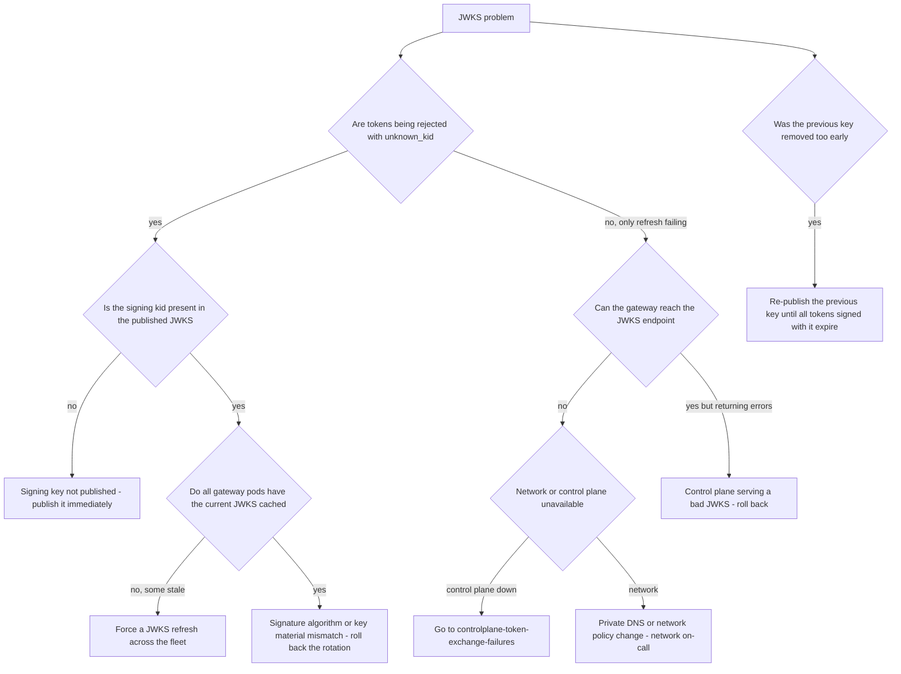

# Runbook: JWKSRotationFailure

## 1. Alert

| Field | Value |
|---|---|
| Name | `JWKSRotationFailure` |
| Severity | SEV1 (page primary + secondary) |
| Routing | `PD-AGENTGATE-PRIMARY` + security duty officer |

```promql
- alert: JWKSRotationFailure
  expr: |
    sum(rate(agentgate_controlplane_jwks_refresh_total{result="fail"}[5m])) > 0
  for: 5m
  labels: { severity: sev1 }
  annotations:
    runbook_url: https://docs.internal/agentgate/runbooks/jwks-rotation-failure.md

# The gateway is rejecting tokens because it does not recognise the signing key
- alert: JWKSUnknownKid
  expr: |
    sum(rate(agentgate_identity_token_validations_total{result="fail",reason="unknown_kid"}[5m])) > 0
  for: 2m
  labels: { severity: sev1 }

# Rotation overdue - the key is older than its policy allows
- alert: JWKSKeyOverdue
  expr: max(agentgate_controlplane_jwks_key_age_seconds) > 86400 * 90
  for: 1h
  labels: { severity: sev3 }

# Only one key published - a rotation cannot happen safely from here
- alert: JWKSSingleKeyPublished
  expr: agentgate_controlplane_jwks_keys_published < 2
  for: 30m
  labels: { severity: sev3 }
```

## 2. What this means

The signing-key material behind agent identity is in a bad state. The control plane signs AgentGate
access tokens; the gateway validates them against the published JWKS at
`$CP/.well-known/jwks.json` (SPEC §3.2, stage `authn`). A safe rotation publishes the new key
*before* signing with it and keeps the old key published until every token signed with it has
expired. Break that ordering and the gateway rejects live tokens with `unknown_kid`, which is
`401 unauthenticated` for every affected agent.

Distinguish two states immediately:

- **Rotation refresh failing** — the gateway cannot fetch the JWKS. Cached keys keep working, so
  there may be no impact yet. You have until the cache expires.
- **`unknown_kid` validation failures** — tokens are already being rejected. That is happening now.

## 3. Impact

Same shape as [controlplane-token-exchange-failures.md](controlplane-token-exchange-failures.md):
`401 unauthenticated`, a 4xx that does not burn the availability budget while making the platform
unusable. The difference is timing. A botched rotation can invalidate *every currently valid token
at once*, which is faster and more total than an exchange outage. If `unknown_kid` is climbing, you
are in the worst version of this incident.

## 4. First 5 minutes

```bash
export CTX=prod-eastus NS=agentgate PROM=https://prometheus.internal CP=https://controlplane.agentgate.internal
```

1. Are tokens being rejected right now?

```bash
promtool query instant "$PROM" '
sum by (reason) (rate(agentgate_identity_token_validations_total{result="fail"}[2m]))'
```

2. What is published, and what is being signed with?

```bash
curl -sS "$CP/.well-known/jwks.json" | jq '{count: (.keys | length), kids: [.keys[] | {kid, alg, use}]}'
agentctl --context "$CTX" identity keys list -o json \
  | jq -r '.[] | "\(.kid)\t\(.state)\tcreated=\(.created_at)\tsigning=\(.is_signing)"'
```

You need at least two keys published — the current signer and the previous key — during any
rotation window.

3. Can the gateway actually fetch the JWKS from where it runs?

```bash
POD=$(kubectl --context "$CTX" -n "$NS" get pod -l app=gateway -o name | head -1)
kubectl --context "$CTX" -n "$NS" exec "$POD" -- \
  curl -sS -o /dev/null -w 'code=%{http_code} total=%{time_total}\n' --max-time 5 \
  https://controlplane.agentgate.internal/.well-known/jwks.json
kubectl --context "$CTX" -n "$NS" logs deploy/gateway --since=15m \
  | jq -c 'select(.msg | test("jwks")) | {msg, err, kid}' | tail -20
```

4. Decode a live token and compare its `kid` against the published set — this is the definitive test:

```bash
SA_TOKEN=$(kubectl --context "$CTX" -n "$NS" create token agentgate-probe --audience=api://agentgate)
AT=$(curl -sS -X POST "$CP/oauth2/token" \
  -H 'content-type: application/x-www-form-urlencoded' \
  -d 'grant_type=urn:ietf:params:oauth:grant-type:token-exchange' \
  -d 'subject_token_type=urn:ietf:params:oauth:token-type:jwt' \
  --data-urlencode "subject_token=$SA_TOKEN" \
  -d 'audience=https://gateway.agentgate.internal' | jq -r .access_token)

echo "$AT" | cut -d. -f1 | base64 -d 2>/dev/null | jq '{alg, kid}'
curl -sS "$CP/.well-known/jwks.json" | jq --arg kid "$(echo "$AT" | cut -d. -f1 | base64 -d 2>/dev/null | jq -r .kid)" \
  '[.keys[] | select(.kid == $kid)] | length'
# 0 means the signing key is not published. That is the bug.
```

5. Then try the token against the gateway:

```bash
curl -sS -o /dev/null -D- -X POST "$GW/v1/chat/completions" \
  -H "Authorization: Bearer $AT" -H 'content-type: application/json' \
  -d '{"model":"general-chat","messages":[{"role":"user","content":"ping"}],"max_tokens":8}' \
  | grep -E '^HTTP|x-agentgate-request-id'
```

6. What changed? Rotation is usually automated, so look at the automation:

```bash
agentctl --context "$CTX" audit list --since 24h --kind identity
kubectl --context "$CTX" -n "$NS" get cronjob key-rotation -o yaml | grep -A5 'schedule\|lastScheduleTime'
kubectl --context "$CTX" -n "$NS" logs job/key-rotation-$(date -u +%Y%m%d) --tail=100 2>/dev/null
```

## 5. Diagnosis decision tree



## 6. Mitigations

The governing rule of a JWKS incident: **publishing a key is safe, removing one is not.** When in
doubt, publish more keys, not fewer.

### 6.1 Publish the missing key (blast radius: none — this is the safe direction)

```bash
agentctl --context "$CTX" identity keys publish --kid ag-signing-2026-08 \
  --reason "INC-1234 signing key absent from JWKS"
curl -sS "$CP/.well-known/jwks.json" | jq '[.keys[].kid]'
```

Expected effect: `unknown_kid` failures stop within the gateway's JWKS refresh interval. Force it
rather than waiting (6.2).

### 6.2 Force a JWKS refresh on the gateway fleet (blast radius: none)

```bash
agentctl --context "$CTX" identity jwks refresh --all-gateways
# or, if the admin path is unavailable:
kubectl --context "$CTX" -n "$NS" rollout restart deploy/gateway
kubectl --context "$CTX" -n "$NS" rollout status deploy/gateway --timeout=300s
```

Verify every pod has the expected kids:

```bash
for p in $(kubectl --context "$CTX" -n "$NS" get pod -l app=gateway -o name); do
  echo -n "$p "
  kubectl --context "$CTX" -n "$NS" exec "$p" -- curl -sS localhost:9090/debug/jwks 2>/dev/null | jq -c '[.keys[].kid]'
done
```

Prefer the admin refresh: restarting the gateway during an authentication incident removes capacity
exactly when in-flight requests are already failing.

### 6.3 Re-publish a prematurely retired key (blast radius: none — restores validity)

```bash
agentctl --context "$CTX" identity keys republish --kid ag-signing-2026-05 \
  --reason "INC-1234 retired before token expiry" --until "$(date -u -d '+2 hours' +%FT%TZ)"
```

The `--until` should cover the maximum token lifetime remaining. Do not leave a retired key
published indefinitely — a retired key is retired for a reason.

### 6.4 Revert to signing with the previous key (blast radius: rotation progress)

When the new key is bad — wrong algorithm, wrong curve, unusable material:

```bash
agentctl --context "$CTX" identity keys set-signing --kid ag-signing-2026-05 \
  --reason "INC-1234 new key rejected by validators"
# Confirm the change took effect by minting a fresh token and decoding it:
```

Repeat step 4 and verify the `kid` in a new token matches the key you selected.

### 6.5 Roll back the control plane (blast radius: the change)

If the rotation shipped as part of a deployment:

```bash
kubectl --context "$CTX" -n "$NS" rollout undo deploy/controlplane
kubectl --context "$CTX" -n "$NS" rollout status deploy/controlplane --timeout=180s
```

### 6.6 What you must not do

Do not relax validation. `authn.allow_unverified`, skipping signature checks, or accepting any
`kid` are not mitigations — they turn an authentication outage into an unauthenticated gateway
serving a regulated client. There is no approval level for this. If service cannot be restored by
key publication, escalate to the security duty officer and the platform lead and accept the
downtime while it is fixed properly.

## 7. Rollback

| Mitigation | Undo |
|---|---|
| 6.1 | None needed. If the key was published in error, retire it only after every token signed with it has expired |
| 6.2 | None needed |
| 6.3 | `agentctl --context "$CTX" identity keys retire --kid ag-signing-2026-05` once the `--until` window has passed and no validation failures reference it. Confirm with `sum(rate(agentgate_identity_token_validations_total{reason="unknown_kid"}[5m])) == 0` |
| 6.4 | Complete the rotation properly through [day-2-operations.md](day-2-operations.md#6-rotating-signing-keys) once the new key is validated in staging |
| 6.5 | Re-deploy only a fixed build |

## 8. Escalation

- Security duty officer immediately on any JWKS incident, regardless of impact. Key material is
  their domain and they may have context you do not — a key may have been retired deliberately in
  response to a suspected compromise, in which case re-publishing it is exactly wrong. **Ask before
  running 6.3.**
- Page L2 at once; SEV1.
- Client incident manager at 30 minutes if agents are failing.
- If key material is suspected compromised, this stops being an availability incident and becomes a
  security incident under their process. Follow their instructions, not this runbook.

## 9. Post-incident

```bash
curl -sS "$CP/.well-known/jwks.json" > /tmp/inc-jwks-final.json
agentctl --context "$CTX" identity keys list -o json > /tmp/inc-keys.json
agentctl --context "$CTX" audit list --since 48h --kind identity -o json > /tmp/inc-identity-audit.json
promtool query range "$PROM" 'sum by (reason) (rate(agentgate_identity_token_validations_total{result="fail"}[5m]))' \
  --start "$(date -u -d '-6 hours' +%FT%TZ)" --end "$(date -u +%FT%TZ)" --step 1m > /tmp/inc-validation.txt
```

Capture: the rotation timeline with exact timestamps for publish, sign-switch and retire; which
step was out of order; how many tokens were invalidated and how many requests failed; every key
published or re-published during the incident and its current state; and confirmation that no
validation was weakened at any point.

The action item is almost always the same and worth stating plainly: rotation must publish, wait
for the maximum token lifetime plus the JWKS cache TTL, then switch signing, then wait again, then
retire. If the automation does not enforce those waits, fix the automation.

## 10. Related

- [controlplane-token-exchange-failures.md](controlplane-token-exchange-failures.md)
- [secret-rotation-overdue.md](secret-rotation-overdue.md)
- [certificate-expiry.md](certificate-expiry.md)
- [day-2-operations.md](day-2-operations.md#6-rotating-signing-keys)
- Dashboards: `$GRAFANA/d/agentgate-controlplane`

Last game-day exercise: 2026-08-04 (early key retirement in staging, measured token invalidation).
