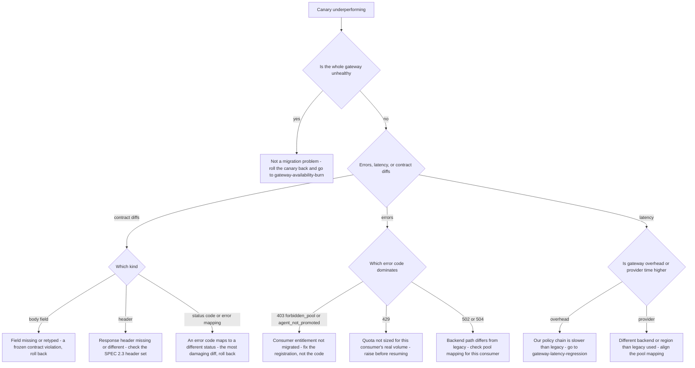

# Runbook: MigrationCanaryRollback

## 1. Alert

| Field | Value |
|---|---|
| Name | `MigrationCanaryRollback` |
| Severity | SEV2 (page) |
| Routing | `PD-AGENTGATE-PRIMARY` + the migration owner |
| Context | Strangler migration from the legacy gateway: shadow → canary 1% → 5% → 25% → 50% → 100%, per consumer, with automatic rollback on SLO burn. Rollback at every stage is a weight change, not a deploy (SPEC §7) |

```promql
- alert: MigrationCanaryRollback
  expr: |
    (
      sum by (consumer) (rate(agentgate_gateway_requests_total{env="prod",migration="canary",status=~"5.."}[5m]))
      / sum by (consumer) (rate(agentgate_gateway_requests_total{env="prod",migration="canary"}[5m]))
    )
    > 2 *
    (
      sum by (consumer) (rate(legacy_gateway_requests_total{status=~"5.."}[5m]))
      / sum by (consumer) (rate(legacy_gateway_requests_total[5m]))
    )
  for: 5m
  labels: { severity: sev2 }
  annotations:
    runbook_url: https://docs.internal/agentgate/runbooks/migration-canary-rollback.md

# Contract diffs are the thing the migration exists to prevent
- alert: MigrationContractDiff
  expr: sum by (consumer, field) (increase(agentgate_migration_contract_diff_total[15m])) > 0
  for: 5m
  labels: { severity: sev2 }

# Latency regression against the legacy baseline
- alert: MigrationLatencyRegression
  expr: |
    histogram_quantile(0.95, sum by (le) (rate(agentgate_gateway_duration_seconds_bucket{migration="canary",phase="total"}[5m])))
    > 1.2 * histogram_quantile(0.95, sum by (le) (rate(legacy_gateway_duration_seconds_bucket[5m])))
  for: 10m
  labels: { severity: sev2 }
```

## 2. What this means

A consumer that was moved onto AgentGate is doing measurably worse than it did on the legacy
gateway — more errors, slower, or receiving responses that differ from the frozen contract. The
migration's entire premise is that consumers cannot tell the difference (SPEC §7), so any
detectable difference is a failure of that premise.

The good news, and it is worth remembering at 03:00: **rollback is a weight change, not a deploy.**
You can be back on the legacy path in under a minute without shipping anything.

## 3. Impact

Confined to the consumers currently routed to AgentGate. At 1% canary that may be a handful of
requests; at 50% it is half a consumer's production traffic. The contract-diff alert has a quieter
and more dangerous impact profile: responses that differ subtly — a missing field, a different
error mapping, a changed status code for an existing `code` — may be accepted by the consumer and
produce wrong behaviour downstream without any error at all.

## 4. First 5 minutes

```bash
export CTX=prod-eastus NS=agentgate PROM=https://prometheus.internal
```

1. Which consumer, at what weight, and how bad?

```bash
promtool query instant "$PROM" 'agentgate_canary_weight'
promtool query instant "$PROM" '
sum by (consumer, status, code) (rate(agentgate_gateway_requests_total{migration="canary",status=~"5.."}[5m]))'
```

2. Compare AgentGate against legacy on identical traffic — this is the only comparison that matters:

```bash
promtool query instant "$PROM" '
sum by (consumer) (rate(agentgate_gateway_requests_total{migration="canary",status=~"5.."}[5m]))
  / sum by (consumer) (rate(agentgate_gateway_requests_total{migration="canary"}[5m]))'
promtool query instant "$PROM" '
sum by (consumer) (rate(legacy_gateway_requests_total{status=~"5.."}[5m]))
  / sum by (consumer) (rate(legacy_gateway_requests_total[5m]))'
```

3. Contract diffs — what exactly differs?

```bash
promtool query instant "$PROM" '
topk(10, sum by (consumer, field, kind) (increase(agentgate_migration_contract_diff_total[1h])))'
agentctl --context "$CTX" migration diffs --consumer payments-risk --since 1h -o json \
  | jq '.[] | {field, kind, legacy, agentgate, request_id, sample_count}' | head -40
```

`kind` is one of `body_field`, `header`, `status_code`, `error_mapping`. Header and error-mapping
diffs are the ones consumers notice least and depend on most.

4. Is the problem AgentGate-wide or specific to this consumer?

```bash
promtool query instant "$PROM" 'agentgate:gateway_error:ratio_rate5m'
promtool query instant "$PROM" '
sum by (migration) (rate(agentgate_gateway_requests_total{env="prod",status=~"5.."}[5m]))'
```

If the whole gateway is unhealthy, this is not a migration incident — go to
[gateway-availability-burn.md](gateway-availability-burn.md) and roll the canary back anyway to
reduce the surface.

5. Reproduce a diff directly against both implementations:

```bash
REQ='{"model":"general-chat","messages":[{"role":"user","content":"migration probe"}],"max_tokens":16,"temperature":0}'
for target in https://gateway.agentgate.internal https://legacy-gateway.internal; do
  echo "== $target"
  curl -sS -D- -o /tmp/body-$(basename "$target").json -X POST "$target/v1/chat/completions" \
    -H "Authorization: Bearer $AGENTGATE_PROBE_TOKEN" -H 'content-type: application/json' -d "$REQ" \
    | grep -Ei '^HTTP|^x-|^retry-after'
done
diff <(jq -S 'del(.id, .created)' /tmp/body-gateway.agentgate.internal.json) \
     <(jq -S 'del(.id, .created)' /tmp/body-legacy-gateway.internal.json)
```

6. What was the last weight change?

```bash
agentctl --context "$CTX" migration history --consumer payments-risk | tail -10
```

## 5. Diagnosis decision tree



## 6. Mitigations

### 6.1 Roll the weight back (blast radius: this consumer — seconds)

The first action in essentially every case. It is cheap, reversible and requires no deploy.

```bash
scripts/frontdoor-weight.sh --consumer payments-risk --set agentgate=0 --set legacy=100 \
  --reason "INC-1234 canary error ratio 3x legacy"
agentctl --context "$CTX" migration status --consumer payments-risk
```

Expected effect: that consumer's traffic returns to legacy within DNS/front-door propagation,
30–90 seconds. Verify:

```bash
promtool query instant "$PROM" 'agentgate_canary_weight{consumer="payments-risk"}'
promtool query instant "$PROM" 'sum by (consumer) (rate(agentgate_gateway_requests_total{migration="canary"}[1m]))'
```

Streaming requests in flight end with an SSE `error` frame; unary requests complete. Tell the
consumer if their traffic includes long generations.

### 6.2 Step down rather than fully back (blast radius: this consumer)

If the regression appeared at 50% and 25% was clean, step down one level rather than abandoning the
migration. Preserves progress and localises the cause to the step.

```bash
scripts/frontdoor-weight.sh --consumer payments-risk --set agentgate=25 --set legacy=75 \
  --reason "INC-1234 regression at 50 percent, stepping down"
```

Only do this if you have evidence the lower step was clean. Otherwise roll fully back.

### 6.3 Roll back every consumer (blast radius: the migration)

When the cause is platform-side rather than consumer-specific:

```bash
scripts/frontdoor-weight.sh --all-consumers --set agentgate=0 --set legacy=100 \
  --reason "INC-1234 platform-side contract regression"
agentctl --context "$CTX" migration status --all
```

### 6.4 Return to shadow mode (blast radius: none — keeps learning)

Shadow gives mirrored traffic with discarded responses (SPEC §7), so diffs keep being reported
while no consumer is affected. This is the right resting state while a contract bug is fixed.

```bash
agentctl --context "$CTX" migration set-mode --consumer payments-risk --mode shadow \
  --reason "INC-1234 collecting diffs without exposure"
promtool query instant "$PROM" 'sum by (field) (rate(agentgate_migration_contract_diff_total[5m]))'
```

### 6.5 Fix the consumer's pool or entitlement mapping (blast radius: one consumer config)

For `403 forbidden_pool`, `403 agent_not_promoted` or wrong-backend routing — the migration mapping
is wrong, not the code:

```bash
agentctl --context "$CTX" migration mapping show --consumer payments-risk -o json \
  | jq '{legacy_model, logical_model, pool, entitled_pools}'
agentctl --context "$CTX" migration mapping set --consumer payments-risk \
  --legacy-model gpt-4o-mini-prod --logical-model general-chat --reason "INC-1234 mapping corrected"
```

Then re-run the compatibility suite for that consumer before resuming the canary:

```bash
scripts/compat-suite.sh --consumer payments-risk --corpus golden/payments-risk --target agentgate
```

### 6.6 Fix a contract violation in the gateway (blast radius: the change)

A `body_field`, `header` or `status_code` diff is a violation of the frozen v1 contract
(SPEC §2.4 compatibility rule). It is fixed in code, validated against the golden corpus, and only
then does the canary resume. There is no configuration workaround, and the consumer must stay on
legacy until it is fixed.

```bash
scripts/compat-suite.sh --corpus golden/all --target agentgate --fail-on-diff
```

## 7. Rollback

Rollback *is* the mitigation here. What needs care is going forward again:

| Step | Requirement before resuming |
|---|---|
| Resume at the previous weight | 24h of clean diffs in shadow, and the compatibility suite green on the full golden corpus |
| Resume at a higher weight | Never immediately after a rollback. Return to the last known-good step and hold for a full business day |
| Full 100% | 30 days at 100% with zero contract diffs is the decommission criterion (SPEC §7); a rollback resets your confidence, not necessarily the clock — the migration owner decides and records it |

```bash
scripts/frontdoor-weight.sh --consumer payments-risk --set agentgate=25 --set legacy=75 \
  --reason "INC-1234 resolved, resuming at last known-good step"
```

## 8. Escalation

- Migration owner immediately — they hold the schedule, the consumer relationships and the
  decommission criteria.
- Any `error_mapping` or `status_code` diff: treat as SEV2 minimum and involve the API owner. A
  status code changing for an existing `code` is precisely what the frozen contract forbids, and
  consumers may have branching logic on it.
- Client incident manager if a consumer noticed before we did. The migration's promise to consuming
  teams is that they will not notice; a consumer-reported migration defect damages that
  relationship more than the technical fault does.
- If rollback does not restore the consumer's service, this is no longer a migration incident —
  the legacy path is also broken. Escalate to L2 and treat it as a full availability incident.

## 9. Post-incident

```bash
agentctl --context "$CTX" migration diffs --consumer payments-risk --since 24h -o json > /tmp/inc-diffs.json
agentctl --context "$CTX" migration history --consumer payments-risk -o json > /tmp/inc-history.json
promtool query range "$PROM" 'agentgate_canary_weight' \
  --start "$(date -u -d '-24 hours' +%FT%TZ)" --end "$(date -u +%FT%TZ)" --step 1m > /tmp/inc-weights.txt
```

Capture: the exact diff, field by field; how many requests were served with the non-conforming
response and whether the consumer acted on any of them; why the golden corpus did not contain the
case — this is nearly always the finding, and the fix is to add the case to the corpus, not to be
more careful; and how long from weight change to detection. That last number sets how long each
future canary step should bake before advancing.

Update the migration record with the rollback and the resume decision so the audit trail of the
migration is continuous. A migration with unexplained weight changes in its history is one nobody
will trust to reach 100%.

## 10. Related

- [gateway-availability-burn.md](gateway-availability-burn.md)
- [gateway-latency-regression.md](gateway-latency-regression.md)
- [promotion-gate-blocked.md](promotion-gate-blocked.md)
- [operational-readiness-review.md](operational-readiness-review.md)
- `test/load/scenarios.md` — the canary comparison scenario
- Dashboards: `$GRAFANA/d/agentgate-migration`

Last game-day exercise: 2026-06-30 (injected a header omission at 5% canary in staging).
