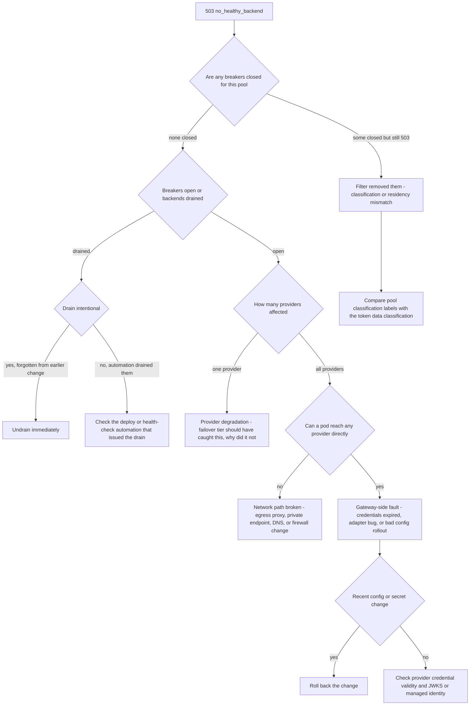

# Runbook: NoHealthyBackend

## 1. Alert

| Field | Value |
|---|---|
| Name | `NoHealthyBackend` |
| Severity | SEV1 (page primary + secondary) |
| Routing | `PD-AGENTGATE-PRIMARY`, auto-escalates to `PD-AGENTGATE-SECONDARY` at 5 min |
| Error code | `503 no_healthy_backend` (SPEC §2.4) |

```promql
- alert: NoHealthyBackend
  expr: |
    sum by (pool) (rate(agentgate_gateway_requests_total{env="prod",code="no_healthy_backend"}[2m])) > 0
  for: 2m
  labels: { severity: sev1 }
  annotations:
    runbook_url: https://docs.internal/agentgate/runbooks/no-healthy-backend.md
```

A second, faster form fires when the pool has nothing left at all, before any request proves it:

```promql
- alert: NoHealthyBackendImminent
  expr: |
    count by (pool) (agentgate_breaker_state{state="closed"} == 1) == 0
  for: 1m
```

## 2. What this means

For at least one pool, every backend is either open-circuit or drained, so the gateway has nowhere
to send the request and returns 503 immediately. It is not retrying, it is not queuing — the
selection step (SPEC §3.1) found zero survivors after filtering by health and by
classification/residency compatibility. Two very different causes produce the identical symptom:
all the backends really are broken, or the filter removed them (someone drained them, or a
classification label change made every backend ineligible for the caller's data class).

## 3. Impact

Total loss of service for every agent using that pool. If the pool is `general-chat`, that is most
of the fleet. Callers see 503 with a `Retry-After`; well-behaved SDKs back off, badly-behaved ones
hammer, so expect load to rise while service is down. `no_healthy_backend` is excluded from the
availability SLI numerator by design, which means this alert burns the availability budget at full
rate for its entire duration.

## 4. First 5 minutes

```bash
export CTX=prod-eastus NS=agentgate PROM=https://prometheus.internal GW=https://gateway.agentgate.internal
```

1. Which pool, and what does the breaker table look like?

```bash
promtool query instant "$PROM" '
sum by (pool) (rate(agentgate_gateway_requests_total{env="prod",code="no_healthy_backend"}[2m]))'

promtool query instant "$PROM" 'agentgate_breaker_state == 1'
```

2. Ask the gateway directly — it knows its own routing table:

```bash
agentctl --context "$CTX" pool show --pool general-chat -o json | jq '
  .backends[] | {backend, priority, weight, breaker: .breaker_state, drained, healthy, last_error}'
```

3. Is anything drained? A forgotten drain from an earlier change is a common cause:

```bash
agentctl --context "$CTX" backend list --drained -o json | jq -r '.[] | "\(.pool) \(.backend) drained_by=\(.actor) reason=\(.reason) ttl=\(.expires_at)"'
```

4. If breakers tripped, find out on what. The reason label is the fastest signal available:

```bash
promtool query instant "$PROM" '
topk(10, sum by (backend, reason) (rate(agentgate_retry_attempts_total[5m])))'
promtool query instant "$PROM" '
topk(10, sum by (backend, code) (rate(agentgate_gateway_requests_total{env="prod",status=~"5.."}[5m])))'
```

5. Test one backend from inside a gateway pod, bypassing our own routing:

```bash
POD=$(kubectl --context "$CTX" -n "$NS" get pod -l app=gateway -o name | head -1)
kubectl --context "$CTX" -n "$NS" exec "$POD" -- \
  curl -sS -o /dev/null -w '%{http_code} dns=%{time_namelookup} conn=%{time_connect} tls=%{time_appconnect} total=%{time_total}\n' \
  https://fsclient-eastus.openai.azure.internal/openai/deployments/gpt-4o-mini/chat/completions
```

DNS or TLS timing that is large or zero points at network, not the provider.

6. Confirm the classification filter is not the cause:

```bash
kubectl --context "$CTX" -n "$NS" logs deploy/gateway --since=5m \
  | jq -c 'select(.msg=="backend filtered") | {backend,reason,classification,residency}' | head -20
```

## 5. Diagnosis decision tree



## 6. Mitigations

### 6.1 Undrain a backend that should not be drained (blast radius: one backend, instant)

```bash
agentctl --context "$CTX" backend undrain --pool general-chat --backend onprem-vllm/llama-3.1-8b
```

Expected effect: the backend re-enters selection immediately; 503 rate falls to zero within one
selection cycle. Verify:

```bash
promtool query instant "$PROM" 'sum(rate(agentgate_gateway_requests_total{code="no_healthy_backend"}[1m]))'
```

### 6.2 Force a breaker to half-open to re-probe (blast radius: one backend)

If you believe the backend has recovered but the 30s open window keeps re-tripping on a stale
signal:

```bash
agentctl --context "$CTX" breaker reset --backend bedrock/claude-haiku --reason "INC-1234 provider confirmed recovered"
```

Expected effect: five probe requests are admitted; if they succeed the breaker closes. Verify:

```bash
promtool query instant "$PROM" 'agentgate_breaker_state{backend="bedrock/claude-haiku"} == 1'
```

Do not loop on this. If it re-opens twice, the backend is not healthy and you are wasting the
caller's deadline.

### 6.3 Add the failover tier's backend into the primary tier (blast radius: one pool, capacity)

The on-prem vLLM backend exists at priority 2 precisely for this. If it is healthy but the pool
still 503s because of a filter mismatch, promote it explicitly:

```bash
agentctl --context "$CTX" pool set-priority --pool general-chat \
  --backend onprem-vllm/llama-3.1-8b --priority 1 --reason "INC-1234"
```

Expected effect: on-prem serves the pool. Quality and context window differ from the cloud models;
tell consuming teams. Verify traffic is flowing and check its saturation, because on-prem capacity
is finite:

```bash
promtool query instant "$PROM" 'sum by (backend) (rate(agentgate_gateway_requests_total{pool="general-chat"}[1m]))'
promtool query instant "$PROM" 'agentgate_gateway_inflight{pool="general-chat"}'
```

### 6.4 Borrow capacity from another pool (blast radius: two pools)

Only if `long-context` or another pool has healthy backends the caller is entitled to. This is a
routing change, not an entitlement change — it must not grant a token access to a pool that is not
in its `model_pools` claim.

```bash
agentctl --context "$CTX" pool add-backend --pool general-chat \
  --backend azure-openai/gpt-4o --weight 100 --priority 2 --reason "INC-1234 emergency capacity"
```

Cost per token is higher on the borrowed backend. Note it for chargeback.

### 6.5 Roll back the config or secret change (blast radius: the change)

```bash
kubectl --context "$CTX" -n "$NS" rollout undo deploy/gateway
# or, if it was a config-only change:
kubectl --context "$CTX" -n "$NS" get cm gateway-config -o yaml > /tmp/bad-config.yaml   # keep evidence
kubectl --context "$CTX" -n "$NS" apply -f deploy/k8s/overlays/prod/gateway-config.yaml
kubectl --context "$CTX" -n "$NS" rollout restart deploy/gateway
```

### 6.6 Regional failover (blast radius: everything)

If the network path from this region is broken, no amount of pool surgery helps. L4 approval, then:

```bash
agentctl --context prod-westus health check --deep
scripts/frontdoor-weight.sh --set prod-eastus=0 --set prod-westus=100 --reason "INC-1234"
```

## 7. Rollback

| Mitigation | Undo |
|---|---|
| 6.1 | Re-drain only with a reason and TTL: `agentctl backend drain --pool <p> --backend <b> --reason ... --ttl 30m` |
| 6.2 | None needed; the breaker will re-open on its own if the backend is still bad |
| 6.3 | `agentctl --context "$CTX" pool set-priority --pool general-chat --backend onprem-vllm/llama-3.1-8b --priority 2` once cloud backends are closed and stable for 30 min |
| 6.4 | `agentctl --context "$CTX" pool remove-backend --pool general-chat --backend azure-openai/gpt-4o`. Do this within 24h — an emergency backend left in place quietly changes the cost model |
| 6.5 | Re-apply the intended config only after it has been validated in staging |
| 6.6 | Ramp back 25 → 50 → 100 with 10 min of clean SLI at each step |

Reconcile the live routing table against git before you close the incident. Drift here is how the
next incident starts:

```bash
agentctl --context "$CTX" pool diff --against deploy/k8s/overlays/prod/pools.yaml
```

## 8. Escalation

- Page L2 immediately; this is a SEV1 by definition and should not be worked alone.
- If no pod can reach any provider: network on-call, with the FQDN, the port, the observed DNS and
  TLS timings from step 5, and whether the failure is uniform across pods and nodes.
- If provider credentials are rejected: the secrets owner, and check
  [secret-rotation-overdue.md](secret-rotation-overdue.md) — an expired credential presents as
  provider errors that trip every breaker at once.
- Client incident manager at 30 minutes: this is visible to every consuming team.

## 9. Post-incident

```bash
# Breaker state timeline - the spine of the postmortem narrative
promtool query range "$PROM" 'agentgate_breaker_state' \
  --start "$(date -u -d '-3 hours' +%FT%TZ)" --end "$(date -u +%FT%TZ)" --step 30s > /tmp/inc-breakers.txt

# Routing table as it was during the incident
agentctl --context "$CTX" pool show --pool general-chat -o json > /tmp/inc-pool.json

# Drain and mutation history
agentctl --context "$CTX" audit list --since 24h --kind mutation -o json > /tmp/inc-audit.json
```

Answer these three in the postmortem, because they are the ones that prevent a repeat:

1. Why did the failover tier not absorb this? If the answer is "it was drained" or "it was
   filtered out", that is the finding.
2. How long between the first breaker opening and the last one? A tight cluster means a shared
   dependency; a slow cascade means retries taking the pool down one backend at a time.
3. Did we return 503 when we still had a usable option? If so, the selection logic or the labels
   need a change, and there should be an integration test for it.

## 10. Related

- [circuit-breaker-open.md](circuit-breaker-open.md) — the single-backend precursor
- [provider-degradation.md](provider-degradation.md)
- [retry-storm.md](retry-storm.md) — a cause of cascading breaker trips
- [gateway-availability-burn.md](gateway-availability-burn.md)
- [day-2-operations.md](day-2-operations.md) — draining and undraining as a routine operation
- Dashboards: `$GRAFANA/d/agentgate-pools`, `$GRAFANA/d/agentgate-gateway-slo`

Last game-day exercise: 2026-08-04 (drained every backend in `long-context` in staging).
