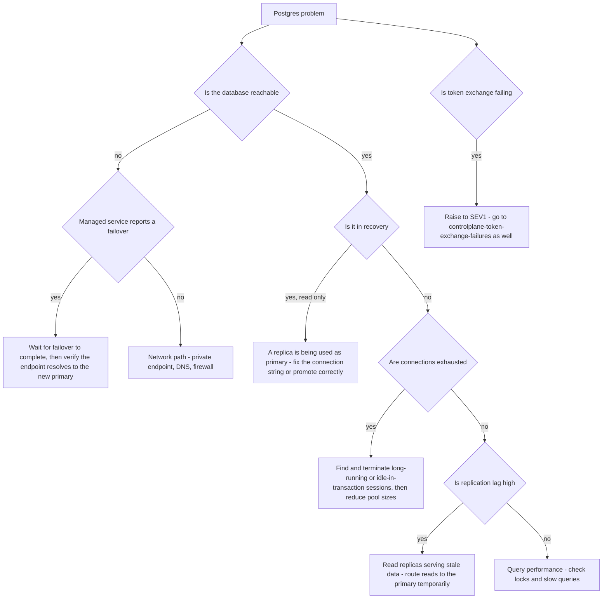

# Runbook: PostgresFailover

## 1. Alert

| Field | Value |
|---|---|
| Name | `PostgresFailover` |
| Severity | SEV2 (page); SEV1 if the control plane cannot serve token exchange |
| Routing | `PD-AGENTGATE-PRIMARY` |

```promql
- alert: PostgresFailover
  expr: changes(pg_stat_database_stats_reset_time{datname="agentgate"}[10m]) > 0 or pg_up{instance=~".*agentgate.*"} == 0
  for: 1m
  labels: { severity: sev2 }
  annotations:
    runbook_url: https://docs.internal/agentgate/runbooks/postgres-failover.md

- alert: PostgresReplicationLag
  expr: pg_replication_lag_seconds{instance=~".*agentgate.*"} > 30
  for: 5m
  labels: { severity: sev2 }

- alert: PostgresConnectionsExhausted
  expr: |
    sum(pg_stat_activity_count{datname="agentgate"}) / max(pg_settings_max_connections) > 0.85
  for: 5m
  labels: { severity: sev2 }

- alert: UsageRecordWriteFailures
  expr: sum(rate(agentgate_usage_records_written_total{result="fail"}[5m])) > 0
  for: 5m
  labels: { severity: sev2 }
```

## 2. What this means

The Postgres instance behind AgentGate has failed over, is unreachable, or is falling behind. What
depends on it, and how badly:

| Consumer | Dependency | Behaviour when Postgres is down |
|---|---|---|
| Control plane token exchange | Reads registry, writes issuance log | Exchange fails — SEV1, see [controlplane-token-exchange-failures.md](controlplane-token-exchange-failures.md) |
| Gateway authz | Promotion state and pool entitlement | Cached; degrades gracefully until the cache expires |
| Registry and promotion | Read and write | Registrations and promotions blocked |
| Chargeback rollups | Reads `usage_records` | Reporting stale; no traffic impact |
| Usage records | Written from the usage stream, not synchronously | Buffered in the stream; recoverable |

The gateway's request path is deliberately not synchronous on Postgres — usage records go to the
usage stream (Kafka/Event Hubs) and are written from there (SPEC §6). That is why a Postgres outage
is usually a SEV2 and not a SEV1: traffic keeps flowing on cached authz state. The clock you are
racing is the authz cache TTL.

## 3. Impact

Immediately: no new registrations, no promotions, control-plane token exchange failing for agents
that need a fresh token. Then, as the gateway's authz cache expires, authorization decisions start
failing and requests are refused. Chargeback data is delayed but not lost, provided the usage
stream retains it — check retention, because that is the number that decides whether delay becomes
loss.

## 4. First 5 minutes

```bash
export CTX=prod-eastus NS=agentgate PROM=https://prometheus.internal
```

1. Is it reachable, and who is primary?

```bash
psql "$AGENTGATE_PG_URL" -tAc "select now(), pg_is_in_recovery(), inet_server_addr();"
promtool query instant "$PROM" 'pg_up{instance=~".*agentgate.*"}'
promtool query instant "$PROM" 'pg_replication_lag_seconds{instance=~".*agentgate.*"}'
```

2. Is the control plane failing? That decides severity.

```bash
promtool query instant "$PROM" '
sum by (result) (rate(agentgate_controlplane_token_exchange_total[2m]))'
kubectl --context "$CTX" -n "$NS" logs deploy/controlplane --since=10m \
  | jq -c 'select(.level=="error" and (.err | test("sql|pg|connection"; "i"))) | {msg, err}' | tail -20
```

3. Is the gateway still serving? Check the authz cache TTL — it is the countdown clock:

```bash
promtool query instant "$PROM" 'sum by (code) (rate(agentgate_gateway_requests_total{env="prod"}[2m]))'
kubectl --context "$CTX" -n "$NS" get cm gateway-config -o jsonpath='{.data.authz\.cache_ttl}{"\n"}'
promtool query instant "$PROM" 'agentgate_authz_cache_entries'
```

4. Connection state — exhaustion presents identically to an outage from the application side:

```bash
psql "$AGENTGATE_PG_URL" -c "
select state, count(*) from pg_stat_activity where datname='agentgate' group by state order by 2 desc;"
psql "$AGENTGATE_PG_URL" -c "
select pid, usename, application_name, state, wait_event_type, wait_event,
       now()-query_start as duration, left(query, 80) as query
  from pg_stat_activity
 where datname='agentgate' and state <> 'idle'
 order by duration desc limit 10;"
```

5. Is the usage stream buffering safely?

```bash
promtool query instant "$PROM" 'sum(rate(agentgate_usage_records_written_total{result="fail"}[5m]))'
promtool query instant "$PROM" 'agentgate_usage_stream_consumer_lag'
```

Compare the lag against the stream's retention. If lag is growing toward retention, cost data will
be lost and this becomes urgent for reasons unrelated to traffic.

6. Managed service events:

```bash
az postgres flexible-server show --name pg-agentgate-prod --resource-group rg-agentgate-prod \
  --query '{state:state, ha:highAvailability, zone:availabilityZone}' -o json
# AWS:
aws rds describe-events --source-identifier agentgate-prod --source-type db-instance --duration 60
```

## 5. Diagnosis decision tree



## 6. Mitigations

### 6.1 Wait out an in-progress managed failover (blast radius: none)

A managed HA failover completes in roughly 60–120 seconds. Restarting application pods during it
adds connection storms to a database that is already re-establishing itself. Watch, do not act:

```bash
for i in $(seq 1 24); do
  psql "$AGENTGATE_PG_URL" -tAc "select 'up', pg_is_in_recovery();" 2>/dev/null || echo "down"
  sleep 5
done
```

### 6.2 Extend the gateway's authz cache TTL (blast radius: staleness — buys time)

The single most useful mitigation, because it keeps traffic flowing while Postgres is fixed:

```bash
kubectl --context "$CTX" -n "$NS" patch cm gateway-config --type merge \
  -p '{"data":{"authz.cache_ttl":"3600s","authz.serve_stale_on_error":"true"}}'
kubectl --context "$CTX" -n "$NS" rollout restart deploy/gateway
```

Expected effect: authz decisions continue from cache for up to an hour. The cost is staleness — a
version blocked or an entitlement revoked during this window may not take effect. If you have
blocked a version or suspended an agent in the last hour, this mitigation will un-do that in
practice. Check before you run it:

```bash
agentctl --context "$CTX" audit list --since 2h --kind authz
```

### 6.3 Terminate blocking sessions (blast radius: those sessions)

```bash
psql "$AGENTGATE_PG_URL" -c "
select pid, usename, application_name, state, now()-xact_start as xact_age, left(query,60)
  from pg_stat_activity
 where datname='agentgate' and state='idle in transaction' and now()-xact_start > interval '5 minutes';"

psql "$AGENTGATE_PG_URL" -c "
select pg_terminate_backend(pid) from pg_stat_activity
 where datname='agentgate' and state='idle in transaction' and now()-xact_start > interval '5 minutes';"
```

Verify connection count falls:

```bash
psql "$AGENTGATE_PG_URL" -tAc "select count(*) from pg_stat_activity where datname='agentgate';"
```

### 6.4 Reduce application connection pools (blast radius: control plane throughput)

```bash
kubectl --context "$CTX" -n "$NS" patch cm controlplane-config --type merge \
  -p '{"data":{"db.max_open_conns":"20","db.max_idle_conns":"5","db.conn_max_lifetime":"5m"}}'
kubectl --context "$CTX" -n "$NS" rollout restart deploy/controlplane
```

Under-provisioned pools cost latency; over-provisioned pools cost availability. During an
exhaustion incident, choose latency.

### 6.5 Route reads to a replica (blast radius: staleness)

For read-heavy pressure on the primary, when lag is low:

```bash
promtool query instant "$PROM" 'pg_replication_lag_seconds{instance=~".*agentgate.*"}'
kubectl --context "$CTX" -n "$NS" patch cm fleetview-config --type merge \
  -p '{"data":{"db.read_url":"postgresql://agentgate_ro@pg-agentgate-prod-replica.postgres.internal:5432/agentgate?sslmode=verify-full"}}'
kubectl --context "$CTX" -n "$NS" rollout restart deploy/fleetview
```

Never route the control plane's writes or its issuance log to a replica.

### 6.6 Fail over deliberately (blast radius: brief total interruption)

When the primary is unhealthy but has not failed over on its own:

```bash
az postgres flexible-server restart --name pg-agentgate-prod \
  --resource-group rg-agentgate-prod --failover Forced
# AWS:
aws rds failover-db-cluster --db-cluster-identifier agentgate-prod
```

Verify the endpoint now points at the new primary and that it is not in recovery:

```bash
psql "$AGENTGATE_PG_URL" -tAc "select inet_server_addr(), pg_is_in_recovery();"
```

## 7. Rollback

| Mitigation | Undo |
|---|---|
| 6.2 | Restore `authz.cache_ttl` to its committed value and set `authz.serve_stale_on_error` back to `false`. **Do this before closing the incident** — a long stale-authz window is an access-control weakening, and any authz change made during the window must be re-verified as effective |
| 6.3 | Terminated sessions cannot be restored; the clients reconnect. Record which application they belonged to |
| 6.4 | Restore committed pool values from `deploy/k8s/overlays/prod/` |
| 6.5 | Restore the read URL to the primary once lag and load are normal |
| 6.6 | A failover is not reversible. Confirm HA topology and replica health afterwards |

## 8. Escalation

- SEV2 by default; SEV1 the moment token exchange starts failing.
- Managed service: cloud provider support case in parallel.
- If the usage stream's consumer lag approaches its retention window, escalate to L4 and the cost
  owner: cost data loss is not recoverable and needs a decision about extending retention before
  the window closes, not after.
- Security duty officer if `authz.serve_stale_on_error` was enabled for more than an hour, or if an
  agent suspension or version block was in force during the stale window and may not have been
  enforced.

## 9. Post-incident

```bash
psql "$AGENTGATE_PG_URL" -c "
select count(*), min(ts), max(ts) from usage_records where ts >= now() - interval '12 hours';" \
  > /tmp/inc-usage-continuity.txt
promtool query range "$PROM" 'agentgate_usage_stream_consumer_lag' \
  --start "$(date -u -d '-12 hours' +%FT%TZ)" --end "$(date -u +%FT%TZ)" --step 1m > /tmp/inc-stream-lag.txt
kubectl --context "$CTX" -n "$NS" logs deploy/controlplane --since=6h > /tmp/inc-controlplane.log
```

Reconcile usage records against gateway request counts for the incident window — this is the check
that proves no chargeback data was lost:

```bash
promtool query instant "$PROM" 'sum(increase(agentgate_gateway_requests_total{env="prod"}[6h]))'
psql "$AGENTGATE_PG_URL" -tAc \
  "select count(*) from usage_records where ts >= now() - interval '6 hours' and env='prod';"
```

Capture: the failover duration; whether traffic continued and for how long the authz cache carried
it; whether the cache TTL was extended and when it was restored; the usage-record reconciliation
result; and whether connection pool sizing across all services sums to less than `max_connections`
with headroom. That last sum is worth computing explicitly — it is usually the root cause of the
exhaustion variant of this incident.

## 10. Related

- [controlplane-token-exchange-failures.md](controlplane-token-exchange-failures.md)
- [redis-unavailable.md](redis-unavailable.md)
- [promotion-gate-blocked.md](promotion-gate-blocked.md)
- [trace-attribution-broken.md](trace-attribution-broken.md)
- `test/load/capacity-model.md` — Postgres write rate from usage records
- Dashboards: `$GRAFANA/d/agentgate-infra`, `$GRAFANA/d/agentgate-controlplane`

Last game-day exercise: 2026-07-28 (forced failover under load, measured the authz cache runway).
