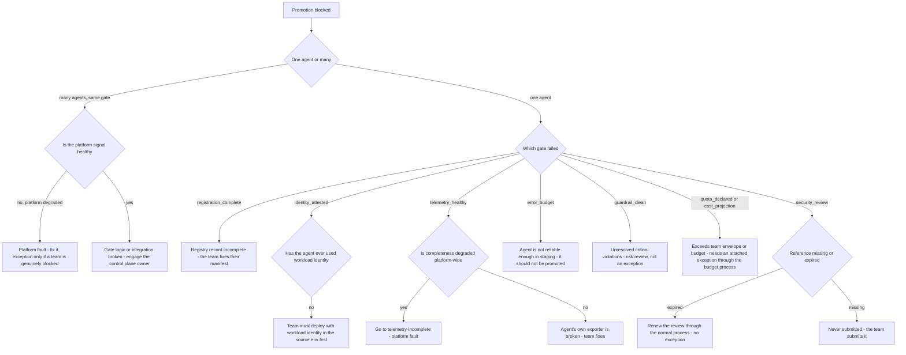

# Runbook: PromotionGateBlocked

## 1. Alert

| Field | Value |
|---|---|
| Name | `PromotionGateBlocked` |
| Severity | SEV4 (ticket); SEV3 if a platform fault is the cause; SEV2 if fleet-wide |
| Routing | Jira `AGP` + the requesting team |
| Gates | `registration_complete`, `identity_attested`, `telemetry_healthy`, `error_budget`, `guardrail_clean`, `quota_declared`, `cost_projection`, `security_review` (SPEC §1.4) |

```promql
- alert: PromotionGateBlocked
  expr: |
    sum by (gate, env) (increase(agentgate_promotion_gate_evaluations_total{result="fail"}[1h])) > 0
  for: 30m
  labels: { severity: sev4 }
  annotations:
    summary: "Promotion gate {{ $labels.gate }} failing for {{ $labels.env }}"
    runbook_url: https://docs.internal/agentgate/runbooks/promotion-gate-blocked.md

# Fleet-wide: the gate itself is broken, not the agents
- alert: PromotionGateFailingFleetWide
  expr: |
    sum by (gate) (increase(agentgate_promotion_gate_evaluations_total{result="fail"}[1h]))
    / sum by (gate) (increase(agentgate_promotion_gate_evaluations_total[1h])) > 0.5
  for: 30m
  labels: { severity: sev2 }

- alert: PromotionRequestsStale
  expr: agentgate_promotion_pending_age_seconds > 86400 * 3
  for: 1h
  labels: { severity: sev4 }
```

## 2. What this means

An agent version cannot be promoted because at least one automated gate failed. Most of the time
this is the gate doing exactly what it was built to do, and the correct outcome is that the agent
does not reach production. The runbook exists for the other case: when the gate fails because *we*
are broken — telemetry we lost, an error budget we burned, a ServiceNow integration that is down —
and a consuming team is blocked by our fault.

Read the distinction carefully before acting. Granting an exception to a gate that is working
correctly is the single most damaging thing this runbook can be used to do.

## 3. Impact

A consuming team cannot ship. No production traffic is affected. In a client with release windows
and change-approval calendars, a blocked promotion may mean a missed window and a multi-week
delay, so the urgency is real even though nothing is on fire. If the failure is fleet-wide, every
team's pipeline stops and the platform becomes the reason nobody can ship — that escalates quickly
and deserves the SEV2.

## 4. First 5 minutes

Business hours. Nobody gets woken for a blocked promotion.

```bash
export CTX=prod-eastus PROM=https://prometheus.internal
export AGENT='agent://fsclient/payments-risk/dispute-triage'
```

1. Which gate, which agent, and what did the evaluation actually say?

```bash
agentctl --context "$CTX" promotion status --agent "$AGENT" --version 2.5.0 --env prod -o json \
  | jq '.gates[] | {gate, result, detail, evaluated_at}'
```

2. Is it one agent or many? That is the whole triage.

```bash
promtool query instant "$PROM" '
sum by (gate, result) (increase(agentgate_promotion_gate_evaluations_total[6h]))'
psql "$AGENTGATE_PG_URL" -c "
select gate, result, count(*) from promotion_gate_results
 where evaluated_at >= now() - interval '24 hours' group by 1,2 order by 1,2;"
```

If one gate fails for most agents, the gate is broken. If several gates fail for one agent, the
agent is not ready.

3. Gate-specific checks — run the one that matches:

```bash
# registration_complete
psql "$AGENTGATE_PG_URL" -x -c "
select identity, owner->>'team', owner->>'email', owner->>'oncall', owner->>'cost_center',
       data_classification from agents where identity='$AGENT';"

# identity_attested
promtool query instant "$PROM" '
sum by (attestation) (increase(agentgate_controlplane_token_exchange_total{agent_id="agt_01J8Z9X2QK"}[7d]))'

# telemetry_healthy  - needs >= 95% complete traces over 24h and >= 100 requests
promtool query instant "$PROM" 'agentgate_telemetry_completeness{agent="'"$AGENT"'",env="staging"}'
promtool query instant "$PROM" '
sum(increase(agentgate_gateway_requests_total{agent="'"$AGENT"'",env="staging"}[24h]))'

# error_budget - the agent's own success SLI over 7d in the source env
promtool query instant "$PROM" '
sum(rate(agentgate_gateway_requests_total{agent="'"$AGENT"'",env="staging",status!~"5.."}[7d]))
  / sum(rate(agentgate_gateway_requests_total{agent="'"$AGENT"'",env="staging"}[7d]))'

# guardrail_clean
promtool query instant "$PROM" '
sum by (category) (increase(agentgate_guardrail_decisions_total{agent="'"$AGENT"'",action="block"}[7d]))'

# quota_declared and cost_projection
agentctl --context "$CTX" promotion projection --agent "$AGENT" --version 2.5.0 -o json \
  | jq '{requested_quota, team_envelope, projected_monthly_usd, team_budget_usd, exceptions}'

# security_review
psql "$AGENTGATE_PG_URL" -tAc "
select security_review_ref, security_review_expires_at from agent_versions
 where agent_id=(select agent_id from agents where identity='$AGENT') and version='2.5.0';"
```

4. If the gate looks like a platform fault, confirm against the platform's own health:

```bash
promtool query instant "$PROM" 'avg(agentgate_telemetry_completeness{env="staging"})'
curl -sS -o /dev/null -w '%{http_code}\n' "$CP/api/v1/integrations/servicenow/health"
```

## 5. Diagnosis decision tree



## 6. Mitigations

The honest default for most of this tree is **the gate is right; help the team pass it**.

### 6.1 Complete the registration record (blast radius: one agent)

```bash
agentctl --context "$CTX" registry apply -f registry/agents/dispute-triage.yaml --dry-run
agentctl --context "$CTX" registry apply -f registry/agents/dispute-triage.yaml
agentctl --context "$CTX" promotion status --agent "$AGENT" --version 2.5.0 --env prod
```

### 6.2 Re-evaluate the gates (blast radius: none)

Gate results are snapshots. If the underlying condition has been fixed, they need re-running:

```bash
agentctl --context "$CTX" promotion reevaluate --agent "$AGENT" --version 2.5.0 --env prod
agentctl --context "$CTX" promotion status --agent "$AGENT" --version 2.5.0 --env prod -o json | jq '.gates'
```

This is the correct first action far more often than an exception is.

### 6.3 Fix the platform-side signal (blast radius: platform)

If `telemetry_healthy` fails because of our collector loss, fix the collector rather than exempting
the agent — see [telemetry-incomplete.md](telemetry-incomplete.md) and
[collector-backpressure.md](collector-backpressure.md). The team can then re-evaluate and pass
honestly.

### 6.4 Grant a time-boxed, recorded exception (blast radius: governance — APPROVAL REQUIRED)

Only when the gate fails for a **platform-side** reason and a team is genuinely blocked. Requires
the platform approver and a change reference; the exception is recorded against the promotion
snapshot so an auditor can reconstruct the decision (SPEC §1.4).

```bash
agentctl --context "$CTX" promotion exception create \
  --agent "$AGENT" --version 2.5.0 --env prod --gate telemetry_healthy \
  --reason "AGP-903 collector loss 2026-08-26 09:00-11:00Z, agent-side telemetry verified healthy by trace sample" \
  --approver platform-lead@client.example --change-ref CHG0045512 --expires 24h
agentctl --context "$CTX" promotion exception list --agent "$AGENT"
```

Exceptions that must **never** be granted by on-call:

| Gate | Why not |
|---|---|
| `security_review` | It is the security review. There is no engineering substitute for it |
| `guardrail_clean` | Unresolved critical violations reaching production is the outcome the platform exists to prevent |
| `error_budget` | An agent that cannot meet its own SLI in staging will not meet it in prod |
| `identity_attested` | Promoting an unattested workload defeats the identity model |

`quota_declared` and `cost_projection` have their own exception path through the budget owner, with
the exception attached to the request (SPEC §1.4). That is not an on-call exception either — it is a
budget approval that happens to be recorded on the gate.

### 6.5 Use the manual change path (blast radius: process)

When the ServiceNow integration is down, the gate falls back to a documented manual path with the
same recorded evidence (SPEC §1.4):

```bash
agentctl --context "$CTX" promotion change-payload --agent "$AGENT" --version 2.5.0 --env prod \
  -o json > /tmp/agp-903-change.json
# Submit through the manual change process, then attach the resulting reference:
agentctl --context "$CTX" promotion attach-change --agent "$AGENT" --version 2.5.0 \
  --change-ref CHG0045512 --evidence /tmp/agp-903-change.json
```

The evidence file is the point. The manual path is not a shortcut around the record; it is the same
record produced by hand.

### 6.6 Two-party approval for prod (blast radius: process)

Production promotion needs one owning-team approver and one platform approver, neither of whom may
be the requester (SPEC §1.4):

```bash
agentctl --context "$CTX" promotion approve --agent "$AGENT" --version 2.5.0 --env prod \
  --as platform-approver --reason "AGP-903 gates green, change CHG0045512"
agentctl --context "$CTX" promotion status --agent "$AGENT" --version 2.5.0 --env prod -o json \
  | jq '{approvals, gate_snapshot_hash}'
```

If you are the requester, you cannot be an approver. The tool enforces it; do not look for a way
around it.

## 7. Rollback

| Mitigation | Undo |
|---|---|
| 6.1 | `git revert` in the team's registry repo and re-apply |
| 6.2 | Nothing to undo; re-evaluation is read-only over the current state |
| 6.4 | `agentctl --context "$CTX" promotion exception revoke --agent "$AGENT" --gate telemetry_healthy` as soon as the underlying signal recovers. Revoke explicitly rather than letting it expire — the revocation is the evidence the gate is real |
| 6.5 | Detach an incorrect change reference: `agentctl promotion detach-change --agent "$AGENT" --version 2.5.0` |
| 6.6 | `agentctl --context "$CTX" promotion revoke-approval --agent "$AGENT" --version 2.5.0 --reason "..."`. If the version is already active in prod, the correct action is a rollback of the deployment, not a revocation of the paperwork |

## 8. Escalation

- Fleet-wide gate failure: SEV2, control plane domain owner, and tell every team that promotions are
  paused before they discover it themselves.
- `security_review` disputes: the security review owner, never on-call.
- Budget or quota exceptions: budget owner and L4, in business hours.
- A team pushing hard for an exception during a release window: escalate to L4 rather than
  absorbing the pressure. The two-party rule and the gate list exist so that no single engineer is
  the last line of defence at 17:55 on a Friday.

## 9. Post-incident

For a platform-caused block, capture: which gate, how many agents, the duration, every exception
granted with approver and expiry, and confirmation each was revoked.

```bash
psql "$AGENTGATE_PG_URL" -c "
select a.identity, r.version, r.gate, r.result, r.evaluated_at, r.detail
  from promotion_gate_results r join agents a using (agent_id)
 where r.evaluated_at >= now() - interval '48 hours' and r.result='fail'
 order by r.evaluated_at desc;" > /tmp/agp-903-gates.txt
agentctl --context "$CTX" promotion exception list --all --since 48h -o json > /tmp/agp-903-exceptions.json
```

For a correctly-blocked agent, there is nothing to capture but a note to the team — and, if the same
gate blocks the same team repeatedly, a conversation about their readiness process rather than about
our gate. That conversation is in
[operational-readiness-review.md](operational-readiness-review.md).

## 10. Related

- [telemetry-incomplete.md](telemetry-incomplete.md) — the most common platform-side cause
- [operational-readiness-review.md](operational-readiness-review.md) — the consuming-agent checklist
- [guardrail-false-positive-spike.md](guardrail-false-positive-spike.md)
- [postgres-failover.md](postgres-failover.md) — gate evaluation needs the registry
- [day-2-operations.md](day-2-operations.md)
- Dashboards: `$GRAFANA/d/agentgate-fleet`

Last game-day exercise: 2026-05-05 (ServiceNow integration disabled, manual path exercised end to end).
