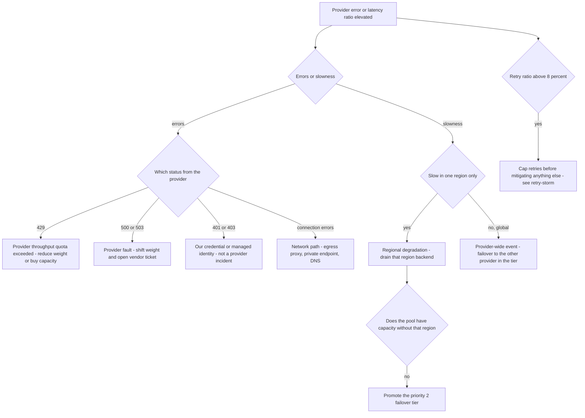

# Runbook: ProviderDegradation

## 1. Alert

| Field | Value |
|---|---|
| Name | `ProviderDegradation` |
| Severity | SEV2 (page); SEV1 if two providers degrade together |
| Routing | `PD-AGENTGATE-PRIMARY` + vendor bridge |

```promql
- alert: ProviderDegradation
  expr: |
    (
      sum by (backend) (rate(agentgate_gateway_requests_total{env="prod",code=~"provider_error|provider_timeout"}[5m]))
      / sum by (backend) (rate(agentgate_gateway_requests_total{env="prod"}[5m]))
    ) > 0.05
  for: 5m
  labels: { severity: sev2 }
  annotations:
    summary: "Backend {{ $labels.backend }} error ratio above 5 percent"
    runbook_url: https://docs.internal/agentgate/runbooks/provider-degradation.md

# Latency form: the provider is answering, just badly
- alert: ProviderLatencyDegradation
  expr: |
    histogram_quantile(0.95,
      sum by (le, backend) (rate(agentgate_gateway_duration_seconds_bucket{phase="total",env="prod"}[5m])))
      - on() group_left()
    histogram_quantile(0.95,
      sum by (le) (rate(agentgate_gateway_duration_seconds_bucket{phase="overhead",env="prod"}[5m])))
      > 8
  for: 10m
```

## 2. What this means

One model provider is returning errors or answering much more slowly than usual. AgentGate is
behaving correctly — retrying, failing over, tripping breakers — but the pool is running on
degraded upstream capacity. The provider-side cause is almost always regional: a single Azure
OpenAI region, one Bedrock region, or one on-prem vLLM node group. This alert exists so we act
before the breaker cascade in [no-healthy-backend.md](no-healthy-backend.md) starts.

## 3. Impact

Depends entirely on the pool's remaining capacity. With a healthy sibling backend, callers see
higher `x-agentgate-attempts` and slightly higher latency — annoying, not damaging. With no
sibling, every request pays retry cost before failing over to priority 2, which can double or
triple latency and will eventually exhaust the retry budget. Consuming teams typically notice as
latency, not errors, which is why they often report it before our page fires.

## 4. First 5 minutes

```bash
export CTX=prod-eastus NS=agentgate PROM=https://prometheus.internal
```

1. Which provider, which region, and how bad?

```bash
promtool query instant "$PROM" '
sum by (backend, code) (rate(agentgate_gateway_requests_total{env="prod",status=~"5.."}[5m]))'
promtool query instant "$PROM" '
histogram_quantile(0.95, sum by (le, backend) (rate(agentgate_gateway_duration_seconds_bucket{phase="total"}[5m])))'
```

2. Errors or slowness? They have different mitigations.

```bash
promtool query instant "$PROM" '
sum by (backend, reason) (rate(agentgate_retry_attempts_total[5m]))'
```

3. Is it us or them? Probe the provider from a pod, and compare with the other region:

```bash
POD=$(kubectl --context "$CTX" -n "$NS" get pod -l app=gateway -o name | head -1)
for host in fsclient-eastus.openai.azure.internal fsclient-westus.openai.azure.internal; do
  echo -n "$host "
  kubectl --context "$CTX" -n "$NS" exec "$POD" -- \
    curl -sS -o /dev/null -w 'code=%{http_code} dns=%{time_namelookup} tls=%{time_appconnect} total=%{time_total}\n' \
    --max-time 15 "https://$host/openai/deployments/gpt-4o-mini/chat/completions"
done
```

4. Check the provider's status page and open the vendor bridge in parallel — do not serialise
   diagnosis and vendor engagement:

```bash
agentctl --context "$CTX" provider status --provider azure-openai
# Vendor bridge: #vendor-escalation, template in incident-response.md section 7
```

5. Confirm failover is actually working, not just configured:

```bash
promtool query instant "$PROM" '
sum by (backend) (rate(agentgate_gateway_requests_total{pool="general-chat"}[2m]))'
promtool query instant "$PROM" '
sum(rate(agentgate_gateway_requests_total{env="prod"}[5m])) by (code)'
```

6. Watch the retry budget. Provider degradation is the standard route to a retry storm:

```bash
promtool query instant "$PROM" '
sum(rate(agentgate_retry_attempts_total[5m])) / sum(rate(agentgate_gateway_requests_total[5m]))'
# Fleet-wide cap is 0.10 (SPEC 3.3). Above 0.08 means you are minutes from RetryStorm.
```

## 5. Diagnosis decision tree



## 6. Mitigations

### 6.1 Cap retries first if the retry ratio is climbing (blast radius: fleet, protective)

Retrying into a degraded provider makes it worse for everyone. Do this before weight changes if
the ratio is above 8%.

```bash
agentctl --context "$CTX" retry set-budget --ratio 0.05 --reason "INC-1234 protecting degraded provider"
```

Verify: `sum(rate(agentgate_retry_attempts_total[2m])) / sum(rate(agentgate_gateway_requests_total[2m]))`
falls below 0.05 within two minutes.

### 6.2 Shift weight away from the degraded backend (blast radius: one pool)

```bash
agentctl --context "$CTX" pool set-weights --pool general-chat \
  --weight azure-openai/gpt-4o-mini=10 --weight bedrock/claude-haiku=90 --reason "INC-1234"
agentctl --context "$CTX" pool show --pool general-chat
```

Expected effect: error ratio for the pool falls proportionally within ~30s. Cost per request
changes — record it.

### 6.3 Drain the degraded backend entirely (blast radius: one backend)

```bash
agentctl --context "$CTX" backend drain --pool general-chat --backend azure-openai/gpt-4o-mini \
  --reason "INC-1234 provider regional degradation" --ttl 4h
```

Expected effect: zero traffic to that backend; no more retry cost paid against it. Verify with the
per-backend request rate falling to zero.

### 6.4 Promote the failover tier (blast radius: one pool, quality change)

When the surviving primary-tier backends cannot absorb the load:

```bash
agentctl --context "$CTX" pool set-priority --pool general-chat \
  --backend onprem-vllm/llama-3.1-8b --priority 1 --reason "INC-1234"
promtool query instant "$PROM" 'agentgate_gateway_inflight{pool="general-chat"}'
```

On-prem has a smaller context window; expect a rise in `413 context_too_large` from agents with
long prompts. Watch for it and tell the affected teams:

```bash
promtool query instant "$PROM" '
topk(5, sum by (agent) (rate(agentgate_gateway_requests_total{code="context_too_large"}[5m])))'
```

### 6.5 Regional failover of AgentGate itself (blast radius: everything)

Only if the degraded provider region is the one co-located with this AgentGate region and the
cross-region path is worse than moving. L4 approval. See
[gateway-availability-burn.md](gateway-availability-burn.md#66-regional-failover-blast-radius-everything-but-recovers-everything).

## 7. Rollback

| Mitigation | Undo |
|---|---|
| 6.1 | `agentctl --context "$CTX" retry set-budget --ratio 0.25` (the documented default from SPEC §3.3) once the provider is stable for 30 min |
| 6.2 | Restore committed weights from `deploy/k8s/overlays/prod/pools.yaml` |
| 6.3 | `agentctl --context "$CTX" backend undrain --pool general-chat --backend azure-openai/gpt-4o-mini`, then ramp weight 10 → 30 → 60 with 10 min at each step. Do not go straight back to full weight; a recovering provider re-degrades under a step load |
| 6.4 | `agentctl --context "$CTX" pool set-priority --pool general-chat --backend onprem-vllm/llama-3.1-8b --priority 2` |
| 6.5 | Ramp front-door weight back 25 → 50 → 100 |

## 8. Escalation

- Vendor bridge at the same moment you start mitigating, not after. Provide: region, deployment
  name, three `x-agentgate-request-id` values, observed error codes, start time in UTC, and your
  measured p95.
- Two providers degraded simultaneously: SEV1, page L2, and treat a shared dependency (our egress
  proxy or DNS) as the leading hypothesis until disproved.
- If a provider quota purchase is needed to restore service, escalate to L4 — an on-call engineer
  does not commit spend.
- Regulated-environment note: if degradation forces traffic to a backend in a different
  data-residency zone, that is a control change. Stop and get the security duty officer before you
  route restricted-classification traffic across a residency boundary; the routing filter should
  prevent it, and if it did not, that is a SEV1 security finding.

## 9. Post-incident

```bash
promtool query range "$PROM" 'sum by (backend, code) (rate(agentgate_gateway_requests_total{status=~"5.."}[5m]))' \
  --start "$(date -u -d '-6 hours' +%FT%TZ)" --end "$(date -u +%FT%TZ)" --step 1m > /tmp/inc-provider-errors.txt
promtool query range "$PROM" 'sum(rate(agentgate_retry_attempts_total[5m])) / sum(rate(agentgate_gateway_requests_total[5m]))' \
  --start "$(date -u -d '-6 hours' +%FT%TZ)" --end "$(date -u +%FT%TZ)" --step 1m > /tmp/inc-retry-ratio.txt
agentctl --context "$CTX" audit list --since 12h -o json > /tmp/inc-audit.json
```

Record: vendor ticket reference and their stated cause; how long from provider degradation start to
our detection; whether failover absorbed it without consumer-visible impact; the extra cost of
running on the alternate backend; and whether the retry budget held. Feed the timing into the
capacity model in `test/load/capacity-model.md` if the failover tier turned out to be under-sized.

## 10. Related

- [circuit-breaker-open.md](circuit-breaker-open.md)
- [no-healthy-backend.md](no-healthy-backend.md)
- [retry-storm.md](retry-storm.md)
- [gateway-ttft-regression.md](gateway-ttft-regression.md)
- [postmortem-template.md](postmortem-template.md) — the worked example is exactly this scenario
- Dashboards: `$GRAFANA/d/agentgate-pools`, `$GRAFANA/d/agentgate-gateway-slo`

Last game-day exercise: 2026-08-04 (regional degradation of `azure-openai` in staging).
