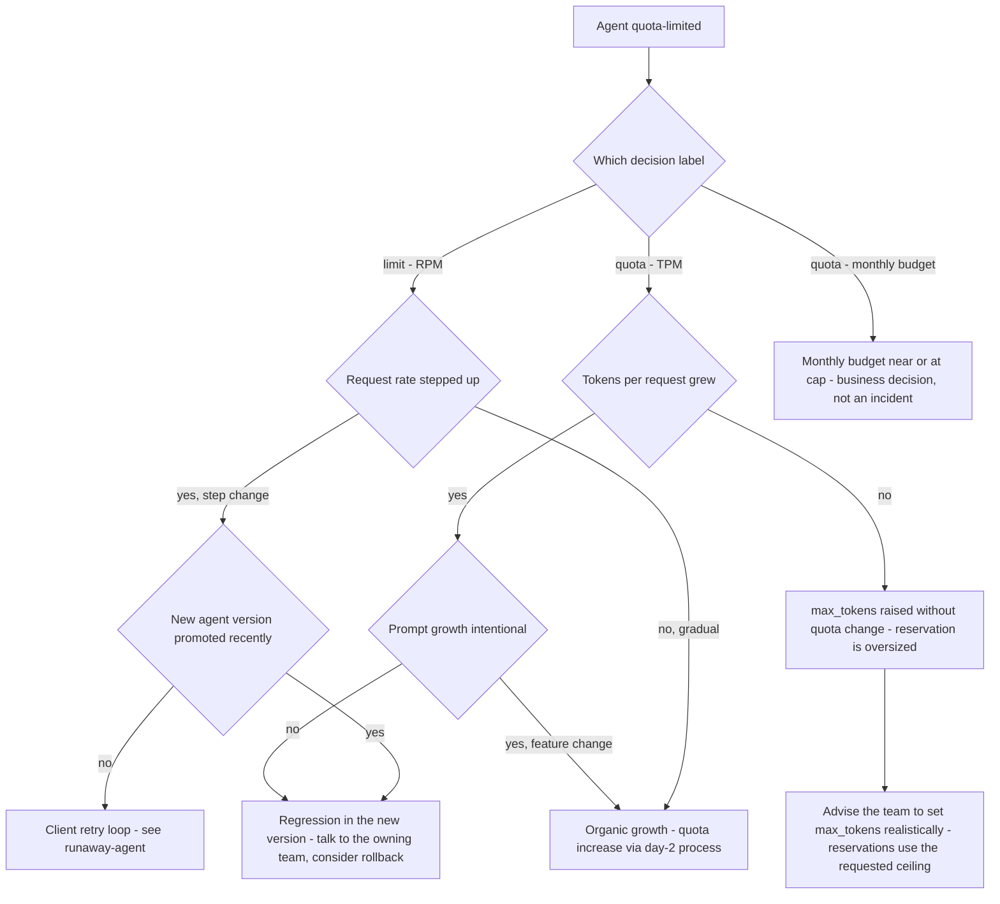

# Runbook: QuotaSaturation

## 1. Alert

| Field | Value |
|---|---|
| Name | `QuotaSaturation` |
| Severity | SEV3 (ticket); SEV2 if the agent is on a critical business path |
| Routing | Jira `AGP`, plus a notification to the owning team's channel |
| Error codes | `429 quota_exceeded` (TPM or monthly budget), `429 rate_limited` (RPM) — SPEC §2.4 |

```promql
- alert: QuotaSaturation
  expr: |
    sum by (agent) (rate(agentgate_ratelimit_decisions_total{decision="quota"}[10m]))
    / sum by (agent) (rate(agentgate_ratelimit_decisions_total[10m])) > 0.05
  for: 15m
  labels: { severity: sev3 }
  annotations:
    summary: "{{ $labels.agent }} is being quota-limited on more than 5 percent of requests"
    runbook_url: https://docs.internal/agentgate/runbooks/quota-saturation.md

- alert: MonthlyBudgetNearExhaustion
  expr: agentgate_quota_monthly_tokens_used / agentgate_quota_monthly_tokens_budget > 0.90
  for: 30m
  labels: { severity: sev3 }
```

## 2. What this means

An agent is asking for more token throughput than its registered quota allows, and the gateway is
refusing the excess. Quota is token-aware (SPEC §3.4): we estimate input tokens plus `max_tokens`,
**reserve** them from the agent's bucket, and **settle** the difference on completion. A saturated
agent is one whose reservations are being refused. This is the platform doing its job — the
question is whether the quota is wrong or the agent is.

The three limits are separate and the alert tells you which one:
`decision="limit"` is RPM, `decision="quota"` is TPM or the monthly budget.

## 3. Impact

Confined to one agent, by design — that is the whole point of per-agent buckets keyed
`tenant:team:agent:env`. That agent's runs fail or stall; its framework may retry, which does not
help since the bucket is still empty. Other agents are unaffected unless the saturated agent is
also generating a retry storm. If the agent is `dispute-triage` in `payments-risk`, a stalled run
means unclassified cases and a business SLA of its own, so check the registration record's
`data_classification` and owner before deciding this is routine.

## 4. First 5 minutes

```bash
export CTX=prod-eastus NS=agentgate PROM=https://prometheus.internal
export AGENT='agent://fsclient/payments-risk/dispute-triage'
```

1. Which limit is being hit, and how hard?

```bash
promtool query instant "$PROM" '
sum by (agent, decision) (rate(agentgate_ratelimit_decisions_total{agent="'"$AGENT"'"}[5m]))'
```

2. What is the configured quota, and what is actual consumption?

```bash
psql "$AGENTGATE_PG_URL" -x -c \
  "select identity, quota->>'requests_per_minute' as rpm,
          quota->>'tokens_per_minute' as tpm,
          quota->>'monthly_token_budget' as monthly,
          owner->>'team' as team, owner->>'oncall' as oncall
     from agents where identity = '$AGENT';"

promtool query instant "$PROM" '
sum(rate(agentgate_gateway_tokens_total{agent="'"$AGENT"'",env="prod"}[1m])) * 60'
promtool query instant "$PROM" '
sum(rate(agentgate_gateway_requests_total{agent="'"$AGENT"'",env="prod"}[1m])) * 60'
```

3. Is this new behaviour or steady growth? A step change means something shipped.

```bash
promtool query instant "$PROM" '
sum(rate(agentgate_gateway_tokens_total{agent="'"$AGENT"'"}[1h]))
  / sum(rate(agentgate_gateway_tokens_total{agent="'"$AGENT"'"}[1h] offset 24h))'
```

4. Did the agent's version change? Correlate with the registry.

```bash
psql "$AGENTGATE_PG_URL" -c \
  "select version, env, state, promoted_at, promoted_by
     from agent_versions where agent_id = (select agent_id from agents where identity = '$AGENT')
     order by promoted_at desc limit 5;"
```

5. Inspect the live bucket state in Redis. Keys are `tenant:team:agent:env` (SPEC §3.4):

```bash
redis-cli -u "$REDIS_URL" --no-auth-warning \
  GET 'ag:{fsclient:payments-risk:dispute-triage:prod}:tpm'
redis-cli -u "$REDIS_URL" --no-auth-warning \
  TTL 'ag:{fsclient:payments-risk:dispute-triage:prod}:tpm'
redis-cli -u "$REDIS_URL" --no-auth-warning \
  GET 'ag:budget:{fsclient}:CC-4471:202608'
```

6. Check whether prompt size grew rather than call volume — a quota breach with flat RPM is a
   prompt-size story:

```bash
promtool query instant "$PROM" '
sum(rate(agentgate_gateway_tokens_total{agent="'"$AGENT"'",direction="input"}[10m]))
  / sum(rate(agentgate_gateway_requests_total{agent="'"$AGENT"'"}[10m]))'
```

## 5. Diagnosis decision tree



## 6. Mitigations

Note the ordering: the default answer is **not** to raise the quota. A quota is a control, and
raising it during an incident removes the control that was containing the problem.

### 6.1 Confirm the limit is correct and tell the owning team (blast radius: none)

```bash
psql "$AGENTGATE_PG_URL" -tAc \
  "select owner->>'email', owner->>'oncall' from agents where identity = '$AGENT';"
```

Send them: the observed RPM and TPM, the configured limits, the version correlation, and the
tokens-per-request trend. Most of these close here.

### 6.2 Temporary quota increase with a TTL (blast radius: cost, one agent)

For a legitimate burst — a backfill, a month-end run — where the team has budget.

```bash
agentctl --context "$CTX" quota set --agent "$AGENT" --env prod \
  --tokens-per-minute 200000 --requests-per-minute 900 \
  --reason "INC-1234 month-end backfill, CHG0045512" --ttl 8h
```

Expected effect: `decision="quota"` falls to zero within one bucket window (60s). Verify:

```bash
promtool query instant "$PROM" '
sum by (decision) (rate(agentgate_ratelimit_decisions_total{agent="'"$AGENT"'"}[2m]))'
```

The TTL is mandatory. An untimed quota increase is a permanent change made without review.

### 6.3 Permanent quota increase (blast radius: team envelope)

Not an on-call action. Requires: the team's allocated envelope has room, cost projection within
budget, and the change recorded. Follow
[day-2-operations.md](day-2-operations.md#5-raising-a-quota). If the request exceeds the team
envelope it needs an attached exception — the same rule the `quota_declared` promotion gate
applies (SPEC §1.4).

### 6.4 Move the agent to a cheaper pool (blast radius: one agent, quality)

If the agent's work does not need the model it is using, the token budget goes further elsewhere.
This changes behaviour and belongs to the owning team, not to on-call.

### 6.5 Roll back the agent version (blast radius: one agent)

If a promoted version caused a step change in consumption, the owning team rolls back. We can
block the version at the gateway if they cannot act and the spend is material:

```bash
agentctl --context "$CTX" version block --agent "$AGENT" --version 2.5.0 --env prod \
  --reason "INC-1234 4x token consumption regression, owner notified"
```

This returns `403 agent_not_promoted` for that version. It is a significant action: notify the
owning team's on-call by phone, not by ticket.

## 7. Rollback

| Mitigation | Undo |
|---|---|
| 6.2 | Expires by TTL. To end it early: `agentctl --context "$CTX" quota reset --agent "$AGENT" --env prod` |
| 6.3 | Revert the registry change and re-apply from git: `agentctl registry apply -f registry/agents/dispute-triage.yaml` |
| 6.4 | Restore the agent's `requested_pools` in the registration record |
| 6.5 | `agentctl --context "$CTX" version unblock --agent "$AGENT" --version 2.5.0 --env prod` once the owning team has shipped a fix and confirmed consumption in staging |

## 8. Escalation

- Business-hours default. Do not wake anyone for a single agent hitting its quota.
- Wake the owning team's on-call if: the agent is on a critical path (check
  `data_classification` and the team's own SLA), or the saturation is caused by a version they
  promoted in the last hour.
- Escalate to L4 if a quota increase would exceed the team's envelope and the requesting team
  is pushing for it during an incident. That is a budget decision with an audit trail, not an
  on-call decision.
- Escalate to the cost owner if the monthly budget is the limit being hit — see
  [cost-anomaly.md](cost-anomaly.md).

## 9. Post-incident

- Record the observed RPM/TPM against the configured values and the ratio between them; a quota set
  at 2x observed peak is healthy, at 1.05x it will page again next week.
- Note whether the agent sets `max_tokens` realistically. Reservations use the requested ceiling,
  so an agent asking for 4096 and using 200 is burning 20x its real need in reservation. This is
  the single most common finding in this runbook and the fix is one line in the caller's code.
- If a version regression caused it, confirm the `cost_projection` promotion gate should have
  caught it and why it did not.
- If the same agent saturates twice in a month, its quota is wrong; open a permanent change rather
  than granting a third TTL.

## 10. Related

- [rate-limit-misconfiguration.md](rate-limit-misconfiguration.md) — when the *limit* is wrong
- [runaway-agent.md](runaway-agent.md) — when the *agent* is wrong
- [cost-anomaly.md](cost-anomaly.md)
- [day-2-operations.md](day-2-operations.md#5-raising-a-quota)
- Dashboards: `$GRAFANA/d/agentgate-cost`, `$GRAFANA/d/agentgate-fleet`

Last game-day exercise: 2026-06-16 (quota exhaustion in staging with a synthetic backfill).
