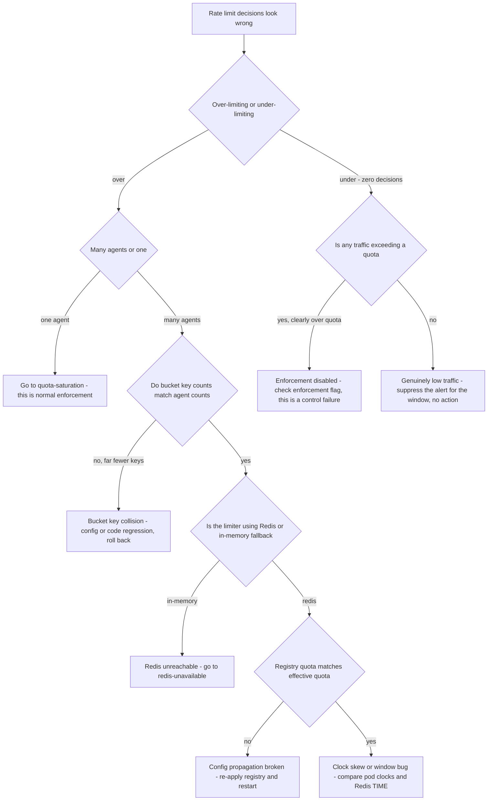

# Runbook: RateLimitMisconfiguration

## 1. Alert

| Field | Value |
|---|---|
| Name | `RateLimitMisconfiguration` |
| Severity | SEV2 (page) |
| Routing | `PD-AGENTGATE-PRIMARY` |

Fires when limiting is happening at a scale or shape that no legitimate quota would produce — many
agents limited at once, or an agent limited far below its registered quota.

```promql
- alert: RateLimitMisconfiguration
  expr: |
    count(
      sum by (agent) (rate(agentgate_ratelimit_decisions_total{decision=~"limit|quota"}[5m])) > 0
    ) > 10
  for: 5m
  labels: { severity: sev2 }
  annotations:
    runbook_url: https://docs.internal/agentgate/runbooks/rate-limit-misconfiguration.md

# Limiting below the registered quota - the bucket and the registry disagree
- alert: RateLimitBelowRegisteredQuota
  expr: |
    (sum by (agent) (rate(agentgate_gateway_requests_total{env="prod"}[1m])) * 60)
      < 0.5 * agentgate_quota_requests_per_minute_configured
    and
    sum by (agent) (rate(agentgate_ratelimit_decisions_total{decision="limit"}[1m])) > 0
  for: 5m
  labels: { severity: sev2 }

# The inverse failure: nothing is being limited at all
- alert: RateLimitNotEnforcing
  expr: sum(rate(agentgate_ratelimit_decisions_total{decision=~"limit|quota"}[30m])) == 0
  for: 30m
  labels: { severity: sev2 }
```

## 2. What this means

The rate limiter is producing decisions that do not match the registry. Two opposite failures land
here and they need opposite responses:

- **Over-limiting** — agents are being refused below their configured quota. Causes: a bad config
  push, a bucket key change that made every agent share one bucket, a Redis Lua script version
  mismatch, or clock skew making bucket windows expire early.
- **Under-limiting** — nothing is being limited at all, so quota is not a control any more. That is
  a compliance-relevant failure in a regulated environment even though nobody is complaining, and a
  runaway agent has nothing standing in its way.

## 3. Impact

Over-limiting: legitimate traffic rejected with `429 rate_limited` or `429 quota_exceeded` across
many teams simultaneously. Consuming teams experience this as an outage that our availability SLI
does not show, because 4xx does not burn the budget — one of the few cases where the SLO looks
fine and the platform is not.

Under-limiting: no immediate symptom, but the shared-capacity protections are off. One agent can
consume a pool's throughput, provider-side quotas get hit instead of ours, and chargeback figures
diverge from expectations.

## 4. First 5 minutes

```bash
export CTX=prod-eastus NS=agentgate PROM=https://prometheus.internal
```

1. Which direction is the failure?

```bash
promtool query instant "$PROM" 'sum by (decision) (rate(agentgate_ratelimit_decisions_total[5m]))'
promtool query instant "$PROM" '
topk(20, sum by (agent, decision) (rate(agentgate_ratelimit_decisions_total{decision=~"limit|quota"}[5m])))'
```

If the `topk` shows many agents at similar rates, suspect a shared bucket. If it shows one, this is
[quota-saturation.md](quota-saturation.md), not this runbook.

2. Compare a live bucket against the registry for one affected agent:

```bash
export AGENT='agent://fsclient/payments-risk/dispute-triage'
psql "$AGENTGATE_PG_URL" -tAc \
  "select quota->>'requests_per_minute', quota->>'tokens_per_minute'
     from agents where identity='$AGENT';"

agentctl --context "$CTX" quota show --agent "$AGENT" --env prod -o json
```

Registry and effective quota must match. If they do not, the config path is broken.

3. Check the bucket keys in Redis. Every agent must have its own key; one shared key is the
   classic misconfiguration:

```bash
redis-cli -u "$REDIS_URL" --no-auth-warning --scan --pattern 'ag:{*}:rpm' --count 100 | head -30
redis-cli -u "$REDIS_URL" --no-auth-warning --scan --pattern 'ag:{*}:rpm' --count 1000 | wc -l
# Compare against the number of active agents:
promtool query instant "$PROM" 'count(count by (agent) (agentgate_gateway_requests_total{env="prod"}))'
```

A key count far below the agent count means agents are colliding into one bucket.

4. Check the limiter script version. Buckets are a single atomic Lua script (SPEC §3.4); a mismatch
   between pods is a rolling-deploy artefact:

```bash
kubectl --context "$CTX" -n "$NS" logs deploy/gateway --since=15m \
  | jq -c 'select(.msg=="ratelimit script loaded") | {pod:.pod, sha:.script_sha}' | sort -u
redis-cli -u "$REDIS_URL" --no-auth-warning SCRIPT EXISTS "$(kubectl --context "$CTX" -n "$NS" get cm gateway-config -o jsonpath='{.data.ratelimit\.script_sha}')"
```

5. Check for the in-memory fallback. If Redis was unreachable the gateway may have fallen back to
   per-pod in-memory buckets, which limit at 1/Nth of the intended rate per pod:

```bash
promtool query instant "$PROM" 'agentgate_ratelimit_backend_info'
kubectl --context "$CTX" -n "$NS" logs deploy/gateway --since=30m | grep -c 'ratelimit fallback to in-memory'
```

6. What changed?

```bash
kubectl --context "$CTX" -n "$NS" rollout history deploy/gateway | tail -5
agentctl --context "$CTX" audit list --since 12h --kind quota
```

## 5. Diagnosis decision tree



## 6. Mitigations

### 6.1 Roll back the change that caused it (blast radius: the change)

```bash
kubectl --context "$CTX" -n "$NS" rollout undo deploy/gateway
kubectl --context "$CTX" -n "$NS" rollout status deploy/gateway --timeout=180s
```

Verify decisions return to the expected shape:

```bash
promtool query instant "$PROM" 'sum by (decision) (rate(agentgate_ratelimit_decisions_total[2m]))'
```

### 6.2 Re-apply the registry quotas from git (blast radius: quota config)

When effective quota disagrees with the registry:

```bash
agentctl --context "$CTX" registry apply -f registry/agents/ --dry-run
agentctl --context "$CTX" registry apply -f registry/agents/
agentctl --context "$CTX" quota show --agent "$AGENT" --env prod
```

### 6.3 Flush a corrupted bucket, one agent at a time (blast radius: one agent, brief)

Only for buckets whose contents are provably wrong — for example a negative or absurd reserve
count. Flushing gives that agent a free window; do not flush broadly.

```bash
redis-cli -u "$REDIS_URL" --no-auth-warning GET 'ag:{fsclient:payments-risk:dispute-triage:prod}:tpm'
redis-cli -u "$REDIS_URL" --no-auth-warning DEL \
  'ag:{fsclient:payments-risk:dispute-triage:prod}:tpm' \
  'ag:{fsclient:payments-risk:dispute-triage:prod}:rpm'
```

Never `FLUSHDB`. The same Redis holds cache entries, breaker state and JTI replay records; flushing
it turns a rate-limit incident into an availability and security incident.

### 6.4 Raise limits temporarily across the board (blast radius: fleet, cost)

When over-limiting is blocking many teams and the root cause will take time. IC approval required,
because it removes a control for everyone.

```bash
agentctl --context "$CTX" quota multiplier set --factor 3 --env prod \
  --reason "INC-1234 limiter over-restricting, IC approved" --ttl 60m
```

Expected effect: `decision="limit"` collapses. Watch cost and provider-side 429s closely while it
is in force:

```bash
promtool query instant "$PROM" 'sum(rate(agentgate_gateway_cost_usd_total[5m])) * 3600'
promtool query instant "$PROM" 'sum by (backend) (rate(agentgate_gateway_requests_total{status="429"}[2m]))'
```

### 6.5 Re-enable enforcement (blast radius: fleet — for the under-limiting case)

```bash
kubectl --context "$CTX" -n "$NS" get cm gateway-config -o jsonpath='{.data.ratelimit\.enforce}{"\n"}'
kubectl --context "$CTX" -n "$NS" patch cm gateway-config --type merge -p '{"data":{"ratelimit.enforce":"true"}}'
kubectl --context "$CTX" -n "$NS" rollout restart deploy/gateway
```

Expect a burst of 429s as over-quota agents meet the limit for the first time. Warn affected teams
in advance where you can; enforcement returning is not an outage but it will look like one to them.

## 7. Rollback

| Mitigation | Undo |
|---|---|
| 6.1 | Re-deploy only a fixed build |
| 6.2 | `git revert` the registry change and re-apply; never hand-edit rows in `agents` |
| 6.3 | Nothing to undo; buckets refill on the next window. Record which keys you deleted |
| 6.4 | `agentctl --context "$CTX" quota multiplier reset --env prod` — this **must** be undone before the incident closes. A multiplier left in place silently invalidates every team's envelope |
| 6.5 | Only disable enforcement again with security approval; treat re-disabling as a control exception with a recorded reference |

## 8. Escalation

- Over-limiting affecting more than three teams: SEV2, page L2, and post in the platform channel
  before the tickets arrive.
- Under-limiting: notify the security duty officer and the compliance contact the same day, even if
  no consumer noticed. In a regulated environment an unenforced control is a finding, and it is
  better reported by us than found in an audit.
- If bucket key collision is confirmed, involve the gateway domain owner: agents sharing a bucket
  is a tenant-isolation defect, not a configuration slip.

## 9. Post-incident

```bash
promtool query range "$PROM" 'sum by (decision) (rate(agentgate_ratelimit_decisions_total[5m]))' \
  --start "$(date -u -d '-6 hours' +%FT%TZ)" --end "$(date -u +%FT%TZ)" --step 1m > /tmp/inc-ratelimit.txt
agentctl --context "$CTX" audit list --since 24h --kind quota -o json > /tmp/inc-quota-audit.json
```

Capture: how many agents were wrongly limited and for how long; the exact config or code diff;
whether the multiplier was used and proof it was reset; and whether any tenant's requests were
counted against another tenant's bucket — that last one is an isolation question and has to be
answered explicitly, not assumed.

Add a test if one is missing: `test/load/k6/multitenant.js` asserts fair-share isolation and should
have caught a bucket collision before production.

## 10. Related

- [quota-saturation.md](quota-saturation.md)
- [runaway-agent.md](runaway-agent.md)
- [redis-unavailable.md](redis-unavailable.md)
- [day-2-operations.md](day-2-operations.md#5-raising-a-quota)
- Dashboards: `$GRAFANA/d/agentgate-fleet`, `$GRAFANA/d/agentgate-cost`

Last game-day exercise: 2026-05-19 (bucket key collision injected in staging).
