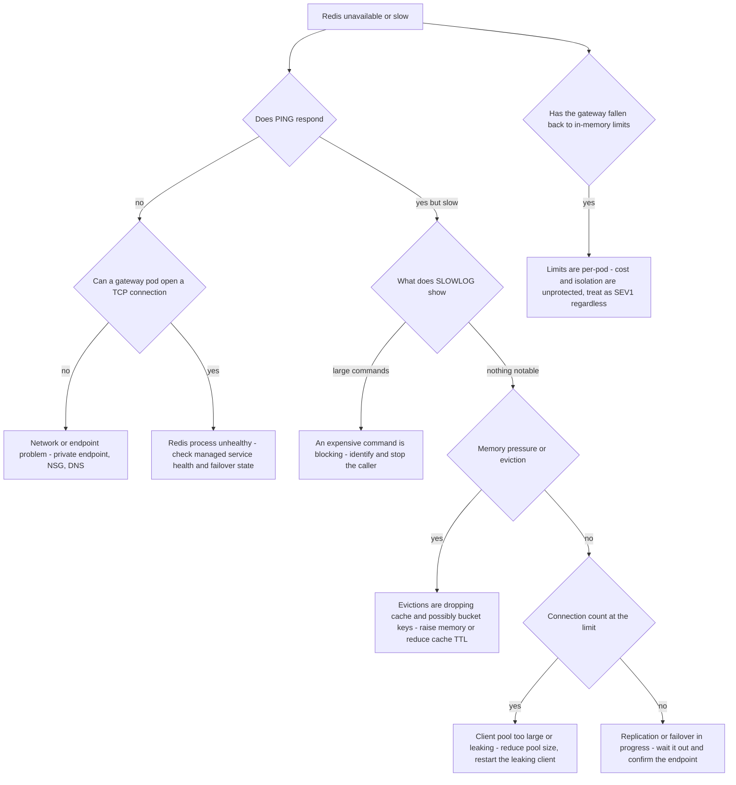

# Runbook: RedisUnavailable

## 1. Alert

| Field | Value |
|---|---|
| Name | `RedisUnavailable` |
| Severity | SEV1 (page primary + secondary) |
| Routing | `PD-AGENTGATE-PRIMARY`, auto-page `PD-AGENTGATE-SECONDARY` |

```promql
- alert: RedisUnavailable
  expr: redis_up{instance=~".*agentgate.*"} == 0
  for: 1m
  labels: { severity: sev1 }
  annotations:
    runbook_url: https://docs.internal/agentgate/runbooks/redis-unavailable.md

- alert: RedisDegraded
  expr: |
    histogram_quantile(0.99, sum by (le) (rate(agentgate_redis_command_duration_seconds_bucket[5m]))) > 0.050
  for: 5m
  labels: { severity: sev2 }

- alert: RedisConnectionErrors
  expr: sum(rate(agentgate_redis_errors_total[5m])) > 1
  for: 3m
  labels: { severity: sev2 }

- alert: RedisMemoryPressure
  expr: redis_memory_used_bytes / redis_memory_max_bytes > 0.90
  for: 10m
  labels: { severity: sev2 }
```

## 2. What this means

Redis is unreachable or too slow. Redis is on the hot path of four things (SPEC §3.2, §3.4, §3.5):

| Consumer | Key shape | What breaks without it |
|---|---|---|
| Distributed rate limit and quota buckets | `ag:{tenant:team:agent:env}:rpm` / `:tpm` | Limits stop being distributed |
| Monthly budget counters | `ag:budget:{tenant}:{cost_center}:{yyyymm}` | Budget enforcement drifts |
| Exact and semantic cache | `ag:cache:exact:{tenant}:{sha}` / `ag:cache:sem:{tenant}` | Cache misses, cost rises |
| JTI replay window | `ag:jti:{jti}` | Replay protection weakens |

The gateway has in-memory buckets with identical semantics for local and dev (SPEC §3.4). If it
falls back to them in production, limits become per-pod — with 16 pods, an agent gets roughly 16x
its intended rate. That is the dangerous part of this incident, and it is silent.

## 3. Impact

Depends on the configured failure mode, which you must establish immediately:

- **Fail-closed admission**: requests are rejected because quota cannot be reserved. Total outage,
  loud, budget-burning.
- **Fail-open admission**: requests proceed with degraded limiting. No visible impact; rate limits
  and quotas are effectively not enforced fleet-wide, cost is uncontrolled, and one agent can starve
  a pool.

Cache misses raise cost and latency in both modes. Replay-window loss weakens a security control
and must be recorded regardless of which mode is in force.

## 4. First 5 minutes

```bash
export CTX=prod-eastus NS=agentgate PROM=https://prometheus.internal
```

1. Is Redis actually down, or just slow?

```bash
promtool query instant "$PROM" 'redis_up{instance=~".*agentgate.*"}'
redis-cli -u "$REDIS_URL" --no-auth-warning PING
redis-cli -u "$REDIS_URL" --no-auth-warning --latency-history -i 5 &
sleep 15; kill %1
```

2. **What did the gateway do about it?** This is the question that decides the severity.

```bash
promtool query instant "$PROM" 'agentgate_ratelimit_backend_info'
kubectl --context "$CTX" -n "$NS" logs deploy/gateway --since=10m \
  | grep -cE 'ratelimit fallback to in-memory|redis unavailable'
promtool query instant "$PROM" 'sum by (decision) (rate(agentgate_ratelimit_decisions_total[2m]))'
promtool query instant "$PROM" 'sum by (code) (rate(agentgate_gateway_requests_total{env="prod",status="429"}[2m]))'
```

Zero limit decisions plus normal traffic means limits are not being enforced.

3. Redis server state:

```bash
redis-cli -u "$REDIS_URL" --no-auth-warning INFO server | head -12
redis-cli -u "$REDIS_URL" --no-auth-warning INFO replication
redis-cli -u "$REDIS_URL" --no-auth-warning INFO memory | grep -E 'used_memory_human|maxmemory_human|evicted_keys|mem_fragmentation_ratio'
redis-cli -u "$REDIS_URL" --no-auth-warning INFO clients | grep -E 'connected_clients|blocked_clients|rejected'
redis-cli -u "$REDIS_URL" --no-auth-warning INFO stats | grep -E 'keyspace_hits|keyspace_misses|expired_keys|evicted_keys'
```

4. Cluster health, if clustered:

```bash
redis-cli -u "$REDIS_URL" --no-auth-warning CLUSTER INFO
redis-cli -u "$REDIS_URL" --no-auth-warning CLUSTER NODES | awk '{print $2, $3, $8}'
```

5. Is anything blocking the server? A slow command blocks everything after it:

```bash
redis-cli -u "$REDIS_URL" --no-auth-warning SLOWLOG GET 10
redis-cli -u "$REDIS_URL" --no-auth-warning CLIENT LIST | awk '{print $1, $17, $18}' | head -20
```

Never run `KEYS` on this instance. Use `SCAN`.

6. Network path from a gateway pod:

```bash
POD=$(kubectl --context "$CTX" -n "$NS" get pod -l app=gateway -o name | head -1)
kubectl --context "$CTX" -n "$NS" exec "$POD" -- \
  timeout 5 bash -c 'cat < /dev/null > /dev/tcp/redis-agentgate-prod.redis.internal/6380 && echo tcp-ok || echo tcp-fail'
```

## 5. Diagnosis decision tree



## 6. Mitigations

### 6.1 Establish what the failure mode is doing (blast radius: none)

```bash
kubectl --context "$CTX" -n "$NS" get cm gateway-config -o jsonpath='{.data.ratelimit\.on_backend_failure}{"\n"}'
# "fail_open" -> serving without limits; "fail_closed" -> rejecting
```

Decide deliberately which one you want for the next thirty minutes, and say it out loud in the
incident channel. Drifting into fail-open by accident is the failure mode of this runbook.

### 6.2 Fail over the managed Redis (blast radius: brief connection reset)

```bash
# Azure Cache for Redis
az redis force-reboot --name redis-agentgate-prod --resource-group rg-agentgate-prod \
  --reboot-type PrimaryNode
# AWS ElastiCache
aws elasticache test-failover --replication-group-id agentgate-prod \
  --node-group-id 0001
```

Expected effect: connections reset, clients reconnect, service resumes within 30–60 seconds.
Verify:

```bash
redis-cli -u "$REDIS_URL" --no-auth-warning PING
promtool query instant "$PROM" 'redis_up{instance=~".*agentgate.*"}'
promtool query instant "$PROM" 'sum(rate(agentgate_redis_errors_total[1m]))'
```

### 6.3 Relieve memory pressure (blast radius: cache hit ratio)

Cache entries are the expendable data here; bucket and JTI keys are not. Make evictions hit the
right thing by shortening cache TTL rather than letting `maxmemory-policy` choose:

```bash
redis-cli -u "$REDIS_URL" --no-auth-warning CONFIG GET maxmemory-policy
agentctl --context "$CTX" cache set-ttl --pool general-chat --ttl 300s \
  --reason "INC-1234 Redis memory pressure"
agentctl --context "$CTX" cache purge --pool general-chat --older-than 10m --reason "INC-1234"
```

Verify memory falls and evictions stop:

```bash
redis-cli -u "$REDIS_URL" --no-auth-warning INFO memory | grep -E 'used_memory_human|evicted_keys'
```

If `evicted_keys` is climbing and the policy is `allkeys-lru`, bucket keys are being evicted too —
that is why limits are behaving strangely. Change the policy to `volatile-lru` so only keys with a
TTL are candidates:

```bash
redis-cli -u "$REDIS_URL" --no-auth-warning CONFIG SET maxmemory-policy volatile-lru
```

### 6.4 Disable the cache to reduce Redis load (blast radius: cost and latency)

```bash
agentctl --context "$CTX" cache disable --all-pools --reason "INC-1234 reducing Redis load" --ttl 2h
```

Expected effect: Redis ops per request drop by roughly a third; cost per request rises. Verify:

```bash
promtool query instant "$PROM" 'sum(rate(agentgate_redis_commands_total[2m]))'
promtool query instant "$PROM" 'sum(rate(agentgate_gateway_cost_usd_total[5m])) / sum(rate(agentgate_gateway_requests_total[5m]))'
```

### 6.5 Set admission to fail-closed deliberately (blast radius: fleet — protective)

If Redis is down and running unlimited is unacceptable — which it is for a regulated client running
shared capacity — choose rejection over uncontrolled spend:

```bash
kubectl --context "$CTX" -n "$NS" patch cm gateway-config --type merge \
  -p '{"data":{"ratelimit.on_backend_failure":"fail_closed"}}'
kubectl --context "$CTX" -n "$NS" rollout restart deploy/gateway
```

This is an IC decision. It converts a silent control failure into a visible outage, which is the
right trade and an unpopular one. Say so explicitly in the incident channel.

### 6.6 Reduce the connection pool (blast radius: gateway latency)

When Redis is refusing connections because clients have too many:

```bash
kubectl --context "$CTX" -n "$NS" patch cm gateway-config --type merge \
  -p '{"data":{"redis.pool_size":"16","redis.min_idle_conns":"4"}}'
kubectl --context "$CTX" -n "$NS" rollout restart deploy/gateway
redis-cli -u "$REDIS_URL" --no-auth-warning INFO clients | grep connected_clients
```

## 7. Rollback

| Mitigation | Undo |
|---|---|
| 6.2 | None; a failover is not reversible. Confirm the replica topology is healthy afterwards |
| 6.3 | `agentctl --context "$CTX" cache set-ttl --pool general-chat --ttl 3600s` and restore `maxmemory-policy` to its committed value from the terraform module — do not leave a hand-set policy in place |
| 6.4 | `agentctl --context "$CTX" cache enable --all-pools`; watch Redis load as the hit ratio rebuilds |
| 6.5 | Restore `ratelimit.on_backend_failure` to its committed value once Redis is stable for 30 minutes. Record which mode was in force and when it changed |
| 6.6 | Restore committed pool values from `deploy/k8s/overlays/prod/` |

## 8. Escalation

- Page L2 immediately; SEV1.
- Managed service: open a cloud provider support case in parallel with mitigation.
- **Security duty officer** if the JTI replay window was lost or unavailable: replay protection was
  degraded for a measurable period and that is a control gap that must be recorded, not inferred.
- Client incident manager at 30 minutes if service is degraded, and immediately if you chose 6.5 —
  a deliberate outage decision needs to be communicated as a decision, not discovered.
- If Redis was fine and the gateway could not reach it, this is a network incident: network on-call.

## 9. Post-incident

```bash
redis-cli -u "$REDIS_URL" --no-auth-warning INFO all > /tmp/inc-redis-info.txt
redis-cli -u "$REDIS_URL" --no-auth-warning SLOWLOG GET 128 > /tmp/inc-redis-slowlog.txt
promtool query range "$PROM" 'sum by (decision) (rate(agentgate_ratelimit_decisions_total[5m]))' \
  --start "$(date -u -d '-6 hours' +%FT%TZ)" --end "$(date -u +%FT%TZ)" --step 1m > /tmp/inc-ratelimit.txt
promtool query range "$PROM" 'histogram_quantile(0.99, sum by (le) (rate(agentgate_redis_command_duration_seconds_bucket[5m])))' \
  --start "$(date -u -d '-6 hours' +%FT%TZ)" --end "$(date -u +%FT%TZ)" --step 1m > /tmp/inc-redis-latency.txt
```

Answer these explicitly:

1. For exactly how long were rate limits and quotas not enforced as intended? Give a UTC window.
2. Did any agent exceed its quota during that window, and by how much? Reconcile against
   `usage_records`, which are written independently of Redis.
3. Was replay protection degraded? For how long?
4. Did the in-memory fallback engage, and was that the configured intent or a surprise?
5. Was the cache invalidated, and what did the cold cache cost in dollars and latency?

Item 1 and item 3 are compliance records, not engineering notes. Write them where an auditor will
find them.

## 10. Related

- [rate-limit-misconfiguration.md](rate-limit-misconfiguration.md)
- [gateway-latency-regression.md](gateway-latency-regression.md)
- [cache-poisoning-suspected.md](cache-poisoning-suspected.md)
- [postgres-failover.md](postgres-failover.md)
- `test/load/capacity-model.md` — Redis ops per request
- Dashboards: `$GRAFANA/d/agentgate-infra`

Last game-day exercise: 2026-06-02 (Redis failover under load, both admission modes exercised).
