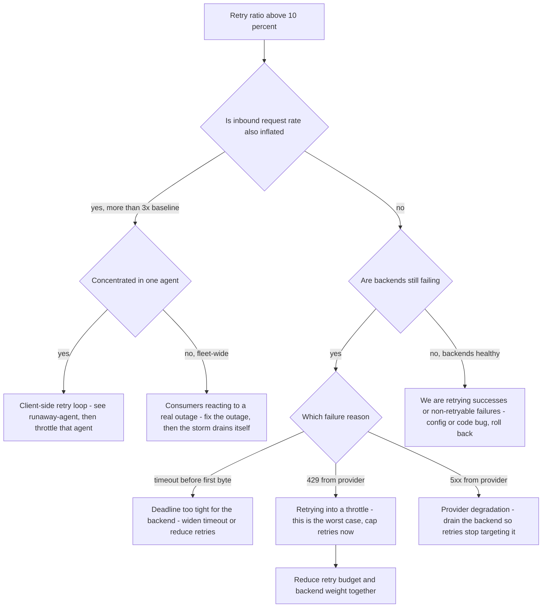

# Runbook: RetryStorm

## 1. Alert

| Field | Value |
|---|---|
| Name | `RetryStorm` |
| Severity | SEV1 (page primary + secondary) |
| Routing | `PD-AGENTGATE-PRIMARY`, auto-page `PD-AGENTGATE-SECONDARY` |
| Policy | Per-request retry budget 25% of deadline; fleet-wide retry budget capped at 10% of request volume (SPEC §3.3) |

```promql
- alert: RetryStorm
  expr: |
    sum(rate(agentgate_retry_attempts_total[5m]))
    / sum(rate(agentgate_gateway_requests_total{env="prod"}[5m])) > 0.10
  for: 3m
  labels: { severity: sev1 }
  annotations:
    runbook_url: https://docs.internal/agentgate/runbooks/retry-storm.md

# Client-side storm: callers retrying us, which the fleet budget does not govern
- alert: ClientRetryStorm
  expr: |
    sum by (agent) (rate(agentgate_gateway_requests_total{env="prod"}[5m]))
    > 4 * sum by (agent) (rate(agentgate_gateway_requests_total{env="prod"}[5m] offset 1h))
  for: 5m
  labels: { severity: sev2 }
```

## 2. What this means

More than one in ten requests reaching backends is a retry. The system is spending capacity
re-asking questions instead of answering new ones. Retry storms are self-reinforcing: retries add
load, added load causes more failures, more failures cause more retries. Left alone this takes down
a pool that was only mildly degraded to begin with. The fleet-wide budget exists to break that
loop; this alert means the budget is at or over its cap.

There are two distinct storms and you must tell them apart in the first two minutes:

- **Inbound storm** — consuming agents are retrying *us*, so request volume itself is inflated.
- **Internal storm** — we are retrying *backends*, so `agentgate_retry_attempts_total` is inflated
  relative to a normal request rate.

## 3. Impact

Effective capacity collapses. Latency rises because each caller's deadline is consumed by attempts
before the answer arrives, so callers time out and retry, which adds more load. Cost rises with no
corresponding successful work — a retried streaming request that failed after prefill was still
billed by the provider. If the storm is inbound, quotas start rejecting legitimate traffic because
the retries consumed the token budget.

## 4. First 5 minutes

```bash
export CTX=prod-eastus NS=agentgate PROM=https://prometheus.internal
```

1. Which storm is it?

```bash
# Internal: retries per request
promtool query instant "$PROM" '
sum(rate(agentgate_retry_attempts_total[2m])) / sum(rate(agentgate_gateway_requests_total{env="prod"}[2m]))'

# Inbound: request rate now vs an hour ago
promtool query instant "$PROM" '
sum(rate(agentgate_gateway_requests_total{env="prod"}[5m]))
  / sum(rate(agentgate_gateway_requests_total{env="prod"}[5m] offset 1h))'
```

2. Attribute it. Retries have a `reason`; inbound storms have an `agent`.

```bash
promtool query instant "$PROM" '
topk(10, sum by (backend, reason) (rate(agentgate_retry_attempts_total[2m])))'
promtool query instant "$PROM" '
topk(10, sum by (agent, team) (rate(agentgate_gateway_requests_total{env="prod"}[2m])))'
```

3. Check attempt distribution — how deep are requests going?

```bash
promtool query instant "$PROM" '
histogram_quantile(0.95, sum by (le) (rate(agentgate_gateway_attempts_bucket[5m])))'
```

4. Is the underlying failure still present, or are we storming on a resolved problem?

```bash
promtool query instant "$PROM" 'agentgate_breaker_state == 1'
promtool query instant "$PROM" '
sum by (code) (rate(agentgate_gateway_requests_total{env="prod",status=~"5.."}[2m]))'
```

5. Confirm the fleet budget is actually being enforced. If it is not, that is the bug:

```bash
promtool query instant "$PROM" 'sum(rate(agentgate_retry_budget_exhausted_total[2m]))'
kubectl --context "$CTX" -n "$NS" get cm gateway-config -o jsonpath='{.data.retry\.budget_ratio}{"\n"}'
```

## 5. Diagnosis decision tree



## 6. Mitigations

### 6.1 Cut the fleet retry budget (blast radius: fleet, protective, seconds)

The first move in almost every case. It converts a cascading failure into a bounded one.

```bash
agentctl --context "$CTX" retry set-budget --ratio 0.05 --reason "INC-1234 retry storm"
```

Expected effect: retry attempts fall within one to two minutes; error ratio may rise slightly
because fewer failures are being papered over — this is the intended trade. Verify:

```bash
promtool query instant "$PROM" '
sum(rate(agentgate_retry_attempts_total[2m])) / sum(rate(agentgate_gateway_requests_total[2m]))'
```

### 6.2 Stop retrying the failing backend by draining it (blast radius: one backend)

```bash
agentctl --context "$CTX" backend drain --pool general-chat --backend azure-openai/gpt-4o-mini \
  --reason "INC-1234 retry sink" --ttl 2h
```

Expected effect: the backend stops absorbing retries; capacity returns to backends that can serve.

### 6.3 Throttle the storming agent (blast radius: one agent)

For an inbound storm from a single consumer. This is a deliberate, recorded reduction of that
agent's rate limit — it is not a punishment and should be communicated immediately.

```bash
agentctl --context "$CTX" quota set --agent agent://fsclient/payments-risk/dispute-triage \
  --env prod --requests-per-minute 60 --reason "INC-1234 client retry loop" --ttl 60m

# Tell them, now, using the on-call from the registry
psql "$AGENTGATE_PG_URL" -tAc \
  "select owner->>'oncall', owner->>'email' from agents
    where identity='agent://fsclient/payments-risk/dispute-triage';"
```

Expected effect: that agent receives `429 rate_limited` with `Retry-After`; fleet request rate
returns to baseline. Verify:

```bash
promtool query instant "$PROM" '
sum by (decision) (rate(agentgate_ratelimit_decisions_total{agent="agent://fsclient/payments-risk/dispute-triage"}[2m]))'
```

### 6.4 Shed batch priority (blast radius: batch agents)

```bash
agentctl --context "$CTX" admission set --tier batch --max-concurrency 0 --reason "INC-1234" --ttl 30m
```

### 6.5 Disable retries entirely (blast radius: fleet, blunt)

Only when the storm is not draining and the underlying failure is unmitigated. Error rates will
rise immediately and visibly; that is the point, because the errors are already happening, just
hidden behind attempts.

```bash
agentctl --context "$CTX" retry set-budget --ratio 0.0 --reason "INC-1234 emergency, IC approved"
```

Announce in the incident channel before running. Verify that latency drops sharply while error
ratio rises — if neither moves, retries were not the problem.

## 7. Rollback

| Mitigation | Undo |
|---|---|
| 6.1 / 6.5 | `agentctl --context "$CTX" retry set-budget --ratio 0.25` — the SPEC §3.3 default. Restore in one step only after the underlying failure is fixed and breakers have been closed for 30 min |
| 6.2 | `agentctl --context "$CTX" backend undrain ...`, ramping weight rather than restoring it in one jump |
| 6.3 | `agentctl --context "$CTX" quota reset --agent agent://... --env prod` once the consuming team confirms their retry loop is fixed. Do not lift it just because the storm stopped — the storm stopped *because* of the throttle |
| 6.4 | `agentctl --context "$CTX" admission reset --tier batch` |

## 8. Escalation

- Page L2 at once. A retry storm is a positive-feedback failure and needs one person watching the
  ratio while another mitigates.
- Inbound storm from a consuming agent: page that team's own on-call from `owner.oncall`. They are
  the only ones who can fix the client-side loop; we can only contain it.
- If the storm continues after the fleet budget is cut to zero, the retry policy is not being
  enforced — that is a platform defect, escalate to the gateway domain owner immediately and treat
  the throttle in 6.3 as the primary control.
- Client incident manager at 30 minutes; retry storms are consumer-visible as latency and errors
  and consuming teams will already be asking.

## 9. Post-incident

```bash
promtool query range "$PROM" 'sum(rate(agentgate_retry_attempts_total[5m])) / sum(rate(agentgate_gateway_requests_total[5m]))' \
  --start "$(date -u -d '-6 hours' +%FT%TZ)" --end "$(date -u +%FT%TZ)" --step 30s > /tmp/inc-retry-ratio.txt
promtool query range "$PROM" 'sum by (agent) (rate(agentgate_gateway_requests_total{env="prod"}[5m]))' \
  --start "$(date -u -d '-6 hours' +%FT%TZ)" --end "$(date -u +%FT%TZ)" --step 1m > /tmp/inc-agent-rates.txt
```

Capture: what triggered the first wave; how long between trigger and the ratio crossing 10%; the
provider cost of retried work that produced no answer; whether the per-request 25% deadline budget
was respected or whether some requests spent their whole deadline retrying; and — the finding that
matters most — whether any consuming SDK retries without jitter. A client without jitter will do
this again, and the fix belongs in the SDK guidance, not in our alert thresholds.

## 10. Related

- [provider-degradation.md](provider-degradation.md) — the usual trigger
- [no-healthy-backend.md](no-healthy-backend.md) — the usual destination if unmitigated
- [runaway-agent.md](runaway-agent.md) — inbound storms from one consumer
- [gateway-availability-burn.md](gateway-availability-burn.md)
- [postmortem-template.md](postmortem-template.md) — worked example covers a retry-budget exhaustion
- Dashboards: `$GRAFANA/d/agentgate-pools`, `$GRAFANA/d/agentgate-gateway-slo`

Last game-day exercise: 2026-08-04 (60% failure injection with default retry budget).
