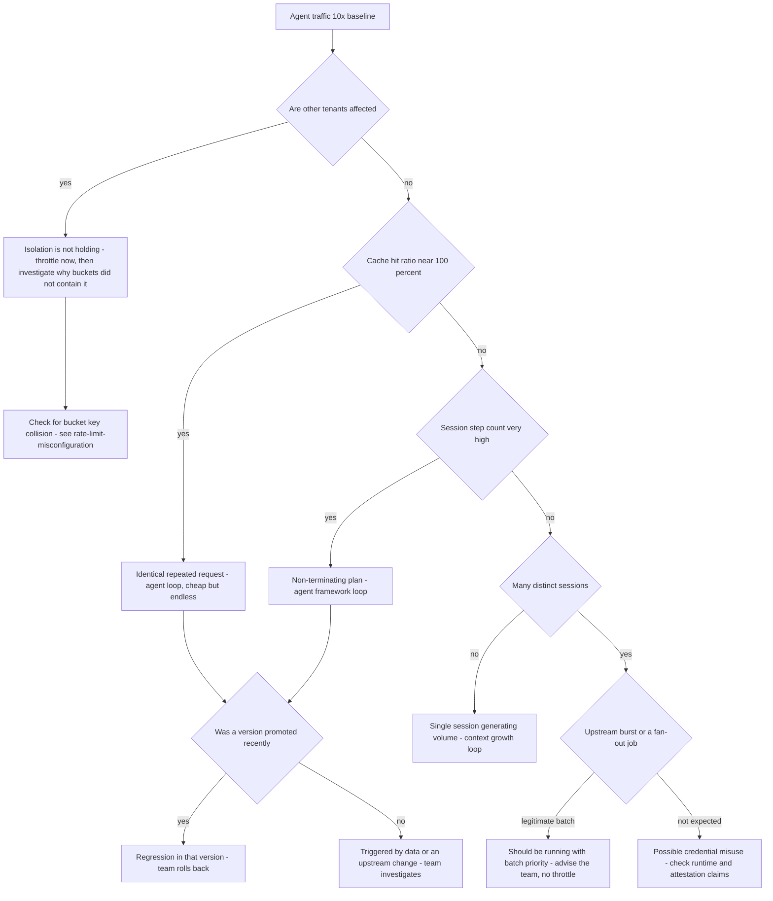

# Runbook: RunawayAgent

## 1. Alert

| Field | Value |
|---|---|
| Name | `RunawayAgent` |
| Severity | SEV2 (page) |
| Routing | `PD-AGENTGATE-PRIMARY` + the agent's own on-call from `owner.oncall` |

```promql
- alert: RunawayAgent
  expr: |
    sum by (agent, team) (rate(agentgate_gateway_requests_total{env="prod"}[5m]))
      > 10 * sum by (agent, team) (rate(agentgate_gateway_requests_total{env="prod"}[1h] offset 24h))
    and sum by (agent, team) (rate(agentgate_gateway_requests_total{env="prod"}[5m])) > 5
  for: 5m
  labels: { severity: sev2 }
  annotations:
    summary: "{{ $labels.agent }} request rate is 10x its 24h-ago baseline"
    runbook_url: https://docs.internal/agentgate/runbooks/runaway-agent.md

# The signature that distinguishes a loop from a busy day: identical requests
- alert: RunawayAgentIdenticalRequests
  expr: |
    sum by (agent) (rate(agentgate_cache_lookups_total{result="hit"}[5m]))
    / sum by (agent) (rate(agentgate_cache_lookups_total[5m])) > 0.95
    and sum by (agent) (rate(agentgate_gateway_requests_total{env="prod"}[5m])) > 20
  for: 5m
  labels: { severity: sev2 }

# A single conversation that will not terminate
- alert: RunawayAgentSessionDepth
  expr: agentgate_session_step_count > 200
  for: 5m
  labels: { severity: sev2 }
```

## 2. What this means

One agent is generating far more traffic than it ever has. The usual cause is a loop the agent
cannot escape: a plan step that never satisfies its own exit condition, a tool that returns an error
the agent re-asks about, a retry wrapper around a retry wrapper, or a conversation that keeps
appending to its own context. It is not usually malicious and it is not usually a platform fault —
but it is our problem, because a runaway agent consumes shared capacity and shared budget.

The platform's own defences are already engaging: per-agent buckets keyed `tenant:team:agent:env`
should be containing the blast radius. This alert asks you to confirm that containment is working
and to stop the bleeding at the source.

## 3. Impact

- The runaway agent burns its own quota, then fails, then usually retries — see
  [retry-storm.md](retry-storm.md).
- Cost accrues against its cost centre at a multiple of plan.
- Shared pool capacity is consumed; if the pool's `pool:backend` bucket saturates, other tenants
  start seeing latency. Verify explicitly whether isolation is holding — that is the single most
  important question in this runbook.
- Provider-side quota may be consumed, causing 429s for backends other agents also use.

## 4. First 5 minutes

```bash
export CTX=prod-eastus NS=agentgate PROM=https://prometheus.internal
export AGENT='agent://fsclient/payments-risk/dispute-triage'
```

1. Identify and size it:

```bash
promtool query instant "$PROM" '
topk(5, sum by (agent, team, env) (rate(agentgate_gateway_requests_total{env="prod"}[5m])) * 60)'
promtool query instant "$PROM" '
sum by (agent) (increase(agentgate_gateway_cost_usd_total{env="prod"}[1h]))'
```

2. **Is anyone else being harmed?** Answer this before you decide how aggressive to be:

```bash
promtool query instant "$PROM" '
histogram_quantile(0.95, sum by (le, tenant) (rate(agentgate_gateway_duration_seconds_bucket{env="prod",phase="overhead"}[5m])))'
promtool query instant "$PROM" 'sum by (pool) (agentgate_gateway_inflight)'
promtool query instant "$PROM" '
sum by (agent) (rate(agentgate_ratelimit_decisions_total{decision=~"limit|quota"}[5m]))'
```

If only the runaway agent is being limited, isolation is working and you have time to do this
properly. If other agents are being limited or slowed, escalate the urgency.

3. What shape is the loop? Look at sessions and repetition:

```bash
promtool query instant "$PROM" 'topk(5, agentgate_session_step_count)'
promtool query instant "$PROM" '
sum by (agent) (rate(agentgate_cache_lookups_total{result="hit"}[5m]))
  / sum by (agent) (rate(agentgate_cache_lookups_total[5m]))'
```

A near-100% cache hit ratio means the agent is asking the identical question over and over — the
clearest loop signature there is, and it also means the loop is cheap, which buys you time.

4. Look at actual traffic:

```bash
kubectl --context "$CTX" -n "$NS" logs deploy/gateway --since=5m \
  | jq -c 'select(.agent=="'"$AGENT"'") | {ts,session_id,step:.metadata.step,tokens_in,cache}' | head -20
```

`metadata.step` repeating the same value is the loop, named.

5. Did a version ship?

```bash
psql "$AGENTGATE_PG_URL" -c "
select version, env, state, promoted_at, promoted_by from agent_versions
 where agent_id=(select agent_id from agents where identity='$AGENT')
 order by promoted_at desc limit 5;"
```

6. Get the owning team on the phone. They own the fix; we only own containment.

```bash
psql "$AGENTGATE_PG_URL" -tAc \
  "select owner->>'team', owner->>'email', owner->>'oncall' from agents where identity='$AGENT';"
```

## 5. Diagnosis decision tree



## 6. Mitigations

### 6.1 Confirm the quota is containing it (blast radius: none)

Often the correct action is *nothing but a phone call*. The agent is hitting its own limit, other
tenants are fine, and the fix belongs to the owning team.

```bash
promtool query instant "$PROM" '
sum by (decision) (rate(agentgate_ratelimit_decisions_total{agent="'"$AGENT"'"}[2m]))'
```

### 6.2 Reduce that agent's quota (blast radius: one agent)

When containment is holding but the cost or the noise is unacceptable:

```bash
agentctl --context "$CTX" quota set --agent "$AGENT" --env prod \
  --requests-per-minute 30 --tokens-per-minute 20000 \
  --reason "INC-1234 runaway loop, owner paged" --ttl 2h
```

Verify the fleet-level rate returns to normal and that the agent is the only one limited.

### 6.3 Kill the specific session (blast radius: one conversation)

Surgical, and often enough — one non-terminating session can account for all the volume:

```bash
promtool query instant "$PROM" 'topk(3, agentgate_session_step_count)'
agentctl --context "$CTX" session terminate --session-id sess_123 \
  --reason "INC-1234 non-terminating plan, 412 steps"
```

Expected effect: in-flight requests for that session receive `499 client_closed_request`
semantics; new requests with the same session id are refused. Verify the step counter stops.

### 6.4 Block the offending version (blast radius: one agent version)

When a promoted version is the cause and the team cannot roll back fast enough:

```bash
agentctl --context "$CTX" version block --agent "$AGENT" --version 2.5.0 --env prod \
  --reason "INC-1234 loop regression, owner notified at 03:12Z"
```

Callers on that version receive `403 agent_not_promoted`. If the previous version is still deployed
alongside it, traffic continues on the good version; if not, the agent stops entirely. Know which
before you run it:

```bash
psql "$AGENTGATE_PG_URL" -c "
select version, state from agent_versions
 where agent_id=(select agent_id from agents where identity='$AGENT') and env='prod';"
```

### 6.5 Suspend the agent (blast radius: one agent, total)

Last resort, IC approval, notify the owning team's on-call by phone at the same moment:

```bash
agentctl --context "$CTX" agent suspend --agent "$AGENT" --env prod \
  --reason "INC-1234 uncontained runaway affecting shared capacity" --approver ic@client.example
```

All requests receive `403 agent_not_promoted`. Verify:

```bash
promtool query instant "$PROM" 'sum(rate(agentgate_gateway_requests_total{agent="'"$AGENT"'"}[1m]))'
```

## 7. Rollback

| Mitigation | Undo |
|---|---|
| 6.2 | `agentctl --context "$CTX" quota reset --agent "$AGENT" --env prod` after the team confirms and deploys a fix — not merely when the traffic subsides |
| 6.3 | Nothing to undo. Sessions are not resumable; note the session id in the incident record |
| 6.4 | `agentctl --context "$CTX" version unblock --agent "$AGENT" --version 2.5.0 --env prod` once a fixed version passes the promotion gate. Do not unblock the same version |
| 6.5 | `agentctl --context "$CTX" agent resume --agent "$AGENT" --env prod --approver ...` with the same approval level, and watch its rate for 30 minutes afterwards |

## 8. Escalation

- Page the owning team's on-call from `owner.oncall` immediately. This is the rare alert where the
  consuming team is a first responder, not a stakeholder.
- If other tenants are affected, raise to SEV1 and treat the isolation failure as the primary
  incident — a runaway agent that can starve others is a platform defect, and the agent is just the
  thing that found it.
- If the traffic pattern does not match the agent's declared purpose (unexpected runtime, unexpected
  `attestation`, prod traffic from a version never promoted), stop and treat it as a possible
  credential compromise: security duty officer, suspend first, ask later.
- Suspension of a production agent requires IC approval and must be communicated to the client
  incident manager, because it is a deliberate denial of service to a business function.

## 9. Post-incident

```bash
promtool query range "$PROM" 'sum by (agent) (rate(agentgate_gateway_requests_total{env="prod"}[5m]))' \
  --start "$(date -u -d '-6 hours' +%FT%TZ)" --end "$(date -u +%FT%TZ)" --step 1m > /tmp/inc-agent-rate.txt
psql "$AGENTGATE_PG_URL" -c "
select date_trunc('minute', ts) m, count(*) reqs, round(sum(cost_usd)::numeric,2) usd
  from usage_records where ts >= now() - interval '6 hours'
   and agent_id=(select agent_id from agents where identity='$AGENT')
 group by 1 order by 1;" > /tmp/inc-agent-usage.txt
```

Capture: the loop's mechanism in one sentence, from the owning team; total excess requests and
dollars; whether per-agent isolation held, with evidence; how long from onset to detection; and
whether a step-count or session-depth ceiling would have stopped it automatically. If the answer to
the last one is yes, that ceiling is the real fix and it belongs in the platform, not in a runbook.

## 10. Related

- [quota-saturation.md](quota-saturation.md)
- [rate-limit-misconfiguration.md](rate-limit-misconfiguration.md) — if isolation failed
- [cost-anomaly.md](cost-anomaly.md)
- [retry-storm.md](retry-storm.md)
- `test/load/k6/multitenant.js` — the test that proves one runaway agent cannot starve others
- Dashboards: `$GRAFANA/d/agentgate-fleet`, `$GRAFANA/d/agentgate-cost`

Last game-day exercise: 2026-06-30 (looping agent in staging with fair-share assertions).
