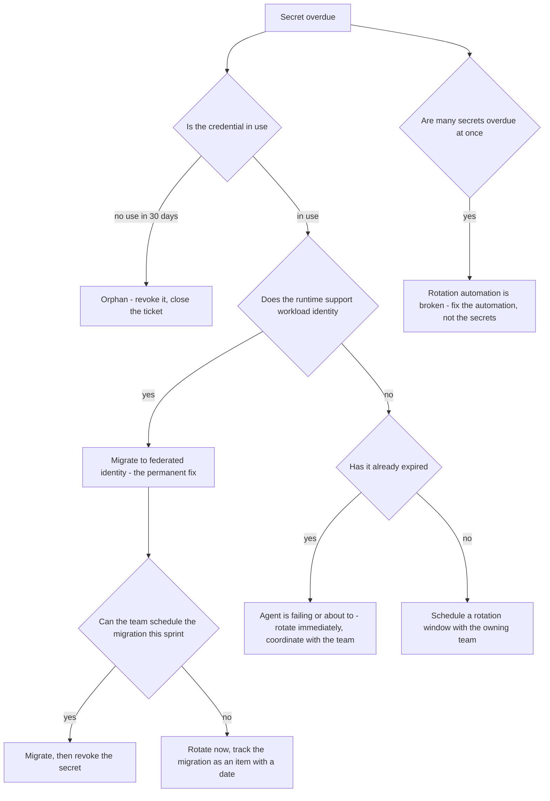

# Runbook: SecretRotationOverdue

## 1. Alert

| Field | Value |
|---|---|
| Name | `SecretRotationOverdue` |
| Severity | SEV4 (ticket) at 90d; SEV3 at 100d; SEV2 if a secret has already expired and is in use |
| Routing | Jira `AGP` + the owning team; security duty officer is copied on every instance |
| Policy | Client-credential secrets rotate on a 90-day clock and are never returned again after issuance (SPEC §1.1) |

```promql
- alert: SecretRotationOverdue
  expr: agentgate_secret_age_seconds > 86400 * 90
  for: 6h
  labels: { severity: sev4 }
  annotations:
    summary: "Secret for {{ $labels.agent_id }} is {{ $value | humanizeDuration }} old"
    runbook_url: https://docs.internal/agentgate/runbooks/secret-rotation-overdue.md

- alert: SecretRotationCritical
  expr: agentgate_secret_age_seconds > 86400 * 100
  for: 1h
  labels: { severity: sev3 }

- alert: SecretExpiredInUse
  expr: |
    (agentgate_secret_age_seconds > 86400 * 105)
    and on(agent_id) (sum by (agent_id) (rate(agentgate_controlplane_token_exchange_total{mode="client_credentials"}[1h])) > 0)
  for: 15m
  labels: { severity: sev2 }
```

## 2. What this means

A long-lived client credential has passed its 90-day rotation deadline. Client credentials are the
**fallback** issuance mode for runtimes without workload identity (SPEC §1.1); federated workload
identity is preferred precisely because it has no secret to rotate. So every alert here is really
two questions: rotate this secret, and can this agent move to workload identity so the secret stops
existing?

This is hygiene until it is not. Once the credential actually expires, the agent stops
authenticating and this becomes an availability incident for that agent — with no warning to its
team beyond the tickets they have been ignoring.

## 3. Impact

None today. On expiry, that agent's token exchange fails and it receives `401 unauthenticated` at
the gateway. Compliance impact is immediate rather than deferred: an over-age credential is an audit
finding in a regulated environment whether or not anything breaks, and the finding lands on the
platform, not on the consuming team.

## 4. First 5 minutes

This is a business-hours ticket. The steps below are the triage, not an emergency response.

```bash
export CTX=prod-eastus NS=agentgate PROM=https://prometheus.internal
```

1. What is overdue, how far, and who owns it?

```bash
promtool query instant "$PROM" 'topk(20, agentgate_secret_age_seconds / 86400)'
psql "$AGENTGATE_PG_URL" -c "
select a.identity, a.runtime, s.kind, s.created_at,
       date_part('day', now() - s.created_at)::int as age_days,
       a.owner->>'team' team, a.owner->>'email' email, a.owner->>'oncall' oncall
  from secrets_metadata s join agents a using (agent_id)
 where s.created_at < now() - interval '90 days' and s.state = 'active'
 order by s.created_at;"
```

2. Is the credential actually in use, or is it an orphan from a migrated agent?

```bash
promtool query instant "$PROM" '
sum by (agent_id) (rate(agentgate_controlplane_token_exchange_total{mode="client_credentials"}[24h]))'
```

An overdue secret with zero use is the easiest ticket you will close all week — revoke it.

3. Could this agent use workload identity instead? Check its runtime:

```bash
psql "$AGENTGATE_PG_URL" -tAc \
  "select identity, runtime, framework from agents where agent_id = 'agt_01J8Z9X2QK';"
```

`aks`, `eks`, `aca` and `lambda` all support workload identity. A secret on any of those is a
migration opportunity, and the migration is the permanent fix.

4. Confirm vault state matches the registry:

```bash
agentctl --context "$CTX" secrets status --agent-id agt_01J8Z9X2QK -o json \
  | jq '{vault_path, version, created_at, last_accessed_at, rotation_policy}'
```

5. Check for anything already expired and still in use:

```bash
promtool query instant "$PROM" 'agentgate_secret_age_seconds > 86400 * 105'
promtool query instant "$PROM" '
sum by (agent_id, reason) (rate(agentgate_controlplane_token_exchange_total{result="fail",mode="client_credentials"}[1h]))'
```

## 5. Diagnosis decision tree



## 6. Mitigations

### 6.1 Revoke an unused credential (blast radius: none if truly unused)

```bash
promtool query instant "$PROM" \
  'sum(rate(agentgate_controlplane_token_exchange_total{agent_id="agt_01J8Z9X2QK",mode="client_credentials"}[30d]))'
# Confirm zero, then:
agentctl --context "$CTX" secrets revoke --agent-id agt_01J8Z9X2QK \
  --reason "AGP-882 unused for 30 days, overdue rotation"
```

Verify the agent does not start failing:

```bash
promtool query instant "$PROM" \
  'sum by (result) (rate(agentgate_controlplane_token_exchange_total{agent_id="agt_01J8Z9X2QK"}[10m]))'
```

### 6.2 Rotate with overlap (blast radius: one agent — the standard path)

Two credentials are valid at once during the overlap so the agent never has a gap. The secret is
returned exactly once at issuance and never again (SPEC §1.1) — if the team loses it, they rotate
again.

```bash
# 1. Issue the new secret. Capture the output; it will not be shown a second time.
agentctl --context "$CTX" secrets rotate --agent-id agt_01J8Z9X2QK --overlap 72h \
  --reason "AGP-882 90-day rotation"

# 2. Hand it to the owning team through the approved secret-delivery channel.
#    Never paste a client secret into a chat channel, a ticket, or an incident log.

# 3. Watch for the agent adopting the new credential.
promtool query instant "$PROM" \
  'sum by (secret_version) (rate(agentgate_controlplane_token_exchange_total{agent_id="agt_01J8Z9X2QK"}[10m]))'

# 4. Once all traffic is on the new version, revoke the old one.
agentctl --context "$CTX" secrets revoke --agent-id agt_01J8Z9X2QK --version 3 \
  --reason "AGP-882 rotation complete, overlap ended"
```

Do not skip step 3. Revoking the old secret while the agent is still using it is how a routine
rotation becomes an outage.

### 6.3 Migrate to federated workload identity (blast radius: one agent — the permanent fix)

```bash
agentctl --context "$CTX" identity federate --agent-id agt_01J8Z9X2QK \
  --runtime aks --issuer https://oidc.prod-eastus.aks.internal \
  --subject "system:serviceaccount:payments-risk:dispute-triage" \
  --audience api://agentgate --reason "AGP-882 eliminating long-lived secret"
```

Then have the team deploy with the projected SA token, confirm exchanges arrive with
`attestation=workload-identity`, and only then revoke the secret:

```bash
promtool query instant "$PROM" \
  'sum by (mode) (rate(agentgate_controlplane_token_exchange_total{agent_id="agt_01J8Z9X2QK"}[10m]))'
agentctl --context "$CTX" secrets revoke --agent-id agt_01J8Z9X2QK --reason "AGP-882 migrated to workload identity"
```

This also improves the agent's `identity_attested` promotion gate standing (SPEC §1.4), which is a
useful thing to tell a team that is reluctant to spend the sprint capacity.

### 6.4 Emergency rotation for a suspected compromise (blast radius: one agent, immediate)

No overlap. The agent breaks until it picks up the new secret; that is the correct trade.

```bash
agentctl --context "$CTX" secrets rotate --agent-id agt_01J8Z9X2QK --overlap 0 \
  --reason "SEC-441 suspected credential exposure" --approver security-duty@client.example
agentctl --context "$CTX" secrets revoke --agent-id agt_01J8Z9X2QK --version 3 --immediate
```

Call the owning team's on-call at the same moment. Then check whether the exposed credential was
used from anywhere unexpected:

```bash
psql "$AGENTGATE_PG_URL" -c "
select ts, source_ip, runtime, result, attestation from token_issuance_log
 where agent_id='agt_01J8Z9X2QK' and ts >= now() - interval '30 days'
 order by ts desc limit 100;"
```

### 6.5 Fix the rotation automation (blast radius: fleet — when many are overdue)

```bash
kubectl --context "$CTX" -n "$NS" get cronjob secret-rotation-reminder -o yaml \
  | grep -E 'schedule|suspend|lastScheduleTime'
kubectl --context "$CTX" -n "$NS" logs job/secret-rotation-reminder-$(date -u +%Y%m%d) --tail=100 2>/dev/null
```

Many simultaneous overdue secrets is an automation failure, not twenty separate team failures.
Treat it as one ticket against the platform.

## 7. Rollback

| Mitigation | Undo |
|---|---|
| 6.1 | A revoked secret cannot be un-revoked. If you revoked one that was in use, issue a new one immediately with 6.2 and notify the team — this is why the 30-day usage check is mandatory |
| 6.2 | During the overlap, both versions work; if the new one fails, the agent keeps using the old until you revoke it. After revocation, the only path is another rotation |
| 6.3 | Re-issue a client credential with 6.2 if federation does not work, then debug federation without time pressure |
| 6.4 | None. Emergency rotation is deliberately irreversible |
| 6.5 | Standard deployment rollback for the automation change |

## 8. Escalation

- Business hours only unless a secret has expired and an agent is failing.
- Security duty officer is copied on every instance, and leads if compromise is suspected.
- If a team has ignored rotation tickets past 100 days, escalate to their engineering manager with
  the age and the audit exposure. Do not silently rotate on their behalf without telling them —
  that risks breaking their agent and teaches them the ticket did not matter.
- If more than five secrets are overdue simultaneously, escalate to the platform lead: the rotation
  process is not working and individual tickets will not fix it.

## 9. Post-incident

For the routine case, close the ticket with: the rotation timestamp, the new version number, the
overlap window used, confirmation the old version is revoked, and either the federation migration
date or the reason the runtime cannot support it.

For a compromise:

```bash
psql "$AGENTGATE_PG_URL" -c "
select ts, source_ip, runtime, attestation, result from token_issuance_log
 where agent_id='agt_01J8Z9X2QK' and ts >= now() - interval '90 days' order by ts;" > /tmp/sec-441-issuance.txt
psql "$AGENTGATE_PG_URL" -c "
select date_trunc('hour', ts) h, count(*), round(sum(cost_usd)::numeric,2)
  from usage_records where agent_id='agt_01J8Z9X2QK' and ts >= now() - interval '90 days'
 group by 1 order by 1;" > /tmp/sec-441-usage.txt
```

Hand both to the security duty officer. Do not analyse a suspected compromise alone; preserve
evidence and let their process run.

Standing metric worth tracking in the monthly review: what fraction of agents still use client
credentials. The target is zero, and every alert here is a chance to move it.

## 10. Related

- [controlplane-token-exchange-failures.md](controlplane-token-exchange-failures.md)
- [jwks-rotation-failure.md](jwks-rotation-failure.md)
- [certificate-expiry.md](certificate-expiry.md)
- [day-2-operations.md](day-2-operations.md#6-rotating-signing-keys)
- [operational-readiness-review.md](operational-readiness-review.md) — identity is an ORR item
- Dashboards: `$GRAFANA/d/agentgate-controlplane`

Last game-day exercise: 2026-05-05 (expired a staging credential and measured detection to recovery).
