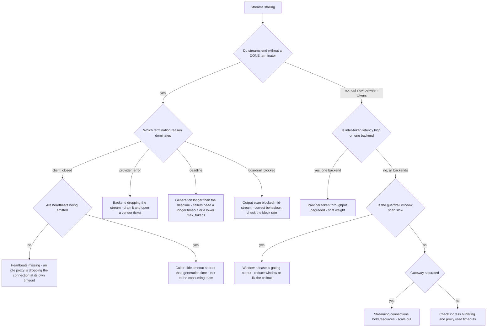

# Runbook: StreamingStalls

## 1. Alert

| Field | Value |
|---|---|
| Name | `StreamingStalls` |
| Severity | SEV2 (page) |
| Routing | `PD-AGENTGATE-PRIMARY` |
| Contract | SSE with `data:` frames, `data: [DONE]` terminator, `event: agentgate.usage`, `event: agentgate.failover`, heartbeat comment every 15s (SPEC §2.5) |

```promql
- alert: StreamingStalls
  expr: sum by (pool, backend) (rate(agentgate_stream_stalls_total[5m])) > 0.05
  for: 5m
  labels: { severity: sev2 }
  annotations:
    runbook_url: https://docs.internal/agentgate/runbooks/streaming-stalls.md

# Inter-token latency: the stream is alive but crawling
- alert: StreamingInterTokenLatency
  expr: |
    histogram_quantile(0.95,
      sum by (le, pool) (rate(agentgate_stream_intertoken_seconds_bucket[5m]))) > 0.5
  for: 10m
  labels: { severity: sev2 }

# Callers hanging up mid-stream
- alert: StreamingClientDisconnects
  expr: |
    sum(rate(agentgate_gateway_requests_total{code="client_closed_request"}[5m]))
    / sum(rate(agentgate_gateway_requests_total{stream="true"}[5m])) > 0.05
  for: 10m
  labels: { severity: sev2 }

# Heartbeats not being emitted - idle proxies will drop long generations
- alert: StreamingHeartbeatMissing
  expr: |
    sum(rate(agentgate_stream_heartbeats_total[5m])) == 0
    and sum(rate(agentgate_gateway_requests_total{stream="true"}[5m])) > 0
  for: 10m
  labels: { severity: sev2 }
```

## 2. What this means

Streams are starting and then stopping, or crawling. A stall is a gap between content frames longer
than the configured threshold. This is distinct from
[gateway-ttft-regression.md](gateway-ttft-regression.md): there, the first token is late; here, the
stream begins normally and then goes quiet.

The contract constraint that shapes every decision in this runbook: **after the first content byte
a stream is never silently restarted** (SPEC §2.5). Before first content we can fail over and emit
`event: agentgate.failover`; after it, the only honest option is an SSE `error` frame. So once
content has started flowing, failover is not available to you as a mitigation.

## 3. Impact

Agents receive partial responses. A framework that treats a truncated stream as a complete one
produces silently wrong results, which is worse than an error — check whether the affected teams'
SDKs validate the `[DONE]` terminator. Human-facing surfaces appear to freeze mid-sentence. Callers
that time out mid-stream produce `499 client_closed_request`, and their retries re-run the entire
generation, doubling provider cost for work already partly done.

## 4. First 5 minutes

```bash
export CTX=prod-eastus NS=agentgate PROM=https://prometheus.internal GW=https://gateway.agentgate.internal
```

1. Scope: which pool and backend, and is it stalls or slowness?

```bash
promtool query instant "$PROM" 'sum by (pool, backend) (rate(agentgate_stream_stalls_total[5m]))'
promtool query instant "$PROM" '
histogram_quantile(0.95, sum by (le, pool, backend) (rate(agentgate_stream_intertoken_seconds_bucket[5m])))'
```

2. Where do streams end? The finish reason separates a provider problem from a proxy problem:

```bash
promtool query instant "$PROM" '
sum by (reason) (rate(agentgate_stream_terminations_total[5m]))'
# expected: complete, client_closed, provider_error, guardrail_blocked, deadline
```

3. Are heartbeats flowing? Without them, idle proxies drop long generations at their own timeout:

```bash
promtool query instant "$PROM" 'sum(rate(agentgate_stream_heartbeats_total[5m]))'
```

4. Observe a real stream with timestamps. This is the fastest way to see the shape of the stall:

```bash
curl -sS -N -X POST "$GW/v1/chat/completions" \
  -H "Authorization: Bearer $AGENTGATE_PROBE_TOKEN" -H 'content-type: application/json' \
  -H 'accept: text/event-stream' \
  -d '{"model":"general-chat","stream":true,"stream_options":{"include_usage":true},
       "messages":[{"role":"user","content":"write two hundred words about interest rate risk"}],
       "max_tokens":400}' \
  | ts '%.s' | awk '{print} /agentgate.usage|\[DONE\]/ {print "-- terminator seen"}'
```

Look for: gaps larger than a second between `data:` lines, `:` heartbeat comments every 15s, an
`event: agentgate.usage` frame, and `data: [DONE]`. A stream that ends without `[DONE]` is the
defect.

5. Is the guardrail output window holding content? It buffers ~256 tokens before releasing
   (SPEC §3.6), which looks exactly like a periodic stall if the callout is slow:

```bash
promtool query instant "$PROM" '
histogram_quantile(0.95, sum by (le) (rate(agentgate_guardrail_callout_duration_seconds_bucket[5m])))'
promtool query instant "$PROM" 'agentgate_guardrail_window_tokens'
```

6. Is anything between us and the caller timing out? Ingress and any inspecting proxy have their own
   idle timeouts:

```bash
kubectl --context "$CTX" -n "$NS" get ingress gateway -o yaml \
  | grep -iE 'timeout|buffering|proxy-read'
kubectl --context "$CTX" -n "$NS" logs deploy/gateway --since=10m \
  | jq -c 'select(.stream==true and .msg=="stream terminated") | {reason, elapsed_ms, tokens_emitted}' | tail -20
```

## 5. Diagnosis decision tree



## 6. Mitigations

### 6.1 Fix ingress buffering and idle timeouts (blast radius: ingress config)

The most common cause of "streams stop after exactly N seconds". A buffering proxy also destroys
streaming entirely by holding frames until the response completes.

```bash
kubectl --context "$CTX" -n "$NS" annotate ingress gateway \
  nginx.ingress.kubernetes.io/proxy-read-timeout="600" \
  nginx.ingress.kubernetes.io/proxy-send-timeout="600" \
  nginx.ingress.kubernetes.io/proxy-buffering="off" \
  nginx.ingress.kubernetes.io/proxy-http-version="1.1" --overwrite
```

Verify with the timestamped curl from step 4: frames should arrive continuously, and the stream
should survive past the previous cut-off point.

### 6.2 Confirm and restore heartbeats (blast radius: none)

```bash
kubectl --context "$CTX" -n "$NS" get cm gateway-config -o jsonpath='{.data.stream\.heartbeat_interval}{"\n"}'
kubectl --context "$CTX" -n "$NS" patch cm gateway-config --type merge \
  -p '{"data":{"stream.heartbeat_interval":"15s"}}'
kubectl --context "$CTX" -n "$NS" rollout restart deploy/gateway
```

15s is the contract value (SPEC §2.5). If an intermediate proxy has an idle timeout below 15s, the
proxy is the thing to change — do not shorten the heartbeat below the documented interval without
recording it, because clients may reasonably depend on the interval.

### 6.3 Shift weight away from a slow-streaming backend (blast radius: one pool)

```bash
promtool query instant "$PROM" '
histogram_quantile(0.95, sum by (le, backend) (rate(agentgate_stream_intertoken_seconds_bucket{pool="general-chat"}[5m])))'
agentctl --context "$CTX" pool set-weights --pool general-chat \
  --weight azure-openai/gpt-4o-mini=20 --weight bedrock/claude-haiku=80 --reason "INC-1234 inter-token latency"
```

Note: this only helps **new** streams. In-flight streams cannot be moved after first content byte.

### 6.4 Reduce the guardrail output window (blast radius: detection granularity)

```bash
agentctl --context "$CTX" guardrail set-window --pool general-chat --tokens 128 \
  --reason "INC-1234 window release causing periodic stalls" --ttl 4h
```

Expected effect: content releases twice as often, so the stall period halves. Callout QPS doubles —
watch the guardrail service after this change.

### 6.5 Scale out for streaming capacity (blast radius: cost)

Each in-flight stream holds a connection, a goroutine and a buffer for its entire life, so streaming
saturates a pod long before CPU does. See `test/load/capacity-model.md` for the per-stream memory
figure used for sizing.

```bash
promtool query instant "$PROM" 'sum by (pool) (agentgate_gateway_inflight)'
kubectl --context "$CTX" -n "$NS" scale deploy/gateway --replicas=24
```

### 6.6 Advise callers to cap `max_tokens` and lengthen their deadline (blast radius: one agent)

When the termination reason is `deadline`, the generation is simply longer than the caller allows.
Both sides of the fix belong to them; give them the data:

```bash
promtool query instant "$PROM" '
histogram_quantile(0.95, sum by (le, agent) (rate(agentgate_stream_duration_seconds_bucket[1h])))'
```

## 7. Rollback

| Mitigation | Undo |
|---|---|
| 6.1 | Restore the committed ingress annotations from `deploy/k8s/overlays/prod/ingress.yaml`. Never leave `proxy-buffering` unset — the committed value must be explicit |
| 6.2 | Restore `stream.heartbeat_interval` to `15s` if you changed it; the contract value is the default and deviations need recording |
| 6.3 | Restore committed weights once inter-token latency recovers for 30 minutes |
| 6.4 | `agentctl --context "$CTX" guardrail set-window --pool general-chat --tokens 256` |
| 6.5 | HPA `minReplicas` back down in business hours |

## 8. Escalation

- If streams are terminating without `[DONE]` and any consuming SDK does not detect it, raise the
  severity: agents may be acting on truncated model output. That is a correctness problem, not a
  latency problem, and the affected teams need telling immediately.
- Provider-side stream drops: vendor bridge, with three `x-agentgate-request-id` values and the
  observed token counts at termination.
- If an inspecting proxy on the third-party egress path is buffering streams, engage the network and
  security owners together — buffering may be a deliberate DLP control, in which case the answer is
  a policy conversation, not a config change.

## 9. Post-incident

```bash
promtool query range "$PROM" 'sum by (reason) (rate(agentgate_stream_terminations_total[5m]))' \
  --start "$(date -u -d '-6 hours' +%FT%TZ)" --end "$(date -u +%FT%TZ)" --step 1m > /tmp/inc-stream-term.txt
promtool query range "$PROM" 'histogram_quantile(0.95, sum by (le, backend) (rate(agentgate_stream_intertoken_seconds_bucket[5m])))' \
  --start "$(date -u -d '-6 hours' +%FT%TZ)" --end "$(date -u +%FT%TZ)" --step 1m > /tmp/inc-intertoken.txt
```

Capture: how many streams terminated abnormally; whether any caller received truncated content
without an error frame (this must be answered definitively); the cost of regenerated content from
client retries; and whether `test/load/k6/streaming.js` asserts everything that broke — heartbeat
presence, usage frame, `[DONE]` terminator, inter-token distribution. If the load test would have
passed during this incident, the test is the finding.

## 10. Related

- [gateway-ttft-regression.md](gateway-ttft-regression.md)
- [provider-degradation.md](provider-degradation.md)
- [guardrail-service-down.md](guardrail-service-down.md)
- `test/load/k6/streaming.js` — the SSE contract assertions
- Dashboards: `$GRAFANA/d/agentgate-streaming`

Last game-day exercise: 2026-06-16 (ingress idle timeout lowered to 10s in staging).
