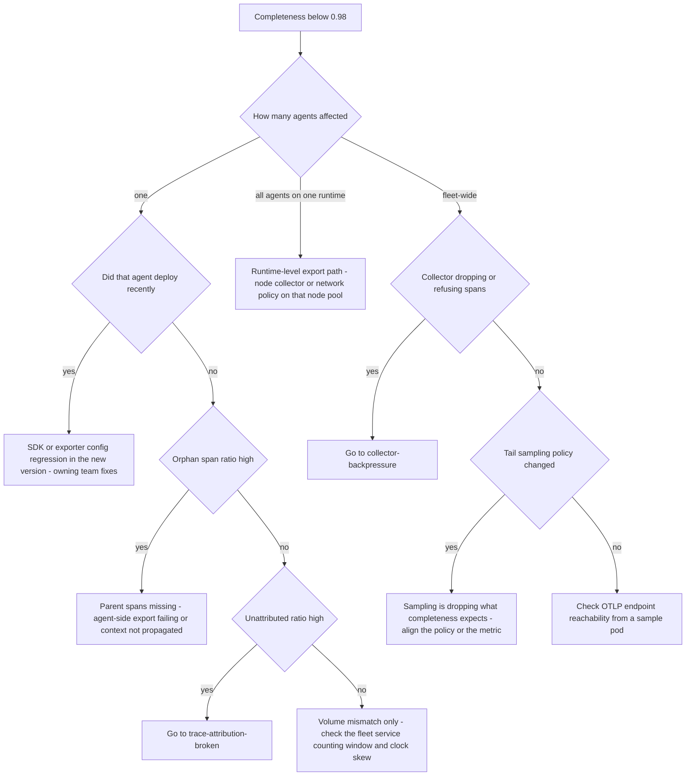

# Runbook: TelemetryDegraded

## 1. Alert

| Field | Value |
|---|---|
| Name | `TelemetryDegraded` (SPEC §4.5 calls this `telemetry_degraded`) |
| Severity | SEV3 (ticket); SEV2 if fleet-wide, because promotion is blocked for everyone |
| Routing | Jira `AGP`, notification to the affected agent's owning team |
| SLO | Per-agent completeness ≥ 0.98 for 99% of agents (SPEC §5) |

```promql
- alert: TelemetryDegraded
  expr: agentgate_telemetry_completeness{env="prod"} < 0.98
  for: 15m
  labels: { severity: sev3 }
  annotations:
    summary: "Telemetry completeness {{ $value }} for {{ $labels.agent }}"
    runbook_url: https://docs.internal/agentgate/runbooks/telemetry-incomplete.md

- alert: TelemetryDegradedFleetWide
  expr: |
    count(agentgate_telemetry_completeness{env="prod"} < 0.98)
    / count(agentgate_telemetry_completeness{env="prod"}) > 0.01
  for: 15m
  labels: { severity: sev2 }
```

## 2. What this means

The fleet service compares, every 60 seconds, the number of gateway requests it counted for an
agent against the number of spans that actually arrived carrying that agent's resource attributes.
The ratio has dropped below 0.98 — we are losing telemetry. This matters more here than in a normal
platform for two reasons: telemetry completeness is a **hard input to the promotion gate**
(SPEC §1.4, §4.5), so a degraded agent cannot be promoted to production; and in a regulated
environment, "we cannot show what this agent did" is a control failure, not an inconvenience.

Losing telemetry does not mean losing traffic. The gateway is almost certainly still serving
requests perfectly.

## 3. Impact

- Promotion of the affected agent to prod is blocked until completeness recovers (`telemetry_healthy`
  gate requires ≥95% complete, correctly-attributed traces over 24h with ≥100 requests observed).
- Chargeback may under-report for the affected agent, which shows up as a billing dispute later.
- Debugging that agent becomes guesswork — traces have holes exactly when someone needs them.
- If fleet-wide, every team's promotion pipeline stops, and that generates far more noise than the
  underlying data loss does.

## 4. First 5 minutes

```bash
export CTX=prod-eastus NS=agentgate PROM=https://prometheus.internal
```

1. One agent, one team, one runtime, or everyone? The answer names the layer.

```bash
promtool query instant "$PROM" 'agentgate_telemetry_completeness{env="prod"} < 0.98'
promtool query instant "$PROM" '
count by (runtime) (agentgate_telemetry_completeness{env="prod"} < 0.98)'
promtool query instant "$PROM" 'avg(agentgate_telemetry_completeness{env="prod"})'
```

2. Which of the four §4.5 signals is bad? They point at different failures:

```bash
promtool query instant "$PROM" 'agentgate_telemetry_orphan_span_ratio{env="prod"} > 0.02'
promtool query instant "$PROM" 'agentgate_telemetry_unattributed_ratio{env="prod"} > 0.02'
promtool query instant "$PROM" 'agentgate_telemetry_clock_skew_seconds{quantile="0.99"} > 5'
```

High orphan ratio means parents are missing — usually sampling or a dropped agent-side export.
High unattributed ratio means resource attributes are missing — go to
[trace-attribution-broken.md](trace-attribution-broken.md).

3. Is the collector dropping data? Check both tiers.

```bash
promtool query instant "$PROM" 'sum by (exporter) (rate(otelcol_exporter_send_failed_spans[5m]))'
promtool query instant "$PROM" 'sum by (processor) (rate(otelcol_processor_refused_spans[5m]))'
promtool query instant "$PROM" 'sum by (processor) (rate(otelcol_processor_dropped_spans[5m]))'
promtool query instant "$PROM" 'otelcol_exporter_queue_size / otelcol_exporter_queue_capacity'
```

If any of these are non-zero, this is [collector-backpressure.md](collector-backpressure.md).

4. Is the agent exporting at all? Compare expected against received directly:

```bash
curl -sS "$FLEET/api/v1/telemetry/completeness?agent=agent://fsclient/payments-risk/dispute-triage&env=prod" \
  -H "Authorization: Bearer $AGENTGATE_PROBE_TOKEN" | jq '.'
# {"traces_expected": 14210, "traces_received": 13012, "completeness": 0.9157, ...}
```

5. Check tail sampling. It is the most common false alarm here — sampling that drops spans the
   fleet service expected to see:

```bash
kubectl --context "$CTX" -n "$NS" get cm otel-collector-gateway-config -o yaml | grep -A 20 tail_sampling
promtool query instant "$PROM" 'sum by (policy) (rate(otelcol_processor_tail_sampling_sampling_policy_evaluation_error_total[5m]))'
promtool query instant "$PROM" 'sum by (sampled) (rate(otelcol_processor_tail_sampling_count_traces_sampled[5m]))'
```

6. Did the agent's SDK version change? A framework upgrade that changes exporter defaults is a
   frequent cause.

```bash
psql "$AGENTGATE_PG_URL" -c \
  "select version, env, state, promoted_at from agent_versions
    where agent_id=(select agent_id from agents where identity='agent://fsclient/payments-risk/dispute-triage')
    order by promoted_at desc limit 3;"
```

## 5. Diagnosis decision tree



## 6. Mitigations

### 6.1 Confirm it is data loss, not a counting artefact (blast radius: none)

Before changing anything, verify with a synthetic request that you can follow end to end:

```bash
TRACE=$(curl -sS -D- -o /dev/null -X POST "$GW/v1/chat/completions" \
  -H "Authorization: Bearer $AGENTGATE_PROBE_TOKEN" -H 'content-type: application/json' \
  -d '{"model":"general-chat","messages":[{"role":"user","content":"telemetry probe"}],"max_tokens":8}' \
  | awk -F': ' '/x-agentgate-trace-id/ {print $2}' | tr -d '\r')
echo "trace: $TRACE"
sleep 30
curl -sS "$FLEET/api/v1/traces/$TRACE" -H "Authorization: Bearer $AGENTGATE_PROBE_TOKEN" \
  | jq '{spans: (.spans | length), names: [.spans[].name], attributed: .attribution_complete}'
```

You should see `gateway.request`, the `gateway.policy.*` stages, and `gen_ai.chat`. Missing gateway
spans point at us; missing `agent.*` spans point at the SDK.

### 6.2 Raise the baseline sampling rate temporarily (blast radius: telemetry cost)

If tail sampling is dropping what completeness needs:

```bash
kubectl --context "$CTX" -n "$NS" patch cm otel-collector-gateway-config --type merge \
  -p '{"data":{"tail_sampling.baseline_percent":"25"}}'
kubectl --context "$CTX" -n "$NS" rollout restart deploy/otel-collector-gateway
```

Expected effect: completeness rises within two evaluation windows (~2 min after restart). Costs
more storage; note it and set a reminder to revert.

### 6.3 Restart the node collector for an affected runtime (blast radius: one node pool)

```bash
kubectl --context "$CTX" -n "$NS" rollout restart daemonset/otel-collector-agent
kubectl --context "$CTX" -n "$NS" rollout status daemonset/otel-collector-agent --timeout=300s
```

A restart drops whatever is in the in-memory queue, so completeness dips before it recovers. Do not
restart during a period you are actively trying to measure.

### 6.4 Exempt the agent from the promotion gate — with a recorded exception (blast radius: governance)

When completeness is degraded for a platform-side reason and a consuming team is blocked from a
release they need. This is a governance action and must never be routine.

```bash
agentctl --context "$CTX" promotion exception create \
  --agent agent://fsclient/payments-risk/dispute-triage --gate telemetry_healthy \
  --reason "INC-1234 platform-side collector loss, not agent fault" \
  --approver platform-lead@client.example --expires 24h --change-ref CHG0045512
```

Verify it is recorded and time-bounded:

```bash
agentctl --context "$CTX" promotion exception list --agent agent://fsclient/payments-risk/dispute-triage
```

### 6.5 Fix the agent's exporter configuration (blast radius: one agent — owning team acts)

Send the owning team the specifics rather than "your telemetry is broken":

```bash
curl -sS "$FLEET/api/v1/telemetry/diagnose?agent=agent://fsclient/payments-risk/dispute-triage" \
  -H "Authorization: Bearer $AGENTGATE_PROBE_TOKEN" | jq '.findings'
# e.g. ["resource attribute service.namespace missing", "exporter timeout 1s below p99 export duration"]
```

## 7. Rollback

| Mitigation | Undo |
|---|---|
| 6.2 | `kubectl patch cm otel-collector-gateway-config --type merge -p '{"data":{"tail_sampling.baseline_percent":"5"}}'` and restart. 5% is the SPEC §4.4 baseline; revert within 48h |
| 6.3 | Nothing to undo; note the restart time so the completeness dip is not misread later |
| 6.4 | `agentctl --context "$CTX" promotion exception revoke --agent agent://... --gate telemetry_healthy` as soon as completeness recovers. Do not let it expire silently — revoking is the evidence that the gate is real |
| 6.5 | Owning team reverts their own change |

## 8. Escalation

- Fleet-wide degradation: SEV2, page L2, and notify all consuming teams that promotions are blocked
  — they will discover it at the worst possible moment otherwise.
- If the cause is data loss in the collector pipeline that also affects the **content** pipeline
  (SPEC §4.2), involve the security duty officer: that pipeline has its own retention and access
  control obligations and gaps in it are reportable.
- If a promotion exception is requested for an agent whose telemetry is broken by the agent's own
  code, refuse and escalate to the platform lead. The gate exists precisely for that case.

## 9. Post-incident

```bash
promtool query range "$PROM" 'avg(agentgate_telemetry_completeness{env="prod"})' \
  --start "$(date -u -d '-24 hours' +%FT%TZ)" --end "$(date -u +%FT%TZ)" --step 5m > /tmp/inc-completeness.txt
promtool query range "$PROM" 'sum(rate(otelcol_processor_dropped_spans[5m]))' \
  --start "$(date -u -d '-24 hours' +%FT%TZ)" --end "$(date -u +%FT%TZ)" --step 5m > /tmp/inc-dropped.txt
```

Capture: the completeness floor and how long it was below 0.98; how many agents were blocked from
promotion and for how long; every exception granted, with approver and expiry; and whether any
chargeback period needs restating because usage records were lost. That last one has a finance
consequence and cannot be discovered a month later.

## 10. Related

- [trace-attribution-broken.md](trace-attribution-broken.md)
- [collector-backpressure.md](collector-backpressure.md)
- [promotion-gate-blocked.md](promotion-gate-blocked.md)
- [operational-readiness-review.md](operational-readiness-review.md) — telemetry is an ORR item
- Dashboards: `$GRAFANA/d/agentgate-telemetry-trust`

Last game-day exercise: 2026-06-16 (node collector stopped on one AKS node pool).
