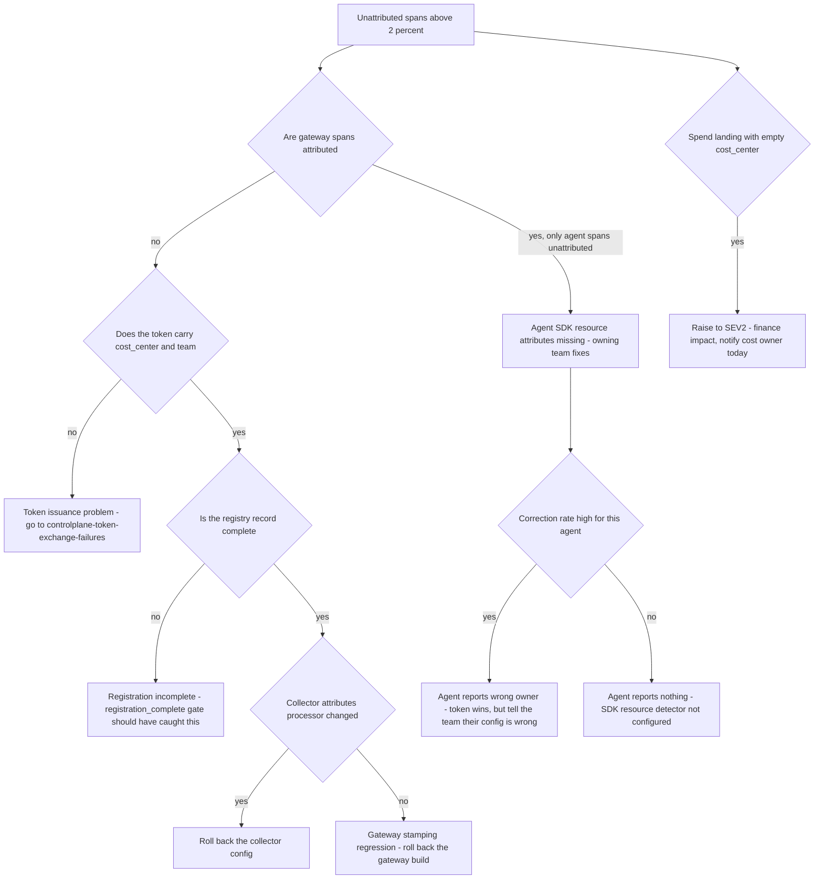

# Runbook: TraceAttributionBroken

## 1. Alert

| Field | Value |
|---|---|
| Name | `TraceAttributionBroken` |
| Severity | SEV3 (ticket); SEV2 if chargeback is affected across a cost centre |
| Routing | Jira `AGP`, notification to the affected team and to the cost owner |

```promql
- alert: TraceAttributionBroken
  expr: agentgate_telemetry_unattributed_ratio{env="prod"} > 0.02
  for: 15m
  labels: { severity: sev3 }
  annotations:
    summary: "{{ $labels.agent }} has {{ $value }} unattributed spans"
    runbook_url: https://docs.internal/agentgate/runbooks/trace-attribution-broken.md

# The gateway is having to correct what agents report
- alert: AttributionCorrectionSpike
  expr: |
    sum by (agent) (rate(agentgate_attribution_corrected_total[10m]))
    / sum by (agent) (rate(agentgate_gateway_requests_total[10m])) > 0.10
  for: 15m
  labels: { severity: sev3 }

# Spend that cannot be billed to anyone
- alert: UnattributedSpend
  expr: |
    sum(rate(agentgate_gateway_cost_usd_total{cost_center=""}[1h])) * 3600 > 1
  for: 30m
  labels: { severity: sev2 }
```

## 2. What this means

Spans are arriving without the ownership attributes that make them useful: `agentgate.owner.email`,
`agentgate.cost_center`, `agentgate.team.id`, `agentgate.agent.identity`. Either the agent is not
setting them, or the gateway's stamping is not correcting them. Per SPEC §4.1 the gateway **stamps
or corrects** these from the verified token, so an agent cannot lie about who pays — if attribution
is broken at the gateway that mechanism has failed, and spend is landing in a bucket nobody owns.

`agentgate.attribution.corrected=true` is *not* an error. It is the system working, telling you the
agent's self-reported attributes disagreed with its token. A high correction rate is a signal to fix
the agent's configuration, not an outage.

## 3. Impact

- **Chargeback**: cost lands with an empty or wrong `cost_center` and cannot be billed. In a
  financial-services client that is a finance data-quality problem with an audit trail obligation.
- **Promotion**: the `telemetry_healthy` gate requires *correctly-attributed* traces, so the
  affected agent cannot be promoted.
- **Incident response**: when the next incident hits, you cannot answer "which team owns this
  traffic" from the trace, which is the question you always need first.

## 4. First 5 minutes

```bash
export CTX=prod-eastus NS=agentgate PROM=https://prometheus.internal FLEET=https://fleetview.agentgate.internal
```

1. Which agents, and which attribute is missing?

```bash
promtool query instant "$PROM" 'topk(20, agentgate_telemetry_unattributed_ratio{env="prod"})'
curl -sS "$FLEET/api/v1/telemetry/attribution?env=prod&window=1h" \
  -H "Authorization: Bearer $AGENTGATE_PROBE_TOKEN" \
  | jq '.agents[] | select(.unattributed_ratio > 0.02) | {agent, missing_attributes, sample_trace_id}'
```

2. Is spend landing unattributed?

```bash
promtool query instant "$PROM" '
sum by (cost_center) (rate(agentgate_gateway_cost_usd_total{env="prod"}[1h])) * 3600'
```

An empty `cost_center` bucket with a non-trivial rate is the urgent part of this alert.

3. Is the gateway stamping? Take a live request and look at its span:

```bash
TRACE=$(curl -sS -D- -o /dev/null -X POST "$GW/v1/chat/completions" \
  -H "Authorization: Bearer $AGENTGATE_PROBE_TOKEN" -H 'content-type: application/json' \
  -d '{"model":"general-chat","messages":[{"role":"user","content":"attribution probe"}],"max_tokens":8}' \
  | awk -F': ' '/x-agentgate-trace-id/ {print $2}' | tr -d '\r')
sleep 20
curl -sS "$FLEET/api/v1/traces/$TRACE" -H "Authorization: Bearer $AGENTGATE_PROBE_TOKEN" \
  | jq '.spans[] | select(.name=="gateway.request") | .resource | {tenant:."agentgate.tenant.id", team:."agentgate.team.id", cc:."agentgate.cost_center", corrected:."agentgate.attribution.corrected"}'
```

If `cc` is null on a gateway span, the stamping path is broken and this is ours to fix.

4. Does the token carry the claims? A token missing `cost_center` cannot reach prod at all
   (SPEC §1.2), so if you see prod traffic without one, the authz path is also suspect:

```bash
curl -sS "$CP/api/v1/tokens/introspect" -H "Authorization: Bearer $AGENTGATE_ADMIN_TOKEN" \
  -H 'content-type: application/json' \
  -d '{"agent":"agent://fsclient/payments-risk/dispute-triage","env":"prod"}' \
  | jq '{sub,tenant,team,cost_center,env,attestation}'
```

5. Is the registry record complete? The gateway stamps `owner.email` from the registry, not the
   token:

```bash
psql "$AGENTGATE_PG_URL" -x -c \
  "select identity, owner->>'email' as email, owner->>'cost_center' as cc,
          data_classification
     from agents where identity = 'agent://fsclient/payments-risk/dispute-triage';"
```

6. Check the collector's attributes processor — a config change here breaks attribution fleet-wide:

```bash
kubectl --context "$CTX" -n "$NS" get cm otel-collector-gateway-config -o yaml | grep -A 25 'processors:' | head -40
kubectl --context "$CTX" -n "$NS" logs deploy/otel-collector-gateway --since=15m | grep -i 'attribute' | tail -20
```

## 5. Diagnosis decision tree



## 6. Mitigations

### 6.1 Roll back the collector or gateway change (blast radius: the change)

```bash
kubectl --context "$CTX" -n "$NS" rollout undo deploy/otel-collector-gateway
# or
kubectl --context "$CTX" -n "$NS" rollout undo deploy/gateway
```

Verify with the probe trace from step 3 — a fresh trace must show a populated `cost_center`.

### 6.2 Complete the registry record (blast radius: one agent)

```bash
agentctl --context "$CTX" registry apply -f registry/agents/dispute-triage.yaml --dry-run
agentctl --context "$CTX" registry apply -f registry/agents/dispute-triage.yaml
psql "$AGENTGATE_PG_URL" -tAc \
  "select owner->>'email', owner->>'cost_center' from agents where identity='agent://fsclient/payments-risk/dispute-triage';"
```

The record is owned by the consuming team; edit it in their repo and apply, do not patch the
database.

### 6.3 Backfill attribution for the affected window (blast radius: chargeback data)

Usage records carry the attribution independently of spans (SPEC §6), so cost can usually be
recovered even when traces cannot:

```bash
agentctl --context "$CTX" chargeback reattribute \
  --from "2026-08-26T09:00:00Z" --to "2026-08-26T13:00:00Z" \
  --agent agent://fsclient/payments-risk/dispute-triage --cost-center CC-4471 \
  --reason "INC-1234 attribution gap" --dry-run

# review the diff, then run without --dry-run
```

Verify the unattributed spend bucket empties:

```bash
psql "$AGENTGATE_PG_URL" -c \
  "select date_trunc('hour', ts) h, coalesce(nullif(cost_center,''),'UNATTRIBUTED') cc,
          round(sum(cost_usd)::numeric, 4) usd
     from usage_records
    where ts >= now() - interval '6 hours'
    group by 1,2 order by 1,2;"
```

Never edit `usage_records` directly — they are immutable by design. `reattribute` writes
compensating records with a linkage to the originals so the audit trail stays intact.

### 6.4 Tell the owning team what to change (blast radius: one agent)

The concrete fix for the common case — missing OTel resource attributes:

```
OTEL_RESOURCE_ATTRIBUTES=service.name=dispute-triage,service.version=2.4.1,\
service.namespace=payments-risk,deployment.environment.name=prod
```

Everything else (`agentgate.*`) is stamped by the gateway from the verified token. If they set
`agentgate.cost_center` themselves and it disagrees with the token, the token wins and the
correction counter increments — so the fix is to stop setting it, not to set it correctly.

## 7. Rollback

| Mitigation | Undo |
|---|---|
| 6.1 | Re-deploy only after the attribution path is covered by a test in the integration suite |
| 6.2 | `git revert` in the team's registry repo, then re-apply |
| 6.3 | `agentctl --context "$CTX" chargeback reattribute --undo --batch <batch-id>` — reattribution batches are reversible by id, which is why you must record the id |
| 6.4 | Owning team reverts |

## 8. Escalation

- Unattributed spend above $1/hour: notify the cost owner and the finance contact the same
  business day. Do not let it accumulate to a month-end surprise.
- Gateway stamping broken (not agent-side): this is a platform defect with governance impact.
  Escalate to the gateway domain owner and record it as a control failure, because "an agent cannot
  lie about who pays" is a stated property of the platform.
- If tokens are reaching prod without `cost_center`, that is an authz bypass. Security duty officer,
  immediately — this is not a telemetry ticket any more.

## 9. Post-incident

```bash
promtool query range "$PROM" 'sum by (cost_center) (rate(agentgate_gateway_cost_usd_total{env="prod"}[1h])) * 3600' \
  --start "$(date -u -d '-24 hours' +%FT%TZ)" --end "$(date -u +%FT%TZ)" --step 15m > /tmp/inc-attribution-cost.txt
```

Capture: the exact window of broken attribution; the dollar amount that was unattributed and
whether it was recovered; how many agents were affected; whether any promotion was blocked as a
side effect; and whether the gap is visible to finance in the monthly export. Attach the
reattribution batch id to the postmortem so an auditor can follow the correction.

## 10. Related

- [telemetry-incomplete.md](telemetry-incomplete.md)
- [collector-backpressure.md](collector-backpressure.md)
- [cost-anomaly.md](cost-anomaly.md)
- [controlplane-token-exchange-failures.md](controlplane-token-exchange-failures.md)
- Dashboards: `$GRAFANA/d/agentgate-telemetry-trust`, `$GRAFANA/d/agentgate-cost`

Last game-day exercise: 2026-07-28 (removed the attributes processor in staging).
